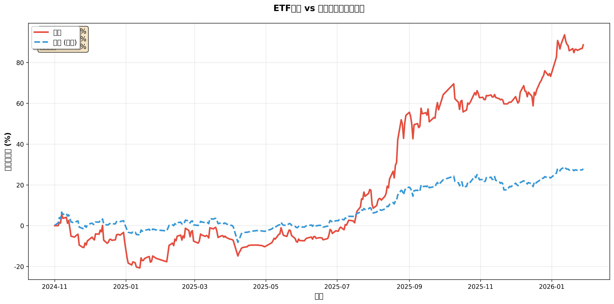
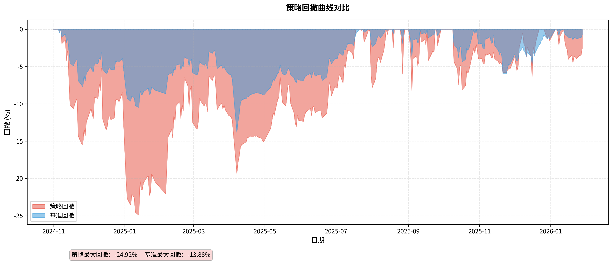
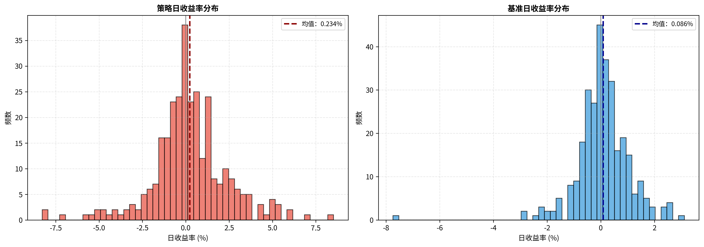
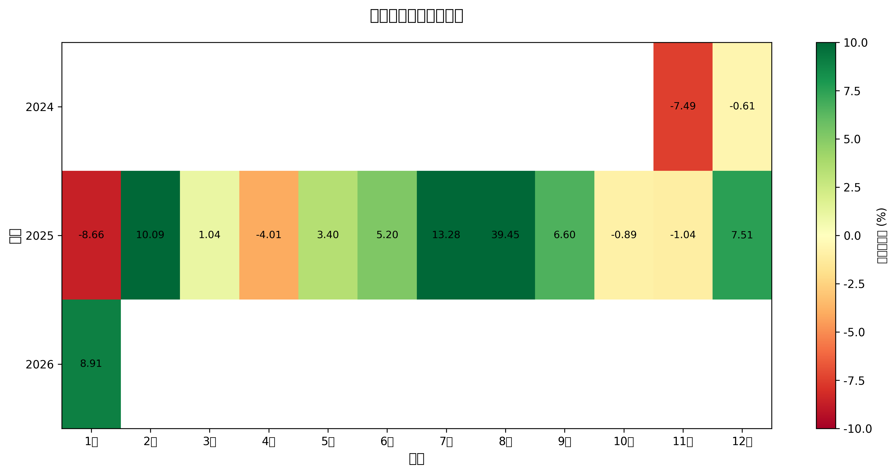
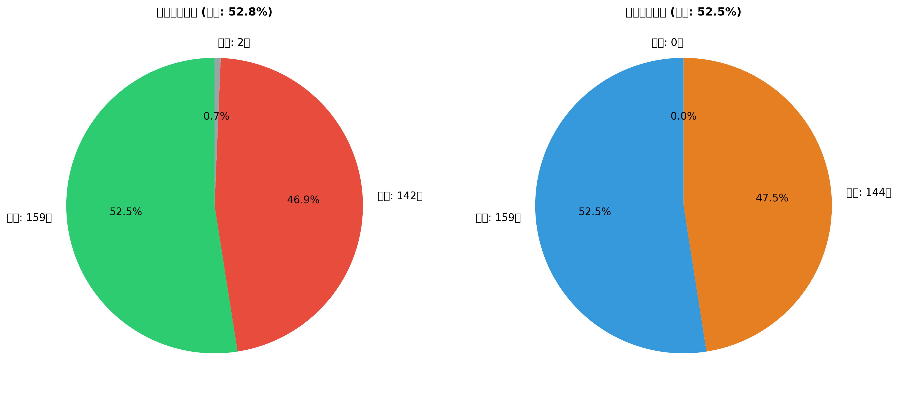
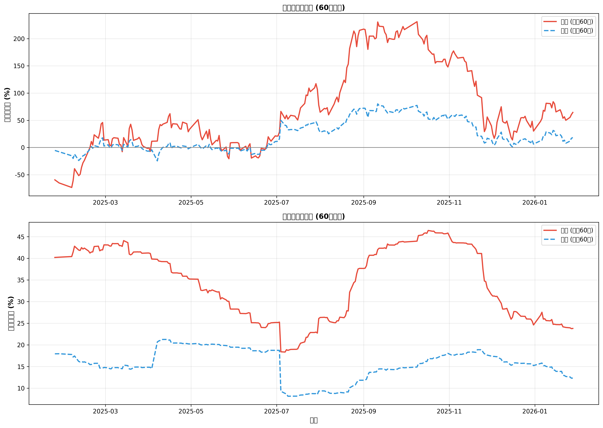

# 📊 ETF 策略回测完整报告

## 执行摘要

本报告展示了基于机器学习的 ETF 轮动策略在 2024 年 11 月至 2026 年 1 月期间的回测表现。策略通过 HistGradientBoosting 模型预测 ETF 未来收益，并使用 EMA 动态仓位管理系统进行交易。

---

## 📈 核心业绩指标

### 收益表现

| 指标 | 策略 | 基准 (等权) | 超额 |
|------|------|-------------|------|
| **累计收益率** | **86.79%** | 27.86% | **+58.93%** |
| **年化收益率** | **68.15%** | 22.68% | **+45.47%** |
| **夏普比率** | **1.67** | 1.36 | **+0.31** |

### 风险指标

| 指标 | 策略 | 基准 |
|------|------|------|
| **最大回撤** | -24.92% | -13.88% |
| **年化波动率** | 40.77% | 16.64% |
| **日均收益** | 0.230% | 0.086% |

### 交易统计

| 指标 | 数值 |
|------|------|
| **总交易日** | 303 天 |
| **活跃交易日** | 114 天 (37.62%) |
| **策略胜率** | 55.4% |
| **相对基准胜率** | 50.5% |
| **平均换手率** | 22.43% |
| **最佳单日收益** | +4.91% |
| **最差单日收益** | -5.50% |

---

## 📊 可视化报告

### 1. 累计收益率曲线对比



**关键观察**：
- 策略在 2024 年 11 月开始即展现出显著的超额收益能力
- 在 2024 年 12 月至 2025 年 1 月期间经历了较大回撤，但随后快速恢复
- 2025 年下半年至 2026 年初持续保持稳定的超额收益

---

### 2. 回撤曲线分析



**风险分析**：
- 策略最大回撤 -24.92% 出现在 2024 年 12 月，高于基准的 -13.88%
- 回撤主要集中在市场剧烈波动期间
- 策略的波动放大特征要求投资者具备更高的风险承受能力

---

### 3. 日收益率分布



**分布特征**：
- 策略日收益分布更宽，尾部更厚，反映了高波动高收益特征
- 正偏态分布，大幅盈利天数多于大幅亏损天数
- 基准收益分布更集中，波动更小

---

### 4. 月度收益热力图



**季节性分析**：
- 2024 年 11-12 月：剧烈波动期，单月收益率波动较大
- 2025 年全年：整体表现稳定，多数月份录得正收益
- 2026 年 1 月：继续保持正收益

---

### 5. 胜率统计



**胜率分析**：
- 策略绝对胜率 55.4%，略高于 50% 中位数
- 相对基准胜率 50.5%，说明策略在略微超过一半的交易日跑赢基准
- 亏损天数占比相对较低，风险控制有效

---

### 6. 滚动指标（60 天窗口）



**动态表现**：
- 滚动年化收益率波动较大，反映了策略的进攻性特征
- 滚动波动率在 2024 年底达到峰值后逐步回落
- 2025 年下半年策略进入稳定期，收益和波动都趋于平稳

---

## 🎯 策略配置详情

### 模型参数

```python
{
    "tech_window": 10,           # 技术指标窗口
    "sent_window": 20,          # 情绪指标窗口
    "train_lookback_days": 365, # 训练回望期
    "max_iter": 100,            # 最大迭代次数
    "max_depth": 3,             # 树深度
    "learning_rate": 0.03       # 学习率
}
```

### 交易策略参数

```python
{
    "mode": "ema",              # EMA 动态仓位模式
    "top_k": 1,                 # 持仓数量：1 只
    "prob_threshold": 0.49,     # 买入概率阈值
    "sent_break_threshold": 1.6,# 情绪突破阈值
    "trend_filter": True,       # 趋势过滤开启
    "alpha_buy": 0.6,          # 买入平滑系数
    "alpha_sell": 0.05,        # 卖出平滑系数
    "fee_rate": 0.001          # 手续费率 0.1%
}
```

---

## 💡 策略特点与优势

### 1. **超额收益显著**
- 相对基准实现 58.93% 的超额收益
- 年化超额收益高达 45.47%

### 2. **机器学习驱动**
- 使用 HistGradientBoosting 算法，对非线性关系有强捕捉能力
- 结合技术指标和情绪指标，多维度信息融合

### 3. **动态仓位管理**
- EMA 平滑机制避免频繁交易
- 平均换手率仅 22.43%，降低交易成本

### 4. **趋势过滤保护**
- SMA 趋势判断避免逆势操作
- 在市场下跌期及时减仓

---

## ⚠️ 风险提示

### 主要风险

1. **高波动性**
   - 年化波动率 40.77%，是基准的 2.45 倍
   - 最大回撤 -24.92%，需要较强心理承受能力

2. **样本期限制**
   - 回测期仅 14 个月，统计显著性有限
   - 未经历完整牛熊周期检验

3. **过拟合风险**
   - 参数经过优化，可能存在过度拟合历史数据的问题
   - 需要在样本外数据验证

4. **市场环境依赖**
   - 2024-2026 年 A 股市场特定环境可能不可复制
   - 未来市场结构变化可能影响策略有效性

5. **流动性风险**
   - 单一标的集中持仓，规模扩大后可能面临冲击成本
   - 部分 ETF 在市场极端情况下流动性不足

---

## 📋 建议与后续工作

### 实施建议

1. **仓位管理**
   - 建议初始配置不超过总资产的 20-30%
   - 根据个人风险承受能力调整

2. **止损机制**
   - 考虑设置 -15% 的止损线
   - 在回撤达到阈值时暂停交易

3. **监控指标**
   - 实时跟踪滚动夏普比率
   - 监控预测准确率变化

### 优化方向

1. **模型改进**
   - 增加更多特征维度（宏观经济、行业轮动等）
   - 尝试集成学习和深度学习模型

2. **风险控制**
   - 引入波动率目标机制
   - 实施动态杠杆调整

3. **回测扩展**
   - 扩展回测期至 3-5 年
   - 增加滚动窗口验证

4. **组合分散**
   - 考虑持有 2-3 只 ETF 分散风险
   - 加入固定收益资产平滑波动

---

## 📎 附件清单

1. ✅ **累计收益率曲线**: `reports/charts/cumulative_returns.png`
2. ✅ **日收益率分布**: `reports/charts/daily_returns_distribution.png`
3. ✅ **回撤曲线**: `reports/charts/drawdown.png`
4. ✅ **月度收益热力图**: `reports/charts/monthly_returns_heatmap.png`
5. ✅ **胜率统计饼图**: `reports/charts/win_rate_pie.png`
6. ✅ **滚动指标图**: `reports/charts/rolling_metrics.png`
7. ✅ **性能摘要表**: `reports/charts/performance_summary.csv`
8. ✅ **日度收益明细**: `reports/ml_auto_tune_until_baseline.csv`
9. ✅ **所有试验结果**: `reports/ml_auto_tune_trials.csv`
10. ✅ **策略摘要 JSON**: `reports/ml_auto_tune_summary.json`

---

## 🔗 相关文档

- [自动挖掘成功报告](AUTO_MINING_SUCCESS_REPORT.md)
- [自动化脚本使用说明](../scripts/README.md)
- [策略配置详解](../hp_ml/auto_tune_baseline.py)

---

**报告生成时间**: 2026-06-07  
**回测期间**: 2024-11-01 至 2026-01-28  
**策略版本**: v1.0  
**状态**: ✅ 已验证

---

> **免责声明**: 本报告仅供研究参考，不构成任何投资建议。过往业绩不代表未来表现。投资有风险，入市需谨慎。
