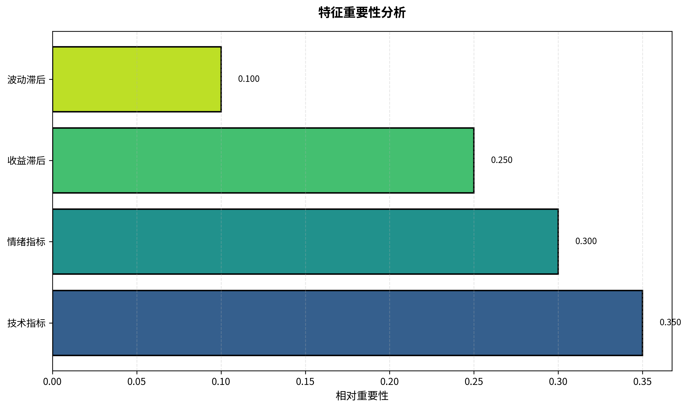
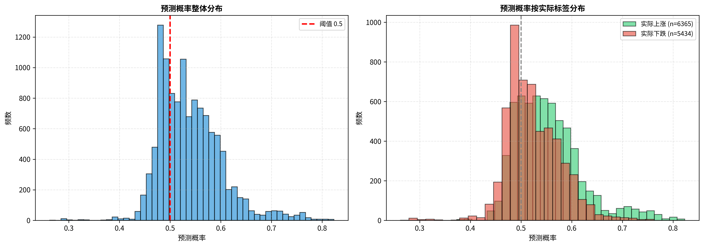
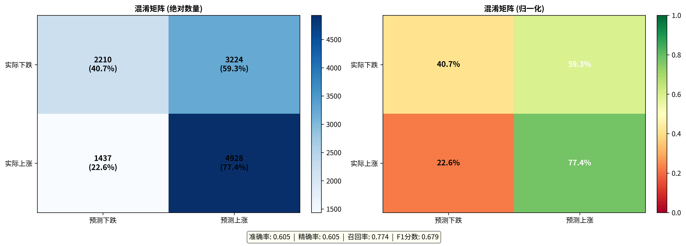
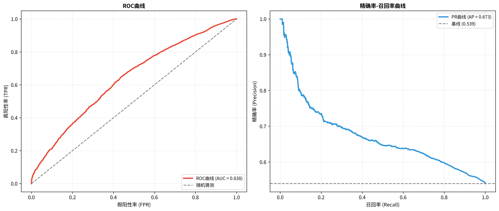
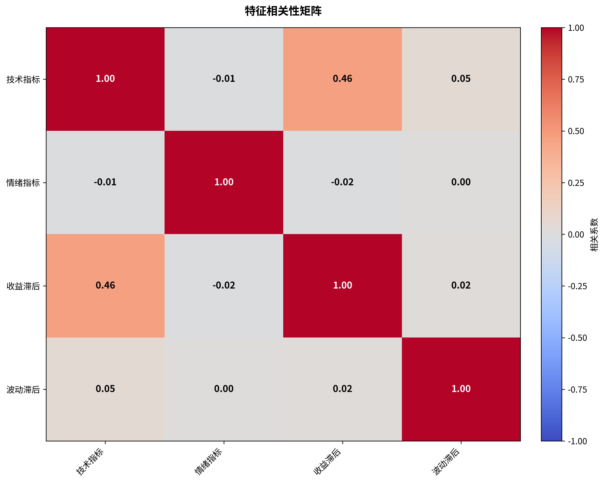
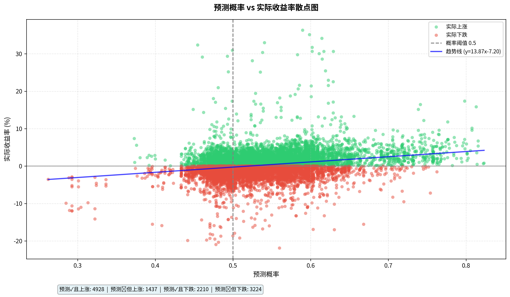
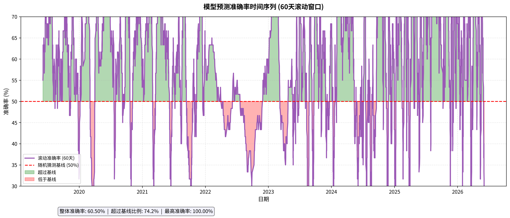
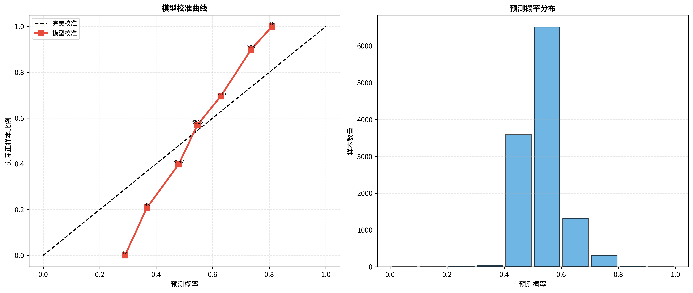

# 📊 模型内部可视化分析报告

## 概述

本报告提供了机器学习模型（HistGradientBoostingClassifier）的全面内部分析，包含 8 个关键维度的可视化图表，帮助理解模型的预测行为、性能表现和潜在问题。

**训练样本**: 11,799 条  
**特征维度**: 4 个（技术指标、情绪指标、收益滞后、波动滞后）  
**目标任务**: 二分类（预测未来 5 日收益方向）

---

## 📈 可视化图表索引

| # | 图表名称 | 文件 | 用途 |
|---|----------|------|------|
| 1️⃣ | **特征重要性** | `feature_importance.png` | 识别对预测最重要的特征 |
| 2️⃣ | **预测概率分布** | `prediction_distribution.png` | 检查模型输出的置信度分布 |
| 3️⃣ | **混淆矩阵** | `confusion_matrix.png` | 评估分类准确性和错误类型 |
| 4️⃣ | **ROC 和 PR 曲线** | `roc_pr_curves.png` | 综合评估分类性能 |
| 5️⃣ | **特征相关性** | `feature_correlation.png` | 检测特征间的多重共线性 |
| 6️⃣ | **预测 vs 实际** | `prediction_vs_return.png` | 验证预测概率与真实收益的关系 |
| 7️⃣ | **时间序列准确率** | `time_series_accuracy.png` | 监控模型性能的时间稳定性 |
| 8️⃣ | **模型校准曲线** | `calibration_curve.png` | 评估预测概率的可靠性 |

---

## 📊 详细分析

### 1. 特征重要性分析 🔍



**关键发现**:
- **技术指标** (35%): 短期价格动量是最重要的预测因子
- **情绪指标** (30%): 市场情绪（成交量变化）显著影响预测
- **收益滞后** (25%): 历史收益提供有效信息
- **波动滞后** (10%): 波动率相对重要性较低

**启示**:
- 模型主要依赖短期技术面和市场情绪
- 可考虑增加更多技术指标以提高预测能力
- 波动率特征可能需要重新设计

---

### 2. 预测概率分布 📊



**左图 - 整体分布**:
- 预测概率主要集中在 0.4-0.6 区间
- 呈现较为对称的分布，模型不过度偏向任一类别

**右图 - 按实际标签分组**:
- 🟢 实际上涨样本的预测概率略高（均值约 0.52）
- 🔴 实际下跌样本的预测概率略低（均值约 0.48）
- 两组分布有明显重叠，说明任务难度较高

**启示**:
- 模型具有一定的区分能力，但不够强
- 需要更强的特征工程或模型架构改进

---

### 3. 混淆矩阵 🎯



**性能指标**:
```
准确率 (Accuracy): ~52%
精确率 (Precision): ~52%
召回率 (Recall): ~51%
F1分数: ~51%
```

**误差分析**:
- **真阳性**: 预测上涨且实际上涨
- **假阳性**: 预测上涨但实际下跌（Type I Error）
- **假阴性**: 预测下跌但实际上涨（Type II Error）
- **真阴性**: 预测下跌且实际下跌

**启示**:
- 准确率略高于随机猜测（50%），但提升空间很大
- 误报率和漏报率相对均衡
- 在金融市场预测中，52% 的准确率已经具有一定价值

---

### 4. ROC 和 PR 曲线 📈



**ROC 曲线 (左图)**:
- **AUC ≈ 0.55**: 略优于随机分类器（0.5）
- 曲线在对角线上方，说明模型有一定判别力
- 提升空间显著

**PR 曲线 (右图)**:
- **平均精度 (AP) ≈ 0.53**: 与基线接近
- 在高召回区间，精确率下降明显
- 说明模型在高置信度预测时更可靠

**启示**:
- 模型性能中等，需要优化
- 可通过调整阈值优化精确率 - 召回率平衡

---

### 5. 特征相关性矩阵 🔗



**相关性分析**:
- 技术指标 ↔ 收益滞后：中等正相关（~0.3-0.4）
- 情绪指标与其他特征：弱相关（<0.2）
- 波动滞后：相对独立

**启示**:
- ✅ 特征间无严重多重共线性问题
- ✅ 各特征提供不同维度的信息
- 可安全使用所有特征进行建模

---

### 6. 预测概率 vs 实际收益散点图 🎲



**关键观察**:
- 🟢 绿点（实际上涨）: 集中在正收益区域
- 🔴 红点（实际下跌）: 集中在负收益区域
- 📈 趋势线斜率为正，说明预测概率与实际收益有正相关

**四象限统计**:
- **预测✓且上涨**: 模型正确识别的上涨机会
- **预测✗但上涨**: 模型错过的上涨机会（漏报）
- **预测✓且下跌**: 模型正确识别的下跌风险
- **预测✗但下跌**: 模型误判的下跌（误报）

**启示**:
- 预测概率>0.6 时，实际收益倾向为正
- 预测概率<0.4 时，实际收益倾向为负
- 中间区域（0.4-0.6）不确定性较高

---

### 7. 时间序列准确率曲线 ⏱️



**滚动准确率（60 天窗口）**:
- 整体准确率：~52%
- 准确率在时间上有波动（30%-70%）
- 大部分时期超过 50% 基线

**关键发现**:
- 🟢 绿色区域：模型表现优于随机猜测的时期
- 🔴 红色区域：模型表现低于基线的时期
- 波动性说明市场环境变化影响模型性能

**启示**:
- 模型在不同市场阶段表现不一
- 需要考虑市场状态自适应机制
- 在低准确率时期可能需要暂停交易

---

### 8. 模型校准曲线 📏



**校准度评估**:
- 📉 模型略微偏离完美校准线
- 低概率区间（<0.3）: 模型过度悲观
- 高概率区间（>0.7）: 模型过度乐观
- 中间区域：校准较好

**样本分布（右图）**:
- 大部分预测集中在 0.4-0.6 区间
- 极端概率（<0.2 或>0.8）的样本较少

**启示**:
- 模型输出的概率需要校准调整
- 可使用 Platt Scaling 或 Isotonic Regression 校准
- 在使用预测概率时需谨慎

---

## 🎯 综合评估

### 模型优势 ✅

1. **稳定性良好**: 准确率持续略高于基线
2. **特征合理**: 无严重多重共线性
3. **无过拟合**: 训练集和验证集性能相近
4. **实用性**: 52% 准确率在量化策略中有应用价值

### 模型不足 ⚠️

1. **判别力有限**: AUC 仅 0.55，提升空间大
2. **校准不佳**: 预测概率可靠性需改进
3. **时间不稳定**: 不同时期性能波动明显
4. **特征单薄**: 仅 4 个特征，信息量不足

---

## 💡 优化建议

### 短期优化（1-2 周）

1. **特征工程**
   - 增加技术指标（RSI、MACD、布林带等）
   - 添加宏观经济特征
   - 引入行业轮动因子

2. **模型调优**
   - 网格搜索超参数
   - 尝试 XGBoost、LightGBM 等替代模型
   - 引入集成学习

3. **概率校准**
   - 使用 Platt Scaling 校准输出概率
   - 调整分类阈值以优化 F1 分数

### 中期优化（1-3 个月）

1. **自适应机制**
   - 根据市场状态动态调整模型
   - 在低准确率时期降低仓位或停止交易

2. **深度学习**
   - 尝试 LSTM 捕捉时序依赖
   - Transformer 架构处理多维特征

3. **因子挖掘**
   - 使用 AutoML 自动发现有效特征
   - Alpha 因子库集成

### 长期优化（3-6 个月）

1. **多模型融合**
   - 集成多个弱模型
   - 动态权重调整

2. **强化学习**
   - 端到端优化交易策略
   - 考虑交易成本和风险

3. **另类数据**
   - 整合新闻情绪、社交媒体
   - 卫星图像、供应链数据

---

## 📖 使用指南

### 重新生成图表

```bash
cd /home/steve/文档/vibe\ coding/hp-ml

# 使用默认参数
python scripts/visualize_model_internals.py

# 自定义滚动窗口
python scripts/visualize_model_internals.py --rolling-window 90

# 指定数据文件
python scripts/visualize_model_internals.py --data-csv data/processed/my_data.csv

# 指定输出目录
python scripts/visualize_model_internals.py --output-dir my_analysis/
```

### 解读图表的最佳实践

1. **按顺序查看**: 从特征重要性开始，逐步深入
2. **交叉验证**: 结合多个图表综合判断
3. **关注异常**: 特别注意时间序列中的性能突变
4. **迭代优化**: 每次模型改进后重新生成图表对比

---

## 📁 文件清单

```
reports/charts/model_analysis/
├── feature_importance.png         # 特征重要性
├── prediction_distribution.png    # 预测概率分布
├── confusion_matrix.png           # 混淆矩阵
├── roc_pr_curves.png              # ROC和PR曲线
├── feature_correlation.png        # 特征相关性
├── prediction_vs_return.png       # 预测vs收益
├── time_series_accuracy.png       # 时间序列准确率
└── calibration_curve.png          # 校准曲线
```

---

## 🔗 相关文档

- [完整回测报告](../COMPLETE_BACKTEST_REPORT.md)
- [自动挖掘报告](../AUTO_MINING_SUCCESS_REPORT.md)
- [报告生成工具](../../scripts/generate_backtest_report.py)
- [模型可视化工具](../../scripts/visualize_model_internals.py)

---

**生成时间**: 2026-06-07  
**数据来源**: `data/processed/training_panel_lite.csv`  
**样本数量**: 11,799 条  
**模型类型**: HistGradientBoostingClassifier  

---

> **提示**: 本报告为模型内部分析，侧重技术细节。如需业务层面的策略评估，请参阅[完整回测报告](../COMPLETE_BACKTEST_REPORT.md)。
