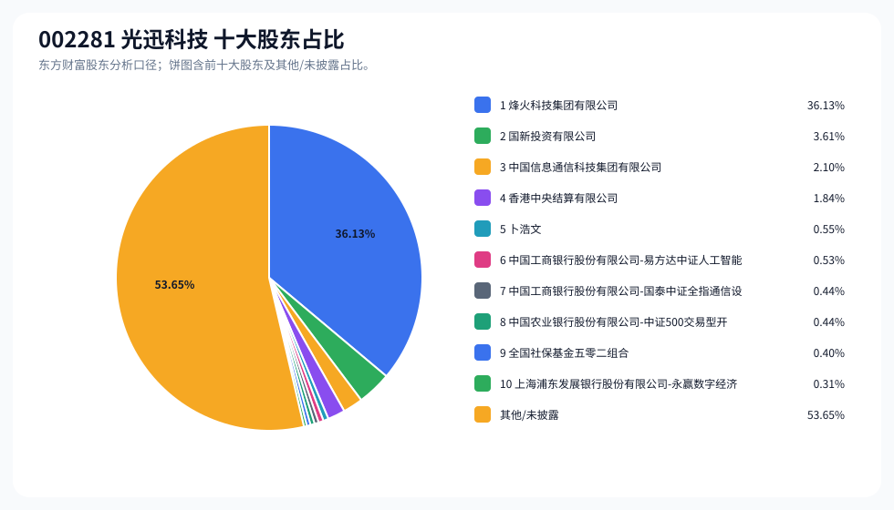
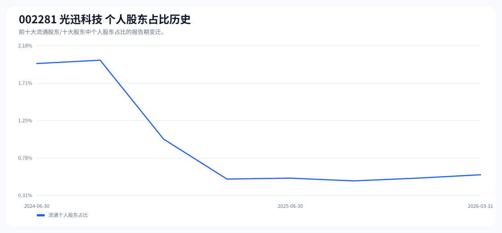

# 002281 光迅科技 股东成分报告

- 生成时间：2026-06-07T16:17:50
- 看涨排名：1；综合评分：39.515。
- ETF/指数线索：CSI_500 / 510500 中证500ETF南方。
- 增长/交易机制标签：ETF信号牵引;价格动量;高换手交易;流通股东集中;机构股东参与。
- 说明：本报告是股东结构研究工件，不构成投资建议。

## 1. 公司交易与 ETF 线索

|项目|数值|
|---|---:|
|行业/地区|通信设备 / 武汉市|
|最新价|227.58|
|成交额|169.78亿|
|换手率|9.44%|
|5日收益|11.59%|
|20日收益|25.93%|
|20日成交额放大倍数|1.08|
|主力净流入| ()|

## 2. 股东结构快照

|项目|数值|
|---|---:|
|流通股东报告期|2026-03-31|
|前十大流通股东合计占流通股本|47.95%|
|其中机构类流通股东占比|47.38%|
|其中基金/社保/QFII 类占比|2.19%|
|前十大流通股东占比变化合计|-1.97%|
|第一大流通股东|烽火科技集团有限公司 / 其他 / 37.37%|
|十大股东报告期|2026-03-31|
|前十大股东合计占总股本|46.35%|
|其中机构类十大股东占比|45.80%|
|前十大股东占比变化合计|-1.96%|
|第一大股东|烽火科技集团有限公司 / 其他 / 36.13%|

## 3. 股东占比饼图

## 4. 历史股东变迁（个人股东重点）

|报告期|口径|前十大占比|个人股东数|个人股东占比|个人股东|机构占比|基金/社保/QFII占比|
|---|---|---:|---:|---:|---|---:|---:|
|2026-03-31|流通股东|47.95%|1|0.57%|卜浩文|47.38%|2.19%|
|2025-12-31|流通股东|50.29%|1|0.53%|卜浩文|49.77%|3.07%|
|2025-09-30|流通股东|48.65%|1|0.49%|卜浩文|48.16%|3.01%|
|2025-06-30|流通股东|49.00%|1|0.53%|卜浩文|48.47%|1.98%|
|2025-03-31|流通股东|48.56%|1|0.52%|卜浩文|48.05%|2.30%|
|2024-12-31|流通股东|49.87%|2|1.01%|卜浩文、杨宏|48.85%|1.86%|
|2024-09-30|流通股东|48.02%|2|2.00%|杨宏、卜浩文|46.02%|2.44%|
|2024-06-30|流通股东|45.28%|2|1.96%|杨宏、卜浩文|43.33%|3.00%|

### 个人股东逐期变化

|从|到|口径|个人股东|状态|上一期占比|本期占比|占比变化|上一期排名|本期排名|
|---|---|---|---|---|---:|---:|---:|---:|---:|
|2025-12-31|2026-03-31|流通|卜浩文|增持|0.53%|0.57%|0.04%|8|5|
|2025-09-30|2025-12-31|流通|卜浩文|增持|0.49%|0.53%|0.03%|8|8|
|2025-06-30|2025-09-30|流通|卜浩文|减持|0.53%|0.49%|-0.03%|8|8|
|2025-03-31|2025-06-30|流通|卜浩文|增持|0.52%|0.53%|0.01%|9|8|
|2024-12-31|2025-03-31|流通|杨宏|退出|0.50%||-0.50%|7||
|2024-12-31|2025-03-31|流通|卜浩文|增持|0.52%|0.52%|0.00%|6|9|
|2024-09-30|2024-12-31|流通|杨宏|减持|1.47%|0.50%|-0.97%|4|7|
|2024-09-30|2024-12-31|流通|卜浩文|减持|0.53%|0.52%|-0.01%|6|6|
|2024-06-30|2024-09-30|流通|杨宏|增持|1.43%|1.47%|0.04%|2|4|
|2024-06-30|2024-09-30|流通|卜浩文|不变|0.53%|0.53%|0.00%|6|6|

## 5. 股东明细

### 十大流通股东

|排名|股东名称|类型|股份类型|持股数|占总股本|占流通股本|占比变化|方向|参考市值|
|---:|---|---|---|---:|---:|---:|---:|---|---:|
|1|烽火科技集团有限公司|其他|A股|291478944|36.13%|37.37%|0.00%|不变|245.72亿|
|2|国新投资有限公司|其他|A股|29135180|3.61%|3.74%|0.00%|增加|24.56亿|
|3|中国信息通信科技集团有限公司|其他|A股|16960646|2.10%|2.17%|0.00%|不变|14.30亿|
|4|香港中央结算有限公司|其他|A股|14864224|1.84%|1.91%|-1.44%|减少|12.53亿|
|5|卜浩文|个人|A股|4437014|0.55%|0.57%|0.04%|增加|3.74亿|
|6|中国工商银行股份有限公司-易方达中证人工智能主题交易型开放式指数证券投资基金|基金|A股|4286461|0.53%|0.55%|0.04%|增加|3.61亿|
|7|中国工商银行股份有限公司-国泰中证全指通信设备交易型开放式指数证券投资基金|基金|A股|3582519|0.44%|0.46%|0.01%|增加|3.02亿|
|8|中国农业银行股份有限公司-中证500交易型开放式指数证券投资基金|基金|A股|3526517|0.44%|0.45%|-0.45%|减少|2.97亿|
|9|全国社保基金五零二组合|社保|A股|3202480|0.40%|0.41%|-0.17%|减少|2.70亿|
|10|上海浦东发展银行股份有限公司-永赢数字经济智选混合型发起式证券投资基金|基金|A股|2505409|0.31%|0.32%||新进|2.11亿|

### 十大股东

|排名|股东名称|类型|股份类型|持股数|占总股本|占流通股本|占比变化|方向|参考市值|
|---:|---|---|---|---:|---:|---:|---:|---|---:|
|1|烽火科技集团有限公司|其他|流通A股|291478944|36.13%||0.00%|不变|245.72亿|
|2|国新投资有限公司|其他|流通A股|29135180|3.61%||0.00%|增持|24.56亿|
|3|中国信息通信科技集团有限公司|其他|流通A股|16960646|2.10%||0.00%|不变|14.30亿|
|4|香港中央结算有限公司|其他|流通A股|14864224|1.84%||-1.44%|减持|12.53亿|
|5|卜浩文|个人|流通A股|4437014|0.55%||0.04%|增持|3.74亿|
|6|中国工商银行股份有限公司-易方达中证人工智能主题交易型开放式指数证券投资基金|基金|流通A股|4286461|0.53%||0.04%|增持|3.61亿|
|7|中国工商银行股份有限公司-国泰中证全指通信设备交易型开放式指数证券投资基金|基金|流通A股|3582519|0.44%||0.01%|增持|3.02亿|
|8|中国农业银行股份有限公司-中证500交易型开放式指数证券投资基金|基金|流通A股|3526517|0.44%||-0.45%|减持|2.97亿|
|9|全国社保基金五零二组合|社保|流通A股|3202480|0.40%||-0.16%|减持|2.70亿|
|10|上海浦东发展银行股份有限公司-永赢数字经济智选混合型发起式证券投资基金|基金|流通A股|2505409|0.31%|||新进|2.11亿|

## 6. 解读要点

- 若“成交额放大 + 高换手交易”同时出现，说明上涨背后有真实交易活跃度，但也可能伴随波动放大。
- 前十大流通股东占比越高，筹码越集中；机构/基金占比越高，越需要继续核对定期报告、基金持仓和是否存在被动指数持仓。
- 个人股东历史变迁重点看三类信号：连续增持、新进进入前十大、以及从前十大退出；个人股东占比变化越大，越需要核对公告和实际控制人/高管身份。
- 股东占比变化为增持/减持线索，需结合公告日、股价位置和成交额验证，不应单独作为买卖依据。

## 数据源

- 股东数据：https://datacenter-web.eastmoney.com/api/data/v1/get (RPT_F10_EH_FREEHOLDERS / RPT_DMSK_HOLDERS)
- 行情与 K 线：https://push2.eastmoney.com/api/qt/clist/get / https://push2his.eastmoney.com/api/qt/stock/kline/get
