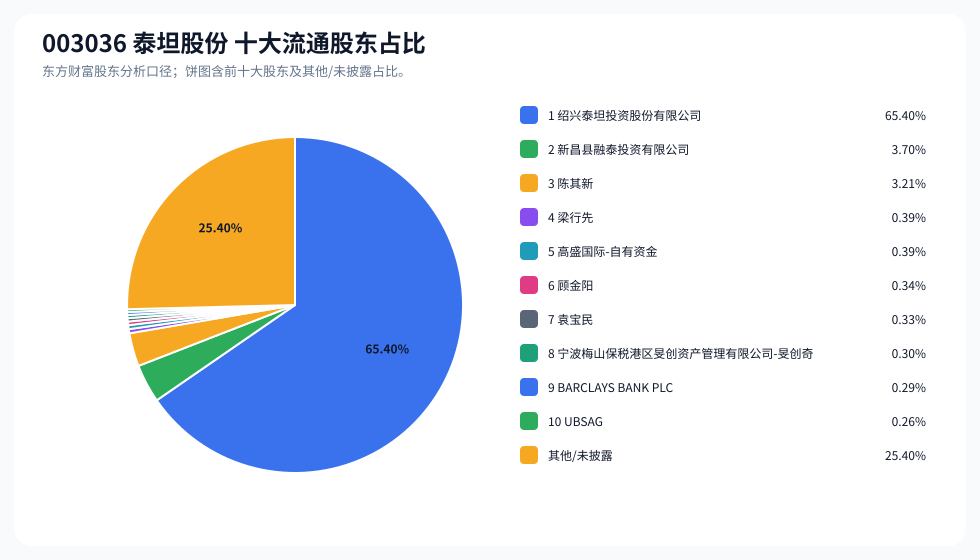
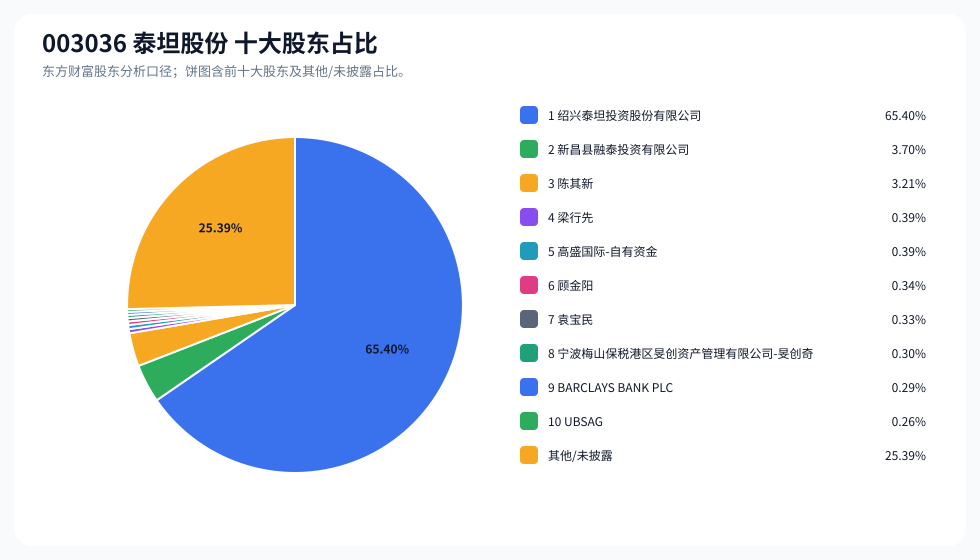
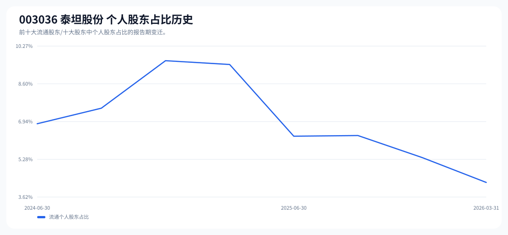

# 003036 泰坦股份 股东成分报告

- 生成时间：2026-06-07T16:40:07
- 看涨排名：1；综合评分：80.725。
- ETF/指数线索：CSI_2000 / 159531 中证2000ETF南方。
- 增长/交易机制标签：ETF信号牵引;价格动量;成交额放大;高换手交易;流通股东集中;机构股东参与。
- 说明：本报告是股东结构研究工件，不构成投资建议。

## 1. 公司交易与 ETF 线索

|项目|数值|
|---|---:|
|行业/地区|专用设备 / 绍兴市|
|最新价|82.35|
|成交额|13.40亿|
|换手率|7.59%|
|5日收益|15.99%|
|20日收益|96.80%|
|20日成交额放大倍数|1.51|
|主力净流入| ()|

## 2. 股东结构快照

|项目|数值|
|---|---:|
|流通股东报告期|2026-03-31|
|前十大流通股东合计占流通股本|74.60%|
|其中机构类流通股东占比|70.34%|
|其中基金/社保/QFII 类占比|1.24%|
|前十大流通股东占比变化合计|-0.14%|
|第一大流通股东|绍兴泰坦投资股份有限公司 / 其他 / 65.40%|
|十大股东报告期|2026-03-31|
|前十大股东合计占总股本|74.61%|
|其中机构类十大股东占比|70.34%|
|前十大股东占比变化合计|-0.14%|
|第一大股东|绍兴泰坦投资股份有限公司 / 其他 / 65.40%|

## 3. 股东占比饼图

## 4. 历史股东变迁（个人股东重点）

|报告期|口径|前十大占比|个人股东数|个人股东占比|个人股东|机构占比|基金/社保/QFII占比|
|---|---|---:|---:|---:|---|---:|---:|
|2026-03-31|流通股东|74.60%|4|4.26%|陈其新、梁行先、顾金阳、袁宝民|70.34%|1.24%|
|2025-12-31|流通股东|74.77%|7|5.36%|陈其新、张良灿、梁行先、吕慧莲、苏德科、林成剑、苏沪光|69.40%|0.30%|
|2025-09-30|流通股东|75.43%|8|6.33%|陈其新、张良灿、陆洲、梁行先、苏德科、吕伟忠、苏煦、吕慧莲|69.10%|0.00%|
|2025-06-30|流通股东|75.87%|7|6.30%|陈其新、赵略、梁行先、付康、吕伟忠、苏煦、吕慧莲|69.57%|0.40%|
|2025-03-31|流通股东|78.63%|8|9.46%|陈其新、隋永亮、赵略、梁行先、付康、徐金涌、余静、姜千坤|69.17%|0.00%|
|2024-12-31|流通股东|78.80%|8|9.62%|陈其新、华灿桥、付康、赵略、王立伟、梁行先、胡韩、王莉萍|69.17%|0.00%|
|2024-09-30|流通股东|76.72%|8|7.53%|陈其新、赵略、王立伟、梁行先、付康、何厚、吕慧莲、于克|69.18%|0.00%|
|2024-06-30|流通股东|76.37%|7|6.85%|陈其新、赵略、梁行先、王立伟、付康、吕慧莲、于克|69.52%|0.34%|

### 个人股东逐期变化

|从|到|口径|个人股东|状态|上一期占比|本期占比|占比变化|上一期排名|本期排名|
|---|---|---|---|---|---:|---:|---:|---:|---:|
|2025-12-31|2026-03-31|流通|张良灿|退出|0.55%||-0.55%|4||
|2025-12-31|2026-03-31|流通|顾金阳|新进||0.34%|0.34%||6|
|2025-12-31|2026-03-31|流通|袁宝民|新进||0.33%|0.33%||7|
|2025-12-31|2026-03-31|流通|吕慧莲|退出|0.29%||-0.29%|7||
|2025-12-31|2026-03-31|流通|苏德科|退出|0.26%||-0.26%|8||
|2025-12-31|2026-03-31|流通|林成剑|退出|0.26%||-0.26%|9||
|2025-12-31|2026-03-31|流通|苏沪光|退出|0.25%||-0.25%|10||
|2025-12-31|2026-03-31|流通|梁行先|减持|0.53%|0.39%|-0.14%|5|4|
|2025-12-31|2026-03-31|流通|陈其新|减持|3.21%|3.21%|-0.00%|3|3|
|2025-09-30|2025-12-31|流通|陆洲|退出|0.55%||-0.55%|5||
|2025-09-30|2025-12-31|流通|吕伟忠|退出|0.31%||-0.31%|8||
|2025-09-30|2025-12-31|流通|苏煦|退出|0.30%||-0.30%|9||
|2025-09-30|2025-12-31|流通|林成剑|新进||0.26%|0.26%||9|
|2025-09-30|2025-12-31|流通|张良灿|减持|0.81%|0.55%|-0.25%|4|4|
|2025-09-30|2025-12-31|流通|苏沪光|新进||0.25%|0.25%||10|
|2025-09-30|2025-12-31|流通|苏德科|减持|0.32%|0.26%|-0.06%|7|8|
|2025-09-30|2025-12-31|流通|陈其新|增持|3.21%|3.21%|0.00%|3|3|
|2025-09-30|2025-12-31|流通|梁行先|增持|0.53%|0.53%|0.00%|6|5|
|2025-09-30|2025-12-31|流通|吕慧莲|不变|0.29%|0.29%|0.00%|10|7|
|2025-06-30|2025-09-30|流通|赵略|退出|1.03%||-1.03%|4||
|2025-06-30|2025-09-30|流通|张良灿|新进||0.81%|0.81%||4|
|2025-06-30|2025-09-30|流通|陆洲|新进||0.55%|0.55%||5|
|2025-06-30|2025-09-30|流通|付康|退出|0.33%||-0.33%|7||
|2025-06-30|2025-09-30|流通|苏德科|新进||0.32%|0.32%||7|

## 5. 股东明细

### 十大流通股东

|排名|股东名称|类型|股份类型|持股数|占总股本|占流通股本|占比变化|方向|参考市值|
|---:|---|---|---|---:|---:|---:|---:|---|---:|
|1|绍兴泰坦投资股份有限公司|其他|A股|141441660|65.40%|65.40%|-0.00%|不变|39.41亿|
|2|新昌县融泰投资有限公司|其他|A股|8000000|3.70%|3.70%|-0.00%|不变|2.23亿|
|3|陈其新|个人|A股|6938340|3.21%|3.21%|-0.00%|不变|1.93亿|
|4|梁行先|个人|A股|848400|0.39%|0.39%|-0.14%|减少|2363.64万|
|5|高盛国际-自有资金|QFII|A股|841781|0.39%|0.39%||新进|2345.20万|
|6|顾金阳|个人|A股|731400|0.34%|0.34%||新进|2037.68万|
|7|袁宝民|个人|A股|704800|0.33%|0.33%||新进|1963.57万|
|8|宁波梅山保税港区旻创资产管理有限公司-旻创奇顺私募证券投资基金|其他|A股|656000|0.30%|0.30%|0.00%|不变|1827.62万|
|9|BARCLAYS BANK PLC|QFII|A股|619202|0.29%|0.29%||新进|1725.10万|
|10|UBSAG|QFII|A股|565901|0.26%|0.26%||新进|1576.60万|

### 十大股东

|排名|股东名称|类型|股份类型|持股数|占总股本|占流通股本|占比变化|方向|参考市值|
|---:|---|---|---|---:|---:|---:|---:|---|---:|
|1|绍兴泰坦投资股份有限公司|其他|流通A股|141441660|65.40%||0.00%|不变|39.41亿|
|2|新昌县融泰投资有限公司|其他|流通A股|8000000|3.70%||0.00%|不变|2.23亿|
|3|陈其新|个人|流通A股|6938340|3.21%||0.00%|不变|1.93亿|
|4|梁行先|个人|流通A股|848400|0.39%||-0.14%|减持|2363.64万|
|5|高盛国际-自有资金|QFII|流通A股|841781|0.39%|||新进|2345.20万|
|6|顾金阳|个人|流通A股|731400|0.34%|||新进|2037.68万|
|7|袁宝民|个人|流通A股|704800|0.33%|||新进|1963.57万|
|8|宁波梅山保税港区旻创资产管理有限公司-旻创奇顺私募证券投资基金|其他|流通A股|656000|0.30%||0.00%|不变|1827.62万|
|9|BARCLAYS BANK PLC|QFII|流通A股|619202|0.29%|||新进|1725.10万|
|10|UBSAG|QFII|流通A股|565901|0.26%|||新进|1576.60万|

## 6. 解读要点

- 若“成交额放大 + 高换手交易”同时出现，说明上涨背后有真实交易活跃度，但也可能伴随波动放大。
- 前十大流通股东占比越高，筹码越集中；机构/基金占比越高，越需要继续核对定期报告、基金持仓和是否存在被动指数持仓。
- 个人股东历史变迁重点看三类信号：连续增持、新进进入前十大、以及从前十大退出；个人股东占比变化越大，越需要核对公告和实际控制人/高管身份。
- 股东占比变化为增持/减持线索，需结合公告日、股价位置和成交额验证，不应单独作为买卖依据。

## 数据源

- 股东数据：https://datacenter-web.eastmoney.com/api/data/v1/get (RPT_F10_EH_FREEHOLDERS / RPT_DMSK_HOLDERS)
- 行情与 K 线：https://push2.eastmoney.com/api/qt/clist/get / https://push2his.eastmoney.com/api/qt/stock/kline/get
