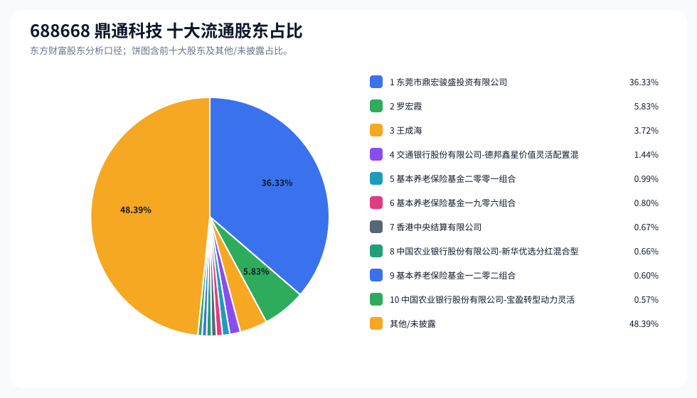
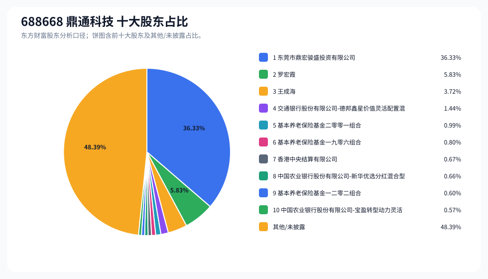
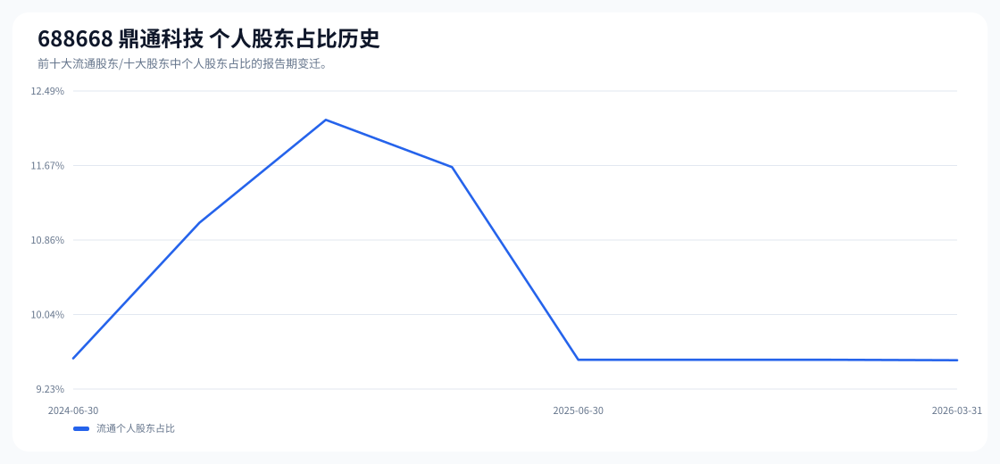

# 688668 鼎通科技 股东成分报告

- 生成时间：2026-06-07T16:40:07
- 看涨排名：2；综合评分：63.847。
- ETF/指数线索：CSI_2000 / 159531 中证2000ETF南方。
- 增长/交易机制标签：ETF信号牵引;价格动量;成交额放大;高换手交易;流通股东集中;机构股东参与。
- 说明：本报告是股东结构研究工件，不构成投资建议。

## 1. 公司交易与 ETF 线索

|项目|数值|
|---|---:|
|行业/地区|通信设备 / 东莞市|
|最新价|395.97|
|成交额|38.65亿|
|换手率|6.84%|
|5日收益|36.57%|
|20日收益|77.09%|
|20日成交额放大倍数|2.06|
|主力净流入| ()|

## 2. 股东结构快照

|项目|数值|
|---|---:|
|流通股东报告期|2026-03-31|
|前十大流通股东合计占流通股本|51.61%|
|其中机构类流通股东占比|42.07%|
|其中基金/社保/QFII 类占比|5.07%|
|前十大流通股东占比变化合计|-0.23%|
|第一大流通股东|东莞市鼎宏骏盛投资有限公司 / 其他 / 36.33%|
|十大股东报告期|2026-03-31|
|前十大股东合计占总股本|51.61%|
|其中机构类十大股东占比|42.06%|
|前十大股东占比变化合计|-0.23%|
|第一大股东|东莞市鼎宏骏盛投资有限公司 / 其他 / 36.33%|

## 3. 股东占比饼图

## 4. 历史股东变迁（个人股东重点）

|报告期|口径|前十大占比|个人股东数|个人股东占比|个人股东|机构占比|基金/社保/QFII占比|
|---|---|---:|---:|---:|---|---:|---:|
|2026-03-31|流通股东|51.61%|2|9.54%|罗宏霞、王成海|42.07%|5.07%|
|2025-12-31|流通股东|50.74%|2|9.55%|罗宏霞、王成海|41.20%|3.66%|
|2025-09-30|流通股东|50.98%|2|9.55%|罗宏霞、王成海|41.44%|3.63%|
|2025-06-30|流通股东|56.56%|2|9.55%|罗宏霞、王成海|47.01%|4.11%|
|2025-03-31|流通股东|54.63%|5|11.66%|罗宏霞、王成海、姜云庆、蔺桂然、卢文书|42.98%|1.78%|
|2024-12-31|流通股东|56.59%|5|12.17%|罗宏霞、王成海、王栋、姜云庆、卢文书|44.42%|1.29%|
|2024-09-30|流通股东|58.51%|3|11.05%|罗宏霞、王成海、何源|47.46%|2.27%|
|2024-06-30|流通股东|57.90%|2|9.56%|罗宏霞、王成海|48.34%|2.77%|

### 个人股东逐期变化

|从|到|口径|个人股东|状态|上一期占比|本期占比|占比变化|上一期排名|本期排名|
|---|---|---|---|---|---:|---:|---:|---:|---:|
|2025-12-31|2026-03-31|流通|罗宏霞|减持|5.83%|5.83%|-0.00%|2|2|
|2025-12-31|2026-03-31|流通|王成海|减持|3.72%|3.72%|-0.00%|3|3|
|2025-09-30|2025-12-31|流通|王成海|不变|3.72%|3.72%|0.00%|3|3|
|2025-09-30|2025-12-31|流通|罗宏霞|不变|5.83%|5.83%|0.00%|2|2|
|2025-06-30|2025-09-30|流通|王成海|不变|3.72%|3.72%|0.00%|3|3|
|2025-06-30|2025-09-30|流通|罗宏霞|不变|5.83%|5.83%|0.00%|2|2|
|2025-03-31|2025-06-30|流通|姜云庆|退出|0.76%||-0.76%|6||
|2025-03-31|2025-06-30|流通|蔺桂然|退出|0.73%||-0.73%|7||
|2025-03-31|2025-06-30|流通|卢文书|退出|0.60%||-0.60%|9||
|2025-03-31|2025-06-30|流通|罗宏霞|减持|5.85%|5.83%|-0.02%|2|2|
|2025-03-31|2025-06-30|流通|王成海|增持|3.71%|3.72%|0.00%|3|3|
|2024-12-31|2025-03-31|流通|王栋|退出|1.14%||-1.14%|7||
|2024-12-31|2025-03-31|流通|蔺桂然|新进||0.73%|0.73%||7|
|2024-12-31|2025-03-31|流通|卢文书|减持|0.71%|0.60%|-0.11%|10|9|
|2024-12-31|2025-03-31|流通|姜云庆|增持|0.76%|0.76%|0.00%|9|6|
|2024-12-31|2025-03-31|流通|王成海|不变|3.71%|3.71%|0.00%|3|3|
|2024-12-31|2025-03-31|流通|罗宏霞|不变|5.85%|5.85%|0.00%|2|2|
|2024-09-30|2024-12-31|流通|何源|退出|1.48%||-1.48%|6||
|2024-09-30|2024-12-31|流通|王栋|新进||1.14%|1.14%||7|
|2024-09-30|2024-12-31|流通|姜云庆|新进||0.76%|0.76%||9|
|2024-09-30|2024-12-31|流通|卢文书|新进||0.71%|0.71%||10|
|2024-09-30|2024-12-31|流通|王成海|不变|3.71%|3.71%|0.00%|3|3|
|2024-09-30|2024-12-31|流通|罗宏霞|不变|5.85%|5.85%|0.00%|2|2|
|2024-06-30|2024-09-30|流通|何源|新进||1.48%|1.48%||6|

## 5. 股东明细

### 十大流通股东

|排名|股东名称|类型|股份类型|持股数|占总股本|占流通股本|占比变化|方向|参考市值|
|---:|---|---|---|---:|---:|---:|---:|---|---:|
|1|东莞市鼎宏骏盛投资有限公司|其他|A股|50595683|36.33%|36.33%|-0.02%|不变|63.70亿|
|2|罗宏霞|个人|A股|8114400|5.83%|5.83%|-0.00%|不变|10.22亿|
|3|王成海|个人|A股|5175206|3.72%|3.72%|-0.00%|不变|6.52亿|
|4|交通银行股份有限公司-德邦鑫星价值灵活配置混合型证券投资基金|基金|A股|2010725|1.44%|1.44%||新进|2.53亿|
|5|基本养老保险基金二零零一组合|其他|A股|1374827|0.99%|0.99%||新进|1.73亿|
|6|基本养老保险基金一九零六组合|其他|A股|1119474|0.80%|0.80%|0.17%|增加|1.41亿|
|7|香港中央结算有限公司|其他|A股|926790|0.67%|0.67%|-0.53%|减少|1.17亿|
|8|中国农业银行股份有限公司-新华优选分红混合型证券投资基金|基金|A股|925893|0.66%|0.66%|0.16%|增加|1.17亿|
|9|基本养老保险基金一二零二组合|其他|A股|840916|0.60%|0.60%||新进|1.06亿|
|10|中国农业银行股份有限公司-宝盈转型动力灵活配置混合型证券投资基金|基金|A股|791613|0.57%|0.57%|-0.00%|不变|9966.41万|

### 十大股东

|排名|股东名称|类型|股份类型|持股数|占总股本|占流通股本|占比变化|方向|参考市值|
|---:|---|---|---|---:|---:|---:|---:|---|---:|
|1|东莞市鼎宏骏盛投资有限公司|其他|流通A股|50595683|36.33%||-0.02%|不变|63.70亿|
|2|罗宏霞|个人|流通A股|8114400|5.83%||0.00%|不变|10.22亿|
|3|王成海|个人|流通A股|5175206|3.72%||0.00%|不变|6.52亿|
|4|交通银行股份有限公司-德邦鑫星价值灵活配置混合型证券投资基金|基金|流通A股|2010725|1.44%|||新进|2.53亿|
|5|基本养老保险基金二零零一组合|其他|流通A股|1374827|0.99%|||新进|1.73亿|
|6|基本养老保险基金一九零六组合|其他|流通A股|1119474|0.80%||0.16%|增持|1.41亿|
|7|香港中央结算有限公司|其他|流通A股|926790|0.67%||-0.52%|减持|1.17亿|
|8|中国农业银行股份有限公司-新华优选分红混合型证券投资基金|基金|流通A股|925893|0.66%||0.15%|增持|1.17亿|
|9|基本养老保险基金一二零二组合|其他|流通A股|840916|0.60%|||新进|1.06亿|
|10|中国农业银行股份有限公司-宝盈转型动力灵活配置混合型证券投资基金|基金|流通A股|791613|0.57%||0.00%|不变|9966.41万|

## 6. 解读要点

- 若“成交额放大 + 高换手交易”同时出现，说明上涨背后有真实交易活跃度，但也可能伴随波动放大。
- 前十大流通股东占比越高，筹码越集中；机构/基金占比越高，越需要继续核对定期报告、基金持仓和是否存在被动指数持仓。
- 个人股东历史变迁重点看三类信号：连续增持、新进进入前十大、以及从前十大退出；个人股东占比变化越大，越需要核对公告和实际控制人/高管身份。
- 股东占比变化为增持/减持线索，需结合公告日、股价位置和成交额验证，不应单独作为买卖依据。

## 数据源

- 股东数据：https://datacenter-web.eastmoney.com/api/data/v1/get (RPT_F10_EH_FREEHOLDERS / RPT_DMSK_HOLDERS)
- 行情与 K 线：https://push2.eastmoney.com/api/qt/clist/get / https://push2his.eastmoney.com/api/qt/stock/kline/get
