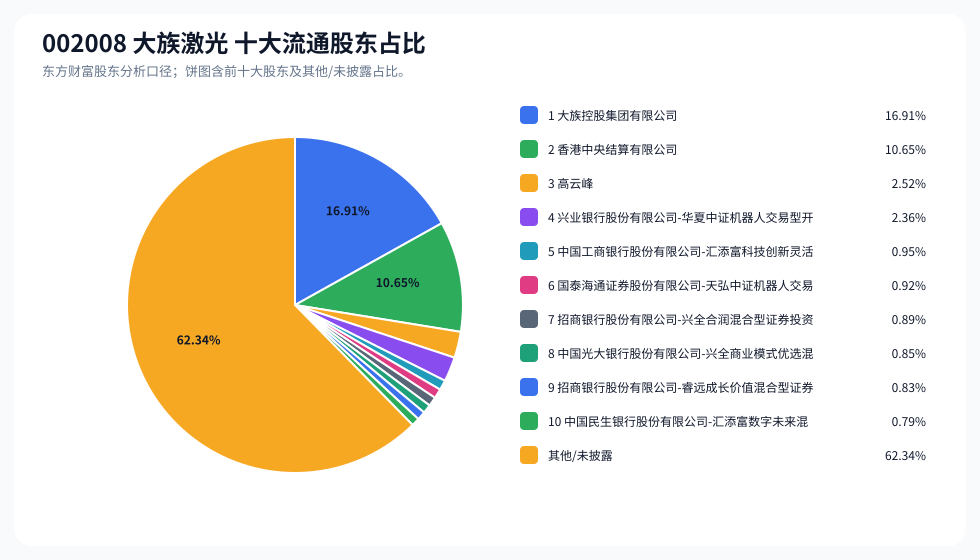
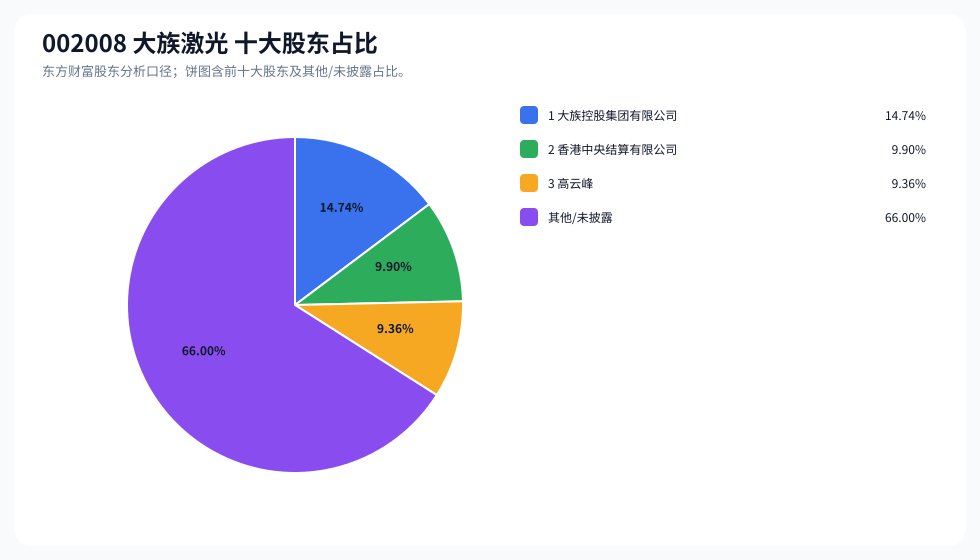
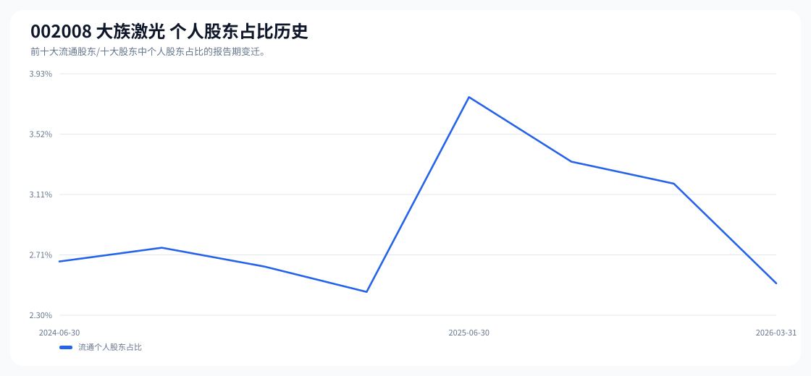

# 002008 大族激光 股东成分报告

- 生成时间：2026-06-07T16:17:50
- 看涨排名：3；综合评分：16.650。
- ETF/指数线索：CSI_500 / 510500 中证500ETF南方。
- 增长/交易机制标签：ETF信号牵引;高换手交易;流通股东集中;机构股东参与。
- 说明：本报告是股东结构研究工件，不构成投资建议。

## 1. 公司交易与 ETF 线索

|项目|数值|
|---|---:|
|行业/地区|自动化设备 / 深圳市|
|最新价|127.87|
|成交额|74.58亿|
|换手率|5.94%|
|5日收益|-3.02%|
|20日收益|4.93%|
|20日成交额放大倍数|0.97|
|主力净流入| ()|

## 2. 股东结构快照

|项目|数值|
|---|---:|
|流通股东报告期|2026-03-31|
|前十大流通股东合计占流通股本|37.66%|
|其中机构类流通股东占比|35.15%|
|其中基金/社保/QFII 类占比|7.58%|
|前十大流通股东占比变化合计|-1.08%|
|第一大流通股东|大族控股集团有限公司 / 其他 / 16.91%|
|十大股东报告期|2026-04-28|
|前十大股东合计占总股本|34.00%|
|其中机构类十大股东占比|24.64%|
|前十大股东占比变化合计|-0.96%|
|第一大股东|大族控股集团有限公司 / 其他 / 14.74%|

## 3. 股东占比饼图

## 4. 历史股东变迁（个人股东重点）

|报告期|口径|前十大占比|个人股东数|个人股东占比|个人股东|机构占比|基金/社保/QFII占比|
|---|---|---:|---:|---:|---|---:|---:|
|2026-03-31|流通股东|37.66%|1|2.52%|高云峰|35.15%|7.58%|
|2025-12-31|流通股东|38.93%|2|3.19%|高云峰、杜远|35.75%|6.56%|
|2025-09-30|流通股东|34.86%|2|3.34%|高云峰、杜远|31.52%|6.65%|
|2025-06-30|流通股东|29.60%|3|3.77%|高云峰、瞿理勇、瞿龙辉|25.83%|4.69%|
|2025-03-31|流通股东|28.94%|1|2.46%|高云峰|26.48%|4.34%|
|2024-12-31|流通股东|26.53%|2|2.63%|高云峰、王斌|23.90%|2.93%|
|2024-09-30|流通股东|26.66%|2|2.76%|高云峰、瞿理勇|23.91%|2.54%|
|2024-06-30|流通股东|25.99%|2|2.66%|高云峰、瞿理勇|23.33%|1.97%|

### 个人股东逐期变化

|从|到|口径|个人股东|状态|上一期占比|本期占比|占比变化|上一期排名|本期排名|
|---|---|---|---|---|---:|---:|---:|---:|---:|
|2025-12-31|2026-03-31|流通|杜远|退出|0.67%||-0.67%|10||
|2025-12-31|2026-03-31|流通|高云峰|不变|2.52%|2.52%|0.00%|4|3|
|2025-09-30|2025-12-31|流通|杜远|减持|0.82%|0.67%|-0.15%|8|10|
|2025-09-30|2025-12-31|流通|高云峰|减持|2.52%|2.52%|-0.00%|3|4|
|2025-06-30|2025-09-30|流通|瞿理勇|退出|0.96%||-0.96%|7||
|2025-06-30|2025-09-30|流通|杜远|新进||0.82%|0.82%||8|
|2025-06-30|2025-09-30|流通|瞿龙辉|退出|0.35%||-0.35%|10||
|2025-06-30|2025-09-30|流通|高云峰|增持|2.46%|2.52%|0.06%|3|3|
|2025-03-31|2025-06-30|流通|瞿理勇|新进||0.96%|0.96%||7|
|2025-03-31|2025-06-30|流通|瞿龙辉|新进||0.35%|0.35%||10|
|2025-03-31|2025-06-30|流通|高云峰|增持|2.46%|2.46%|0.00%|3|3|
|2024-12-31|2025-03-31|流通|王斌|退出|0.17%||-0.17%|9||
|2024-12-31|2025-03-31|流通|高云峰|不变|2.46%|2.46%|0.00%|2|3|
|2024-09-30|2024-12-31|流通|瞿理勇|退出|0.30%||-0.30%|8||
|2024-09-30|2024-12-31|流通|王斌|新进||0.17%|0.17%||9|
|2024-09-30|2024-12-31|流通|高云峰|减持|2.46%|2.46%|-0.00%|2|2|
|2024-06-30|2024-09-30|流通|瞿理勇|增持|0.20%|0.30%|0.09%|9|8|
|2024-06-30|2024-09-30|流通|高云峰|不变|2.46%|2.46%|0.00%|2|2|

## 5. 股东明细

### 十大流通股东

|排名|股东名称|类型|股份类型|持股数|占总股本|占流通股本|占比变化|方向|参考市值|
|---:|---|---|---|---:|---:|---:|---:|---|---:|
|1|大族控股集团有限公司|其他|A股|161773306|15.71%|16.91%|0.00%|不变|99.13亿|
|2|香港中央结算有限公司|其他|A股|101938683|9.90%|10.65%|-0.58%|减少|62.47亿|
|3|高云峰|个人|A股|24079884|2.34%|2.52%|0.00%|不变|14.76亿|
|4|兴业银行股份有限公司-华夏中证机器人交易型开放式指数证券投资基金|基金|A股|22617924|2.20%|2.36%|-0.31%|减少|13.86亿|
|5|中国工商银行股份有限公司-汇添富科技创新灵活配置混合型证券投资基金|基金|A股|9129000|0.89%|0.95%||新进|5.59亿|
|6|国泰海通证券股份有限公司-天弘中证机器人交易型开放式指数证券投资基金|基金|A股|8772846|0.85%|0.92%|-0.20%|减少|5.38亿|
|7|招商银行股份有限公司-兴全合润混合型证券投资基金|基金|A股|8491904|0.82%|0.89%||新进|5.20亿|
|8|中国光大银行股份有限公司-兴全商业模式优选混合型证券投资基金(LOF)|基金|A股|8108314|0.79%|0.85%||新进|4.97亿|
|9|招商银行股份有限公司-睿远成长价值混合型证券投资基金|基金|A股|7896302|0.77%|0.83%||新进|4.84亿|
|10|中国民生银行股份有限公司-汇添富数字未来混合型证券投资基金|基金|A股|7538427|0.73%|0.79%||新进|4.62亿|

### 十大股东

|排名|股东名称|类型|股份类型|持股数|占总股本|占流通股本|占比变化|方向|参考市值|
|---:|---|---|---|---:|---:|---:|---:|---|---:|
|1|大族控股集团有限公司|其他|流通A股|151815157|14.74%||-0.96%|减持|159.74亿|
|2|香港中央结算有限公司|其他|流通A股|101938683|9.90%||0.00%|不变|107.26亿|
|3|高云峰|个人|流通A股,限售流通A股|96319535|9.36%||0.00%|不变|101.35亿|

## 6. 解读要点

- 若“成交额放大 + 高换手交易”同时出现，说明上涨背后有真实交易活跃度，但也可能伴随波动放大。
- 前十大流通股东占比越高，筹码越集中；机构/基金占比越高，越需要继续核对定期报告、基金持仓和是否存在被动指数持仓。
- 个人股东历史变迁重点看三类信号：连续增持、新进进入前十大、以及从前十大退出；个人股东占比变化越大，越需要核对公告和实际控制人/高管身份。
- 股东占比变化为增持/减持线索，需结合公告日、股价位置和成交额验证，不应单独作为买卖依据。

## 数据源

- 股东数据：https://datacenter-web.eastmoney.com/api/data/v1/get (RPT_F10_EH_FREEHOLDERS / RPT_DMSK_HOLDERS)
- 行情与 K 线：https://push2.eastmoney.com/api/qt/clist/get / https://push2his.eastmoney.com/api/qt/stock/kline/get
