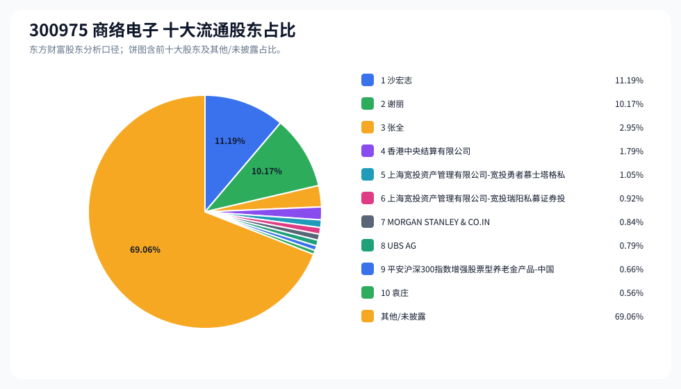
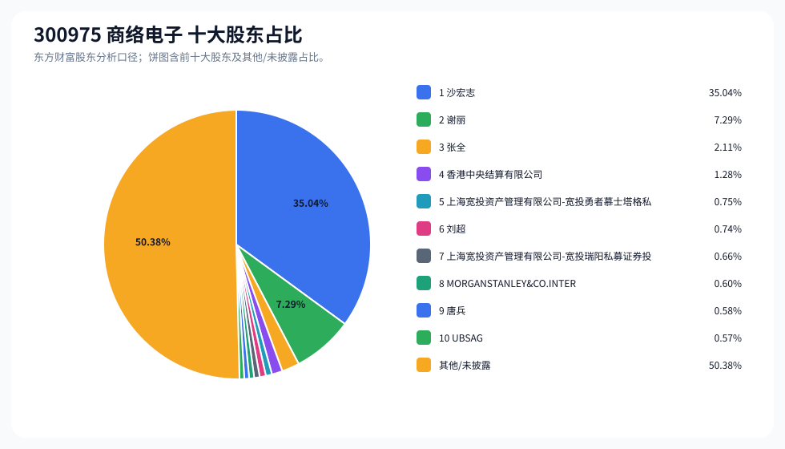
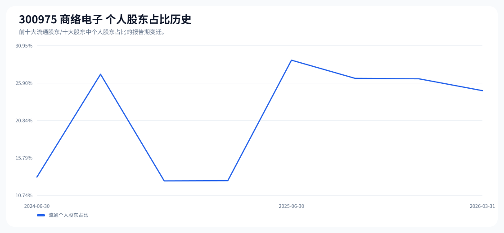

# 300975 商络电子 股东成分报告

- 生成时间：2026-06-07T16:34:50
- 看涨排名：3；综合评分：62.279。
- ETF/指数线索：CSI_2000 / 159531 中证2000ETF南方。
- 增长/交易机制标签：ETF信号牵引;价格动量;成交额放大;高换手交易;流通股东集中;ROE支撑。
- 说明：本报告是股东结构研究工件，不构成投资建议。

## 1. 公司交易与 ETF 线索

|项目|数值|
|---|---:|
|行业/地区|元件 / 南京市|
|最新价|44.80|
|成交额|47.48亿|
|换手率|21.80%|
|5日收益|25.09%|
|20日收益|94.33%|
|20日成交额放大倍数|1.77|
|主力净流入| ()|

## 2. 股东结构快照

|项目|数值|
|---|---:|
|流通股东报告期|2026-03-31|
|前十大流通股东合计占流通股本|30.94%|
|其中机构类流通股东占比|6.06%|
|其中基金/社保/QFII 类占比|3.61%|
|前十大流通股东占比变化合计|-0.24%|
|第一大流通股东|沙宏志 / 个人 / 11.19%|
|十大股东报告期|2026-03-31|
|前十大股东合计占总股本|49.62%|
|其中机构类十大股东占比|3.86%|
|前十大股东占比变化合计|-1.51%|
|第一大股东|沙宏志 / 个人 / 35.04%|

## 3. 股东占比饼图

## 4. 历史股东变迁（个人股东重点）

|报告期|口径|前十大占比|个人股东数|个人股东占比|个人股东|机构占比|基金/社保/QFII占比|
|---|---|---:|---:|---:|---|---:|---:|
|2026-03-31|流通股东|30.94%|4|24.88%|沙宏志、谢丽、张全、袁庄|6.06%|3.61%|
|2025-12-31|流通股东|31.19%|5|26.48%|沙宏志、谢丽、张全、吕强、王民|4.71%|2.52%|
|2025-09-30|流通股东|31.67%|5|26.54%|沙宏志、谢丽、张全、吕强、陶立军|5.13%|2.52%|
|2025-06-30|流通股东|32.73%|5|28.99%|沙宏志、谢丽、张全、袁伟强、陶立军|3.74%|1.63%|
|2025-03-31|流通股东|18.18%|5|12.73%|谢丽、袁伟强、陶立军、汪振华、苑文波|5.44%|1.81%|
|2024-12-31|流通股东|18.48%|5|12.70%|谢丽、蔡运生、陶立军、汪振华、苑文波|5.78%|1.87%|
|2024-09-30|流通股东|34.97%|5|27.09%|沙宏志、谢丽、张全、陶立军、刘超|7.88%|3.06%|
|2024-06-30|流通股东|22.07%|3|13.21%|谢丽、陶立军、黎少广|8.86%|4.19%|

### 个人股东逐期变化

|从|到|口径|个人股东|状态|上一期占比|本期占比|占比变化|上一期排名|本期排名|
|---|---|---|---|---|---:|---:|---:|---:|---:|
|2025-12-31|2026-03-31|流通|沙宏志|减持|12.23%|11.19%|-1.04%|1|1|
|2025-12-31|2026-03-31|流通|袁庄|新进||0.56%|0.56%||10|
|2025-12-31|2026-03-31|流通|吕强|退出|0.55%||-0.55%|8||
|2025-12-31|2026-03-31|流通|王民|退出|0.41%||-0.41%|9||
|2025-12-31|2026-03-31|流通|张全|减持|3.12%|2.95%|-0.17%|3|3|
|2025-12-31|2026-03-31|流通|谢丽|不变|10.17%|10.17%|0.00%|2|2|
|2025-09-30|2025-12-31|流通|王民|新进||0.41%|0.41%||9|
|2025-09-30|2025-12-31|流通|陶立军|退出|0.37%||-0.37%|10||
|2025-09-30|2025-12-31|流通|张全|减持|3.22%|3.12%|-0.09%|3|3|
|2025-09-30|2025-12-31|流通|吕强|不变|0.55%|0.55%|0.00%|9|8|
|2025-09-30|2025-12-31|流通|沙宏志|不变|12.23%|12.23%|0.00%|1|1|
|2025-09-30|2025-12-31|流通|谢丽|不变|10.17%|10.17%|0.00%|2|2|
|2025-06-30|2025-09-30|流通|张全|减持|5.11%|3.22%|-1.89%|3|3|
|2025-06-30|2025-09-30|流通|谢丽|减持|10.77%|10.17%|-0.60%|2|2|
|2025-06-30|2025-09-30|流通|吕强|新进||0.55%|0.55%||9|
|2025-06-30|2025-09-30|流通|袁伟强|退出|0.51%||-0.51%|7||
|2025-06-30|2025-09-30|流通|陶立军|减持|0.37%|0.37%|-0.00%|8|10|
|2025-06-30|2025-09-30|流通|沙宏志|不变|12.23%|12.23%|0.00%|1|1|
|2025-03-31|2025-06-30|流通|沙宏志|新进||12.23%|12.23%||1|
|2025-03-31|2025-06-30|流通|张全|新进||5.11%|5.11%||3|
|2025-03-31|2025-06-30|流通|谢丽|减持|11.41%|10.77%|-0.65%|1|2|
|2025-03-31|2025-06-30|流通|汪振华|退出|0.27%||-0.27%|9||
|2025-03-31|2025-06-30|流通|苑文波|退出|0.25%||-0.25%|10||
|2025-03-31|2025-06-30|流通|袁伟强|增持|0.44%|0.51%|0.07%|5|7|

## 5. 股东明细

### 十大流通股东

|排名|股东名称|类型|股份类型|持股数|占总股本|占流通股本|占比变化|方向|参考市值|
|---:|---|---|---|---:|---:|---:|---:|---|---:|
|1|沙宏志|个人|A股|55087181|8.02%|11.19%|-0.74%|减少|9.45亿|
|2|谢丽|个人|A股|50054000|7.29%|10.17%|0.00%|不变|8.59亿|
|3|张全|个人|A股|14526300|2.11%|2.95%|-0.12%|减少|2.49亿|
|4|香港中央结算有限公司|其他|A股|8822390|1.28%|1.79%|1.02%|增加|1.51亿|
|5|上海宽投资产管理有限公司-宽投勇者慕士塔格私募证券投资基金|其他|A股|5168900|0.75%|1.05%|-0.13%|减少|8869.83万|
|6|上海宽投资产管理有限公司-宽投瑞阳私募证券投资基金|其他|A股|4524600|0.66%|0.92%|-0.26%|减少|7764.21万|
|7|MORGAN STANLEY & CO.INTERNATIONAL PLC.|QFII|A股|4155095|0.60%|0.84%||新进|7130.14万|
|8|UBS AG|QFII|A股|3901780|0.57%|0.79%||新进|6695.45万|
|9|平安沪深300指数增强股票型养老金产品-中国工商银行股份有限公司|其他|A股|3247900|0.47%|0.66%||新进|5573.40万|
|10|袁庄|个人|A股|2758500|0.40%|0.56%||新进|4733.59万|

### 十大股东

|排名|股东名称|类型|股份类型|持股数|占总股本|占流通股本|占比变化|方向|参考市值|
|---:|---|---|---|---:|---:|---:|---:|---|---:|
|1|沙宏志|个人|流通A股,限售流通A股|240756971|35.04%||-0.99%|减持|41.31亿|
|2|谢丽|个人|流通A股|50054000|7.29%||0.00%|不变|8.59亿|
|3|张全|个人|流通A股|14526300|2.11%||-0.13%|减持|2.49亿|
|4|香港中央结算有限公司|其他|流通A股|8822390|1.28%|||新进|1.51亿|
|5|上海宽投资产管理有限公司-宽投勇者慕士塔格私募证券投资基金|其他|流通A股|5168900|0.75%||-0.13%|减持|8869.83万|
|6|刘超|个人|流通A股,限售流通A股|5079933|0.74%||0.00%|不变|8717.17万|
|7|上海宽投资产管理有限公司-宽投瑞阳私募证券投资基金|其他|流通A股|4524600|0.66%||-0.26%|减持|7764.21万|
|8|MORGANSTANLEY&CO.INTERNATIONAL PLC.|QFII|流通A股|4155095|0.60%|||新进|7130.14万|
|9|唐兵|个人|流通A股,限售流通A股|4000000|0.58%||0.00%|不变|6864.00万|
|10|UBSAG|QFII|流通A股|3901780|0.57%|||新进|6695.45万|

## 6. 解读要点

- 若“成交额放大 + 高换手交易”同时出现，说明上涨背后有真实交易活跃度，但也可能伴随波动放大。
- 前十大流通股东占比越高，筹码越集中；机构/基金占比越高，越需要继续核对定期报告、基金持仓和是否存在被动指数持仓。
- 个人股东历史变迁重点看三类信号：连续增持、新进进入前十大、以及从前十大退出；个人股东占比变化越大，越需要核对公告和实际控制人/高管身份。
- 股东占比变化为增持/减持线索，需结合公告日、股价位置和成交额验证，不应单独作为买卖依据。

## 数据源

- 股东数据：https://datacenter-web.eastmoney.com/api/data/v1/get (RPT_F10_EH_FREEHOLDERS / RPT_DMSK_HOLDERS)
- 行情与 K 线：https://push2.eastmoney.com/api/qt/clist/get / https://push2his.eastmoney.com/api/qt/stock/kline/get
