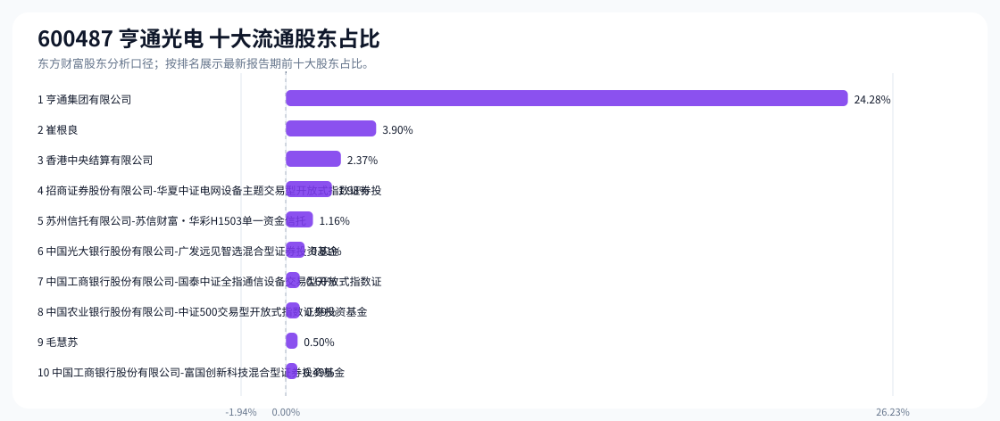
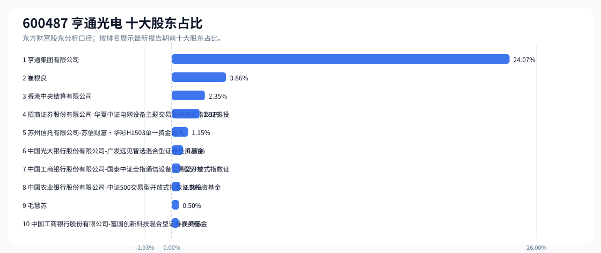

# 600487 亨通光电 股东成分报告

- 生成时间：2026-06-07T16:04:24
- 看涨排名：3；综合评分：4.229。
- ETF/指数线索：CSI_500 / 510500 中证500ETF南方。
- 增长/交易机制标签：ETF信号牵引;流通股东集中;机构股东参与。
- 说明：本报告是股东结构研究工件，不构成投资建议。

## 1. 公司交易与 ETF 线索

|项目|数值|
|---|---:|
|行业/地区|通信设备 / 苏州市|
|最新价||
|成交额||
|换手率||
|5日收益||
|20日收益||
|20日成交额放大倍数||
|主力净流入| ()|

## 2. 股东结构快照

|项目|数值|
|---|---:|
|流通股东报告期|2026-03-31|
|前十大流通股东合计占流通股本|36.69%|
|其中机构类流通股东占比|32.29%|
|其中基金/社保/QFII 类占比|4.47%|
|前十大流通股东占比变化合计|-1.63%|
|第一大流通股东|亨通集团有限公司 / 其他 / 24.28%|
|十大股东报告期|2026-03-31|
|前十大股东合计占总股本|36.37%|
|其中机构类十大股东占比|32.01%|
|前十大股东占比变化合计|-1.64%|
|第一大股东|亨通集团有限公司 / 其他 / 24.07%|

## 3. 股东占比图

## 4. 股东明细

### 十大流通股东

|排名|股东名称|类型|股份类型|持股数|占总股本|占流通股本|占比变化|方向|参考市值|
|---:|---|---|---|---:|---:|---:|---:|---|---:|
|1|亨通集团有限公司|其他|A股|593765498|24.07%|24.28%|0.00%|不变|312.68亿|
|2|崔根良|个人|A股|95294433|3.86%|3.90%|0.00%|不变|50.18亿|
|3|香港中央结算有限公司|其他|A股|58019321|2.35%|2.37%|-1.05%|减少|30.55亿|
|4|招商证券股份有限公司-华夏中证电网设备主题交易型开放式指数证券投资基金|基金|A股|48514182|1.97%|1.98%||新进|25.55亿|
|5|苏州信托有限公司-苏信财富·华彩H1503单一资金信托|信托|A股|28460928|1.15%|1.16%|-0.01%|减少|14.99亿|
|6|中国光大银行股份有限公司-广发远见智选混合型证券投资基金|基金|A股|19754920|0.80%|0.81%||新进|10.40亿|
|7|中国工商银行股份有限公司-国泰中证全指通信设备交易型开放式指数证券投资基金|基金|A股|14562760|0.59%|0.60%|0.01%|增加|7.67亿|
|8|中国农业银行股份有限公司-中证500交易型开放式指数证券投资基金|基金|A股|14474964|0.59%|0.59%|-0.59%|减少|7.62亿|
|9|毛慧苏|个人|A股|12256692|0.50%|0.50%|0.00%|不变|6.45亿|
|10|中国工商银行股份有限公司-富国创新科技混合型证券投资基金|基金|A股|12000100|0.49%|0.49%||新进|6.32亿|

### 十大股东

|排名|股东名称|类型|股份类型|持股数|占总股本|占流通股本|占比变化|方向|参考市值|
|---:|---|---|---|---:|---:|---:|---:|---|---:|
|1|亨通集团有限公司|其他|流通A股|593765498|24.07%||0.00%|不变|312.68亿|
|2|崔根良|个人|流通A股|95294433|3.86%||0.00%|不变|50.18亿|
|3|香港中央结算有限公司|其他|流通A股|58019321|2.35%||-1.05%|减持|30.55亿|
|4|招商证券股份有限公司-华夏中证电网设备主题交易型开放式指数证券投资基金|基金|流通A股|48514182|1.97%|||新进|25.55亿|
|5|苏州信托有限公司-苏信财富·华彩H1503单一资金信托|信托|流通A股|28460928|1.15%||-0.01%|减持|14.99亿|
|6|中国光大银行股份有限公司-广发远见智选混合型证券投资基金|基金|流通A股|19754920|0.80%|||新进|10.40亿|
|7|中国工商银行股份有限公司-国泰中证全指通信设备交易型开放式指数证券投资基金|基金|流通A股|14562760|0.59%||0.01%|增持|7.67亿|
|8|中国农业银行股份有限公司-中证500交易型开放式指数证券投资基金|基金|流通A股|14474964|0.59%||-0.59%|减持|7.62亿|
|9|毛慧苏|个人|流通A股|12256692|0.50%||0.00%|不变|6.45亿|
|10|中国工商银行股份有限公司-富国创新科技混合型证券投资基金|基金|流通A股|12000100|0.49%|||新进|6.32亿|

## 5. 解读要点

- 若“成交额放大 + 高换手交易”同时出现，说明上涨背后有真实交易活跃度，但也可能伴随波动放大。
- 前十大流通股东占比越高，筹码越集中；机构/基金占比越高，越需要继续核对定期报告、基金持仓和是否存在被动指数持仓。
- 股东占比变化为增持/减持线索，需结合公告日、股价位置和成交额验证，不应单独作为买卖依据。

## 数据源

- 股东数据：https://datacenter-web.eastmoney.com/api/data/v1/get (RPT_F10_EH_FREEHOLDERS / RPT_DMSK_HOLDERS)
- 行情与 K 线：https://push2.eastmoney.com/api/qt/clist/get / https://push2his.eastmoney.com/api/qt/stock/kline/get
