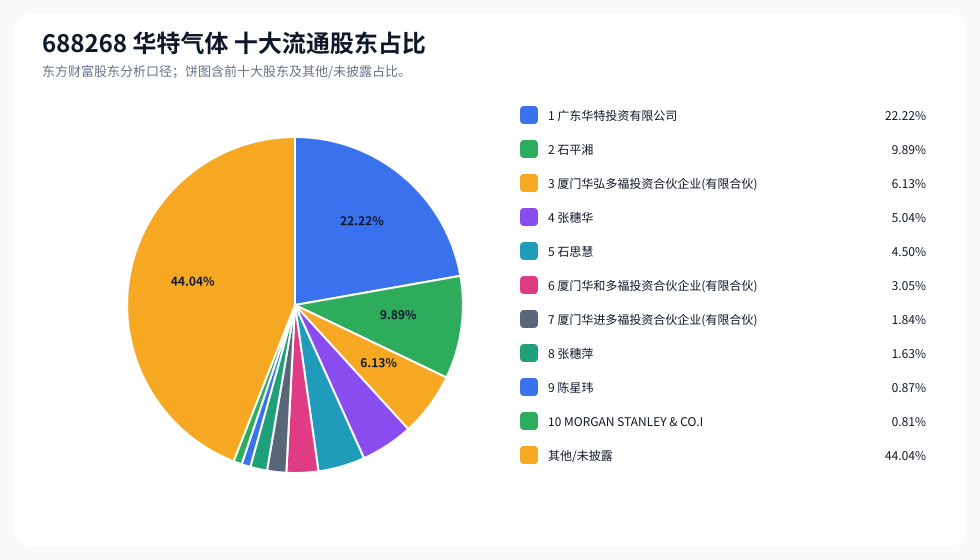
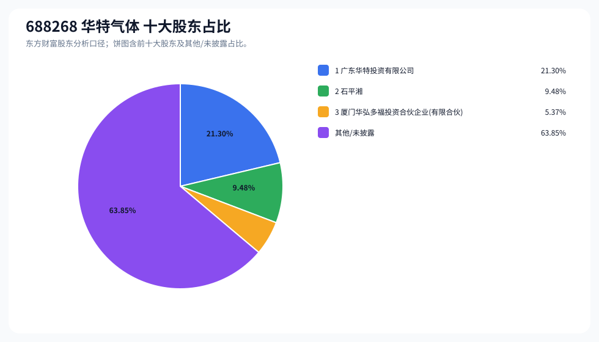
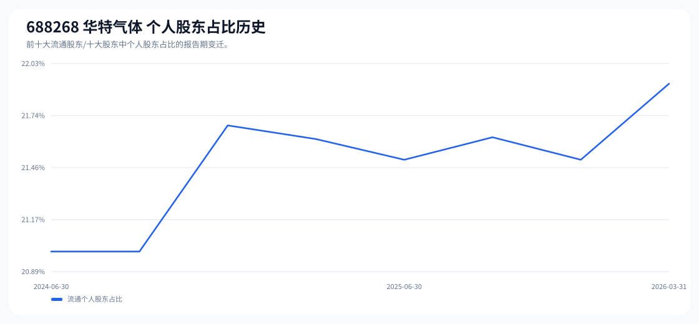

# 688268 华特气体 股东成分报告

- 生成时间：2026-06-07T16:40:07
- 看涨排名：4；综合评分：46.128。
- ETF/指数线索：CSI_2000 / 159531 中证 2000ETF 南方。
- 增长/交易机制标签：ETF 信号牵引;价格动量;成交额放大;高换手交易;流通股东集中;机构股东参与。
- 说明：本报告是股东结构研究工件，不构成投资建议。

## 1. 公司交易与 ETF 线索

|项目 | 数值|
|---|---:|
|行业/地区 | 电子化学品Ⅱ / 佛山市|
|最新价|196.70|
|成交额|27.63 亿|
|换手率|11.13%|
|5 日收益|37.46%|
|20 日收益|19.25%|
|20 日成交额放大倍数|1.50|
|主力净流入 | ()|

## 2. 股东结构快照

|项目 | 数值|
|---|---:|
|流通股东报告期|2026-03-31|
|前十大流通股东合计占流通股本|55.96%|
|其中机构类流通股东占比|34.05%|
|其中基金/社保/QFII 类占比|0.81%|
|前十大流通股东占比变化合计|-1.66%|
|第一大流通股东 | 广东华特投资有限公司 / 其他 / 22.22%|
|十大股东报告期|2026-05-29|
|前十大股东合计占总股本|36.15%|
|其中机构类十大股东占比|26.67%|
|前十大股东占比变化合计|-2.05%|
|第一大股东 | 广东华特投资有限公司 / 其他 / 21.30%|

## 3. 股东占比饼图

## 4. 历史股东变迁（个人股东重点）

|报告期 | 口径 | 前十大占比 | 个人股东数 | 个人股东占比 | 个人股东 | 机构占比 | 基金/社保/QFII 占比|
|---|---|---:|---:|---:|---|---:|---:|
|2026-03-31|流通股东|55.96%|5|21.92%|石平湘、张穗华、石思慧、张穗萍、陈星玮|34.05%|0.81%|
|2025-12-31|流通股东|57.26%|5|21.50%|石平湘、张穗华、石思慧、张穗萍、傅铸红|35.76%|0.61%|
|2025-09-30|流通股东|59.56%|5|21.62%|石平湘、张穗华、石思慧、张穗萍、邱勇强|37.94%|0.79%|
|2025-06-30|流通股东|59.45%|5|21.50%|石平湘、张穗华、石思慧、张穗萍、傅铸红|37.95%|0.81%|
|2025-03-31|流通股东|61.49%|5|21.61%|石平湘、张穗华、石思慧、张穗萍、傅铸红|39.87%|0.74%|
|2024-12-31|流通股东|61.58%|5|21.69%|石平湘、张穗华、石思慧、张穗萍、傅铸红|39.89%|0.75%|
|2024-09-30|流通股东|64.54%|4|21.00%|石平湘、张穗华、石思慧、张穗萍|43.54%|1.12%|
|2024-06-30|流通股东|64.65%|4|21.00%|石平湘、张穗华、石思慧、张穗萍|43.65%|1.00%|

### 个人股东逐期变化

|从 | 到|口径 | 个人股东 | 状态 | 上一期占比 | 本期占比 | 占比变化 | 上一期排名 | 本期排名|
|---|---|---|---|---|---:|---:|---:|---:|---:|
|2025-12-31|2026-03-31|流通 | 陈星玮 | 新进||0.87%|0.87%||9|
|2025-12-31|2026-03-31|流通 | 傅铸红 | 退出|0.50%||-0.50%|10||
|2025-12-31|2026-03-31|流通 | 石平湘 | 增持|9.86%|9.89%|0.03%|2|2|
|2025-12-31|2026-03-31|流通 | 张穗华 | 增持|5.02%|5.04%|0.01%|4|4|
|2025-12-31|2026-03-31|流通 | 石思慧 | 增持|4.49%|4.50%|0.01%|5|5|
|2025-12-31|2026-03-31|流通 | 张穗萍 | 增持|1.62%|1.63%|0.00%|8|8|
|2025-09-30|2025-12-31|流通 | 邱勇强 | 退出|0.62%||-0.62%|10||
|2025-09-30|2025-12-31|流通 | 傅铸红 | 新进||0.50%|0.50%||10|
|2025-09-30|2025-12-31|流通 | 石平湘 | 不变|9.86%|9.86%|-0.00%|2|2|
|2025-09-30|2025-12-31|流通 | 张穗华 | 不变|5.02%|5.02%|-0.00%|4|4|
|2025-09-30|2025-12-31|流通 | 石思慧 | 不变|4.49%|4.49%|-0.00%|5|5|
|2025-09-30|2025-12-31|流通 | 张穗萍 | 不变|1.62%|1.62%|-0.00%|8|8|
|2025-06-30|2025-09-30|流通 | 邱勇强 | 新进||0.62%|0.62%||10|
|2025-06-30|2025-09-30|流通 | 傅铸红 | 退出|0.50%||-0.50%|10||
|2025-06-30|2025-09-30|流通 | 石平湘 | 减持|9.86%|9.86%|-0.00%|2|2|
|2025-06-30|2025-09-30|流通 | 张穗华 | 减持|5.02%|5.02%|-0.00%|4|4|
|2025-06-30|2025-09-30|流通 | 石思慧 | 减持|4.49%|4.49%|-0.00%|5|5|
|2025-06-30|2025-09-30|流通 | 张穗萍 | 不变|1.62%|1.62%|-0.00%|8|8|
|2025-03-31|2025-06-30|流通 | 傅铸红 | 减持|0.61%|0.50%|-0.11%|10|10|
|2025-03-31|2025-06-30|流通 | 石平湘 | 减持|9.86%|9.86%|-0.00%|2|2|
|2025-03-31|2025-06-30|流通 | 张穗华 | 减持|5.02%|5.02%|-0.00%|4|4|
|2025-03-31|2025-06-30|流通 | 石思慧 | 减持|4.49%|4.49%|-0.00%|6|5|
|2025-03-31|2025-06-30|流通 | 张穗萍 | 减持|1.62%|1.62%|-0.00%|8|8|
|2024-12-31|2025-03-31|流通 | 傅铸红 | 减持|0.69%|0.61%|-0.07%|10|10|

## 5. 股东明细

### 十大流通股东

|排名 | 股东名称 | 类型 | 股份类型 | 持股数 | 占总股本 | 占流通股本 | 占比变化 | 方向 | 参考市值|
|---:|---|---|---|---:|---:|---:|---:|---|---:|
|1|广东华特投资有限公司 | 其他|A 股|26640700|22.20%|22.22%|0.06%|不变|24.24 亿|
|2|石平湘 | 个人|A 股|11855345|9.88%|9.89%|0.03%|不变|10.79 亿|
|3|厦门华弘多福投资合伙企业 (有限合伙)|其他|A 股|7347700|6.12%|6.13%|-0.95%|减少|6.69 亿|
|4|张穗华 | 个人|A 股|6039400|5.03%|5.04%|0.01%|不变|5.50 亿|
|5|石思慧 | 个人|A 股|5400000|4.50%|4.50%|0.01%|不变|4.91 亿|
|6|厦门华和多福投资合伙企业 (有限合伙)|其他|A 股|3662900|3.05%|3.05%|-0.56%|减少|3.33 亿|
|7|厦门华进多福投资合伙企业 (有限合伙)|其他|A 股|2203100|1.84%|1.84%|-0.46%|减少|2.00 亿|
|8|张穗萍 | 个人|A 股|1949736|1.62%|1.63%|0.00%|减少|1.77 亿|
|9|陈星玮 | 个人|A 股|1037423|0.86%|0.87%||新进|9440.55 万|
|10|MORGAN STANLEY & CO.INTERNATIONAL PLC.|QFII|A 股|973061|0.81%|0.81%|0.20%|增加|8854.86 万|

### 十大股东

|排名 | 股东名称 | 类型 | 股份类型 | 持股数 | 占总股本 | 占流通股本 | 占比变化 | 方向 | 参考市值|
|---:|---|---|---|---:|---:|---:|---:|---|---:|
|1|广东华特投资有限公司 | 其他 | 流通 A 股|26640700|21.30%||-0.90%|不变|38.12 亿|
|2|石平湘 | 个人 | 流通 A 股|11855345|9.48%||-0.40%|不变|16.96 亿|
|3|厦门华弘多福投资合伙企业 (有限合伙)|其他 | 流通 A 股|6722800|5.37%||-0.75%|减持|9.62 亿|

## 6. 解读要点

- 若“成交额放大 + 高换手交易”同时出现，说明上涨背后有真实交易活跃度，但也可能伴随波动放大。
- 前十大流通股东占比越高，筹码越集中；机构/基金占比越高，越需要继续核对定期报告、基金持仓和是否存在被动指数持仓。
- 个人股东历史变迁重点看三类信号：连续增持、新进进入前十大、以及从前十大退出；个人股东占比变化越大，越需要核对公告和实际控制人/高管身份。
- 股东占比变化为增持/减持线索，需结合公告日、股价位置和成交额验证，不应单独作为买卖依据。

## 数据源

- 股东数据：https://datacenter-web.eastmoney.com/api/data/v1/get (RPT_F10_EH_FREEHOLDERS / RPT_DMSK_HOLDERS)
- 行情与 K 线：https://push2.eastmoney.com/api/qt/clist/get / https://push2his.eastmoney.com/api/qt/stock/kline/get
