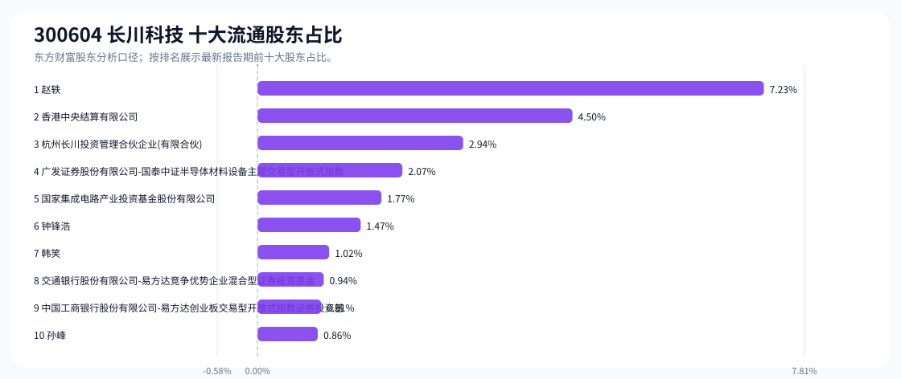
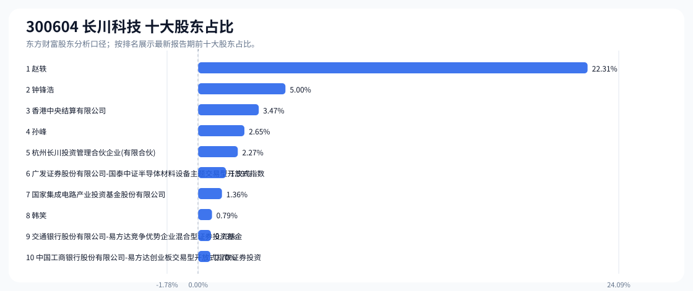

# 300604 长川科技 股东成分报告

- 生成时间：2026-06-07T16:04:24
- 看涨排名：5；综合评分：3.823。
- ETF/指数线索：CSI_500 / 510500 中证500ETF南方。
- 增长/交易机制标签：ETF信号牵引;机构股东参与。
- 说明：本报告是股东结构研究工件，不构成投资建议。

## 1. 公司交易与 ETF 线索

|项目|数值|
|---|---:|
|行业/地区|半导体 / 杭州市|
|最新价||
|成交额||
|换手率||
|5日收益||
|20日收益||
|20日成交额放大倍数||
|主力净流入| ()|

## 2. 股东结构快照

|项目|数值|
|---|---:|
|流通股东报告期|2026-03-31|
|前十大流通股东合计占流通股本|23.70%|
|其中机构类流通股东占比|13.12%|
|其中基金/社保/QFII 类占比|5.69%|
|前十大流通股东占比变化合计|-2.18%|
|第一大流通股东|赵轶 / 个人 / 7.23%|
|十大股东报告期|2026-03-31|
|前十大股东合计占总股本|40.87%|
|其中机构类十大股东占比|10.12%|
|前十大股东占比变化合计|-2.17%|
|第一大股东|赵轶 / 个人 / 22.31%|

## 3. 股东占比图

## 4. 股东明细

### 十大流通股东

|排名|股东名称|类型|股份类型|持股数|占总股本|占流通股本|占比变化|方向|参考市值|
|---:|---|---|---|---:|---:|---:|---:|---|---:|
|1|赵轶|个人|A股|35390549|5.58%|7.23%|-0.00%|不变|42.84亿|
|2|香港中央结算有限公司|其他|A股|22005652|3.47%|4.50%|0.02%|增加|26.64亿|
|3|杭州长川投资管理合伙企业(有限合伙)|其他|A股|14370188|2.27%|2.94%|-0.71%|减少|17.40亿|
|4|广发证券股份有限公司-国泰中证半导体材料设备主题交易型开放式指数证券投资基金|基金|A股|10118042|1.59%|2.07%|0.79%|增加|12.25亿|
|5|国家集成电路产业投资基金股份有限公司|其他|A股|8652300|1.36%|1.77%|-1.50%|减少|10.47亿|
|6|钟锋浩|个人|A股|7201324|1.14%|1.47%|-0.15%|减少|8.72亿|
|7|韩笑|个人|A股|5000000|0.79%|1.02%|-0.02%|减少|6.05亿|
|8|交通银行股份有限公司-易方达竞争优势企业混合型证券投资基金|基金|A股|4623142|0.73%|0.94%||新进|5.60亿|
|9|中国工商银行股份有限公司-易方达创业板交易型开放式指数证券投资基金|基金|A股|4442059|0.70%|0.91%|-0.61%|减少|5.38亿|
|10|孙峰|个人|A股|4202049|0.66%|0.86%||新进|5.09亿|

### 十大股东

|排名|股东名称|类型|股份类型|持股数|占总股本|占流通股本|占比变化|方向|参考市值|
|---:|---|---|---|---:|---:|---:|---:|---|---:|
|1|赵轶|个人|流通A股,限售流通A股|141562196|22.31%||0.00%|不变|171.36亿|
|2|钟锋浩|个人|流通A股,限售流通A股|31720030|5.00%||-0.15%|减持|38.40亿|
|3|香港中央结算有限公司|其他|流通A股|22005652|3.47%||0.02%|增持|26.64亿|
|4|孙峰|个人|流通A股,限售流通A股|16808194|2.65%||0.00%|不变|20.35亿|
|5|杭州长川投资管理合伙企业(有限合伙)|其他|流通A股|14370188|2.27%||-0.71%|减持|17.40亿|
|6|广发证券股份有限公司-国泰中证半导体材料设备主题交易型开放式指数证券投资基金|基金|流通A股|10118042|1.59%||0.78%|增持|12.25亿|
|7|国家集成电路产业投资基金股份有限公司|其他|流通A股|8652300|1.36%||-1.50%|减持|10.47亿|
|8|韩笑|个人|流通A股|5000000|0.79%|||新进|6.05亿|
|9|交通银行股份有限公司-易方达竞争优势企业混合型证券投资基金|基金|流通A股|4623142|0.73%|||新进|5.60亿|
|10|中国工商银行股份有限公司-易方达创业板交易型开放式指数证券投资基金|基金|流通A股|4442059|0.70%||-0.61%|减持|5.38亿|

## 5. 解读要点

- 若“成交额放大 + 高换手交易”同时出现，说明上涨背后有真实交易活跃度，但也可能伴随波动放大。
- 前十大流通股东占比越高，筹码越集中；机构/基金占比越高，越需要继续核对定期报告、基金持仓和是否存在被动指数持仓。
- 股东占比变化为增持/减持线索，需结合公告日、股价位置和成交额验证，不应单独作为买卖依据。

## 数据源

- 股东数据：https://datacenter-web.eastmoney.com/api/data/v1/get (RPT_F10_EH_FREEHOLDERS / RPT_DMSK_HOLDERS)
- 行情与 K 线：https://push2.eastmoney.com/api/qt/clist/get / https://push2his.eastmoney.com/api/qt/stock/kline/get
