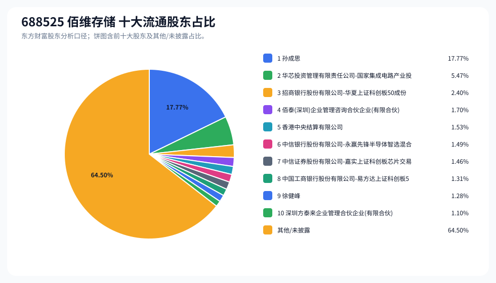
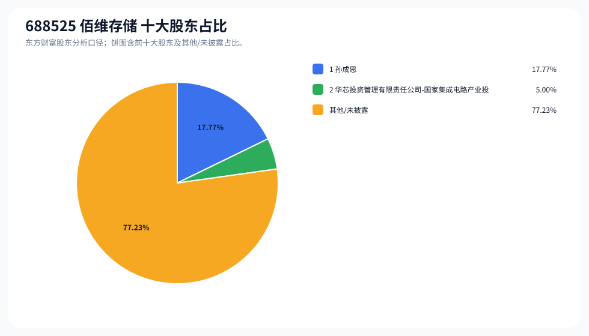
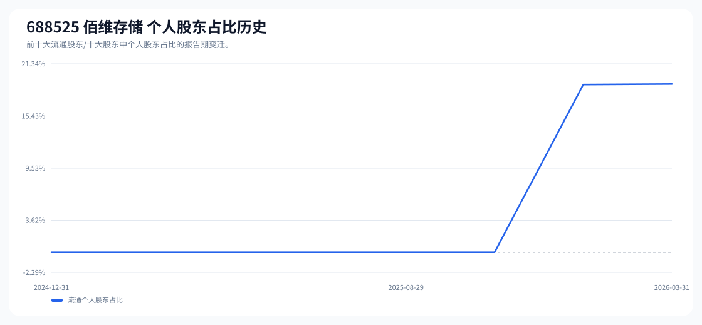

# 688525 佰维存储 股东成分报告

- 生成时间：2026-06-07T16:18:14
- 看涨排名：5；综合评分：12.267。
- ETF/指数线索：CSI_500 / 510500 中证500ETF南方。
- 增长/交易机制标签：ETF信号牵引;高换手交易;流通股东集中;机构股东参与;ROE支撑。
- 说明：本报告是股东结构研究工件，不构成投资建议。

## 1. 公司交易与 ETF 线索

|项目|数值|
|---|---:|
|行业/地区|半导体 / 深圳市|
|最新价|311.00|
|成交额|155.08亿|
|换手率|10.23%|
|5日收益|-5.00%|
|20日收益|7.08%|
|20日成交额放大倍数|1.13|
|主力净流入| ()|

## 2. 股东结构快照

|项目|数值|
|---|---:|
|流通股东报告期|2026-03-31|
|前十大流通股东合计占流通股本|35.50%|
|其中机构类流通股东占比|16.44%|
|其中基金/社保/QFII 类占比|12.12%|
|前十大流通股东占比变化合计|-3.56%|
|第一大流通股东|孙成思 / 个人 / 17.77%|
|十大股东报告期|2026-05-03|
|前十大股东合计占总股本|22.77%|
|其中机构类十大股东占比|5.00%|
|前十大股东占比变化合计|-0.47%|
|第一大股东|孙成思 / 个人 / 17.77%|

## 3. 股东占比饼图

## 4. 历史股东变迁（个人股东重点）

|报告期|口径|前十大占比|个人股东数|个人股东占比|个人股东|机构占比|基金/社保/QFII占比|
|---|---|---:|---:|---:|---|---:|---:|
|2026-03-31|流通股东|35.50%|2|19.05%|孙成思、徐健峰|16.44%|12.12%|
|2025-12-31|流通股东|39.59%|2|18.99%|孙成思、徐健峰|20.61%|18.89%|
|2025-09-30|流通股东|28.13%|0|0.00%||28.13%|27.13%|
|2025-08-29|流通股东|30.13%|0|0.00%||30.13%|30.13%|
|2025-08-08|流通股东|33.23%|0|0.00%||33.23%|33.23%|
|2025-06-30|流通股东|32.98%|0|0.00%||32.98%|32.98%|
|2025-03-31|流通股东|31.25%|0|0.00%||31.25%|31.25%|
|2024-12-31|流通股东|33.34%|0|0.00%||33.34%|32.00%|

### 个人股东逐期变化

|从|到|口径|个人股东|状态|上一期占比|本期占比|占比变化|上一期排名|本期排名|
|---|---|---|---|---|---:|---:|---:|---:|---:|
|2025-12-31|2026-03-31|流通|孙成思|增持|17.69%|17.77%|0.08%|1|1|
|2025-12-31|2026-03-31|流通|徐健峰|减持|1.30%|1.28%|-0.02%|9|9|
|2025-09-30|2025-12-31|流通|孙成思|新进||17.69%|17.69%||1|
|2025-09-30|2025-12-31|流通|徐健峰|新进||1.30%|1.30%||9|

## 5. 股东明细

### 十大流通股东

|排名|股东名称|类型|股份类型|持股数|占总股本|占流通股本|占比变化|方向|参考市值|
|---:|---|---|---|---:|---:|---:|---:|---|---:|
|1|孙成思|个人|A股|83657800|17.77%|17.77%|0.08%|增加|177.35亿|
|2|华芯投资管理有限责任公司-国家集成电路产业投资基金二期股份有限公司|其他|A股|25731779|5.47%|5.47%|-1.46%|减少|54.55亿|
|3|招商银行股份有限公司-华夏上证科创板50成份交易型开放式指数证券投资基金|基金|A股|11297366|2.40%|2.40%|-0.34%|减少|23.95亿|
|4|佰泰(深圳)企业管理咨询合伙企业(有限合伙)|其他|A股|8000000|1.70%|1.70%|-0.02%|不变|16.96亿|
|5|香港中央结算有限公司|其他|A股|7182911|1.53%|1.53%||新进|15.23亿|
|6|中信银行股份有限公司-永赢先锋半导体智选混合型发起式证券投资基金|基金|A股|7000000|1.49%|1.49%|-0.40%|减少|14.84亿|
|7|中信证券股份有限公司-嘉实上证科创板芯片交易型开放式指数证券投资基金|基金|A股|6857195|1.46%|1.46%|-0.14%|减少|14.54亿|
|8|中国工商银行股份有限公司-易方达上证科创板50成份交易型开放式指数证券投资基金|基金|A股|6157372|1.31%|1.31%|-1.25%|减少|13.05亿|
|9|徐健峰|个人|A股|6042000|1.28%|1.28%|-0.02%|不变|12.81亿|
|10|深圳方泰来企业管理合伙企业(有限合伙)|其他|A股|5200000|1.10%|1.10%||新进|11.02亿|

### 十大股东

|排名|股东名称|类型|股份类型|持股数|占总股本|占流通股本|占比变化|方向|参考市值|
|---:|---|---|---|---:|---:|---:|---:|---|---:|
|1|孙成思|个人|流通A股|83657800|17.77%||0.00%|不变|221.76亿|
|2|华芯投资管理有限责任公司-国家集成电路产业投资基金二期股份有限公司|其他|流通A股|23542679|5.00%||-0.47%|减持|62.41亿|

## 6. 解读要点

- 若“成交额放大 + 高换手交易”同时出现，说明上涨背后有真实交易活跃度，但也可能伴随波动放大。
- 前十大流通股东占比越高，筹码越集中；机构/基金占比越高，越需要继续核对定期报告、基金持仓和是否存在被动指数持仓。
- 个人股东历史变迁重点看三类信号：连续增持、新进进入前十大、以及从前十大退出；个人股东占比变化越大，越需要核对公告和实际控制人/高管身份。
- 股东占比变化为增持/减持线索，需结合公告日、股价位置和成交额验证，不应单独作为买卖依据。

## 数据源

- 股东数据：https://datacenter-web.eastmoney.com/api/data/v1/get (RPT_F10_EH_FREEHOLDERS / RPT_DMSK_HOLDERS)
- 行情与 K 线：https://push2.eastmoney.com/api/qt/clist/get / https://push2his.eastmoney.com/api/qt/stock/kline/get
