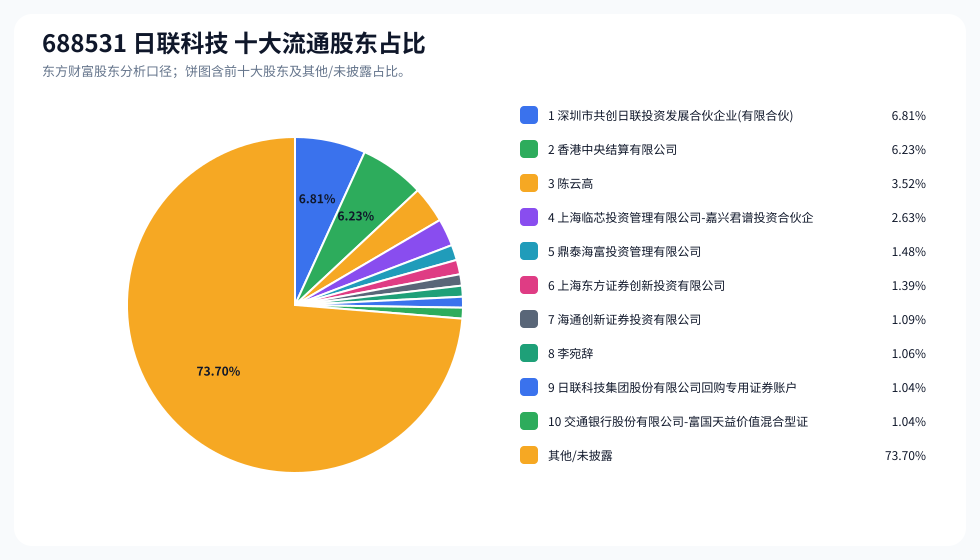
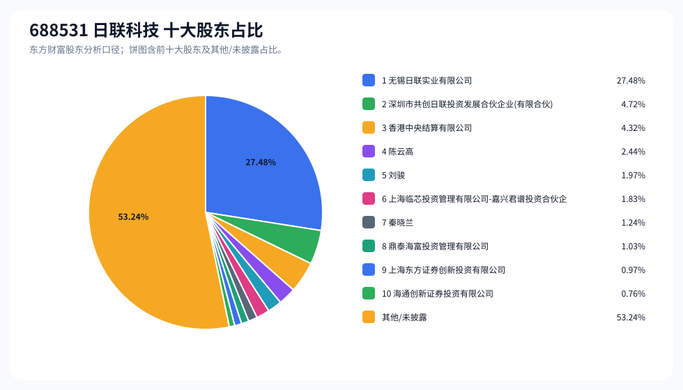
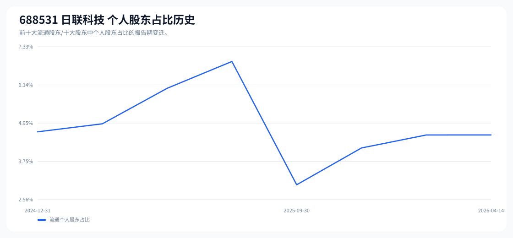

# 688531 日联科技 股东成分报告

- 生成时间：2026-06-07T16:32:43
- 看涨排名：5；综合评分：40.698。
- ETF/指数线索：CSI_2000 / 159531 中证2000ETF南方。
- 增长/交易机制标签：ETF信号牵引;价格动量;高换手交易;机构股东参与。
- 说明：本报告是股东结构研究工件，不构成投资建议。

## 1. 公司交易与 ETF 线索

|项目|数值|
|---|---:|
|行业/地区|专用设备 / 无锡市|
|最新价|195.17|
|成交额|15.76亿|
|换手率|6.81%|
|5日收益|9.22%|
|20日收益|53.11%|
|20日成交额放大倍数|0.96|
|主力净流入| ()|

## 2. 股东结构快照

|项目|数值|
|---|---:|
|流通股东报告期|2026-04-14|
|前十大流通股东合计占流通股本|26.30%|
|其中机构类流通股东占比|21.72%|
|其中基金/社保/QFII 类占比|3.67%|
|前十大流通股东占比变化合计|-0.23%|
|第一大流通股东|深圳市共创日联投资发展合伙企业(有限合伙) / 其他 / 6.81%|
|十大股东报告期|2026-04-14|
|前十大股东合计占总股本|46.76%|
|其中机构类十大股东占比|41.11%|
|前十大股东占比变化合计|-0.23%|
|第一大股东|无锡日联实业有限公司 / 其他 / 27.48%|

## 3. 股东占比饼图

## 4. 历史股东变迁（个人股东重点）

|报告期|口径|前十大占比|个人股东数|个人股东占比|个人股东|机构占比|基金/社保/QFII占比|
|---|---|---:|---:|---:|---|---:|---:|
|2026-04-14|流通股东|26.30%|2|4.58%|陈云高、李宛辞|21.72%|3.67%|
|2026-03-31|流通股东|26.64%|2|4.58%|陈云高、李宛辞|22.06%|4.92%|
|2025-12-31|流通股东|23.98%|2|4.17%|陈云高、李宛辞|19.81%|9.46%|
|2025-09-30|流通股东|21.11%|1|3.02%|陈云高|18.09%|8.71%|
|2025-06-30|流通股东|24.69%|4|6.87%|陈云高、彭朝晖、金亚东、李宛辞|17.82%|7.21%|
|2025-06-20|流通股东|25.80%|3|6.03%|陈云高、彭朝晖、金亚东|19.77%|7.30%|
|2025-03-31|流通股东|28.31%|2|4.92%|陈云高、彭朝晖|23.39%|7.44%|
|2024-12-31|流通股东|37.47%|2|4.67%|陈云高、彭朝晖|32.80%|9.37%|

### 个人股东逐期变化

|从|到|口径|个人股东|状态|上一期占比|本期占比|占比变化|上一期排名|本期排名|
|---|---|---|---|---|---:|---:|---:|---:|---:|
|2026-03-31|2026-04-14|流通|陈云高|增持|3.52%|3.52%|0.00%|3|3|
|2026-03-31|2026-04-14|流通|李宛辞|不变|1.06%|1.06%|0.00%|8|8|
|2025-12-31|2026-03-31|流通|陈云高|增持|3.03%|3.52%|0.49%|3|3|
|2025-12-31|2026-03-31|流通|李宛辞|减持|1.14%|1.06%|-0.08%|10|8|
|2025-09-30|2025-12-31|流通|李宛辞|新进||1.14%|1.14%||10|
|2025-09-30|2025-12-31|流通|陈云高|增持|3.02%|3.03%|0.01%|2|3|
|2025-06-30|2025-09-30|流通|彭朝晖|退出|1.83%||-1.83%|6||
|2025-06-30|2025-09-30|流通|金亚东|退出|1.08%||-1.08%|9||
|2025-06-30|2025-09-30|流通|李宛辞|退出|1.00%||-1.00%|10||
|2025-06-30|2025-09-30|流通|陈云高|增持|2.96%|3.02%|0.07%|3|2|
|2025-06-20|2025-06-30|流通|李宛辞|新进||1.00%|1.00%||10|
|2025-06-20|2025-06-30|流通|金亚东|减持|1.24%|1.08%|-0.17%|9|9|
|2025-06-20|2025-06-30|流通|彭朝晖|不变|1.83%|1.83%|0.00%|6|6|
|2025-06-20|2025-06-30|流通|陈云高|不变|2.96%|2.96%|0.00%|3|3|
|2025-03-31|2025-06-20|流通|金亚东|新进||1.24%|1.24%||9|
|2025-03-31|2025-06-20|流通|陈云高|减持|3.13%|2.96%|-0.17%|3|3|
|2025-03-31|2025-06-20|流通|彭朝晖|增持|1.80%|1.83%|0.03%|7|6|
|2024-12-31|2025-03-31|流通|陈云高|增持|2.89%|3.13%|0.24%|6|3|
|2024-12-31|2025-03-31|流通|彭朝晖|增持|1.78%|1.80%|0.01%|10|7|

## 5. 股东明细

### 十大流通股东

|排名|股东名称|类型|股份类型|持股数|占总股本|占流通股本|占比变化|方向|参考市值|
|---:|---|---|---|---:|---:|---:|---:|---|---:|
|1|深圳市共创日联投资发展合伙企业(有限合伙)|其他|A股|7814993|4.72%|6.81%|0.00%|不变|6.55亿|
|2|香港中央结算有限公司|其他|A股|7153177|4.32%|6.23%|0.38%|增加|5.99亿|
|3|陈云高|个人|A股|4038611|2.44%|3.52%|0.00%|增加|3.38亿|
|4|上海临芯投资管理有限公司-嘉兴君谱投资合伙企业(有限合伙)|其他|A股|3022521|1.83%|2.63%|-0.14%|减少|2.53亿|
|5|鼎泰海富投资管理有限公司|其他|A股|1700000|1.03%|1.48%|-0.48%|减少|1.42亿|
|6|上海东方证券创新投资有限公司|其他|A股|1600633|0.97%|1.39%|0.00%|不变|1.34亿|
|7|海通创新证券投资有限公司|其他|A股|1252124|0.76%|1.09%|0.00%|不变|1.05亿|
|8|李宛辞|个人|A股|1214359|0.73%|1.06%|0.00%|不变|1.02亿|
|9|日联科技集团股份有限公司回购专用证券账户|其他|A股|1196334|0.72%|1.04%||新进|1.00亿|
|10|交通银行股份有限公司-富国天益价值混合型证券投资基金|基金|A股|1195245|0.72%|1.04%|0.00%|不变|1.00亿|

### 十大股东

|排名|股东名称|类型|股份类型|持股数|占总股本|占流通股本|占比变化|方向|参考市值|
|---:|---|---|---|---:|---:|---:|---:|---|---:|
|1|无锡日联实业有限公司|其他|限售流通A股|45507351|27.48%||0.00%|不变|38.11亿|
|2|深圳市共创日联投资发展合伙企业(有限合伙)|其他|流通A股|7814993|4.72%||0.00%|不变|6.55亿|
|3|香港中央结算有限公司|其他|流通A股|7153177|4.32%||0.38%|增持|5.99亿|
|4|陈云高|个人|流通A股|4038611|2.44%||0.00%|增持|3.38亿|
|5|刘骏|个人|限售流通A股|3254670|1.97%||0.00%|不变|2.73亿|
|6|上海临芯投资管理有限公司-嘉兴君谱投资合伙企业(有限合伙)|其他|流通A股|3022521|1.83%||-0.14%|减持|2.53亿|
|7|秦晓兰|个人|限售流通A股|2053091|1.24%||0.00%|不变|1.72亿|
|8|鼎泰海富投资管理有限公司|其他|流通A股|1700000|1.03%||-0.47%|减持|1.42亿|
|9|上海东方证券创新投资有限公司|其他|流通A股|1600633|0.97%||0.00%|不变|1.34亿|
|10|海通创新证券投资有限公司|其他|流通A股|1252124|0.76%||0.00%|不变|1.05亿|

## 6. 解读要点

- 若“成交额放大 + 高换手交易”同时出现，说明上涨背后有真实交易活跃度，但也可能伴随波动放大。
- 前十大流通股东占比越高，筹码越集中；机构/基金占比越高，越需要继续核对定期报告、基金持仓和是否存在被动指数持仓。
- 个人股东历史变迁重点看三类信号：连续增持、新进进入前十大、以及从前十大退出；个人股东占比变化越大，越需要核对公告和实际控制人/高管身份。
- 股东占比变化为增持/减持线索，需结合公告日、股价位置和成交额验证，不应单独作为买卖依据。

## 数据源

- 股东数据：https://datacenter-web.eastmoney.com/api/data/v1/get (RPT_F10_EH_FREEHOLDERS / RPT_DMSK_HOLDERS)
- 行情与 K 线：https://push2.eastmoney.com/api/qt/clist/get / https://push2his.eastmoney.com/api/qt/stock/kline/get
