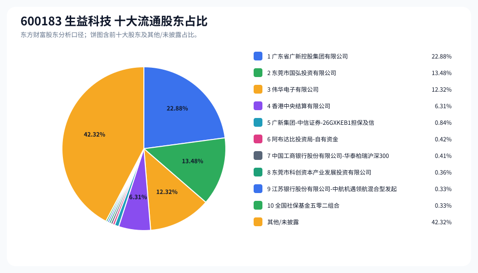
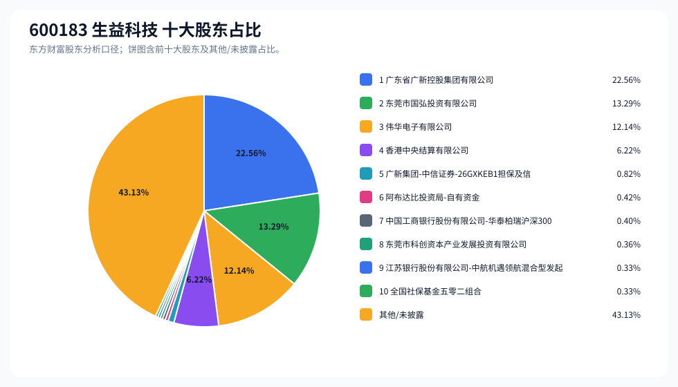
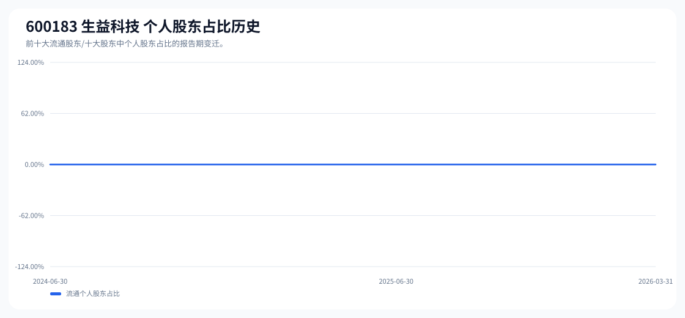

# 600183 生益科技 股东成分报告

- 生成时间：2026-06-07T16:34:50
- 看涨排名：6；综合评分：38.512。
- ETF/指数线索：CSI_A500 / 159352 中证A500ETF。
- 增长/交易机制标签：ETF信号牵引;流通股东集中;机构股东参与。
- 说明：本报告是股东结构研究工件，不构成投资建议。

## 1. 公司交易与 ETF 线索

|项目|数值|
|---|---:|
|行业/地区|元件 / 东莞市|
|最新价|137.36|
|成交额|101.29亿|
|换手率|3.03%|
|5日收益|-1.76%|
|20日收益|69.16%|
|20日成交额放大倍数|1.03|
|主力净流入| ()|

## 2. 股东结构快照

|项目|数值|
|---|---:|
|流通股东报告期|2026-03-31|
|前十大流通股东合计占流通股本|57.68%|
|其中机构类流通股东占比|57.68%|
|其中基金/社保/QFII 类占比|13.81%|
|前十大流通股东占比变化合计|-0.69%|
|第一大流通股东|广东省广新控股集团有限公司 / 其他 / 22.88%|
|十大股东报告期|2026-03-31|
|前十大股东合计占总股本|56.87%|
|其中机构类十大股东占比|56.87%|
|前十大股东占比变化合计|-0.68%|
|第一大股东|广东省广新控股集团有限公司 / 其他 / 22.56%|

## 3. 股东占比饼图

## 4. 历史股东变迁（个人股东重点）

|报告期|口径|前十大占比|个人股东数|个人股东占比|个人股东|机构占比|基金/社保/QFII占比|
|---|---|---:|---:|---:|---|---:|---:|
|2026-03-31|流通股东|57.68%|0|0.00%||57.68%|13.81%|
|2025-12-31|流通股东|58.70%|0|0.00%||58.70%|16.09%|
|2025-09-30|流通股东|58.91%|0|0.00%||58.91%|15.79%|
|2025-06-30|流通股东|61.81%|0|0.00%||61.81%|15.81%|
|2025-03-31|流通股东|62.29%|0|0.00%||62.29%|15.60%|
|2024-12-31|流通股东|66.52%|0|0.00%||66.52%|17.83%|
|2024-09-30|流通股东|63.86%|0|0.00%||63.86%|17.99%|
|2024-06-30|流通股东|62.12%|0|0.00%||62.12%|17.31%|

### 个人股东逐期变化

- 最近报告期内前十大名单未出现个人股东，或个人股东无可计算变化。

## 5. 股东明细

### 十大流通股东

|排名|股东名称|类型|股份类型|持股数|占总股本|占流通股本|占比变化|方向|参考市值|
|---:|---|---|---|---:|---:|---:|---:|---|---:|
|1|广东省广新控股集团有限公司|其他|A股|547979502|22.56%|22.88%|-1.00%|减少|296.84亿|
|2|东莞市国弘投资有限公司|其他|A股|322740539|13.29%|13.48%|0.00%|不变|174.83亿|
|3|伟华电子有限公司|QFII|A股|295010353|12.14%|12.32%|0.00%|不变|159.81亿|
|4|香港中央结算有限公司|其他|A股|151023558|6.22%|6.31%|1.06%|增加|81.81亿|
|5|广新集团-中信证券-26GXKEB1担保及信托财产专户|其他|A股|20000000|0.82%|0.84%||新进|10.83亿|
|6|阿布达比投资局-自有资金|QFII|A股|10081498|0.41%|0.42%||新进|5.46亿|
|7|中国工商银行股份有限公司-华泰柏瑞沪深300交易型开放式指数证券投资基金|基金|A股|9774625|0.40%|0.41%|-0.42%|减少|5.29亿|
|8|东莞市科创资本产业发展投资有限公司|其他|A股|8692132|0.36%|0.36%||新进|4.71亿|
|9|江苏银行股份有限公司-中航机遇领航混合型发起式证券投资基金|基金|A股|8000000|0.33%|0.33%|-0.33%|减少|4.33亿|
|10|全国社保基金五零二组合|社保|A股|7918228|0.33%|0.33%||新进|4.29亿|

### 十大股东

|排名|股东名称|类型|股份类型|持股数|占总股本|占流通股本|占比变化|方向|参考市值|
|---:|---|---|---|---:|---:|---:|---:|---|---:|
|1|广东省广新控股集团有限公司|其他|流通A股|547979502|22.56%||-1.00%|减持|296.84亿|
|2|东莞市国弘投资有限公司|其他|流通A股|322740539|13.29%||0.00%|不变|174.83亿|
|3|伟华电子有限公司|QFII|流通A股|295010353|12.14%||0.00%|不变|159.81亿|
|4|香港中央结算有限公司|其他|流通A股|151023558|6.22%||1.07%|增持|81.81亿|
|5|广新集团-中信证券-26GXKEB1担保及信托财产专户|其他|流通A股|20000000|0.82%|||新进|10.83亿|
|6|阿布达比投资局-自有资金|QFII|流通A股|10081498|0.42%|||新进|5.46亿|
|7|中国工商银行股份有限公司-华泰柏瑞沪深300交易型开放式指数证券投资基金|基金|流通A股|9774625|0.40%||-0.42%|减持|5.29亿|
|8|东莞市科创资本产业发展投资有限公司|其他|流通A股|8692132|0.36%|||新进|4.71亿|
|9|江苏银行股份有限公司-中航机遇领航混合型发起式证券投资基金|基金|流通A股|8000000|0.33%||-0.33%|减持|4.33亿|
|10|全国社保基金五零二组合|社保|流通A股|7918228|0.33%|||新进|4.29亿|

## 6. 解读要点

- 若“成交额放大 + 高换手交易”同时出现，说明上涨背后有真实交易活跃度，但也可能伴随波动放大。
- 前十大流通股东占比越高，筹码越集中；机构/基金占比越高，越需要继续核对定期报告、基金持仓和是否存在被动指数持仓。
- 个人股东历史变迁重点看三类信号：连续增持、新进进入前十大、以及从前十大退出；个人股东占比变化越大，越需要核对公告和实际控制人/高管身份。
- 股东占比变化为增持/减持线索，需结合公告日、股价位置和成交额验证，不应单独作为买卖依据。

## 数据源

- 股东数据：https://datacenter-web.eastmoney.com/api/data/v1/get (RPT_F10_EH_FREEHOLDERS / RPT_DMSK_HOLDERS)
- 行情与 K 线：https://push2.eastmoney.com/api/qt/clist/get / https://push2his.eastmoney.com/api/qt/stock/kline/get
