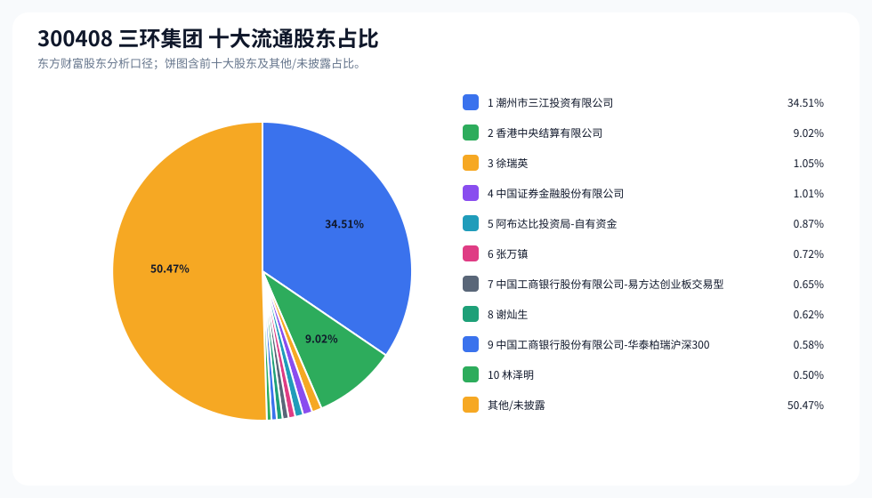
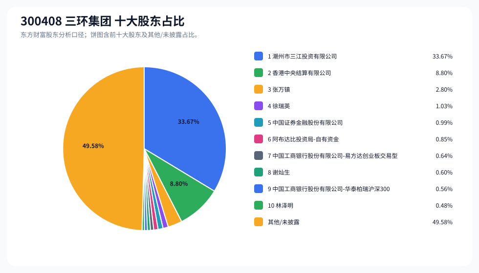
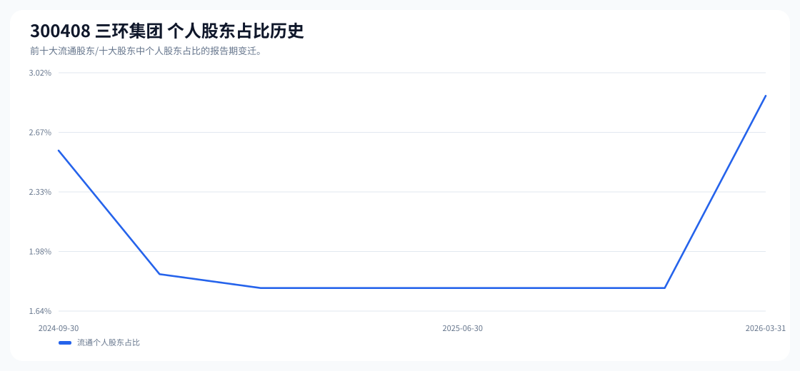

# 300408 三环集团 股东成分报告

- 生成时间：2026-06-07T16:40:07
- 看涨排名：7；综合评分：38.435。
- ETF/指数线索：CSI_A50 / 159601 中证A50ETF华夏。
- 增长/交易机制标签：ETF信号牵引;价格动量;流通股东集中;机构股东参与。
- 说明：本报告是股东结构研究工件，不构成投资建议。

## 1. 公司交易与 ETF 线索

|项目|数值|
|---|---:|
|行业/地区|元件 / 潮州市|
|最新价|134.83|
|成交额|105.79亿|
|换手率|4.18%|
|5日收益|4.70%|
|20日收益|57.05%|
|20日成交额放大倍数|1.49|
|主力净流入| ()|

## 2. 股东结构快照

|项目|数值|
|---|---:|
|流通股东报告期|2026-03-31|
|前十大流通股东合计占流通股本|49.53%|
|其中机构类流通股东占比|46.65%|
|其中基金/社保/QFII 类占比|2.10%|
|前十大流通股东占比变化合计|0.80%|
|第一大流通股东|潮州市三江投资有限公司 / 其他 / 34.51%|
|十大股东报告期|2026-03-31|
|前十大股东合计占总股本|50.42%|
|其中机构类十大股东占比|45.51%|
|前十大股东占比变化合计|0.79%|
|第一大股东|潮州市三江投资有限公司 / 其他 / 33.67%|

## 3. 股东占比饼图

## 4. 历史股东变迁（个人股东重点）

|报告期|口径|前十大占比|个人股东数|个人股东占比|个人股东|机构占比|基金/社保/QFII占比|
|---|---|---:|---:|---:|---|---:|---:|
|2026-03-31|流通股东|49.53%|4|2.88%|徐瑞英、张万镇、谢灿生、林泽明|46.65%|2.10%|
|2025-12-31|流通股东|48.99%|2|1.77%|徐瑞英、张万镇|47.22%|4.73%|
|2025-09-30|流通股东|47.42%|2|1.77%|徐瑞英、张万镇|45.65%|5.36%|
|2025-06-30|流通股东|49.54%|2|1.77%|徐瑞英、张万镇|47.77%|5.26%|
|2025-04-10|流通股东|51.06%|2|1.77%|徐瑞英、张万镇|49.29%|5.60%|
|2025-03-31|流通股东|50.66%|2|1.77%|徐瑞英、张万镇|48.89%|5.14%|
|2024-12-31|流通股东|50.71%|2|1.85%|徐瑞英、郑锐斌|48.86%|5.45%|
|2024-09-30|流通股东|49.92%|3|2.57%|徐瑞英、郑锐斌、张万镇|47.36%|4.85%|

### 个人股东逐期变化

|从|到|口径|个人股东|状态|上一期占比|本期占比|占比变化|上一期排名|本期排名|
|---|---|---|---|---|---:|---:|---:|---:|---:|
|2025-12-31|2026-03-31|流通|谢灿生|新进||0.62%|0.62%||8|
|2025-12-31|2026-03-31|流通|林泽明|新进||0.50%|0.50%||10|
|2025-12-31|2026-03-31|流通|张万镇|不变|0.72%|0.72%|0.00%|9|6|
|2025-12-31|2026-03-31|流通|徐瑞英|不变|1.05%|1.05%|0.00%|6|3|
|2025-09-30|2025-12-31|流通|徐瑞英|增持|1.05%|1.05%|0.00%|6|6|
|2025-09-30|2025-12-31|流通|张万镇|增持|0.72%|0.72%|0.00%|10|9|
|2025-06-30|2025-09-30|流通|张万镇|不变|0.72%|0.72%|0.00%|9|10|
|2025-06-30|2025-09-30|流通|徐瑞英|不变|1.05%|1.05%|0.00%|6|6|
|2025-04-10|2025-06-30|流通|张万镇|不变|0.72%|0.72%|0.00%|10|9|
|2025-04-10|2025-06-30|流通|徐瑞英|不变|1.05%|1.05%|0.00%|6|6|
|2025-03-31|2025-04-10|流通|张万镇|不变|0.72%|0.72%|0.00%|9|10|
|2025-03-31|2025-04-10|流通|徐瑞英|不变|1.05%|1.05%|0.00%|6|6|
|2024-12-31|2025-03-31|流通|郑锐斌|退出|0.80%||-0.80%|8||
|2024-12-31|2025-03-31|流通|张万镇|新进||0.72%|0.72%||9|
|2024-12-31|2025-03-31|流通|徐瑞英|不变|1.05%|1.05%|0.00%|6|6|
|2024-09-30|2024-12-31|流通|张万镇|退出|0.72%||-0.72%|10||
|2024-09-30|2024-12-31|流通|徐瑞英|不变|1.05%|1.05%|0.00%|6|6|
|2024-09-30|2024-12-31|流通|郑锐斌|不变|0.80%|0.80%|0.00%|8|8|

## 5. 股东明细

### 十大流通股东

|排名|股东名称|类型|股份类型|持股数|占总股本|占流通股本|占比变化|方向|参考市值|
|---:|---|---|---|---:|---:|---:|---:|---|---:|
|1|潮州市三江投资有限公司|其他|A股|645357856|33.67%|34.51%|0.00%|不变|341.07亿|
|2|香港中央结算有限公司|其他|A股|168720347|8.80%|9.02%|2.45%|增加|89.17亿|
|3|徐瑞英|个人|A股|19676480|1.03%|1.05%|0.00%|不变|10.40亿|
|4|中国证券金融股份有限公司|国家队|A股|18904423|0.99%|1.01%|-0.45%|减少|9.99亿|
|5|阿布达比投资局-自有资金|QFII|A股|16254141|0.85%|0.87%||新进|8.59亿|
|6|张万镇|个人|A股|13398000|0.70%|0.72%|0.00%|不变|7.08亿|
|7|中国工商银行股份有限公司-易方达创业板交易型开放式指数证券投资基金|基金|A股|12212482|0.64%|0.65%|-0.61%|减少|6.45亿|
|8|谢灿生|个人|A股|11555600|0.60%|0.62%||新进|6.11亿|
|9|中国工商银行股份有限公司-华泰柏瑞沪深300交易型开放式指数证券投资基金|基金|A股|10807218|0.56%|0.58%|-0.59%|减少|5.71亿|
|10|林泽明|个人|A股|9268559|0.48%|0.50%||新进|4.90亿|

### 十大股东

|排名|股东名称|类型|股份类型|持股数|占总股本|占流通股本|占比变化|方向|参考市值|
|---:|---|---|---|---:|---:|---:|---:|---|---:|
|1|潮州市三江投资有限公司|其他|流通A股|645357856|33.67%||0.00%|不变|341.07亿|
|2|香港中央结算有限公司|其他|流通A股|168720347|8.80%||2.45%|增持|89.17亿|
|3|张万镇|个人|流通A股,限售流通A股|53592000|2.80%||0.00%|不变|28.32亿|
|4|徐瑞英|个人|流通A股|19676480|1.03%||0.00%|不变|10.40亿|
|5|中国证券金融股份有限公司|国家队|流通A股|18904423|0.99%||-0.45%|减持|9.99亿|
|6|阿布达比投资局-自有资金|QFII|流通A股|16254141|0.85%|||新进|8.59亿|
|7|中国工商银行股份有限公司-易方达创业板交易型开放式指数证券投资基金|基金|流通A股|12212482|0.64%||-0.61%|减持|6.45亿|
|8|谢灿生|个人|流通A股|11555600|0.60%|||新进|6.11亿|
|9|中国工商银行股份有限公司-华泰柏瑞沪深300交易型开放式指数证券投资基金|基金|流通A股|10807218|0.56%||-0.60%|减持|5.71亿|
|10|林泽明|个人|流通A股|9268559|0.48%|||新进|4.90亿|

## 6. 解读要点

- 若“成交额放大 + 高换手交易”同时出现，说明上涨背后有真实交易活跃度，但也可能伴随波动放大。
- 前十大流通股东占比越高，筹码越集中；机构/基金占比越高，越需要继续核对定期报告、基金持仓和是否存在被动指数持仓。
- 个人股东历史变迁重点看三类信号：连续增持、新进进入前十大、以及从前十大退出；个人股东占比变化越大，越需要核对公告和实际控制人/高管身份。
- 股东占比变化为增持/减持线索，需结合公告日、股价位置和成交额验证，不应单独作为买卖依据。

## 数据源

- 股东数据：https://datacenter-web.eastmoney.com/api/data/v1/get (RPT_F10_EH_FREEHOLDERS / RPT_DMSK_HOLDERS)
- 行情与 K 线：https://push2.eastmoney.com/api/qt/clist/get / https://push2his.eastmoney.com/api/qt/stock/kline/get
