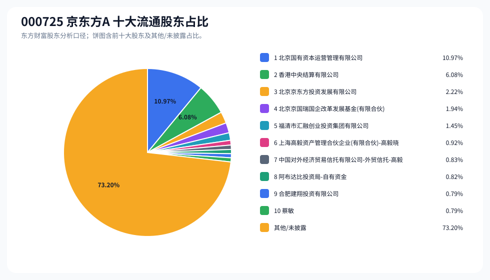
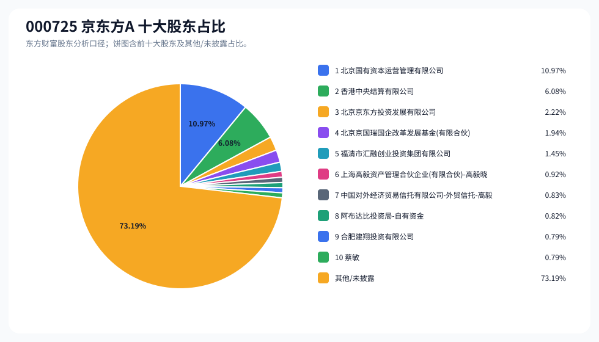
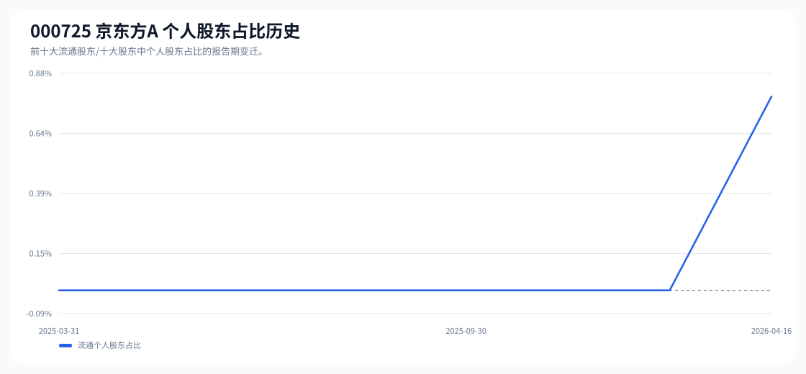

# 000725 京东方A 股东成分报告

- 生成时间：2026-06-07T16:34:50
- 看涨排名：8；综合评分：37.704。
- ETF/指数线索：CSI_A50 / 159601 中证A50ETF华夏。
- 增长/交易机制标签：ETF信号牵引;价格动量;成交额放大;高换手交易;机构股东参与。
- 说明：本报告是股东结构研究工件，不构成投资建议。

## 1. 公司交易与 ETF 线索

|项目|数值|
|---|---:|
|行业/地区|光学光电子 / 北京市|
|最新价|6.43|
|成交额|356.85亿|
|换手率|15.15%|
|5日收益|25.83%|
|20日收益|54.20%|
|20日成交额放大倍数|2.44|
|主力净流入| ()|

## 2. 股东结构快照

|项目|数值|
|---|---:|
|流通股东报告期|2026-04-16|
|前十大流通股东合计占流通股本|26.80%|
|其中机构类流通股东占比|26.02%|
|其中基金/社保/QFII 类占比|3.67%|
|前十大流通股东占比变化合计|0.18%|
|第一大流通股东|北京国有资本运营管理有限公司 / 其他 / 10.97%|
|十大股东报告期|2026-04-16|
|前十大股东合计占总股本|26.81%|
|其中机构类十大股东占比|26.02%|
|前十大股东占比变化合计|0.19%|
|第一大股东|北京国有资本运营管理有限公司 / 其他 / 10.97%|

## 3. 股东占比饼图

## 4. 历史股东变迁（个人股东重点）

|报告期|口径|前十大占比|个人股东数|个人股东占比|个人股东|机构占比|基金/社保/QFII占比|
|---|---|---:|---:|---:|---|---:|---:|
|2026-04-16|流通股东|26.80%|1|0.79%|蔡敏|26.02%|3.67%|
|2026-03-31|流通股东|26.63%|0|0.00%||26.63%|4.46%|
|2025-12-31|流通股东|29.26%|0|0.00%||29.26%|6.52%|
|2025-09-30|流通股东|30.16%|0|0.00%||30.16%|6.65%|
|2025-06-30|流通股东|28.60%|0|0.00%||28.60%|6.84%|
|2025-05-15|流通股东|29.58%|0|0.00%||29.58%|6.85%|
|2025-04-21|流通股东|30.28%|0|0.00%||30.28%|6.97%|
|2025-03-31|流通股东|31.15%|0|0.00%||31.15%|6.59%|

### 个人股东逐期变化

|从|到|口径|个人股东|状态|上一期占比|本期占比|占比变化|上一期排名|本期排名|
|---|---|---|---|---|---:|---:|---:|---:|---:|
|2026-03-31|2026-04-16|流通|蔡敏|新进||0.79%|0.79%||10|

## 5. 股东明细

### 十大流通股东

|排名|股东名称|类型|股份类型|持股数|占总股本|占流通股本|占比变化|方向|参考市值|
|---:|---|---|---|---:|---:|---:|---:|---|---:|
|1|北京国有资本运营管理有限公司|其他|A股|4063333333|10.97%|10.97%|0.00%|不变|163.75亿|
|2|香港中央结算有限公司|其他|A股|2251289443|6.08%|6.08%|0.17%|增加|90.73亿|
|3|北京京东方投资发展有限公司|其他|A股|822092180|2.22%|2.22%|0.00%|不变|33.13亿|
|4|北京京国瑞国企改革发展基金(有限合伙)|其他|A股|718132854|1.94%|1.94%|0.00%|不变|28.94亿|
|5|福清市汇融创业投资集团有限公司|其他|A股|538599640|1.45%|1.45%|0.00%|不变|21.71亿|
|6|上海高毅资产管理合伙企业(有限合伙)-高毅晓峰2号致信基金|其他|A股|339000000|0.92%|0.92%|0.01%|增加|13.66亿|
|7|中国对外经济贸易信托有限公司-外贸信托-高毅晓峰鸿远集合资金信托计划|信托|A股|307988907|0.83%|0.83%|0.00%|增加|12.41亿|
|8|阿布达比投资局-自有资金|QFII|A股|302815309|0.82%|0.82%|-0.00%|减少|12.20亿|
|9|合肥建翔投资有限公司|其他|A股|292056967|0.79%|0.79%|0.00%|不变|11.77亿|
|10|蔡敏|个人|A股|290809076|0.79%|0.79%||新进|11.72亿|

### 十大股东

|排名|股东名称|类型|股份类型|持股数|占总股本|占流通股本|占比变化|方向|参考市值|
|---:|---|---|---|---:|---:|---:|---:|---|---:|
|1|北京国有资本运营管理有限公司|其他|流通A股|4063333333|10.97%||0.00%|不变|163.75亿|
|2|香港中央结算有限公司|其他|流通A股|2251289443|6.08%||0.18%|增持|90.73亿|
|3|北京京东方投资发展有限公司|其他|流通A股|822092180|2.22%||0.00%|不变|33.13亿|
|4|北京京国瑞国企改革发展基金(有限合伙)|其他|流通A股|718132854|1.94%||0.00%|不变|28.94亿|
|5|福清市汇融创业投资集团有限公司|其他|流通A股|538599640|1.45%||0.00%|不变|21.71亿|
|6|上海高毅资产管理合伙企业(有限合伙)-高毅晓峰2号致信基金|其他|流通A股|339000000|0.92%||0.01%|增持|13.66亿|
|7|中国对外经济贸易信托有限公司-外贸信托-高毅晓峰鸿远集合资金信托计划|信托|流通A股|307988907|0.83%||0.00%|增持|12.41亿|
|8|阿布达比投资局-自有资金|QFII|流通A股|302815309|0.82%||0.00%|减持|12.20亿|
|9|合肥建翔投资有限公司|其他|流通A股|292056967|0.79%||0.00%|不变|11.77亿|
|10|蔡敏|个人|流通A股|290809076|0.79%|||新进|11.72亿|

## 6. 解读要点

- 若“成交额放大 + 高换手交易”同时出现，说明上涨背后有真实交易活跃度，但也可能伴随波动放大。
- 前十大流通股东占比越高，筹码越集中；机构/基金占比越高，越需要继续核对定期报告、基金持仓和是否存在被动指数持仓。
- 个人股东历史变迁重点看三类信号：连续增持、新进进入前十大、以及从前十大退出；个人股东占比变化越大，越需要核对公告和实际控制人/高管身份。
- 股东占比变化为增持/减持线索，需结合公告日、股价位置和成交额验证，不应单独作为买卖依据。

## 数据源

- 股东数据：https://datacenter-web.eastmoney.com/api/data/v1/get (RPT_F10_EH_FREEHOLDERS / RPT_DMSK_HOLDERS)
- 行情与 K 线：https://push2.eastmoney.com/api/qt/clist/get / https://push2his.eastmoney.com/api/qt/stock/kline/get
