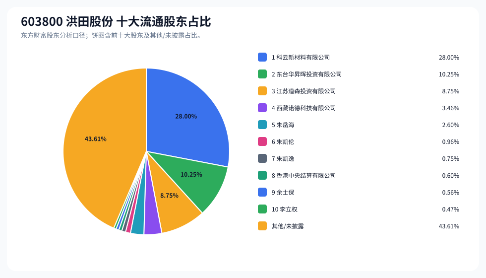
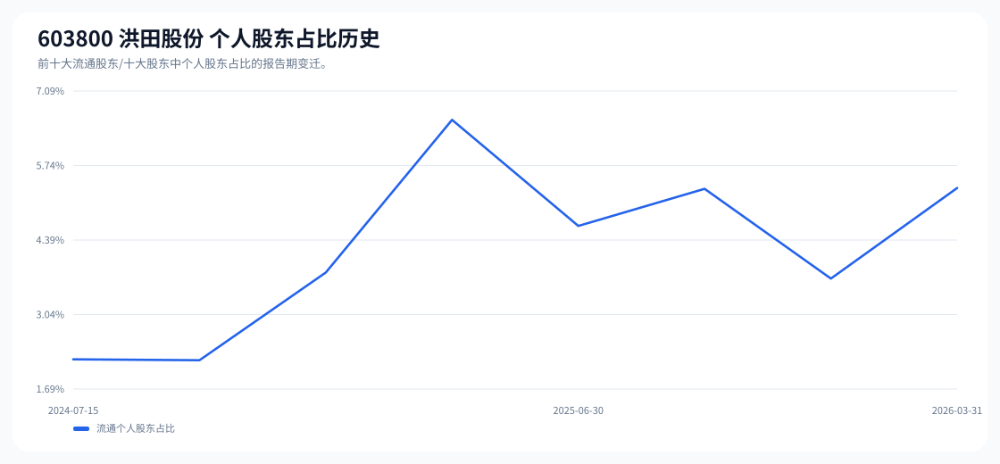

# 603800 洪田股份 股东成分报告

- 生成时间：2026-06-07T16:32:43
- 看涨排名：9；综合评分：36.373。
- ETF/指数线索：CSI_2000 / 159531 中证2000ETF南方。
- 增长/交易机制标签：ETF信号牵引;价格动量;高换手交易;流通股东集中;机构股东参与。
- 说明：本报告是股东结构研究工件，不构成投资建议。

## 1. 公司交易与 ETF 线索

|项目|数值|
|---|---:|
|行业/地区|专用设备 / 苏州市|
|最新价|76.55|
|成交额|10.95亿|
|换手率|6.78%|
|5日收益|23.95%|
|20日收益|38.88%|
|20日成交额放大倍数|1.39|
|主力净流入| ()|

## 2. 股东结构快照

|项目|数值|
|---|---:|
|流通股东报告期|2026-03-31|
|前十大流通股东合计占流通股本|56.39%|
|其中机构类流通股东占比|51.06%|
|其中基金/社保/QFII 类占比|0.00%|
|前十大流通股东占比变化合计|0.67%|
|第一大流通股东|科云新材料有限公司 / 其他 / 28.00%|
|十大股东报告期|2026-03-31|
|前十大股东合计占总股本|56.41%|
|其中机构类十大股东占比|51.07%|
|前十大股东占比变化合计|0.67%|
|第一大股东|科云新材料有限公司 / 其他 / 28.00%|

## 3. 股东占比饼图

## 4. 历史股东变迁（个人股东重点）

|报告期|口径|前十大占比|个人股东数|个人股东占比|个人股东|机构占比|基金/社保/QFII占比|
|---|---|---:|---:|---:|---|---:|---:|
|2026-03-31|流通股东|56.39%|5|5.33%|朱岳海、朱凯伦、朱凯逸、余士保、李立权|51.06%|0.00%|
|2025-12-31|流通股东|58.30%|3|3.69%|朱岳海、朱凯伦、秦希峰|54.61%|4.15%|
|2025-09-30|流通股东|60.13%|3|5.32%|毛金明、秦希峰、余士保|54.81%|4.35%|
|2025-06-30|流通股东|57.57%|3|4.65%|秦希峰、安文娟、张炎明|52.92%|1.48%|
|2025-03-31|流通股东|58.50%|4|6.57%|秦希峰、项光隆、安文娟、陈路|51.93%|1.47%|
|2024-12-31|流通股东|58.58%|3|3.80%|项光隆、安文娟、范江海|54.78%|2.78%|
|2024-09-30|流通股东|61.38%|1|2.21%|项光隆|59.17%|2.84%|
|2024-07-15|流通股东|64.05%|1|2.23%|项光隆|61.82%|2.17%|

### 个人股东逐期变化

|从|到|口径|个人股东|状态|上一期占比|本期占比|占比变化|上一期排名|本期排名|
|---|---|---|---|---|---:|---:|---:|---:|---:|
|2025-12-31|2026-03-31|流通|秦希峰|退出|0.81%||-0.81%|9||
|2025-12-31|2026-03-31|流通|朱凯逸|新进||0.75%|0.75%||7|
|2025-12-31|2026-03-31|流通|朱岳海|增持|2.02%|2.60%|0.58%|6|5|
|2025-12-31|2026-03-31|流通|余士保|新进||0.56%|0.56%||9|
|2025-12-31|2026-03-31|流通|李立权|新进||0.47%|0.47%||10|
|2025-12-31|2026-03-31|流通|朱凯伦|增持|0.87%|0.96%|0.10%|8|6|
|2025-09-30|2025-12-31|流通|毛金明|退出|2.36%||-2.36%|6||
|2025-09-30|2025-12-31|流通|朱岳海|新进||2.02%|2.02%||6|
|2025-09-30|2025-12-31|流通|秦希峰|减持|2.19%|0.81%|-1.38%|7|9|
|2025-09-30|2025-12-31|流通|朱凯伦|新进||0.87%|0.87%||8|
|2025-09-30|2025-12-31|流通|余士保|退出|0.77%||-0.77%|9||
|2025-06-30|2025-09-30|流通|毛金明|新进||2.36%|2.36%||6|
|2025-06-30|2025-09-30|流通|安文娟|退出|1.26%||-1.26%|6||
|2025-06-30|2025-09-30|流通|余士保|新进||0.77%|0.77%||9|
|2025-06-30|2025-09-30|流通|张炎明|退出|0.69%||-0.69%|9||
|2025-06-30|2025-09-30|流通|秦希峰|减持|2.69%|2.19%|-0.50%|5|7|
|2025-03-31|2025-06-30|流通|项光隆|退出|2.08%||-2.08%|6||
|2025-03-31|2025-06-30|流通|张炎明|新进||0.69%|0.69%||9|
|2025-03-31|2025-06-30|流通|陈路|退出|0.60%||-0.60%|9||
|2025-03-31|2025-06-30|流通|安文娟|增持|1.20%|1.26%|0.07%|7|6|
|2025-03-31|2025-06-30|流通|秦希峰|减持|2.69%|2.69%|-0.00%|5|5|
|2024-12-31|2025-03-31|流通|秦希峰|新进||2.69%|2.69%||5|
|2024-12-31|2025-03-31|流通|范江海|退出|0.66%||-0.66%|9||
|2024-12-31|2025-03-31|流通|陈路|新进||0.60%|0.60%||9|

## 5. 股东明细

### 十大流通股东

|排名|股东名称|类型|股份类型|持股数|占总股本|占流通股本|占比变化|方向|参考市值|
|---:|---|---|---|---:|---:|---:|---:|---|---:|
|1|科云新材料有限公司|其他|A股|58240000|28.00%|28.00%|0.00%|不变|22.20亿|
|2|东台华昇晖投资有限公司|其他|A股|21320000|10.25%|10.25%|0.00%|不变|8.13亿|
|3|江苏道森投资有限公司|其他|A股|18190000|8.75%|8.75%|0.00%|不变|6.93亿|
|4|西藏诺德科技有限公司|其他|A股|7207200|3.46%|3.46%|0.00%|不变|2.75亿|
|5|朱岳海|个人|A股|5401322|2.60%|2.60%|0.58%|增加|2.06亿|
|6|朱凯伦|个人|A股|1999300|0.96%|0.96%|0.10%|增加|7621.33万|
|7|朱凯逸|个人|A股|1558100|0.75%|0.75%||新进|5939.48万|
|8|香港中央结算有限公司|其他|A股|1241230|0.60%|0.60%||新进|4731.57万|
|9|余士保|个人|A股|1157900|0.56%|0.56%||新进|4413.91万|
|10|李立权|个人|A股|980000|0.47%|0.47%||新进|3735.76万|

### 十大股东

|排名|股东名称|类型|股份类型|持股数|占总股本|占流通股本|占比变化|方向|参考市值|
|---:|---|---|---|---:|---:|---:|---:|---|---:|
|1|科云新材料有限公司|其他|流通A股|58240000|28.00%||0.00%|不变|22.20亿|
|2|东台华昇晖投资有限公司|其他|流通A股|21320000|10.25%||0.00%|不变|8.13亿|
|3|江苏道森投资有限公司|其他|流通A股|18190000|8.75%||0.00%|不变|6.93亿|
|4|西藏诺德科技有限公司|其他|流通A股|7207200|3.47%||0.00%|不变|2.75亿|
|5|朱岳海|个人|流通A股|5401322|2.60%||0.58%|增持|2.06亿|
|6|朱凯伦|个人|流通A股|1999300|0.96%||0.09%|增持|7621.33万|
|7|朱凯逸|个人|流通A股|1558100|0.75%|||新进|5939.48万|
|8|香港中央结算有限公司|其他|流通A股|1241230|0.60%|||新进|4731.57万|
|9|余士保|个人|流通A股|1157900|0.56%|||新进|4413.91万|
|10|李立权|个人|流通A股|980000|0.47%|||新进|3735.76万|

## 6. 解读要点

- 若“成交额放大 + 高换手交易”同时出现，说明上涨背后有真实交易活跃度，但也可能伴随波动放大。
- 前十大流通股东占比越高，筹码越集中；机构/基金占比越高，越需要继续核对定期报告、基金持仓和是否存在被动指数持仓。
- 个人股东历史变迁重点看三类信号：连续增持、新进进入前十大、以及从前十大退出；个人股东占比变化越大，越需要核对公告和实际控制人/高管身份。
- 股东占比变化为增持/减持线索，需结合公告日、股价位置和成交额验证，不应单独作为买卖依据。

## 数据源

- 股东数据：https://datacenter-web.eastmoney.com/api/data/v1/get (RPT_F10_EH_FREEHOLDERS / RPT_DMSK_HOLDERS)
- 行情与 K 线：https://push2.eastmoney.com/api/qt/clist/get / https://push2his.eastmoney.com/api/qt/stock/kline/get
