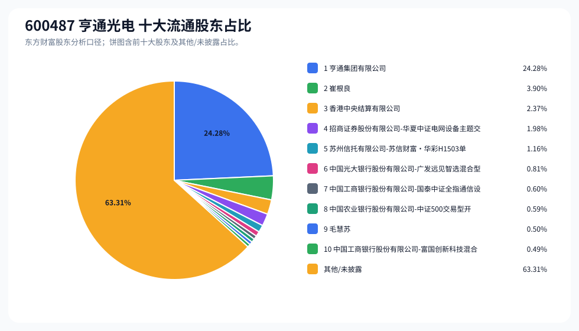
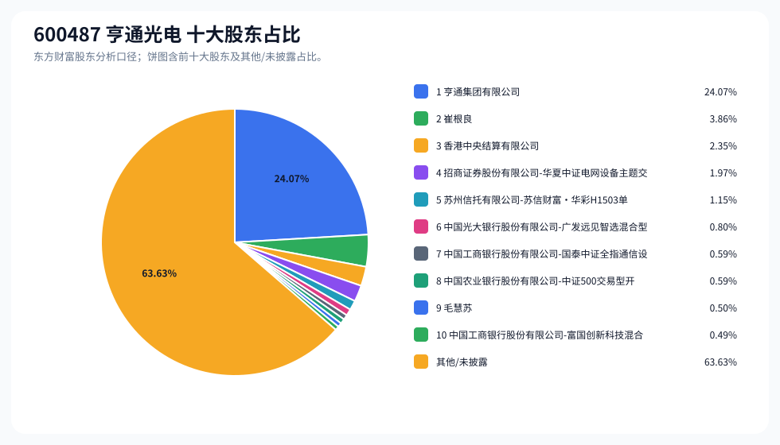
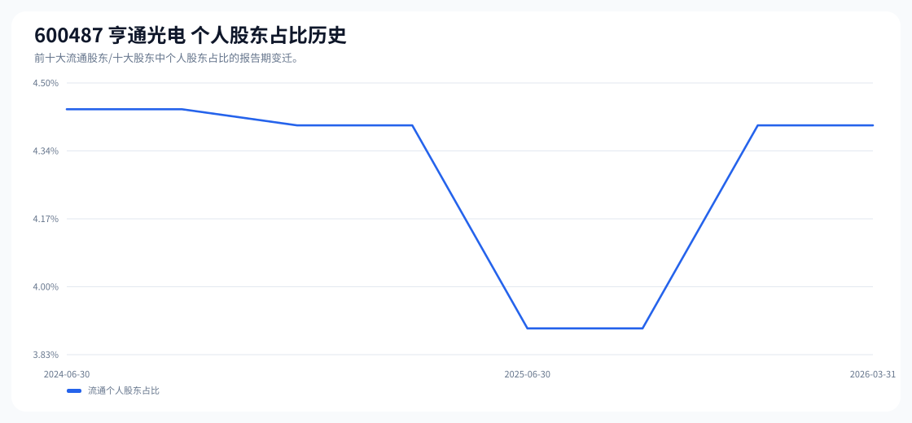

# 600487 亨通光电 股东成分报告

- 生成时间：2026-06-07T16:40:07
- 看涨排名：10；综合评分：33.661。
- ETF/指数线索：CSI_500;CSI_800 / 510500;159800 中证 500ETF 南方;中证 800ETF 鹏华。
- 增长/交易机制标签：ETF 信号牵引;价格动量;成交额放大;高换手交易;流通股东集中;机构股东参与。
- 说明：本报告是股东结构研究工件，不构成投资建议。

## 1. 公司交易与 ETF 线索

|项目 | 数值|
|---|---:|
|行业/地区 | 通信设备 / 苏州市|
|最新价|96.12|
|成交额|247.42 亿|
|换手率|10.26%|
|5 日收益|24.64%|
|20 日收益|24.39%|
|20 日成交额放大倍数|1.72|
|主力净流入 | ()|

## 2. 股东结构快照

|项目 | 数值|
|---|---:|
|流通股东报告期|2026-03-31|
|前十大流通股东合计占流通股本|36.69%|
|其中机构类流通股东占比|32.29%|
|其中基金/社保/QFII 类占比|4.47%|
|前十大流通股东占比变化合计|-1.63%|
|第一大流通股东 | 亨通集团有限公司 / 其他 / 24.28%|
|十大股东报告期|2026-03-31|
|前十大股东合计占总股本|36.37%|
|其中机构类十大股东占比|32.01%|
|前十大股东占比变化合计|-1.64%|
|第一大股东 | 亨通集团有限公司 / 其他 / 24.07%|

## 3. 股东占比饼图

## 4. 历史股东变迁（个人股东重点）

|报告期 | 口径 | 前十大占比 | 个人股东数 | 个人股东占比 | 个人股东 | 机构占比 | 基金/社保/QFII 占比|
|---|---|---:|---:|---:|---|---:|---:|
|2026-03-31|流通股东|36.69%|2|4.40%|崔根良、毛慧苏|32.29%|4.47%|
|2025-12-31|流通股东|36.83%|2|4.40%|崔根良、毛慧苏|32.43%|2.89%|
|2025-09-30|流通股东|36.74%|1|3.90%|崔根良|32.84%|3.07%|
|2025-06-30|流通股东|35.91%|1|3.90%|崔根良|32.01%|2.43%|
|2025-03-31|流通股东|35.26%|2|4.40%|崔根良、毛慧苏|30.86%|2.74%|
|2024-12-31|流通股东|35.90%|2|4.40%|崔根良、毛慧苏|31.50%|2.44%|
|2024-09-30|流通股东|35.30%|2|4.44%|崔根良、蒋海东|30.86%|2.06%|
|2024-06-30|流通股东|35.18%|2|4.44%|崔根良、蒋海东|30.74%|2.01%|

### 个人股东逐期变化

|从 | 到|口径 | 个人股东 | 状态 | 上一期占比 | 本期占比 | 占比变化 | 上一期排名 | 本期排名|
|---|---|---|---|---|---:|---:|---:|---:|---:|
|2025-12-31|2026-03-31|流通 | 崔根良 | 不变|3.90%|3.90%|0.00%|2|2|
|2025-12-31|2026-03-31|流通 | 毛慧苏 | 不变|0.50%|0.50%|0.00%|10|9|
|2025-09-30|2025-12-31|流通 | 毛慧苏 | 新进||0.50%|0.50%||10|
|2025-09-30|2025-12-31|流通 | 崔根良 | 不变|3.90%|3.90%|0.00%|2|2|
|2025-06-30|2025-09-30|流通 | 崔根良 | 不变|3.90%|3.90%|0.00%|2|2|
|2025-03-31|2025-06-30|流通 | 毛慧苏 | 退出|0.50%||-0.50%|10||
|2025-03-31|2025-06-30|流通 | 崔根良 | 不变|3.90%|3.90%|0.00%|2|2|
|2024-12-31|2025-03-31|流通 | 崔根良 | 不变|3.90%|3.90%|0.00%|2|2|
|2024-12-31|2025-03-31|流通 | 毛慧苏 | 不变|0.50%|0.50%|0.00%|10|10|
|2024-09-30|2024-12-31|流通 | 蒋海东 | 退出|0.58%||-0.58%|8||
|2024-09-30|2024-12-31|流通 | 毛慧苏 | 新进||0.50%|0.50%||10|
|2024-09-30|2024-12-31|流通 | 崔根良 | 增持|3.86%|3.90%|0.03%|2|2|
|2024-06-30|2024-09-30|流通 | 崔根良 | 不变|3.86%|3.86%|0.00%|2|2|
|2024-06-30|2024-09-30|流通 | 蒋海东 | 不变|0.58%|0.58%|0.00%|9|8|

## 5. 股东明细

### 十大流通股东

|排名 | 股东名称 | 类型 | 股份类型 | 持股数 | 占总股本 | 占流通股本 | 占比变化 | 方向 | 参考市值|
|---:|---|---|---|---:|---:|---:|---:|---|---:|
|1|亨通集团有限公司 | 其他|A 股|593765498|24.07%|24.28%|0.00%|不变|312.68 亿|
|2|崔根良 | 个人|A 股|95294433|3.86%|3.90%|0.00%|不变|50.18 亿|
|3|香港中央结算有限公司 | 其他|A 股|58019321|2.35%|2.37%|-1.05%|减少|30.55 亿|
|4|招商证券股份有限公司 - 华夏中证电网设备主题交易型开放式指数证券投资基金 | 基金|A 股|48514182|1.97%|1.98%||新进|25.55 亿|
|5|苏州信托有限公司 - 苏信财富·华彩 H1503 单一资金信托 | 信托|A 股|28460928|1.15%|1.16%|-0.01%|减少|14.99 亿|
|6|中国光大银行股份有限公司 - 广发远见智选混合型证券投资基金 | 基金|A 股|19754920|0.80%|0.81%||新进|10.40 亿|
|7|中国工商银行股份有限公司 - 国泰中证全指通信设备交易型开放式指数证券投资基金 | 基金|A 股|14562760|0.59%|0.60%|0.01%|增加|7.67 亿|
|8|中国农业银行股份有限公司 - 中证 500 交易型开放式指数证券投资基金 | 基金|A 股|14474964|0.59%|0.59%|-0.59%|减少|7.62 亿|
|9|毛慧苏 | 个人|A 股|12256692|0.50%|0.50%|0.00%|不变|6.45 亿|
|10|中国工商银行股份有限公司 - 富国创新科技混合型证券投资基金 | 基金|A 股|12000100|0.49%|0.49%||新进|6.32 亿|

### 十大股东

|排名 | 股东名称 | 类型 | 股份类型 | 持股数 | 占总股本 | 占流通股本 | 占比变化 | 方向 | 参考市值|
|---:|---|---|---|---:|---:|---:|---:|---|---:|
|1|亨通集团有限公司 | 其他 | 流通 A 股|593765498|24.07%||0.00%|不变|312.68 亿|
|2|崔根良 | 个人 | 流通 A 股|95294433|3.86%||0.00%|不变|50.18 亿|
|3|香港中央结算有限公司 | 其他 | 流通 A 股|58019321|2.35%||-1.05%|减持|30.55 亿|
|4|招商证券股份有限公司 - 华夏中证电网设备主题交易型开放式指数证券投资基金 | 基金 | 流通 A 股|48514182|1.97%|||新进|25.55 亿|
|5|苏州信托有限公司 - 苏信财富·华彩 H1503 单一资金信托 | 信托 | 流通 A 股|28460928|1.15%||-0.01%|减持|14.99 亿|
|6|中国光大银行股份有限公司 - 广发远见智选混合型证券投资基金 | 基金 | 流通 A 股|19754920|0.80%|||新进|10.40 亿|
|7|中国工商银行股份有限公司 - 国泰中证全指通信设备交易型开放式指数证券投资基金 | 基金 | 流通 A 股|14562760|0.59%||0.01%|增持|7.67 亿|
|8|中国农业银行股份有限公司 - 中证 500 交易型开放式指数证券投资基金 | 基金 | 流通 A 股|14474964|0.59%||-0.59%|减持|7.62 亿|
|9|毛慧苏 | 个人 | 流通 A 股|12256692|0.50%||0.00%|不变|6.45 亿|
|10|中国工商银行股份有限公司 - 富国创新科技混合型证券投资基金 | 基金 | 流通 A 股|12000100|0.49%|||新进|6.32 亿|

## 6. 解读要点

- 若“成交额放大 + 高换手交易”同时出现，说明上涨背后有真实交易活跃度，但也可能伴随波动放大。
- 前十大流通股东占比越高，筹码越集中；机构/基金占比越高，越需要继续核对定期报告、基金持仓和是否存在被动指数持仓。
- 个人股东历史变迁重点看三类信号：连续增持、新进进入前十大、以及从前十大退出；个人股东占比变化越大，越需要核对公告和实际控制人/高管身份。
- 股东占比变化为增持/减持线索，需结合公告日、股价位置和成交额验证，不应单独作为买卖依据。

## 数据源

- 股东数据：https://datacenter-web.eastmoney.com/api/data/v1/get (RPT_F10_EH_FREEHOLDERS / RPT_DMSK_HOLDERS)
- 行情与 K 线：https://push2.eastmoney.com/api/qt/clist/get / https://push2his.eastmoney.com/api/qt/stock/kline/get
