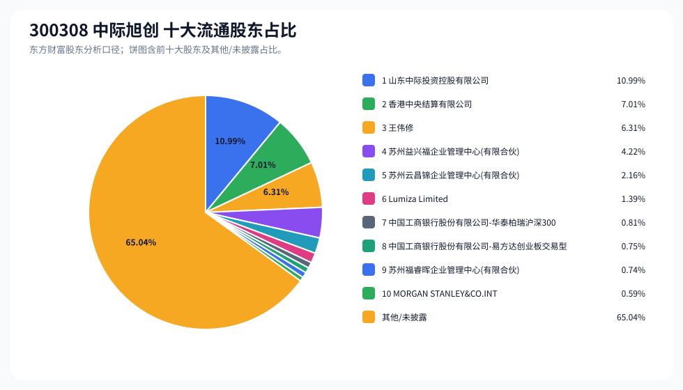
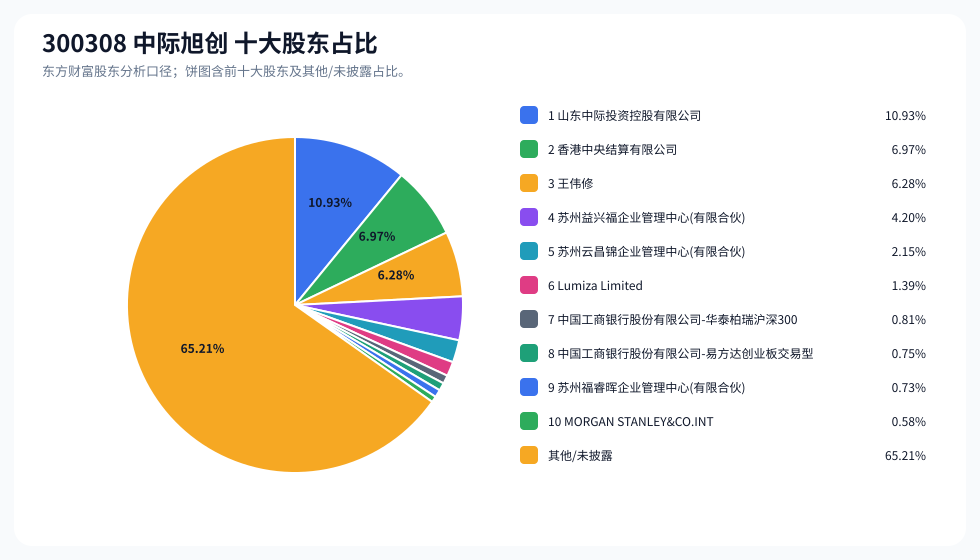
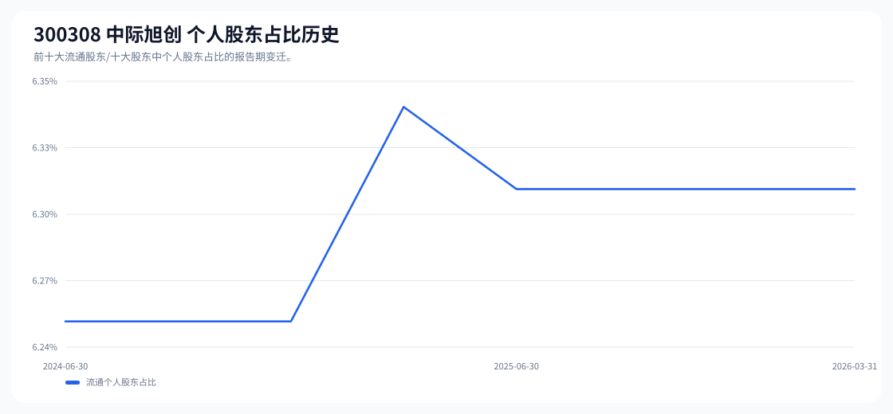

# 300308 中际旭创 股东成分报告

- 生成时间：2026-06-07T16:34:50
- 看涨排名：11；综合评分：31.908。
- ETF/指数线索：CSI_300;CSI_800;CSI_A100;CSI_A50;CSI_A500 / 510310;159800;159627;159601;159352 沪深300ETF易方达;中证800ETF鹏华;中证A100ETF华夏;中证A50ETF华夏;中证A500ETF。
- 增长/交易机制标签：ETF信号牵引;价格动量;成交额放大;流通股东集中;机构股东参与;ROE支撑。
- 说明：本报告是股东结构研究工件，不构成投资建议。

## 1. 公司交易与 ETF 线索

|项目|数值|
|---|---:|
|行业/地区|通信设备 / 烟台市|
|最新价|1179.99|
|成交额|583.25亿|
|换手率|4.28%|
|5日收益|1.62%|
|20日收益|33.18%|
|20日成交额放大倍数|1.81|
|主力净流入| ()|

## 2. 股东结构快照

|项目|数值|
|---|---:|
|流通股东报告期|2026-03-31|
|前十大流通股东合计占流通股本|34.96%|
|其中机构类流通股东占比|28.65%|
|其中基金/社保/QFII 类占比|2.15%|
|前十大流通股东占比变化合计|-0.19%|
|第一大流通股东|山东中际投资控股有限公司 / 其他 / 10.99%|
|十大股东报告期|2026-03-31|
|前十大股东合计占总股本|34.79%|
|其中机构类十大股东占比|28.51%|
|前十大股东占比变化合计|-0.20%|
|第一大股东|山东中际投资控股有限公司 / 其他 / 10.93%|

## 3. 股东占比饼图

## 4. 历史股东变迁（个人股东重点）

|报告期|口径|前十大占比|个人股东数|个人股东占比|个人股东|机构占比|基金/社保/QFII占比|
|---|---|---:|---:|---:|---|---:|---:|
|2026-03-31|流通股东|34.96%|1|6.31%|王伟修|28.65%|2.15%|
|2025-12-31|流通股东|35.92%|1|6.31%|王伟修|29.61%|5.20%|
|2025-09-30|流通股东|35.97%|1|6.31%|王伟修|29.66%|4.02%|
|2025-06-30|流通股东|35.05%|1|6.31%|王伟修|28.74%|4.39%|
|2025-03-31|流通股东|36.00%|1|6.34%|王伟修|29.66%|4.26%|
|2024-12-31|流通股东|37.42%|1|6.25%|王伟修|31.17%|4.50%|
|2024-09-30|流通股东|39.57%|1|6.25%|王伟修|33.32%|4.76%|
|2024-06-30|流通股东|40.36%|1|6.25%|王伟修|34.11%|2.55%|

### 个人股东逐期变化

|从|到|口径|个人股东|状态|上一期占比|本期占比|占比变化|上一期排名|本期排名|
|---|---|---|---|---|---:|---:|---:|---:|---:|
|2025-12-31|2026-03-31|流通|王伟修|不变|6.31%|6.31%|0.00%|2|3|
|2025-09-30|2025-12-31|流通|王伟修|增持|6.31%|6.31%|0.00%|2|2|
|2025-06-30|2025-09-30|流通|王伟修|不变|6.31%|6.31%|0.00%|2|2|
|2025-03-31|2025-06-30|流通|王伟修|减持|6.34%|6.31%|-0.04%|2|2|
|2024-12-31|2025-03-31|流通|王伟修|增持|6.25%|6.34%|0.09%|2|2|
|2024-09-30|2024-12-31|流通|王伟修|不变|6.25%|6.25%|0.00%|3|2|
|2024-06-30|2024-09-30|流通|王伟修|不变|6.25%|6.25%|0.00%|3|3|

## 5. 股东明细

### 十大流通股东

|排名|股东名称|类型|股份类型|持股数|占总股本|占流通股本|占比变化|方向|参考市值|
|---:|---|---|---|---:|---:|---:|---:|---|---:|
|1|山东中际投资控股有限公司|其他|A股|121440135|10.93%|10.99%|-0.06%|减少|691.49亿|
|2|香港中央结算有限公司|其他|A股|77476190|6.97%|7.01%|1.41%|增加|441.16亿|
|3|王伟修|个人|A股|69731451|6.28%|6.31%|0.00%|不变|397.06亿|
|4|苏州益兴福企业管理中心(有限合伙)|其他|A股|46627154|4.20%|4.22%|0.00%|不变|265.50亿|
|5|苏州云昌锦企业管理中心(有限合伙)|其他|A股|23858278|2.15%|2.16%|0.00%|不变|135.85亿|
|6|Lumiza Limited|其他|A股|15415548|1.39%|1.39%|0.00%|不变|87.78亿|
|7|中国工商银行股份有限公司-华泰柏瑞沪深300交易型开放式指数证券投资基金|基金|A股|8948747|0.81%|0.81%|-0.82%|减少|50.96亿|
|8|中国工商银行股份有限公司-易方达创业板交易型开放式指数证券投资基金|基金|A股|8333796|0.75%|0.75%|-0.72%|减少|47.45亿|
|9|苏州福睿晖企业管理中心(有限合伙)|其他|A股|8156444|0.73%|0.74%||新进|46.44亿|
|10|MORGAN STANLEY&CO.INTERNATIONAL PLC.|QFII|A股|6494895|0.58%|0.59%||新进|36.98亿|

### 十大股东

|排名|股东名称|类型|股份类型|持股数|占总股本|占流通股本|占比变化|方向|参考市值|
|---:|---|---|---|---:|---:|---:|---:|---|---:|
|1|山东中际投资控股有限公司|其他|流通A股|121440135|10.93%||-0.06%|减持|691.49亿|
|2|香港中央结算有限公司|其他|流通A股|77476190|6.97%||1.40%|增持|441.16亿|
|3|王伟修|个人|流通A股|69731451|6.28%||0.00%|不变|397.06亿|
|4|苏州益兴福企业管理中心(有限合伙)|其他|流通A股|46627154|4.20%||0.00%|不变|265.50亿|
|5|苏州云昌锦企业管理中心(有限合伙)|其他|流通A股|23858278|2.15%||0.00%|不变|135.85亿|
|6|Lumiza Limited|其他|流通A股|15415548|1.39%||0.00%|不变|87.78亿|
|7|中国工商银行股份有限公司-华泰柏瑞沪深300交易型开放式指数证券投资基金|基金|流通A股|8948747|0.81%||-0.82%|减持|50.96亿|
|8|中国工商银行股份有限公司-易方达创业板交易型开放式指数证券投资基金|基金|流通A股|8333796|0.75%||-0.72%|减持|47.45亿|
|9|苏州福睿晖企业管理中心(有限合伙)|其他|流通A股|8156444|0.73%|||新进|46.44亿|
|10|MORGAN STANLEY&CO.INTERNAT IONAL PLC.|QFII|流通A股|6494895|0.58%|||新进|36.98亿|

## 6. 解读要点

- 若“成交额放大 + 高换手交易”同时出现，说明上涨背后有真实交易活跃度，但也可能伴随波动放大。
- 前十大流通股东占比越高，筹码越集中；机构/基金占比越高，越需要继续核对定期报告、基金持仓和是否存在被动指数持仓。
- 个人股东历史变迁重点看三类信号：连续增持、新进进入前十大、以及从前十大退出；个人股东占比变化越大，越需要核对公告和实际控制人/高管身份。
- 股东占比变化为增持/减持线索，需结合公告日、股价位置和成交额验证，不应单独作为买卖依据。

## 数据源

- 股东数据：https://datacenter-web.eastmoney.com/api/data/v1/get (RPT_F10_EH_FREEHOLDERS / RPT_DMSK_HOLDERS)
- 行情与 K 线：https://push2.eastmoney.com/api/qt/clist/get / https://push2his.eastmoney.com/api/qt/stock/kline/get
