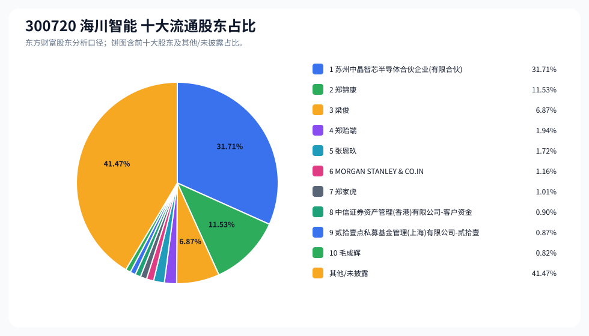
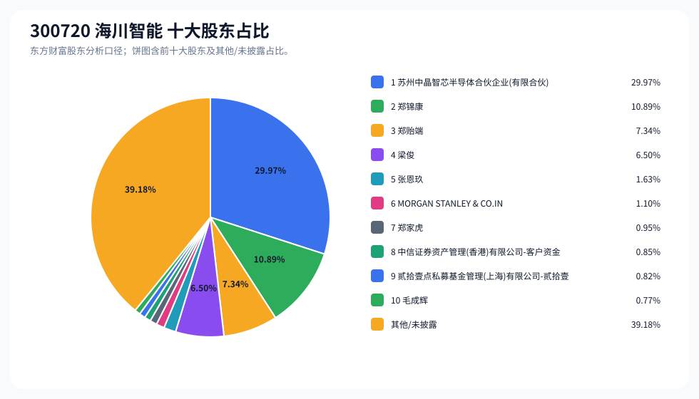
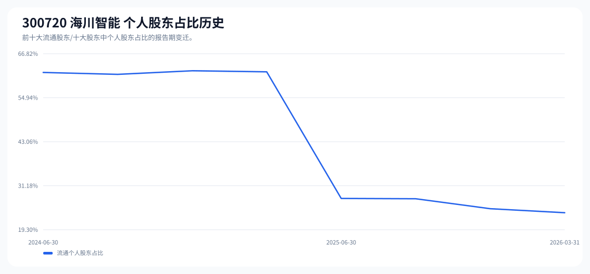

# 300720 海川智能 股东成分报告

- 生成时间：2026-06-07T16:34:50
- 看涨排名：12；综合评分：29.898。
- ETF/指数线索：CSI_2000 / 159531 中证2000ETF南方。
- 增长/交易机制标签：ETF信号牵引;价格动量;高换手交易;流通股东集中;机构股东参与。
- 说明：本报告是股东结构研究工件，不构成投资建议。

## 1. 公司交易与 ETF 线索

|项目|数值|
|---|---:|
|行业/地区|通用设备 / 佛山市|
|最新价|78.53|
|成交额|9.53亿|
|换手率|6.70%|
|5日收益|24.76%|
|20日收益|16.35%|
|20日成交额放大倍数|1.09|
|主力净流入| ()|

## 2. 股东结构快照

|项目|数值|
|---|---:|
|流通股东报告期|2026-03-31|
|前十大流通股东合计占流通股本|58.53%|
|其中机构类流通股东占比|34.64%|
|其中基金/社保/QFII 类占比|2.92%|
|前十大流通股东占比变化合计|0.00%|
|第一大流通股东|苏州中晶智芯半导体合伙企业(有限合伙) / 其他 / 31.71%|
|十大股东报告期|2026-03-31|
|前十大股东合计占总股本|60.82%|
|其中机构类十大股东占比|32.74%|
|前十大股东占比变化合计|0.00%|
|第一大股东|苏州中晶智芯半导体合伙企业(有限合伙) / 其他 / 29.97%|

## 3. 股东占比饼图

## 4. 历史股东变迁（个人股东重点）

|报告期|口径|前十大占比|个人股东数|个人股东占比|个人股东|机构占比|基金/社保/QFII占比|
|---|---|---:|---:|---:|---|---:|---:|
|2026-03-31|流通股东|58.53%|6|23.90%|郑锦康、梁俊、郑贻端、张恩玖、郑家虎、毛成辉|34.64%|2.92%|
|2025-12-31|流通股东|59.51%|8|24.97%|郑锦康、吴桂芳、郑雪芬、郑贻端、邓海权、尹婉霞、黄显安、邓泽宇|34.54%|0.48%|
|2025-09-30|流通股东|61.10%|9|27.66%|郑锦康、吴桂芳、郑雪芬、郑贻端、邓海权、邓泽宇、黄显安、高仁俊、吴秀增|33.44%|0.00%|
|2025-06-30|流通股东|61.19%|9|27.76%|郑锦康、吴桂芳、郑雪芬、郑贻端、梁俊、吴秀增、黄显安、何永波、何文钜|33.44%|0.00%|
|2025-03-31|流通股东|62.40%|9|61.93%|郑锦康、吴桂芳、郑雪芬、郑贻端、梁俊、高仁俊、吴燕山、吴作佳、何永波|0.47%|0.00%|
|2024-12-31|流通股东|62.75%|9|62.22%|郑锦康、吴桂芳、郑雪芬、梁俊、郑贻端、许鸿峰、刘萍、何文钜、高仁俊|0.53%|0.00%|
|2024-09-30|流通股东|62.29%|8|61.26%|郑锦康、吴桂芳、郑雪芬、梁俊、郑贻端、何文钜、汪本强、劳杰超|1.03%|0.00%|
|2024-06-30|流通股东|63.77%|7|61.76%|郑锦康、吴桂芳、郑雪芬、郑贻端、梁俊、何文钜、汪本强|2.00%|1.42%|

### 个人股东逐期变化

|从|到|口径|个人股东|状态|上一期占比|本期占比|占比变化|上一期排名|本期排名|
|---|---|---|---|---|---:|---:|---:|---:|---:|
|2025-12-31|2026-03-31|流通|梁俊|新进||6.87%|6.87%||3|
|2025-12-31|2026-03-31|流通|吴桂芳|退出|3.55%||-3.55%|3||
|2025-12-31|2026-03-31|流通|郑雪芬|退出|3.39%||-3.39%|4||
|2025-12-31|2026-03-31|流通|张恩玖|新进||1.72%|1.72%||5|
|2025-12-31|2026-03-31|流通|邓海权|退出|1.37%||-1.37%|6||
|2025-12-31|2026-03-31|流通|尹婉霞|退出|1.18%||-1.18%|7||
|2025-12-31|2026-03-31|流通|郑家虎|新进||1.01%|1.01%||7|
|2025-12-31|2026-03-31|流通|郑锦康|减持|12.38%|11.53%|-0.85%|2|2|
|2025-12-31|2026-03-31|流通|毛成辉|新进||0.82%|0.82%||10|
|2025-12-31|2026-03-31|流通|黄显安|退出|0.52%||-0.52%|8||
|2025-12-31|2026-03-31|流通|邓泽宇|退出|0.49%||-0.49%|9||
|2025-12-31|2026-03-31|流通|郑贻端|减持|2.09%|1.94%|-0.14%|5|4|
|2025-09-30|2025-12-31|流通|郑雪芬|减持|4.85%|3.39%|-1.46%|4|4|
|2025-09-30|2025-12-31|流通|吴桂芳|减持|4.97%|3.55%|-1.41%|3|3|
|2025-09-30|2025-12-31|流通|尹婉霞|新进||1.18%|1.18%||7|
|2025-09-30|2025-12-31|流通|高仁俊|退出|0.46%||-0.46%|9||
|2025-09-30|2025-12-31|流通|吴秀增|退出|0.44%||-0.44%|10||
|2025-09-30|2025-12-31|流通|郑锦康|增持|12.16%|12.38%|0.22%|2|2|
|2025-09-30|2025-12-31|流通|邓泽宇|减持|0.70%|0.49%|-0.21%|7|9|
|2025-09-30|2025-12-31|流通|邓海权|减持|1.53%|1.37%|-0.16%|6|6|
|2025-09-30|2025-12-31|流通|郑贻端|增持|2.05%|2.09%|0.04%|5|5|
|2025-09-30|2025-12-31|流通|黄显安|增持|0.51%|0.52%|0.01%|8|8|
|2025-06-30|2025-09-30|流通|梁俊|退出|1.81%||-1.81%|6||
|2025-06-30|2025-09-30|流通|邓海权|新进||1.53%|1.53%||6|

## 5. 股东明细

### 十大流通股东

|排名|股东名称|类型|股份类型|持股数|占总股本|占流通股本|占比变化|方向|参考市值|
|---:|---|---|---|---:|---:|---:|---:|---|---:|
|1|苏州中晶智芯半导体合伙企业(有限合伙)|其他|A股|58399999|29.97%|31.71%|0.00%|不变|36.18亿|
|2|郑锦康|个人|A股|21231341|10.89%|11.53%|0.00%|不变|13.15亿|
|3|梁俊|个人|A股|12657640|6.50%|6.87%||新进|7.84亿|
|4|郑贻端|个人|A股|3577345|1.84%|1.94%|0.00%|不变|2.22亿|
|5|张恩玖|个人|A股|3172500|1.63%|1.72%||新进|1.97亿|
|6|MORGAN STANLEY & CO.INTERNATIONAL PLC.|QFII|A股|2134115|1.10%|1.16%||新进|1.32亿|
|7|郑家虎|个人|A股|1859940|0.95%|1.01%||新进|1.15亿|
|8|中信证券资产管理(香港)有限公司-客户资金|QFII|A股|1648796|0.85%|0.90%||新进|1.02亿|
|9|贰拾壹点私募基金管理(上海)有限公司-贰拾壹点龙腾一号私募证券投资基金|其他|A股|1598150|0.82%|0.87%||新进|9900.54万|
|10|毛成辉|个人|A股|1506000|0.77%|0.82%||新进|9329.67万|

### 十大股东

|排名|股东名称|类型|股份类型|持股数|占总股本|占流通股本|占比变化|方向|参考市值|
|---:|---|---|---|---:|---:|---:|---:|---|---:|
|1|苏州中晶智芯半导体合伙企业(有限合伙)|其他|流通A股|58399999|29.97%||0.00%|不变|36.18亿|
|2|郑锦康|个人|流通A股|21231341|10.89%||0.00%|不变|13.15亿|
|3|郑贻端|个人|流通A股,限售流通A股|14309380|7.34%||0.00%|不变|8.86亿|
|4|梁俊|个人|流通A股|12657640|6.50%||0.00%|不变|7.84亿|
|5|张恩玖|个人|流通A股|3172500|1.63%|||新进|1.97亿|
|6|MORGAN STANLEY & CO.INTERNATIONAL PLC.|QFII|流通A股|2134115|1.10%|||新进|1.32亿|
|7|郑家虎|个人|流通A股|1859940|0.95%|||新进|1.15亿|
|8|中信证券资产管理(香港)有限公司-客户资金|QFII|流通A股|1648796|0.85%|||新进|1.02亿|
|9|贰拾壹点私募基金管理(上海)有限公司-贰拾壹点龙腾一号私募证券投资基金|其他|流通A股|1598150|0.82%|||新进|9900.54万|
|10|毛成辉|个人|流通A股|1506000|0.77%|||新进|9329.67万|

## 6. 解读要点

- 若“成交额放大 + 高换手交易”同时出现，说明上涨背后有真实交易活跃度，但也可能伴随波动放大。
- 前十大流通股东占比越高，筹码越集中；机构/基金占比越高，越需要继续核对定期报告、基金持仓和是否存在被动指数持仓。
- 个人股东历史变迁重点看三类信号：连续增持、新进进入前十大、以及从前十大退出；个人股东占比变化越大，越需要核对公告和实际控制人/高管身份。
- 股东占比变化为增持/减持线索，需结合公告日、股价位置和成交额验证，不应单独作为买卖依据。

## 数据源

- 股东数据：https://datacenter-web.eastmoney.com/api/data/v1/get (RPT_F10_EH_FREEHOLDERS / RPT_DMSK_HOLDERS)
- 行情与 K 线：https://push2.eastmoney.com/api/qt/clist/get / https://push2his.eastmoney.com/api/qt/stock/kline/get
