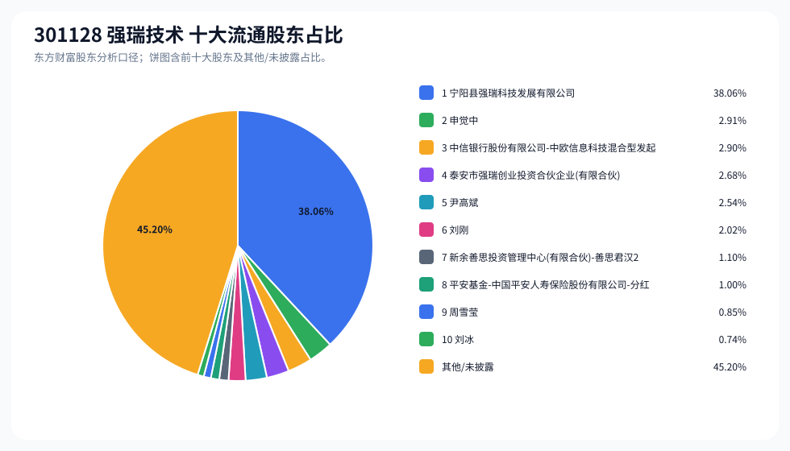
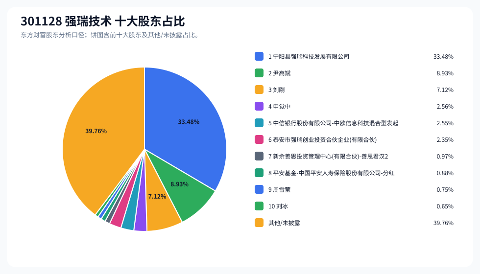
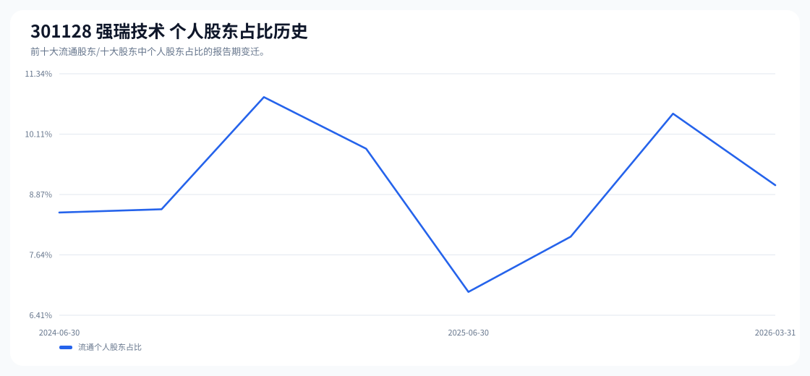

# 301128 强瑞技术 股东成分报告

- 生成时间：2026-06-07T16:34:50
- 看涨排名：13；综合评分：29.250。
- ETF/指数线索：CSI_2000 / 159531 中证2000ETF南方。
- 增长/交易机制标签：ETF信号牵引;价格动量;成交额放大;高换手交易;流通股东集中;机构股东参与。
- 说明：本报告是股东结构研究工件，不构成投资建议。

## 1. 公司交易与 ETF 线索

|项目|数值|
|---|---:|
|行业/地区|专用设备 / 深圳市|
|最新价|145.98|
|成交额|20.51亿|
|换手率|9.57%|
|5日收益|17.94%|
|20日收益|7.03%|
|20日成交额放大倍数|1.91|
|主力净流入| ()|

## 2. 股东结构快照

|项目|数值|
|---|---:|
|流通股东报告期|2026-03-31|
|前十大流通股东合计占流通股本|54.80%|
|其中机构类流通股东占比|45.74%|
|其中基金/社保/QFII 类占比|5.00%|
|前十大流通股东占比变化合计|-1.45%|
|第一大流通股东|宁阳县强瑞科技发展有限公司 / 其他 / 38.06%|
|十大股东报告期|2026-03-31|
|前十大股东合计占总股本|60.24%|
|其中机构类十大股东占比|40.23%|
|前十大股东占比变化合计|-1.45%|
|第一大股东|宁阳县强瑞科技发展有限公司 / 其他 / 33.48%|

## 3. 股东占比饼图

## 4. 历史股东变迁（个人股东重点）

|报告期|口径|前十大占比|个人股东数|个人股东占比|个人股东|机构占比|基金/社保/QFII占比|
|---|---|---:|---:|---:|---|---:|---:|
|2026-03-31|流通股东|54.80%|5|9.07%|申觉中、尹高斌、刘刚、周雪莹、刘冰|45.74%|5.00%|
|2025-12-31|流通股东|54.43%|5|10.52%|申觉中、尹高斌、刘刚、柳正丽、刘冰|43.90%|2.27%|
|2025-09-30|流通股东|54.95%|6|8.01%|尹高斌、刘刚、柳正丽、申觉中、刘冰、庄清进|46.94%|1.53%|
|2025-06-30|流通股东|57.75%|5|6.89%|尹高斌、刘刚、申觉中、肖辉、邱晓颖|50.87%|1.49%|
|2025-03-31|流通股东|13.68%|6|9.81%|伍伯宏、肖辉、吴元棋、项光隆、刘冰、庄清进|3.87%|3.87%|
|2024-12-31|流通股东|13.85%|7|10.86%|肖辉、王逸、刘冰、李光绪、李伯驹、高迎春、陈庆东|2.99%|2.99%|
|2024-09-30|流通股东|12.86%|4|8.57%|王逸、刘冰、劳杰超、李钫|4.29%|3.59%|
|2024-06-30|流通股东|16.28%|4|8.51%|王逸、刘冰、劳杰超、刘星言|7.78%|6.79%|

### 个人股东逐期变化

|从|到|口径|个人股东|状态|上一期占比|本期占比|占比变化|上一期排名|本期排名|
|---|---|---|---|---|---:|---:|---:|---:|---:|
|2025-12-31|2026-03-31|流通|申觉中|减持|4.13%|2.91%|-1.22%|2|2|
|2025-12-31|2026-03-31|流通|柳正丽|退出|1.10%||-1.10%|7||
|2025-12-31|2026-03-31|流通|周雪莹|新进||0.85%|0.85%||9|
|2025-12-31|2026-03-31|流通|刘冰|增持|0.74%|0.74%|0.00%|9|10|
|2025-12-31|2026-03-31|流通|尹高斌|减持|2.54%|2.54%|-0.00%|4|5|
|2025-12-31|2026-03-31|流通|刘刚|不变|2.02%|2.02%|0.00%|5|6|
|2025-09-30|2025-12-31|流通|申觉中|增持|1.04%|4.13%|3.08%|7|2|
|2025-09-30|2025-12-31|流通|庄清进|退出|0.40%||-0.40%|9||
|2025-09-30|2025-12-31|流通|尹高斌|减持|2.62%|2.54%|-0.08%|3|4|
|2025-09-30|2025-12-31|流通|刘刚|减持|2.09%|2.02%|-0.06%|4|5|
|2025-09-30|2025-12-31|流通|柳正丽|减持|1.13%|1.10%|-0.03%|5|7|
|2025-09-30|2025-12-31|流通|刘冰|增持|0.73%|0.74%|0.01%|8|9|
|2025-06-30|2025-09-30|流通|柳正丽|新进||1.13%|1.13%||5|
|2025-06-30|2025-09-30|流通|刘冰|新进||0.73%|0.73%||8|
|2025-06-30|2025-09-30|流通|肖辉|退出|0.69%||-0.69%|7||
|2025-06-30|2025-09-30|流通|邱晓颖|退出|0.45%||-0.45%|10||
|2025-06-30|2025-09-30|流通|庄清进|新进||0.40%|0.40%||9|
|2025-06-30|2025-09-30|流通|刘刚|不变|2.09%|2.09%|0.00%|4|4|
|2025-06-30|2025-09-30|流通|尹高斌|不变|2.62%|2.62%|0.00%|3|3|
|2025-06-30|2025-09-30|流通|申觉中|不变|1.04%|1.04%|0.00%|5|7|
|2025-03-31|2025-06-30|流通|伍伯宏|退出|2.65%||-2.65%|1||
|2025-03-31|2025-06-30|流通|尹高斌|新进||2.62%|2.62%||3|
|2025-03-31|2025-06-30|流通|刘刚|新进||2.09%|2.09%||4|
|2025-03-31|2025-06-30|流通|吴元棋|退出|1.61%||-1.61%|3||

## 5. 股东明细

### 十大流通股东

|排名|股东名称|类型|股份类型|持股数|占总股本|占流通股本|占比变化|方向|参考市值|
|---:|---|---|---|---:|---:|---:|---:|---|---:|
|1|宁阳县强瑞科技发展有限公司|其他|A股|34633497|33.48%|38.06%|0.00%|不变|51.27亿|
|2|申觉中|个人|A股|2646995|2.56%|2.91%|-1.07%|减少|3.92亿|
|3|中信银行股份有限公司-中欧信息科技混合型发起式证券投资基金|基金|A股|2635405|2.55%|2.90%||新进|3.90亿|
|4|泰安市强瑞创业投资合伙企业(有限合伙)|其他|A股|2435476|2.35%|2.68%|0.00%|不变|3.61亿|
|5|尹高斌|个人|A股|2308906|2.23%|2.54%|0.00%|减少|3.42亿|
|6|刘刚|个人|A股|1840712|1.78%|2.02%|0.00%|不变|2.72亿|
|7|新余善思投资管理中心(有限合伙)-善思君汉2号私募证券投资基金|其他|A股|1000000|0.97%|1.10%|-0.39%|减少|1.48亿|
|8|平安基金-中国平安人寿保险股份有限公司-分红-个险分红-平安人寿-平安基金权益委托投资2号单一资产管理计划|基金|A股|911700|0.88%|1.00%||新进|1.35亿|
|9|周雪莹|个人|A股|777302|0.75%|0.85%||新进|1.15亿|
|10|刘冰|个人|A股|674807|0.65%|0.74%|0.00%|增加|9989.17万|

### 十大股东

|排名|股东名称|类型|股份类型|持股数|占总股本|占流通股本|占比变化|方向|参考市值|
|---:|---|---|---|---:|---:|---:|---:|---|---:|
|1|宁阳县强瑞科技发展有限公司|其他|流通A股|34633497|33.48%||0.00%|不变|51.27亿|
|2|尹高斌|个人|流通A股,限售流通A股|9235624|8.93%||0.00%|不变|13.67亿|
|3|刘刚|个人|流通A股,限售流通A股|7362848|7.12%||0.00%|不变|10.90亿|
|4|申觉中|个人|流通A股|2646995|2.56%||-1.07%|减持|3.92亿|
|5|中信银行股份有限公司-中欧信息科技混合型发起式证券投资基金|基金|流通A股|2635405|2.55%|||新进|3.90亿|
|6|泰安市强瑞创业投资合伙企业(有限合伙)|其他|流通A股|2435476|2.35%||0.00%|不变|3.61亿|
|7|新余善思投资管理中心(有限合伙)-善思君汉2号私募证券投资基金|其他|流通A股|1000000|0.97%||-0.38%|减持|1.48亿|
|8|平安基金-中国平安人寿保险股份有限公司-分红-个险分红-平安人寿-平安基金权益委托投资2号单一资产管理计划|基金|流通A股|911700|0.88%|||新进|1.35亿|
|9|周雪莹|个人|流通A股|777302|0.75%|||新进|1.15亿|
|10|刘冰|个人|流通A股|674807|0.65%||0.00%|增持|9989.17万|

## 6. 解读要点

- 若“成交额放大 + 高换手交易”同时出现，说明上涨背后有真实交易活跃度，但也可能伴随波动放大。
- 前十大流通股东占比越高，筹码越集中；机构/基金占比越高，越需要继续核对定期报告、基金持仓和是否存在被动指数持仓。
- 个人股东历史变迁重点看三类信号：连续增持、新进进入前十大、以及从前十大退出；个人股东占比变化越大，越需要核对公告和实际控制人/高管身份。
- 股东占比变化为增持/减持线索，需结合公告日、股价位置和成交额验证，不应单独作为买卖依据。

## 数据源

- 股东数据：https://datacenter-web.eastmoney.com/api/data/v1/get (RPT_F10_EH_FREEHOLDERS / RPT_DMSK_HOLDERS)
- 行情与 K 线：https://push2.eastmoney.com/api/qt/clist/get / https://push2his.eastmoney.com/api/qt/stock/kline/get
