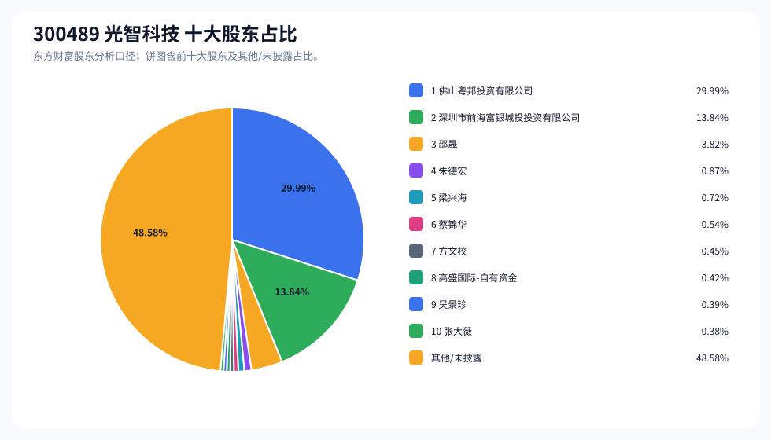
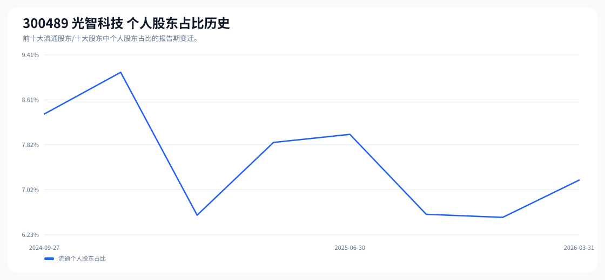

# 300489 光智科技 股东成分报告

- 生成时间：2026-06-07T16:32:44
- 看涨排名：14；综合评分：28.834。
- ETF/指数线索：CSI_2000 / 159531 中证2000ETF南方。
- 增长/交易机制标签：ETF信号牵引;高换手交易;流通股东集中;机构股东参与。
- 说明：本报告是股东结构研究工件，不构成投资建议。

## 1. 公司交易与 ETF 线索

|项目|数值|
|---|---:|
|行业/地区|光学光电子 / 衢州市|
|最新价|125.35|
|成交额|10.79亿|
|换手率|6.15%|
|5日收益|-15.44%|
|20日收益|8.81%|
|20日成交额放大倍数|0.65|
|主力净流入| ()|

## 2. 股东结构快照

|项目|数值|
|---|---:|
|流通股东报告期|2026-03-31|
|前十大流通股东合计占流通股本|51.61%|
|其中机构类流通股东占比|44.42%|
|其中基金/社保/QFII 类占比|0.42%|
|前十大流通股东占比变化合计|-0.11%|
|第一大流通股东|佛山粤邦投资有限公司 / 其他 / 30.10%|
|十大股东报告期|2026-03-31|
|前十大股东合计占总股本|51.42%|
|其中机构类十大股东占比|44.25%|
|前十大股东占比变化合计|-0.11%|
|第一大股东|佛山粤邦投资有限公司 / 其他 / 29.99%|

## 3. 股东占比饼图

## 4. 历史股东变迁（个人股东重点）

|报告期|口径|前十大占比|个人股东数|个人股东占比|个人股东|机构占比|基金/社保/QFII占比|
|---|---|---:|---:|---:|---|---:|---:|
|2026-03-31|流通股东|51.61%|7|7.19%|邵晟、朱德宏、梁兴海、蔡锦华、方文校、吴景珍、张大薇|44.42%|0.42%|
|2025-12-31|流通股东|52.81%|5|6.54%|邵晟、朱德宏、梁兴海、方文校、蔡锦华|46.28%|0.00%|
|2025-09-30|流通股东|52.57%|5|6.59%|邵晟、朱德宏、梁兴海、方文校、蔡锦华|45.97%|0.00%|
|2025-06-30|流通股东|52.00%|8|8.00%|邵晟、朱德宏、梁兴海、邵巧霞、方文校、徐春珍、张大薇、方勇|44.00%|0.00%|
|2025-03-31|流通股东|51.88%|8|7.86%|邵晟、朱德宏、邵巧霞、方文校、梁兴海、林子晖、徐春珍、王丹|44.02%|0.00%|
|2024-12-31|流通股东|53.04%|5|6.58%|邵晟、朱德宏、邵巧霞、方文校、梁兴海|46.46%|2.44%|
|2024-09-30|流通股东|53.86%|7|9.10%|邵晟、邵巧霞、王学平、廖鲁斌、王蕾、黄奇俊、张建龙|44.76%|0.00%|
|2024-09-27|流通股东|53.77%|6|8.36%|邵晟、邵巧霞、王学平、廖鲁斌、王蕾、张建龙|45.41%|0.00%|

### 个人股东逐期变化

|从|到|口径|个人股东|状态|上一期占比|本期占比|占比变化|上一期排名|本期排名|
|---|---|---|---|---|---:|---:|---:|---:|---:|
|2025-12-31|2026-03-31|流通|吴景珍|新进||0.39%|0.39%||9|
|2025-12-31|2026-03-31|流通|张大薇|新进||0.39%|0.39%||10|
|2025-12-31|2026-03-31|流通|方文校|减持|0.59%|0.45%|-0.14%|8|7|
|2025-12-31|2026-03-31|流通|朱德宏|增持|0.83%|0.87%|0.05%|5|4|
|2025-12-31|2026-03-31|流通|梁兴海|减持|0.74%|0.72%|-0.02%|6|5|
|2025-12-31|2026-03-31|流通|蔡锦华|减持|0.54%|0.54%|-0.00%|10|6|
|2025-12-31|2026-03-31|流通|邵晟|减持|3.83%|3.83%|-0.00%|3|3|
|2025-09-30|2025-12-31|流通|朱德宏|减持|0.87%|0.83%|-0.05%|4|5|
|2025-09-30|2025-12-31|流通|梁兴海|减持|0.76%|0.74%|-0.02%|5|6|
|2025-09-30|2025-12-31|流通|蔡锦华|增持|0.53%|0.54%|0.01%|10|10|
|2025-09-30|2025-12-31|流通|邵晟|增持|3.83%|3.83%|0.00%|3|3|
|2025-09-30|2025-12-31|流通|方文校|增持|0.59%|0.59%|0.00%|9|8|
|2025-06-30|2025-09-30|流通|邵巧霞|退出|0.73%||-0.73%|6||
|2025-06-30|2025-09-30|流通|蔡锦华|新进||0.53%|0.53%||10|
|2025-06-30|2025-09-30|流通|徐春珍|退出|0.42%||-0.42%|8||
|2025-06-30|2025-09-30|流通|张大薇|退出|0.39%||-0.39%|9||
|2025-06-30|2025-09-30|流通|方勇|退出|0.37%||-0.37%|10||
|2025-06-30|2025-09-30|流通|梁兴海|减持|0.80%|0.76%|-0.04%|5|5|
|2025-06-30|2025-09-30|流通|方文校|不变|0.59%|0.59%|0.00%|7|9|
|2025-06-30|2025-09-30|流通|朱德宏|不变|0.87%|0.87%|0.00%|4|4|
|2025-06-30|2025-09-30|流通|邵晟|不变|3.83%|3.83%|0.00%|3|3|
|2025-03-31|2025-06-30|流通|林子晖|退出|0.43%||-0.43%|8||
|2025-03-31|2025-06-30|流通|王丹|退出|0.40%||-0.40%|10||
|2025-03-31|2025-06-30|流通|张大薇|新进||0.39%|0.39%||9|

## 5. 股东明细

### 十大流通股东

|排名|股东名称|类型|股份类型|持股数|占总股本|占流通股本|占比变化|方向|参考市值|
|---:|---|---|---|---:|---:|---:|---:|---|---:|
|1|佛山粤邦投资有限公司|其他|A股|41288000|29.99%|30.10%|0.00%|不变|19.79亿|
|2|深圳市前海富银城投投资有限公司|其他|A股|19057500|13.84%|13.89%|0.00%|不变|9.14亿|
|3|邵晟|个人|A股|5258796|3.82%|3.83%|0.00%|不变|2.52亿|
|4|朱德宏|个人|A股|1199100|0.87%|0.87%|0.05%|增加|5748.49万|
|5|梁兴海|个人|A股|987900|0.72%|0.72%|-0.02%|减少|4735.99万|
|6|蔡锦华|个人|A股|740700|0.54%|0.54%|-0.00%|减少|3550.92万|
|7|方文校|个人|A股|621500|0.45%|0.45%|-0.14%|减少|2979.47万|
|8|高盛国际-自有资金|QFII|A股|580417|0.42%|0.42%||新进|2782.52万|
|9|吴景珍|个人|A股|530500|0.39%|0.39%||新进|2543.22万|
|10|张大薇|个人|A股|530000|0.39%|0.39%||新进|2540.82万|

### 十大股东

|排名|股东名称|类型|股份类型|持股数|占总股本|占流通股本|占比变化|方向|参考市值|
|---:|---|---|---|---:|---:|---:|---:|---|---:|
|1|佛山粤邦投资有限公司|其他|流通A股|41288000|29.99%||0.00%|不变|19.79亿|
|2|深圳市前海富银城投投资有限公司|其他|流通A股|19057500|13.84%||0.00%|不变|9.14亿|
|3|邵晟|个人|流通A股|5258796|3.82%||0.00%|不变|2.52亿|
|4|朱德宏|个人|流通A股|1199100|0.87%||0.05%|增持|5748.49万|
|5|梁兴海|个人|流通A股|987900|0.72%||-0.02%|减持|4735.99万|
|6|蔡锦华|个人|流通A股|740700|0.54%||0.00%|减持|3550.92万|
|7|方文校|个人|流通A股|621500|0.45%||-0.14%|减持|2979.47万|
|8|高盛国际-自有资金|QFII|流通A股|580417|0.42%|||新进|2782.52万|
|9|吴景珍|个人|流通A股|530500|0.39%|||新进|2543.22万|
|10|张大薇|个人|流通A股|530000|0.38%|||新进|2540.82万|

## 6. 解读要点

- 若“成交额放大 + 高换手交易”同时出现，说明上涨背后有真实交易活跃度，但也可能伴随波动放大。
- 前十大流通股东占比越高，筹码越集中；机构/基金占比越高，越需要继续核对定期报告、基金持仓和是否存在被动指数持仓。
- 个人股东历史变迁重点看三类信号：连续增持、新进进入前十大、以及从前十大退出；个人股东占比变化越大，越需要核对公告和实际控制人/高管身份。
- 股东占比变化为增持/减持线索，需结合公告日、股价位置和成交额验证，不应单独作为买卖依据。

## 数据源

- 股东数据：https://datacenter-web.eastmoney.com/api/data/v1/get (RPT_F10_EH_FREEHOLDERS / RPT_DMSK_HOLDERS)
- 行情与 K 线：https://push2.eastmoney.com/api/qt/clist/get / https://push2his.eastmoney.com/api/qt/stock/kline/get
