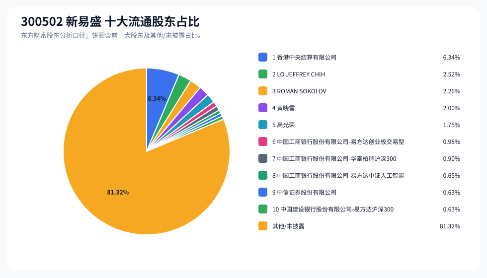
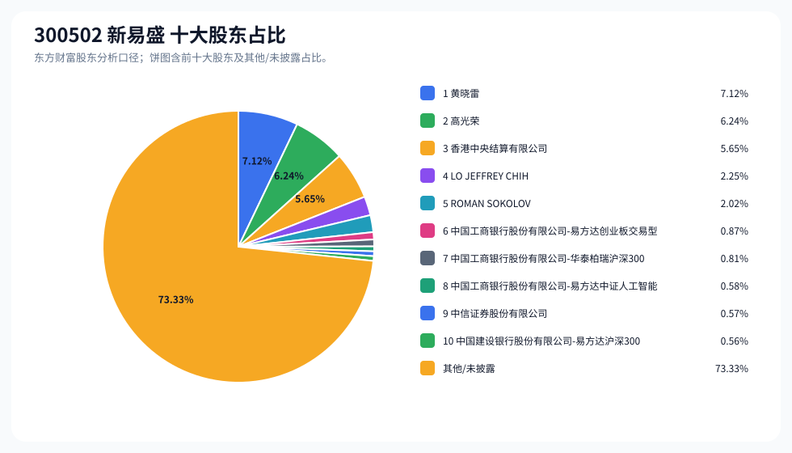
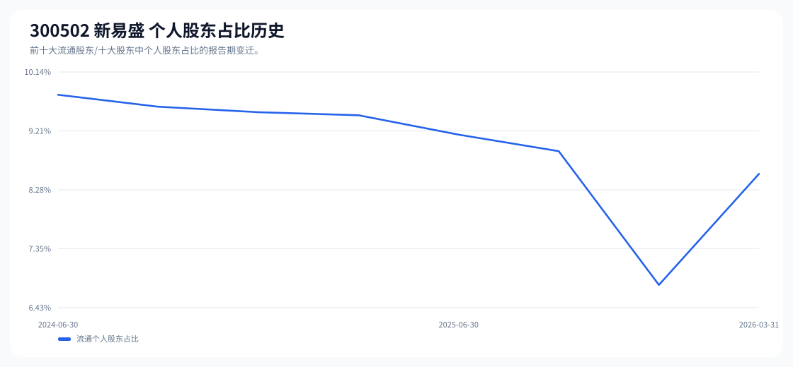

# 300502 新易盛 股东成分报告

- 生成时间：2026-06-07T16:32:44
- 看涨排名：15；综合评分：28.645。
- ETF/指数线索：CSI_300;CSI_800;CSI_A50;CSI_A500 / 510310;159800;159601;159352 沪深300ETF易方达;中证800ETF鹏华;中证A50ETF华夏;中证A500ETF。
- 增长/交易机制标签：ETF信号牵引;价格动量;成交额放大;机构股东参与;ROE支撑。
- 说明：本报告是股东结构研究工件，不构成投资建议。

## 1. 公司交易与 ETF 线索

|项目|数值|
|---|---:|
|行业/地区|通信设备 / 成都市|
|最新价|748.00|
|成交额|341.65亿|
|换手率|4.93%|
|5日收益|5.88%|
|20日收益|35.59%|
|20日成交额放大倍数|1.30|
|主力净流入| ()|

## 2. 股东结构快照

|项目|数值|
|---|---:|
|流通股东报告期|2026-03-31|
|前十大流通股东合计占流通股本|18.68%|
|其中机构类流通股东占比|10.14%|
|其中基金/社保/QFII 类占比|3.16%|
|前十大流通股东占比变化合计|-0.91%|
|第一大流通股东|香港中央结算有限公司 / 其他 / 6.34%|
|十大股东报告期|2026-03-31|
|前十大股东合计占总股本|26.67%|
|其中机构类十大股东占比|9.04%|
|前十大股东占比变化合计|-0.89%|
|第一大股东|黄晓雷 / 个人 / 7.12%|

## 3. 股东占比饼图

## 4. 历史股东变迁（个人股东重点）

|报告期|口径|前十大占比|个人股东数|个人股东占比|个人股东|机构占比|基金/社保/QFII占比|
|---|---|---:|---:|---:|---|---:|---:|
|2026-03-31|流通股东|18.68%|4|8.54%|LO JEFFREY CHIH、ROMAN SOKOLOV、黄晓雷、高光荣|10.14%|3.16%|
|2025-12-31|流通股东|19.17%|3|6.79%|LO JEFFREY CHIH、ROMAN SOKOLOV、黄晓雷|12.39%|6.97%|
|2025-09-30|流通股东|20.29%|4|8.89%|LO JEFFREY CHIH、ROMAN SOKOLOV、高光荣、黄晓雷|11.40%|7.35%|
|2025-06-30|流通股东|22.78%|4|9.15%|LO JEFFREY CHIH、ROMAN SOKOLOV、高光荣、黄晓雷|13.63%|7.90%|
|2025-03-31|流通股东|19.26%|4|9.46%|LO JEFFREY CHIH、ROMAN SOKOLOV、高光荣、黄晓雷|9.80%|7.65%|
|2024-12-31|流通股东|21.31%|4|9.51%|LO JEFFREY CHIH、ROMAN SOKOLOV、高光荣、黄晓雷|11.80%|7.97%|
|2024-09-30|流通股东|20.51%|4|9.59%|LO JEFFREY CHIH、ROMAN SOKOLOV、高光荣、黄晓雷|10.91%|7.10%|
|2024-06-30|流通股东|20.57%|4|9.78%|LO JEFFREY CHIH、ROMAN SOKOLOV、高光荣、黄晓雷|10.79%|5.60%|

### 个人股东逐期变化

|从|到|口径|个人股东|状态|上一期占比|本期占比|占比变化|上一期排名|本期排名|
|---|---|---|---|---|---:|---:|---:|---:|---:|
|2025-12-31|2026-03-31|流通|高光荣|新进||1.75%|1.75%||5|
|2025-12-31|2026-03-31|流通|LO JEFFREY CHIH|不变|2.52%|2.52%|0.00%|2|2|
|2025-12-31|2026-03-31|流通|ROMAN SOKOLOV|不变|2.26%|2.26%|0.00%|3|3|
|2025-12-31|2026-03-31|流通|黄晓雷|不变|2.00%|2.00%|0.00%|4|4|
|2025-09-30|2025-12-31|流通|高光荣|退出|2.07%||-2.07%|5||
|2025-09-30|2025-12-31|流通|LO JEFFREY CHIH|减持|2.56%|2.52%|-0.03%|2|2|
|2025-09-30|2025-12-31|流通|ROMAN SOKOLOV|增持|2.26%|2.26%|0.00%|3|3|
|2025-09-30|2025-12-31|流通|黄晓雷|增持|2.00%|2.00%|0.00%|6|4|
|2025-06-30|2025-09-30|流通|LO JEFFREY CHIH|减持|2.80%|2.56%|-0.25%|2|2|
|2025-06-30|2025-09-30|流通|ROMAN SOKOLOV|减持|2.27%|2.26%|-0.00%|4|3|
|2025-06-30|2025-09-30|流通|高光荣|减持|2.08%|2.07%|-0.00%|5|5|
|2025-06-30|2025-09-30|流通|黄晓雷|减持|2.00%|2.00%|-0.00%|6|6|
|2025-03-31|2025-06-30|流通|LO JEFFREY CHIH|减持|3.10%|2.80%|-0.30%|1|2|
|2025-03-31|2025-06-30|流通|ROMAN SOKOLOV|减持|2.27%|2.27%|-0.00%|3|4|
|2025-03-31|2025-06-30|流通|高光荣|减持|2.08%|2.08%|-0.00%|5|5|
|2025-03-31|2025-06-30|流通|黄晓雷|减持|2.01%|2.00%|-0.00%|6|6|
|2024-12-31|2025-03-31|流通|LO JEFFREY CHIH|减持|3.15%|3.10%|-0.05%|2|1|
|2024-12-31|2025-03-31|流通|ROMAN SOKOLOV|不变|2.27%|2.27%|0.00%|4|3|
|2024-12-31|2025-03-31|流通|高光荣|不变|2.08%|2.08%|0.00%|5|5|
|2024-12-31|2025-03-31|流通|黄晓雷|不变|2.01%|2.01%|0.00%|6|6|
|2024-09-30|2024-12-31|流通|LO JEFFREY CHIH|减持|3.23%|3.15%|-0.09%|2|2|
|2024-09-30|2024-12-31|流通|ROMAN SOKOLOV|增持|2.27%|2.27%|0.00%|4|4|
|2024-09-30|2024-12-31|流通|高光荣|增持|2.08%|2.08%|0.00%|5|5|
|2024-09-30|2024-12-31|流通|黄晓雷|增持|2.01%|2.01%|0.00%|6|6|

## 5. 股东明细

### 十大流通股东

|排名|股东名称|类型|股份类型|持股数|占总股本|占流通股本|占比变化|方向|参考市值|
|---:|---|---|---|---:|---:|---:|---:|---|---:|
|1|香港中央结算有限公司|其他|A股|56156927|5.65%|6.34%|1.63%|增加|248.69亿|
|2|LO JEFFREY CHIH|个人|A股|22328864|2.25%|2.52%|0.00%|不变|98.88亿|
|3|ROMAN SOKOLOV|个人|A股|20046454|2.02%|2.26%|0.00%|不变|88.77亿|
|4|黄晓雷|个人|A股|17698570|1.78%|2.00%|0.00%|不变|78.38亿|
|5|高光荣|个人|A股|15503675|1.56%|1.75%||新进|68.66亿|
|6|中国工商银行股份有限公司-易方达创业板交易型开放式指数证券投资基金|基金|A股|8673627|0.87%|0.98%|-0.84%|减少|38.41亿|
|7|中国工商银行股份有限公司-华泰柏瑞沪深300交易型开放式指数证券投资基金|基金|A股|8006188|0.81%|0.90%|-0.84%|减少|35.45亿|
|8|中国工商银行股份有限公司-易方达中证人工智能主题交易型开放式指数证券投资基金|基金|A股|5771102|0.58%|0.65%||新进|25.56亿|
|9|中信证券股份有限公司|券商|A股|5617706|0.57%|0.63%|-0.25%|减少|24.88亿|
|10|中国建设银行股份有限公司-易方达沪深300交易型开放式指数发起式证券投资基金|基金|A股|5559562|0.56%|0.63%|-0.62%|减少|24.62亿|

### 十大股东

|排名|股东名称|类型|股份类型|持股数|占总股本|占流通股本|占比变化|方向|参考市值|
|---:|---|---|---|---:|---:|---:|---:|---|---:|
|1|黄晓雷|个人|流通A股,限售流通A股|70794280|7.12%||0.00%|不变|313.51亿|
|2|高光荣|个人|流通A股,限售流通A股|62014701|6.24%||0.00%|不变|274.63亿|
|3|香港中央结算有限公司|其他|流通A股|56156927|5.65%||1.64%|增持|248.69亿|
|4|LO JEFFREY CHIH|个人|流通A股|22328864|2.25%||0.00%|不变|98.88亿|
|5|ROMAN SOKOLOV|个人|流通A股|20046454|2.02%||0.00%|不变|88.77亿|
|6|中国工商银行股份有限公司-易方达创业板交易型开放式指数证券投资基金|基金|流通A股|8673627|0.87%||-0.84%|减持|38.41亿|
|7|中国工商银行股份有限公司-华泰柏瑞沪深300交易型开放式指数证券投资基金|基金|流通A股|8006188|0.81%||-0.83%|减持|35.45亿|
|8|中国工商银行股份有限公司-易方达中证人工智能主题交易型开放式指数证券投资基金|基金|流通A股|5771102|0.58%|||新进|25.56亿|
|9|中信证券股份有限公司|券商|流通A股|5617706|0.57%||-0.24%|减持|24.88亿|
|10|中国建设银行股份有限公司-易方达沪深300交易型开放式指数发起式证券投资基金|基金|流通A股|5559562|0.56%||-0.62%|减持|24.62亿|

## 6. 解读要点

- 若“成交额放大 + 高换手交易”同时出现，说明上涨背后有真实交易活跃度，但也可能伴随波动放大。
- 前十大流通股东占比越高，筹码越集中；机构/基金占比越高，越需要继续核对定期报告、基金持仓和是否存在被动指数持仓。
- 个人股东历史变迁重点看三类信号：连续增持、新进进入前十大、以及从前十大退出；个人股东占比变化越大，越需要核对公告和实际控制人/高管身份。
- 股东占比变化为增持/减持线索，需结合公告日、股价位置和成交额验证，不应单独作为买卖依据。

## 数据源

- 股东数据：https://datacenter-web.eastmoney.com/api/data/v1/get (RPT_F10_EH_FREEHOLDERS / RPT_DMSK_HOLDERS)
- 行情与 K 线：https://push2.eastmoney.com/api/qt/clist/get / https://push2his.eastmoney.com/api/qt/stock/kline/get
