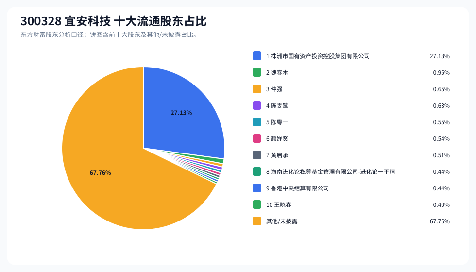
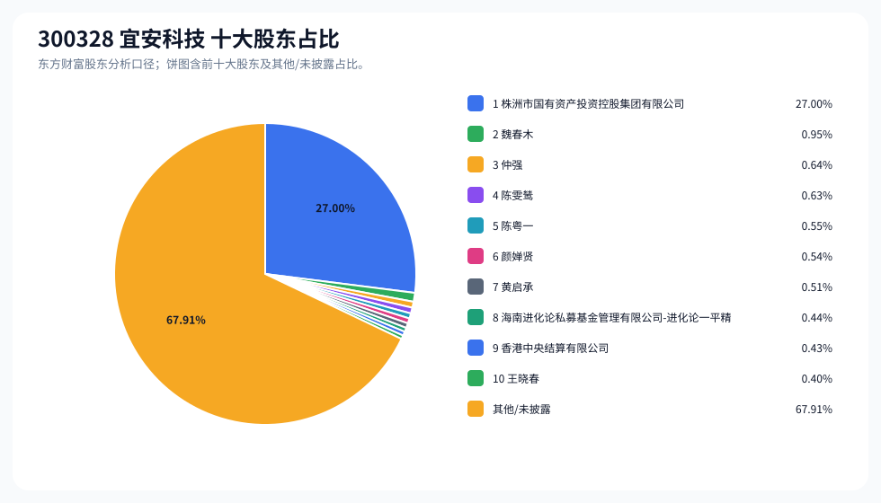
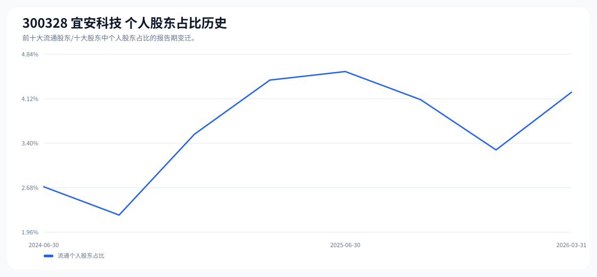

# 300328 宜安科技 股东成分报告

- 生成时间：2026-06-07T16:32:44
- 看涨排名：16；综合评分：28.173。
- ETF/指数线索：CSI_2000 / 159531 中证2000ETF南方。
- 增长/交易机制标签：ETF信号牵引;价格动量;成交额放大;高换手交易;流通股东集中;机构股东参与。
- 说明：本报告是股东结构研究工件，不构成投资建议。

## 1. 公司交易与 ETF 线索

|项目|数值|
|---|---:|
|行业/地区|工业金属 / 东莞市|
|最新价|22.12|
|成交额|28.83亿|
|换手率|19.01%|
|5日收益|24.76%|
|20日收益|20.94%|
|20日成交额放大倍数|2.56|
|主力净流入| ()|

## 2. 股东结构快照

|项目|数值|
|---|---:|
|流通股东报告期|2026-03-31|
|前十大流通股东合计占流通股本|32.24%|
|其中机构类流通股东占比|28.01%|
|其中基金/社保/QFII 类占比|0.44%|
|前十大流通股东占比变化合计|-0.98%|
|第一大流通股东|株洲市国有资产投资控股集团有限公司 / 其他 / 27.13%|
|十大股东报告期|2026-03-31|
|前十大股东合计占总股本|32.09%|
|其中机构类十大股东占比|27.87%|
|前十大股东占比变化合计|-0.98%|
|第一大股东|株洲市国有资产投资控股集团有限公司 / 其他 / 27.00%|

## 3. 股东占比饼图

## 4. 历史股东变迁（个人股东重点）

|报告期|口径|前十大占比|个人股东数|个人股东占比|个人股东|机构占比|基金/社保/QFII占比|
|---|---|---:|---:|---:|---|---:|---:|
|2026-03-31|流通股东|32.24%|7|4.23%|魏春木、仲强、陈雯鸶、陈粤一、颜婵贤、黄启承、王晓春|28.01%|0.44%|
|2025-12-31|流通股东|32.50%|6|3.29%|魏春木、李敏、黄启承、楼兰芳、宋迪伟、徐勇军|29.21%|0.80%|
|2025-09-30|流通股东|32.19%|8|4.11%|魏春木、黄启承、李敏、李海云、徐勇军、刘艇、沈丽华、杨晓东|28.08%|0.00%|
|2025-06-30|流通股东|33.56%|8|4.56%|魏春木、黄启承、黄检、楼兰芳、余仕柏、汪小安、徐勇军、杨利军|29.00%|1.84%|
|2025-03-31|流通股东|32.47%|7|4.42%|魏春木、葛伶俐、黄启承、黄检、徐勇军、楼兰芳、杨利军|28.04%|0.88%|
|2024-12-31|流通股东|33.81%|5|3.55%|魏春木、黄启承、王小军、谢松茂、徐勇军|30.26%|2.09%|
|2024-09-30|流通股东|33.21%|5|2.24%|魏春木、谢松茂、楼兰芳、徐勇军、黄雁举|30.97%|1.80%|
|2024-06-30|流通股东|35.57%|6|2.70%|谢松茂、魏春木、李加平、沈国成、徐勇军、黄雁举|32.87%|0.42%|

### 个人股东逐期变化

|从|到|口径|个人股东|状态|上一期占比|本期占比|占比变化|上一期排名|本期排名|
|---|---|---|---|---|---:|---:|---:|---:|---:|
|2025-12-31|2026-03-31|流通|李敏|退出|0.67%||-0.67%|4||
|2025-12-31|2026-03-31|流通|仲强|新进||0.65%|0.65%||3|
|2025-12-31|2026-03-31|流通|陈雯鸶|新进||0.63%|0.63%||4|
|2025-12-31|2026-03-31|流通|陈粤一|新进||0.55%|0.55%||5|
|2025-12-31|2026-03-31|流通|颜婵贤|新进||0.54%|0.54%||6|
|2025-12-31|2026-03-31|流通|王晓春|新进||0.40%|0.40%||10|
|2025-12-31|2026-03-31|流通|楼兰芳|退出|0.36%||-0.36%|7||
|2025-12-31|2026-03-31|流通|宋迪伟|退出|0.34%||-0.34%|8||
|2025-12-31|2026-03-31|流通|徐勇军|退出|0.31%||-0.31%|10||
|2025-12-31|2026-03-31|流通|魏春木|减持|1.10%|0.95%|-0.14%|3|2|
|2025-12-31|2026-03-31|流通|黄启承|不变|0.51%|0.51%|0.00%|5|7|
|2025-09-30|2025-12-31|流通|李海云|退出|0.43%||-0.43%|6||
|2025-09-30|2025-12-31|流通|刘艇|退出|0.37%||-0.37%|8||
|2025-09-30|2025-12-31|流通|沈丽华|退出|0.36%||-0.36%|9||
|2025-09-30|2025-12-31|流通|杨晓东|退出|0.36%||-0.36%|10||
|2025-09-30|2025-12-31|流通|楼兰芳|新进||0.36%|0.36%||7|
|2025-09-30|2025-12-31|流通|宋迪伟|新进||0.34%|0.34%||8|
|2025-09-30|2025-12-31|流通|李敏|增持|0.47%|0.67%|0.20%|5|4|
|2025-09-30|2025-12-31|流通|徐勇军|减持|0.41%|0.31%|-0.10%|7|10|
|2025-09-30|2025-12-31|流通|魏春木|减持|1.19%|1.10%|-0.09%|2|3|
|2025-09-30|2025-12-31|流通|黄启承|减持|0.51%|0.51%|-0.00%|4|5|
|2025-06-30|2025-09-30|流通|黄检|退出|0.47%||-0.47%|5||
|2025-06-30|2025-09-30|流通|李敏|新进||0.47%|0.47%||5|
|2025-06-30|2025-09-30|流通|楼兰芳|退出|0.47%||-0.47%|6||

## 5. 股东明细

### 十大流通股东

|排名|股东名称|类型|股份类型|持股数|占总股本|占流通股本|占比变化|方向|参考市值|
|---:|---|---|---|---:|---:|---:|---:|---|---:|
|1|株洲市国有资产投资控股集团有限公司|其他|A股|186415400|27.00%|27.13%|0.00%|不变|32.38亿|
|2|魏春木|个人|A股|6556100|0.95%|0.95%|-0.14%|减少|1.14亿|
|3|仲强|个人|A股|4433400|0.64%|0.65%||新进|7700.82万|
|4|陈雯鸶|个人|A股|4318100|0.63%|0.63%||新进|7500.54万|
|5|陈粤一|个人|A股|3764784|0.55%|0.55%||新进|6539.43万|
|6|颜婵贤|个人|A股|3720000|0.54%|0.54%||新进|6461.64万|
|7|黄启承|个人|A股|3500000|0.51%|0.51%|0.00%|不变|6079.50万|
|8|海南进化论私募基金管理有限公司-进化论一平精选私募证券投资基金|其他|A股|3022900|0.44%|0.44%||新进|5250.78万|
|9|香港中央结算有限公司|其他|A股|3001561|0.43%|0.44%|-0.83%|减少|5213.71万|
|10|王晓春|个人|A股|2744068|0.40%|0.40%||新进|4766.45万|

### 十大股东

|排名|股东名称|类型|股份类型|持股数|占总股本|占流通股本|占比变化|方向|参考市值|
|---:|---|---|---|---:|---:|---:|---:|---|---:|
|1|株洲市国有资产投资控股集团有限公司|其他|流通A股|186415400|27.00%||0.00%|不变|32.38亿|
|2|魏春木|个人|流通A股|6556100|0.95%||-0.14%|减持|1.14亿|
|3|仲强|个人|流通A股|4433400|0.64%|||新进|7700.82万|
|4|陈雯鸶|个人|流通A股|4318100|0.63%|||新进|7500.54万|
|5|陈粤一|个人|流通A股|3764784|0.55%|||新进|6539.43万|
|6|颜婵贤|个人|流通A股|3720000|0.54%|||新进|6461.64万|
|7|黄启承|个人|流通A股|3500000|0.51%||0.00%|不变|6079.50万|
|8|海南进化论私募基金管理有限公司-进化论一平精选私募证券投资基金|其他|流通A股|3022900|0.44%|||新进|5250.78万|
|9|香港中央结算有限公司|其他|流通A股|3001561|0.43%||-0.84%|减持|5213.71万|
|10|王晓春|个人|流通A股|2744068|0.40%|||新进|4766.45万|

## 6. 解读要点

- 若“成交额放大 + 高换手交易”同时出现，说明上涨背后有真实交易活跃度，但也可能伴随波动放大。
- 前十大流通股东占比越高，筹码越集中；机构/基金占比越高，越需要继续核对定期报告、基金持仓和是否存在被动指数持仓。
- 个人股东历史变迁重点看三类信号：连续增持、新进进入前十大、以及从前十大退出；个人股东占比变化越大，越需要核对公告和实际控制人/高管身份。
- 股东占比变化为增持/减持线索，需结合公告日、股价位置和成交额验证，不应单独作为买卖依据。

## 数据源

- 股东数据：https://datacenter-web.eastmoney.com/api/data/v1/get (RPT_F10_EH_FREEHOLDERS / RPT_DMSK_HOLDERS)
- 行情与 K 线：https://push2.eastmoney.com/api/qt/clist/get / https://push2his.eastmoney.com/api/qt/stock/kline/get
