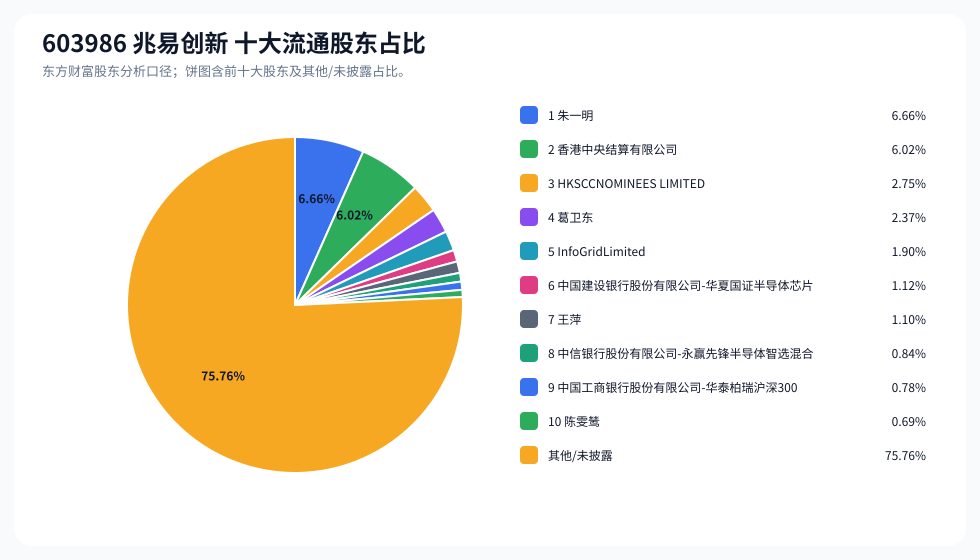
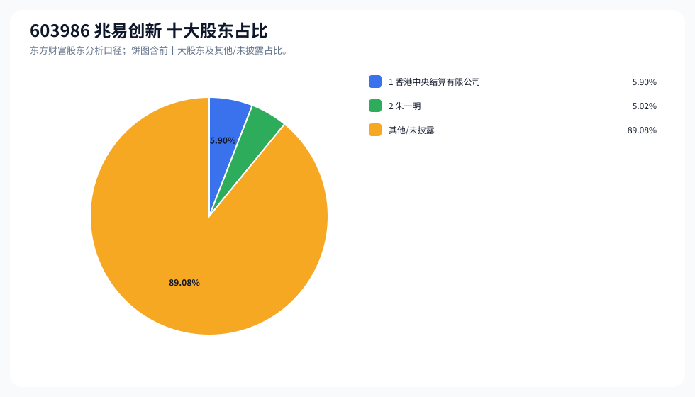
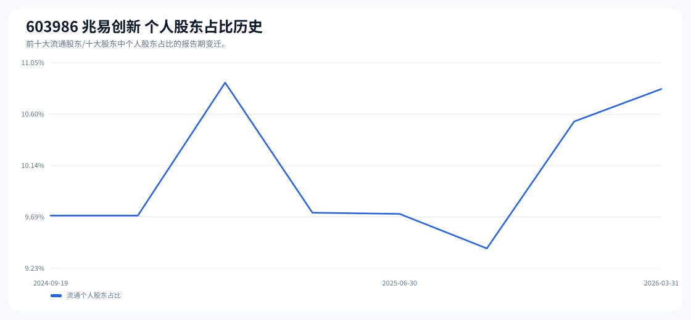

# 603986 兆易创新 股东成分报告

- 生成时间：2026-06-07T16:32:44
- 看涨排名：17；综合评分：26.496。
- ETF/指数线索：CSI_300;CSI_800;CSI_A100 / 510310;159800;159627 沪深300ETF易方达;中证800ETF鹏华;中证A100ETF华夏。
- 增长/交易机制标签：ETF信号牵引;价格动量;高换手交易;机构股东参与。
- 说明：本报告是股东结构研究工件，不构成投资建议。

## 1. 公司交易与 ETF 线索

|项目|数值|
|---|---:|
|行业/地区|半导体 / 北京市|
|最新价|488.00|
|成交额|275.65亿|
|换手率|8.19%|
|5日收益|4.49%|
|20日收益|46.39%|
|20日成交额放大倍数|1.04|
|主力净流入| ()|

## 2. 股东结构快照

|项目|数值|
|---|---:|
|流通股东报告期|2026-03-31|
|前十大流通股东合计占流通股本|24.24%|
|其中机构类流通股东占比|13.42%|
|其中基金/社保/QFII 类占比|2.75%|
|前十大流通股东占比变化合计|-1.97%|
|第一大流通股东|朱一明 / 个人 / 6.66%|
|十大股东报告期|2026-05-27|
|前十大股东合计占总股本|10.92%|
|其中机构类十大股东占比|5.90%|
|前十大股东占比变化合计|-1.51%|
|第一大股东|香港中央结算有限公司 / 其他 / 5.90%|

## 3. 股东占比饼图

## 4. 历史股东变迁（个人股东重点）

|报告期|口径|前十大占比|个人股东数|个人股东占比|个人股东|机构占比|基金/社保/QFII占比|
|---|---|---:|---:|---:|---|---:|---:|
|2026-03-31|流通股东|24.24%|4|10.82%|朱一明、葛卫东、王萍、陈雯鸶|13.42%|2.75%|
|2025-12-31|流通股东|24.52%|3|10.53%|朱一明、葛卫东、王萍|13.99%|5.85%|
|2025-09-30|流通股东|23.03%|2|9.41%|朱一明、葛卫东|13.62%|6.13%|
|2025-06-30|流通股东|26.50%|2|9.71%|朱一明、葛卫东|16.79%|7.35%|
|2025-03-31|流通股东|25.87%|2|9.73%|朱一明、葛卫东|16.14%|6.71%|
|2024-12-31|流通股东|28.02%|3|10.88%|朱一明、葛卫东、王萍|17.15%|6.85%|
|2024-09-30|流通股东|28.72%|2|9.70%|朱一明、葛卫东|19.02%|10.16%|
|2024-09-19|流通股东|28.87%|2|9.70%|朱一明、葛卫东|19.17%|9.90%|

### 个人股东逐期变化

|从|到|口径|个人股东|状态|上一期占比|本期占比|占比变化|上一期排名|本期排名|
|---|---|---|---|---|---:|---:|---:|---:|---:|
|2025-12-31|2026-03-31|流通|陈雯鸶|新进||0.69%|0.69%||10|
|2025-12-31|2026-03-31|流通|朱一明|减持|6.85%|6.66%|-0.19%|1|1|
|2025-12-31|2026-03-31|流通|葛卫东|减持|2.55%|2.37%|-0.18%|3|4|
|2025-12-31|2026-03-31|流通|王萍|减持|1.13%|1.10%|-0.03%|8|7|
|2025-09-30|2025-12-31|流通|王萍|新进||1.13%|1.13%||8|
|2025-09-30|2025-12-31|流通|朱一明|减持|6.86%|6.85%|-0.01%|1|1|
|2025-09-30|2025-12-31|流通|葛卫东|减持|2.55%|2.55%|-0.00%|3|3|
|2025-06-30|2025-09-30|流通|葛卫东|减持|2.82%|2.55%|-0.27%|3|3|
|2025-06-30|2025-09-30|流通|朱一明|减持|6.89%|6.86%|-0.04%|1|1|
|2025-03-31|2025-06-30|流通|朱一明|减持|6.90%|6.89%|-0.01%|1|1|
|2025-03-31|2025-06-30|流通|葛卫东|减持|2.82%|2.82%|-0.00%|3|3|
|2024-12-31|2025-03-31|流通|王萍|退出|1.15%||-1.15%|10||
|2024-12-31|2025-03-31|流通|朱一明|不变|6.90%|6.90%|0.00%|1|1|
|2024-12-31|2025-03-31|流通|葛卫东|不变|2.82%|2.82%|0.00%|3|3|
|2024-09-30|2024-12-31|流通|王萍|新进||1.15%|1.15%||10|
|2024-09-30|2024-12-31|流通|朱一明|增持|6.88%|6.90%|0.02%|1|1|
|2024-09-30|2024-12-31|流通|葛卫东|增持|2.82%|2.82%|0.01%|3|3|
|2024-09-19|2024-09-30|流通|朱一明|不变|6.88%|6.88%|0.00%|1|1|
|2024-09-19|2024-09-30|流通|葛卫东|不变|2.82%|2.82%|0.00%|3|3|

## 5. 股东明细

### 十大流通股东

|排名|股东名称|类型|股份类型|持股数|占总股本|占流通股本|占比变化|方向|参考市值|
|---:|---|---|---|---:|---:|---:|---:|---|---:|
|1|朱一明|个人|A股|45758013|6.53%|6.66%|-0.32%|不变|108.95亿|
|2|香港中央结算有限公司|其他|A股|41368518|5.90%|6.02%|-0.29%|增加|98.50亿|
|3|HKSCCNOMINEES LIMITED|其他|H股|18858760|2.69%|2.75%||新进|44.90亿|
|4|葛卫东|个人|A股|16261569|2.32%|2.37%|-0.23%|减少|38.72亿|
|5|InfoGridLimited|其他|A股|13053500|1.86%|1.90%|-0.09%|不变|31.08亿|
|6|中国建设银行股份有限公司-华夏国证半导体芯片交易型开放式指数证券投资基金|基金|A股|7694957|1.10%|1.12%|-0.09%|减少|18.32亿|
|7|王萍|个人|A股|7573182|1.08%|1.10%|-0.05%|增加|18.03亿|
|8|中信银行股份有限公司-永赢先锋半导体智选混合型发起式证券投资基金|基金|A股|5801926|0.83%|0.84%||新进|13.81亿|
|9|中国工商银行股份有限公司-华泰柏瑞沪深300交易型开放式指数证券投资基金|基金|A股|5374796|0.77%|0.78%|-0.88%|减少|12.80亿|
|10|陈雯鸶|个人|A股|4708948|0.67%|0.69%||新进|11.21亿|

### 十大股东

|排名|股东名称|类型|股份类型|持股数|占总股本|占流通股本|占比变化|方向|参考市值|
|---:|---|---|---|---:|---:|---:|---:|---|---:|
|1|香港中央结算有限公司|其他|流通A股|41368518|5.90%||0.00%|不变|212.71亿|
|2|朱一明|个人|流通A股|35228776|5.02%||-1.51%|减持|181.14亿|

## 6. 解读要点

- 若“成交额放大 + 高换手交易”同时出现，说明上涨背后有真实交易活跃度，但也可能伴随波动放大。
- 前十大流通股东占比越高，筹码越集中；机构/基金占比越高，越需要继续核对定期报告、基金持仓和是否存在被动指数持仓。
- 个人股东历史变迁重点看三类信号：连续增持、新进进入前十大、以及从前十大退出；个人股东占比变化越大，越需要核对公告和实际控制人/高管身份。
- 股东占比变化为增持/减持线索，需结合公告日、股价位置和成交额验证，不应单独作为买卖依据。

## 数据源

- 股东数据：https://datacenter-web.eastmoney.com/api/data/v1/get (RPT_F10_EH_FREEHOLDERS / RPT_DMSK_HOLDERS)
- 行情与 K 线：https://push2.eastmoney.com/api/qt/clist/get / https://push2his.eastmoney.com/api/qt/stock/kline/get
