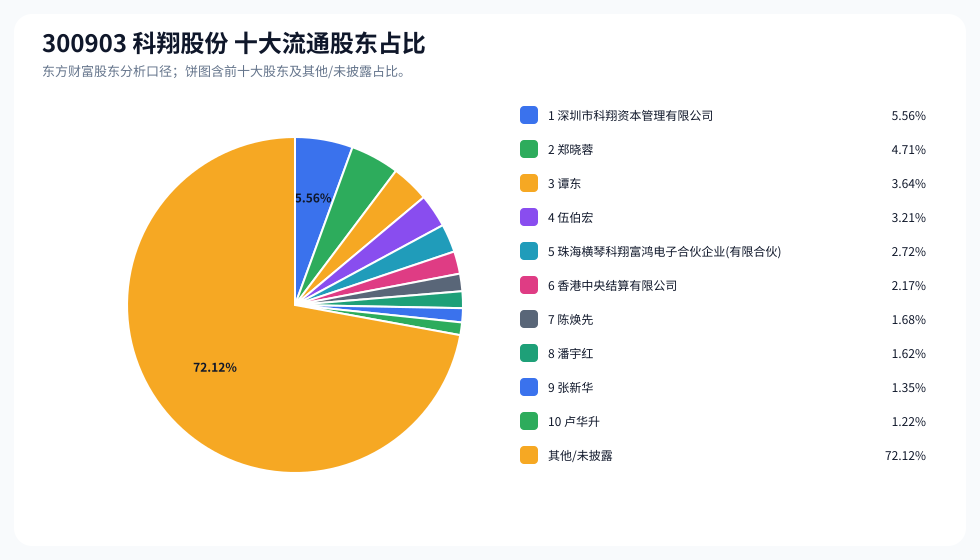
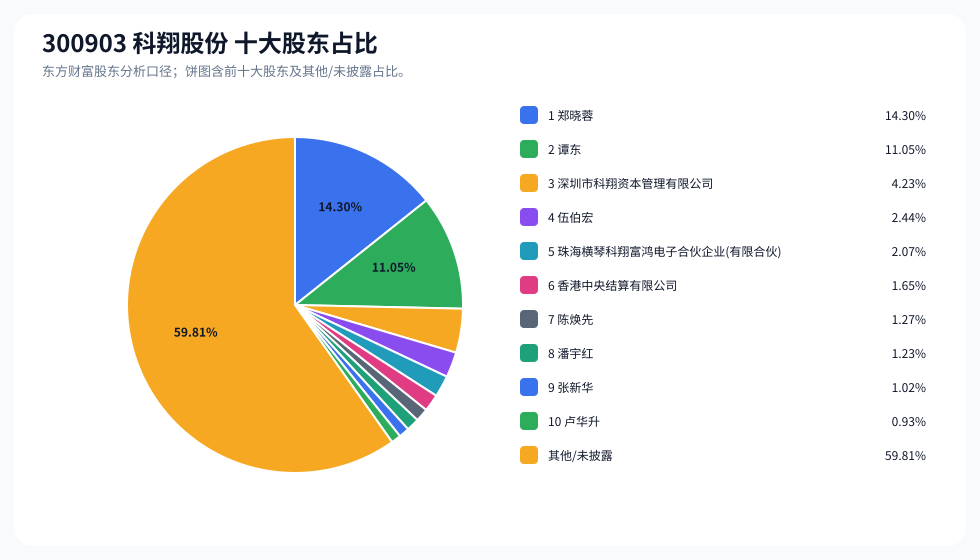
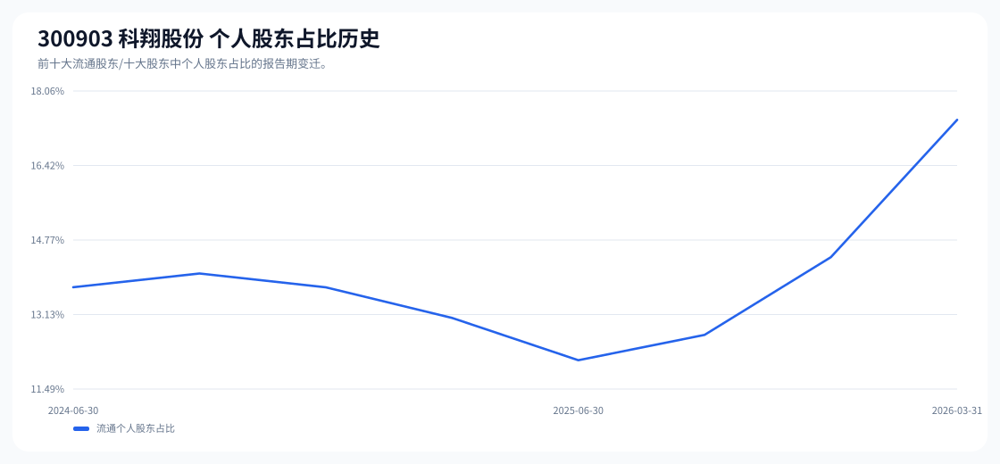

# 300903 科翔股份 股东成分报告

- 生成时间：2026-06-07T16:32:44
- 看涨排名：18；综合评分：23.157。
- ETF/指数线索：CSI_2000 / 159531 中证2000ETF南方。
- 增长/交易机制标签：ETF信号牵引;价格动量;高换手交易;机构股东参与。
- 说明：本报告是股东结构研究工件，不构成投资建议。

## 1. 公司交易与 ETF 线索

|项目|数值|
|---|---:|
|行业/地区|元件 / 惠州市|
|最新价|72.10|
|成交额|21.29亿|
|换手率|8.58%|
|5日收益|2.28%|
|20日收益|24.18%|
|20日成交额放大倍数|0.80|
|主力净流入| ()|

## 2. 股东结构快照

|项目|数值|
|---|---:|
|流通股东报告期|2026-03-31|
|前十大流通股东合计占流通股本|27.88%|
|其中机构类流通股东占比|10.45%|
|其中基金/社保/QFII 类占比|0.00%|
|前十大流通股东占比变化合计|-0.79%|
|第一大流通股东|深圳市科翔资本管理有限公司 / 其他 / 5.56%|
|十大股东报告期|2026-03-31|
|前十大股东合计占总股本|40.19%|
|其中机构类十大股东占比|7.95%|
|前十大股东占比变化合计|-1.74%|
|第一大股东|郑晓蓉 / 个人 / 14.30%|

## 3. 股东占比饼图

## 4. 历史股东变迁（个人股东重点）

|报告期|口径|前十大占比|个人股东数|个人股东占比|个人股东|机构占比|基金/社保/QFII占比|
|---|---|---:|---:|---:|---|---:|---:|
|2026-03-31|流通股东|27.88%|7|17.42%|郑晓蓉、谭东、伍伯宏、陈焕先、潘宇红、张新华、卢华升|10.45%|0.00%|
|2025-12-31|流通股东|25.36%|6|14.39%|郑晓蓉、谭东、段凡、陈焕先、张新华、卢华升|10.97%|2.68%|
|2025-09-30|流通股东|24.72%|5|12.68%|郑晓蓉、谭东、陈焕先、张新华、卢华升|12.04%|3.70%|
|2025-06-30|流通股东|23.05%|6|12.12%|郑晓蓉、谭东、陈焕先、张新华、徐媛瑗、王子宁|10.93%|2.59%|
|2025-03-31|流通股东|23.49%|7|13.05%|郑晓蓉、谭东、陈焕先、张新华、张勤华、曾奕林、张杏辉|10.43%|2.09%|
|2024-12-31|流通股东|24.16%|7|13.73%|郑晓蓉、谭东、陈焕先、张新华、朱荃华、张勤华、郑璇玲|10.43%|2.09%|
|2024-09-30|流通股东|24.42%|7|14.04%|郑晓蓉、谭东、陈焕先、张新华、骆仰成、陈子彬、张勤华|10.39%|2.08%|
|2024-06-30|流通股东|24.12%|7|13.73%|郑晓蓉、谭东、陈焕先、张新华、骆仰成、金勇、陈子彬|10.39%|2.08%|

### 个人股东逐期变化

|从|到|口径|个人股东|状态|上一期占比|本期占比|占比变化|上一期排名|本期排名|
|---|---|---|---|---|---:|---:|---:|---:|---:|
|2025-12-31|2026-03-31|流通|伍伯宏|新进||3.21%|3.21%||4|
|2025-12-31|2026-03-31|流通|段凡|退出|1.80%||-1.80%|6||
|2025-12-31|2026-03-31|流通|潘宇红|新进||1.62%|1.62%||8|
|2025-12-31|2026-03-31|流通|卢华升|不变|1.22%|1.22%|0.00%|9|10|
|2025-12-31|2026-03-31|流通|张新华|不变|1.35%|1.35%|0.00%|8|9|
|2025-12-31|2026-03-31|流通|谭东|不变|3.64%|3.64%|0.00%|3|3|
|2025-12-31|2026-03-31|流通|郑晓蓉|不变|4.71%|4.71%|0.00%|2|2|
|2025-12-31|2026-03-31|流通|陈焕先|不变|1.68%|1.68%|0.00%|7|7|
|2025-09-30|2025-12-31|流通|段凡|新进||1.80%|1.80%||6|
|2025-09-30|2025-12-31|流通|郑晓蓉|减持|4.74%|4.71%|-0.03%|2|2|
|2025-09-30|2025-12-31|流通|谭东|减持|3.66%|3.64%|-0.03%|3|3|
|2025-09-30|2025-12-31|流通|陈焕先|减持|1.69%|1.68%|-0.01%|6|7|
|2025-09-30|2025-12-31|流通|张新华|减持|1.36%|1.35%|-0.01%|7|8|
|2025-09-30|2025-12-31|流通|卢华升|减持|1.23%|1.22%|-0.01%|8|9|
|2025-06-30|2025-09-30|流通|卢华升|新进||1.23%|1.23%||8|
|2025-06-30|2025-09-30|流通|徐媛瑗|退出|0.29%||-0.29%|9||
|2025-06-30|2025-09-30|流通|王子宁|退出|0.26%||-0.26%|10||
|2025-06-30|2025-09-30|流通|张新华|减持|1.44%|1.36%|-0.08%|7|7|
|2025-06-30|2025-09-30|流通|陈焕先|减持|1.72%|1.69%|-0.03%|6|6|
|2025-06-30|2025-09-30|流通|郑晓蓉|减持|4.74%|4.74%|-0.00%|2|2|
|2025-06-30|2025-09-30|流通|谭东|减持|3.66%|3.66%|-0.00%|3|3|
|2025-03-31|2025-06-30|流通|张勤华|退出|0.47%||-0.47%|8||
|2025-03-31|2025-06-30|流通|陈焕先|减持|2.12%|1.72%|-0.39%|5|6|
|2025-03-31|2025-06-30|流通|曾奕林|退出|0.32%||-0.32%|9||

## 5. 股东明细

### 十大流通股东

|排名|股东名称|类型|股份类型|持股数|占总股本|占流通股本|占比变化|方向|参考市值|
|---:|---|---|---|---:|---:|---:|---:|---|---:|
|1|深圳市科翔资本管理有限公司|其他|A股|18396614|4.23%|5.56%|-0.21%|不变|5.88亿|
|2|郑晓蓉|个人|A股|15564308|3.57%|4.71%|-0.18%|不变|4.98亿|
|3|谭东|个人|A股|12026188|2.76%|3.64%|-0.14%|不变|3.84亿|
|4|伍伯宏|个人|A股|10625700|2.44%|3.21%||新进|3.40亿|
|5|珠海横琴科翔富鸿电子合伙企业(有限合伙)|其他|A股|9000000|2.07%|2.72%|-0.10%|不变|2.88亿|
|6|香港中央结算有限公司|其他|A股|7174484|1.65%|2.17%||新进|2.29亿|
|7|陈焕先|个人|A股|5549299|1.27%|1.68%|-0.06%|不变|1.77亿|
|8|潘宇红|个人|A股|5350000|1.23%|1.62%||新进|1.71亿|
|9|张新华|个人|A股|4462562|1.02%|1.35%|-0.05%|不变|1.43亿|
|10|卢华升|个人|A股|4039000|0.93%|1.22%|-0.05%|不变|1.29亿|

### 十大股东

|排名|股东名称|类型|股份类型|持股数|占总股本|占流通股本|占比变化|方向|参考市值|
|---:|---|---|---|---:|---:|---:|---:|---|---:|
|1|郑晓蓉|个人|流通A股,限售流通A股|62257231|14.30%||-0.71%|不变|19.90亿|
|2|谭东|个人|流通A股,限售流通A股|48104750|11.05%||-0.55%|不变|15.38亿|
|3|深圳市科翔资本管理有限公司|其他|流通A股|18396614|4.23%||-0.21%|不变|5.88亿|
|4|伍伯宏|个人|流通A股|10625700|2.44%|||新进|3.40亿|
|5|珠海横琴科翔富鸿电子合伙企业(有限合伙)|其他|流通A股|9000000|2.07%||-0.10%|不变|2.88亿|
|6|香港中央结算有限公司|其他|流通A股|7174484|1.65%|||新进|2.29亿|
|7|陈焕先|个人|流通A股|5549299|1.27%||-0.07%|不变|1.77亿|
|8|潘宇红|个人|流通A股|5350000|1.23%|||新进|1.71亿|
|9|张新华|个人|流通A股|4462562|1.02%||-0.06%|不变|1.43亿|
|10|卢华升|个人|流通A股|4039000|0.93%||-0.04%|不变|1.29亿|

## 6. 解读要点

- 若“成交额放大 + 高换手交易”同时出现，说明上涨背后有真实交易活跃度，但也可能伴随波动放大。
- 前十大流通股东占比越高，筹码越集中；机构/基金占比越高，越需要继续核对定期报告、基金持仓和是否存在被动指数持仓。
- 个人股东历史变迁重点看三类信号：连续增持、新进进入前十大、以及从前十大退出；个人股东占比变化越大，越需要核对公告和实际控制人/高管身份。
- 股东占比变化为增持/减持线索，需结合公告日、股价位置和成交额验证，不应单独作为买卖依据。

## 数据源

- 股东数据：https://datacenter-web.eastmoney.com/api/data/v1/get (RPT_F10_EH_FREEHOLDERS / RPT_DMSK_HOLDERS)
- 行情与 K 线：https://push2.eastmoney.com/api/qt/clist/get / https://push2his.eastmoney.com/api/qt/stock/kline/get
