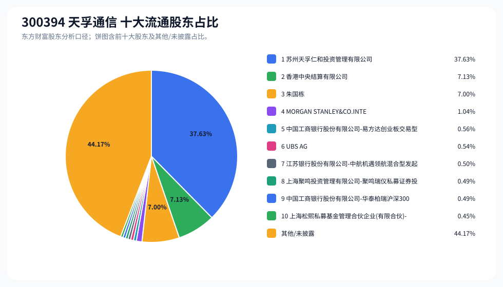
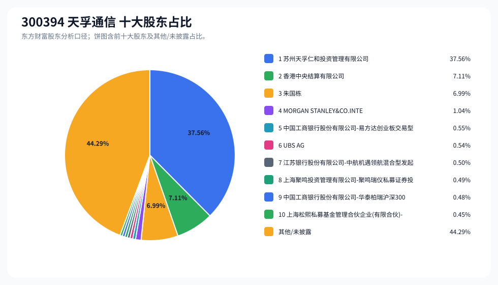
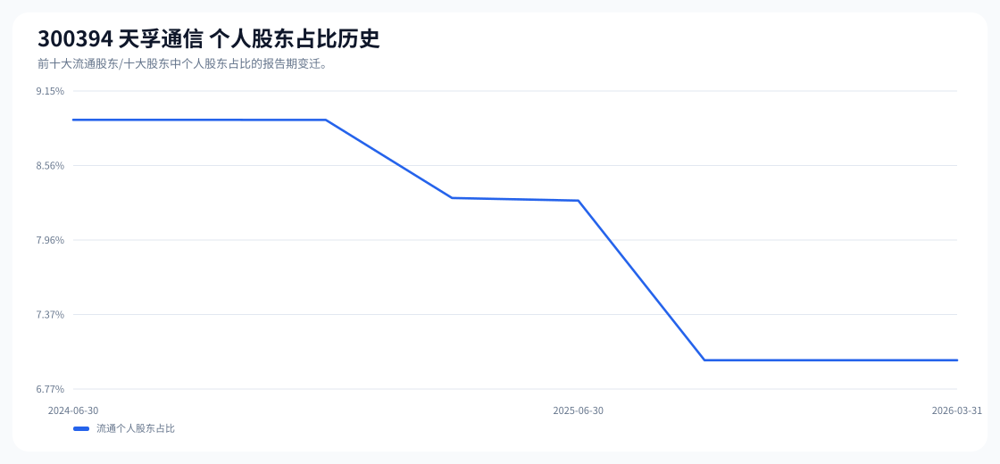

# 300394 天孚通信 股东成分报告

- 生成时间：2026-06-07T16:34:50
- 看涨排名：19；综合评分：22.101。
- ETF/指数线索：CSI_A500 / 159352 中证A500ETF。
- 增长/交易机制标签：ETF信号牵引;价格动量;高换手交易;流通股东集中;机构股东参与。
- 说明：本报告是股东结构研究工件，不构成投资建议。

## 1. 公司交易与 ETF 线索

|项目|数值|
|---|---:|
|行业/地区|通信设备 / 苏州市|
|最新价|457.00|
|成交额|224.74亿|
|换手率|6.06%|
|5日收益|0.40%|
|20日收益|40.06%|
|20日成交额放大倍数|1.01|
|主力净流入| ()|

## 2. 股东结构快照

|项目|数值|
|---|---:|
|流通股东报告期|2026-03-31|
|前十大流通股东合计占流通股本|55.83%|
|其中机构类流通股东占比|48.83%|
|其中基金/社保/QFII 类占比|4.07%|
|前十大流通股东占比变化合计|2.08%|
|第一大流通股东|苏州天孚仁和投资管理有限公司 / 其他 / 37.63%|
|十大股东报告期|2026-03-31|
|前十大股东合计占总股本|55.71%|
|其中机构类十大股东占比|48.72%|
|前十大股东占比变化合计|2.07%|
|第一大股东|苏州天孚仁和投资管理有限公司 / 其他 / 37.56%|

## 3. 股东占比饼图

## 4. 历史股东变迁（个人股东重点）

|报告期|口径|前十大占比|个人股东数|个人股东占比|个人股东|机构占比|基金/社保/QFII占比|
|---|---|---:|---:|---:|---|---:|---:|
|2026-03-31|流通股东|55.83%|1|7.00%|朱国栋|48.83%|4.07%|
|2025-12-31|流通股东|53.80%|1|7.00%|朱国栋|46.80%|5.60%|
|2025-09-30|流通股东|52.72%|1|7.00%|朱国栋|45.72%|5.79%|
|2025-06-30|流通股东|53.94%|1|8.28%|朱国栋|45.67%|5.33%|
|2025-03-31|流通股东|53.29%|1|8.30%|朱国栋|44.99%|5.14%|
|2024-12-31|流通股东|55.61%|1|8.92%|朱国栋|46.69%|5.60%|
|2024-09-30|流通股东|54.91%|1|8.92%|朱国栋|45.99%|5.39%|
|2024-06-30|流通股东|54.28%|1|8.92%|朱国栋|45.35%|4.13%|

### 个人股东逐期变化

|从|到|口径|个人股东|状态|上一期占比|本期占比|占比变化|上一期排名|本期排名|
|---|---|---|---|---|---:|---:|---:|---:|---:|
|2025-12-31|2026-03-31|流通|朱国栋|不变|7.00%|7.00%|0.00%|2|3|
|2025-09-30|2025-12-31|流通|朱国栋|不变|7.00%|7.00%|0.00%|2|2|
|2025-06-30|2025-09-30|流通|朱国栋|减持|8.28%|7.00%|-1.28%|2|2|
|2025-03-31|2025-06-30|流通|朱国栋|减持|8.30%|8.28%|-0.02%|2|2|
|2024-12-31|2025-03-31|流通|朱国栋|减持|8.92%|8.30%|-0.62%|2|2|
|2024-09-30|2024-12-31|流通|朱国栋|减持|8.92%|8.92%|-0.00%|2|2|
|2024-06-30|2024-09-30|流通|朱国栋|不变|8.92%|8.92%|0.00%|2|2|

## 5. 股东明细

### 十大流通股东

|排名|股东名称|类型|股份类型|持股数|占总股本|占流通股本|占比变化|方向|参考市值|
|---:|---|---|---|---:|---:|---:|---:|---|---:|
|1|苏州天孚仁和投资管理有限公司|其他|A股|291989059|37.56%|37.63%|0.00%|不变|880.64亿|
|2|香港中央结算有限公司|其他|A股|55301042|7.11%|7.13%|3.55%|增加|166.79亿|
|3|朱国栋|个人|A股|54322627|6.99%|7.00%|0.00%|不变|163.84亿|
|4|MORGAN STANLEY&CO.INTERNATIONAL PLC.|QFII|A股|8103402|1.04%|1.04%||新进|24.44亿|
|5|中国工商银行股份有限公司-易方达创业板交易型开放式指数证券投资基金|基金|A股|4307980|0.55%|0.56%|-0.56%|减少|12.99亿|
|6|UBS AG|QFII|A股|4193485|0.54%|0.54%||新进|12.65亿|
|7|江苏银行股份有限公司-中航机遇领航混合型发起式证券投资基金|基金|A股|3896800|0.50%|0.50%|-0.41%|减少|11.75亿|
|8|上海聚鸣投资管理有限公司-聚鸣瑞仪私募证券投资基金|其他|A股|3791240|0.49%|0.49%||新进|11.43亿|
|9|中国工商银行股份有限公司-华泰柏瑞沪深300交易型开放式指数证券投资基金|基金|A股|3767283|0.48%|0.49%|-0.50%|减少|11.36亿|
|10|上海松熙私募基金管理合伙企业(有限合伙)-松熙长阳私募证券投资基金|其他|A股|3513783|0.45%|0.45%||新进|10.60亿|

### 十大股东

|排名|股东名称|类型|股份类型|持股数|占总股本|占流通股本|占比变化|方向|参考市值|
|---:|---|---|---|---:|---:|---:|---:|---|---:|
|1|苏州天孚仁和投资管理有限公司|其他|流通A股|291989059|37.56%||0.00%|不变|880.64亿|
|2|香港中央结算有限公司|其他|流通A股|55301042|7.11%||3.55%|增持|166.79亿|
|3|朱国栋|个人|流通A股|54322627|6.99%||0.00%|不变|163.84亿|
|4|MORGAN STANLEY&CO.INTERNATI ONAL PLC.|QFII|流通A股|8103402|1.04%|||新进|24.44亿|
|5|中国工商银行股份有限公司-易方达创业板交易型开放式指数证券投资基金|基金|流通A股|4307980|0.55%||-0.56%|减持|12.99亿|
|6|UBS AG|QFII|流通A股|4193485|0.54%|||新进|12.65亿|
|7|江苏银行股份有限公司-中航机遇领航混合型发起式证券投资基金|基金|流通A股|3896800|0.50%||-0.41%|减持|11.75亿|
|8|上海聚鸣投资管理有限公司-聚鸣瑞仪私募证券投资基金|其他|流通A股|3791240|0.49%|||新进|11.43亿|
|9|中国工商银行股份有限公司-华泰柏瑞沪深300交易型开放式指数证券投资基金|基金|流通A股|3767283|0.48%||-0.51%|减持|11.36亿|
|10|上海松熙私募基金管理合伙企业(有限合伙)-松熙长阳私募证券投资基金|其他|流通A股|3513783|0.45%|||新进|10.60亿|

## 6. 解读要点

- 若“成交额放大 + 高换手交易”同时出现，说明上涨背后有真实交易活跃度，但也可能伴随波动放大。
- 前十大流通股东占比越高，筹码越集中；机构/基金占比越高，越需要继续核对定期报告、基金持仓和是否存在被动指数持仓。
- 个人股东历史变迁重点看三类信号：连续增持、新进进入前十大、以及从前十大退出；个人股东占比变化越大，越需要核对公告和实际控制人/高管身份。
- 股东占比变化为增持/减持线索，需结合公告日、股价位置和成交额验证，不应单独作为买卖依据。

## 数据源

- 股东数据：https://datacenter-web.eastmoney.com/api/data/v1/get (RPT_F10_EH_FREEHOLDERS / RPT_DMSK_HOLDERS)
- 行情与 K 线：https://push2.eastmoney.com/api/qt/clist/get / https://push2his.eastmoney.com/api/qt/stock/kline/get
