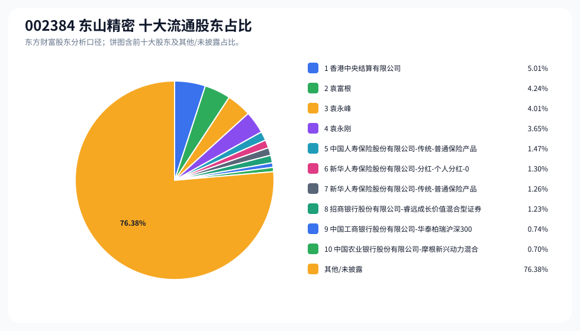
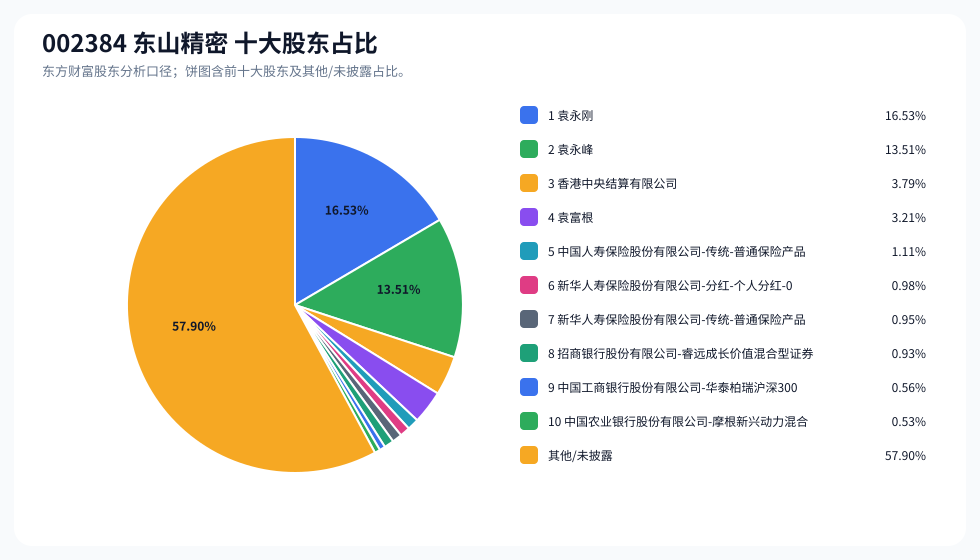
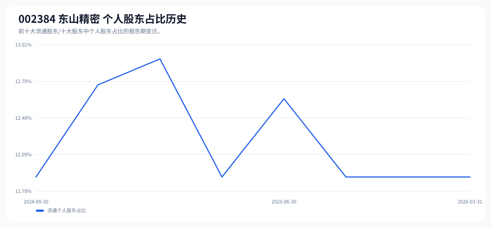

# 002384 东山精密 股东成分报告

- 生成时间：2026-06-07T16:40:07
- 看涨排名：20；综合评分：21.725。
- ETF/指数线索：CSI_300;CSI_800 / 510310;159800 沪深 300ETF 易方达;中证 800ETF 鹏华。
- 增长/交易机制标签：ETF 信号牵引;价格动量;高换手交易;机构股东参与。
- 说明：本报告是股东结构研究工件，不构成投资建议。

## 1. 公司交易与 ETF 线索

|项目 | 数值|
|---|---:|
|行业/地区 | 元件 / 苏州市|
|最新价|221.41|
|成交额|194.66 亿|
|换手率|6.09%|
|5 日收益|3.92%|
|20 日收益|4.74%|
|20 日成交额放大倍数|0.96|
|主力净流入 | ()|

## 2. 股东结构快照

|项目 | 数值|
|---|---:|
|流通股东报告期|2026-03-31|
|前十大流通股东合计占流通股本|23.62%|
|其中机构类流通股东占比|11.72%|
|其中基金/社保/QFII 类占比|2.68%|
|前十大流通股东占比变化合计|0.62%|
|第一大流通股东 | 香港中央结算有限公司 / 其他 / 5.01%|
|十大股东报告期|2026-03-31|
|前十大股东合计占总股本|42.10%|
|其中机构类十大股东占比|8.85%|
|前十大股东占比变化合计|0.60%|
|第一大股东 | 袁永刚 / 个人 / 16.53%|

## 3. 股东占比饼图

## 4. 历史股东变迁（个人股东重点）

|报告期 | 口径 | 前十大占比 | 个人股东数 | 个人股东占比 | 个人股东 | 机构占比 | 基金/社保/QFII 占比|
|---|---|---:|---:|---:|---|---:|---:|
|2026-03-31|流通股东|23.62%|3|11.90%|袁富根、袁永峰、袁永刚|11.72%|2.68%|
|2025-12-31|流通股东|23.18%|3|11.90%|袁富根、袁永峰、袁永刚|11.29%|3.98%|
|2025-09-30|流通股东|23.33%|3|11.90%|袁富根、袁永峰、袁永刚|11.43%|3.20%|
|2025-06-30|流通股东|21.65%|4|12.56%|袁富根、袁永峰、袁永刚、李金兰|9.09%|2.54%|
|2025-04-09|流通股东|22.62%|3|11.90%|袁富根、袁永峰、袁永刚|10.72%|3.32%|
|2025-03-31|流通股东|22.93%|4|12.89%|袁富根、袁永峰、袁永刚、李少丽|10.03%|2.37%|
|2024-12-31|流通股东|20.49%|4|12.67%|袁富根、袁永峰、袁永刚、余巧英|7.82%|3.03%|
|2024-09-30|流通股东|24.18%|3|11.90%|袁富根、袁永峰、袁永刚|12.28%|3.57%|

### 个人股东逐期变化

|从 | 到|口径 | 个人股东 | 状态 | 上一期占比 | 本期占比 | 占比变化 | 上一期排名 | 本期排名|
|---|---|---|---|---|---:|---:|---:|---:|---:|
|2025-12-31|2026-03-31|流通 | 袁富根 | 不变|4.24%|4.24%|0.00%|1|2|
|2025-12-31|2026-03-31|流通 | 袁永刚 | 不变|3.65%|3.65%|0.00%|3|4|
|2025-12-31|2026-03-31|流通 | 袁永峰 | 不变|4.01%|4.01%|0.00%|2|3|
|2025-09-30|2025-12-31|流通 | 袁富根 | 不变|4.24%|4.24%|0.00%|2|1|
|2025-09-30|2025-12-31|流通 | 袁永刚 | 不变|3.65%|3.65%|0.00%|4|3|
|2025-09-30|2025-12-31|流通 | 袁永峰 | 不变|4.01%|4.01%|0.00%|3|2|
|2025-06-30|2025-09-30|流通 | 李金兰 | 退出|0.66%||-0.66%|10||
|2025-06-30|2025-09-30|流通 | 袁富根 | 不变|4.24%|4.24%|0.00%|2|2|
|2025-06-30|2025-09-30|流通 | 袁永刚 | 不变|3.65%|3.65%|0.00%|4|4|
|2025-06-30|2025-09-30|流通 | 袁永峰 | 不变|4.01%|4.01%|0.00%|3|3|
|2025-04-09|2025-06-30|流通 | 李金兰 | 新进||0.66%|0.66%||10|
|2025-04-09|2025-06-30|流通 | 袁富根 | 不变|4.24%|4.24%|0.00%|1|2|
|2025-04-09|2025-06-30|流通 | 袁永刚 | 不变|3.65%|3.65%|0.00%|4|4|
|2025-04-09|2025-06-30|流通 | 袁永峰 | 不变|4.01%|4.01%|0.00%|2|3|
|2025-03-31|2025-04-09|流通 | 李少丽 | 退出|1.00%||-1.00%|9||
|2025-03-31|2025-04-09|流通 | 袁富根 | 不变|4.24%|4.24%|0.00%|1|1|
|2025-03-31|2025-04-09|流通 | 袁永刚 | 不变|3.65%|3.65%|0.00%|3|4|
|2025-03-31|2025-04-09|流通 | 袁永峰 | 不变|4.01%|4.01%|0.00%|2|2|
|2024-12-31|2025-03-31|流通 | 李少丽 | 新进||1.00%|1.00%||9|
|2024-12-31|2025-03-31|流通 | 余巧英 | 退出|0.78%||-0.78%|10||
|2024-12-31|2025-03-31|流通 | 袁富根 | 不变|4.24%|4.24%|0.00%|1|1|
|2024-12-31|2025-03-31|流通 | 袁永刚 | 不变|3.65%|3.65%|0.00%|3|3|
|2024-12-31|2025-03-31|流通 | 袁永峰 | 不变|4.01%|4.01%|0.00%|2|2|
|2024-09-30|2024-12-31|流通 | 余巧英 | 新进||0.78%|0.78%||10|

## 5. 股东明细

### 十大流通股东

|排名 | 股东名称 | 类型 | 股份类型 | 持股数 | 占总股本 | 占流通股本 | 占比变化 | 方向 | 参考市值|
|---:|---|---|---|---:|---:|---:|---:|---|---:|
|1|香港中央结算有限公司 | 其他|A 股|69480875|3.79%|5.01%|1.53%|增加|71.77 亿|
|2|袁富根 | 个人|A 股|58796052|3.21%|4.24%|0.00%|不变|60.74 亿|
|3|袁永峰 | 个人|A 股|55597038|3.04%|4.01%|0.00%|不变|57.43 亿|
|4|袁永刚 | 个人|A 股|50556549|2.76%|3.65%|0.00%|不变|52.22 亿|
|5|中国人寿保险股份有限公司 - 传统 - 普通保险产品 -005L-CT001 沪 | 保险|A 股|20417412|1.11%|1.47%|-0.14%|减少|21.09 亿|
|6|新华人寿保险股份有限公司 - 分红 - 个人分红 -018L-FH002 深 | 保险|A 股|17962635|0.98%|1.30%|0.09%|增加|18.56 亿|
|7|新华人寿保险股份有限公司 - 传统 - 普通保险产品 -018L-CT001 深 | 保险|A 股|17416280|0.95%|1.26%|-0.18%|减少|17.99 亿|
|8|招商银行股份有限公司 - 睿远成长价值混合型证券投资基金 | 基金|A 股|17092410|0.93%|1.23%|-0.14%|减少|17.66 亿|
|9|中国工商银行股份有限公司 - 华泰柏瑞沪深 300 交易型开放式指数证券投资基金 | 基金|A 股|10311700|0.56%|0.74%|-0.55%|减少|10.65 亿|
|10|中国农业银行股份有限公司 - 摩根新兴动力混合型证券投资基金 | 基金|A 股|9750207|0.53%|0.70%||新进|10.07 亿|

### 十大股东

|排名 | 股东名称 | 类型 | 股份类型 | 持股数 | 占总股本 | 占流通股本 | 占比变化 | 方向 | 参考市值|
|---:|---|---|---|---:|---:|---:|---:|---|---:|
|1|袁永刚 | 个人 | 流通 A 股，限售流通 A 股|302781254|16.53%||0.00%|不变|312.77 亿|
|2|袁永峰 | 个人 | 流通 A 股，限售流通 A 股|247526917|13.51%||0.00%|不变|255.70 亿|
|3|香港中央结算有限公司 | 其他 | 流通 A 股|69480875|3.79%||1.53%|增持|71.77 亿|
|4|袁富根 | 个人 | 流通 A 股|58796052|3.21%||0.00%|不变|60.74 亿|
|5|中国人寿保险股份有限公司 - 传统 - 普通保险产品 -005L-CT001 沪 | 保险 | 流通 A 股|20417412|1.11%||-0.14%|减持|21.09 亿|
|6|新华人寿保险股份有限公司 - 分红 - 个人分红 -018L-FH002 深 | 保险 | 流通 A 股|17962635|0.98%||0.09%|增持|18.56 亿|
|7|新华人寿保险股份有限公司 - 传统 - 普通保险产品 -018L-CT001 深 | 保险 | 流通 A 股|17416280|0.95%||-0.18%|减持|17.99 亿|
|8|招商银行股份有限公司 - 睿远成长价值混合型证券投资基金 | 基金 | 流通 A 股|17092410|0.93%||-0.14%|减持|17.66 亿|
|9|中国工商银行股份有限公司 - 华泰柏瑞沪深 300 交易型开放式指数证券投资基金 | 基金 | 流通 A 股|10311700|0.56%||-0.56%|减持|10.65 亿|
|10|中国农业银行股份有限公司 - 摩根新兴动力混合型证券投资基金 | 基金 | 流通 A 股|9750207|0.53%|||新进|10.07 亿|

## 6. 解读要点

- 若“成交额放大 + 高换手交易”同时出现，说明上涨背后有真实交易活跃度，但也可能伴随波动放大。
- 前十大流通股东占比越高，筹码越集中；机构/基金占比越高，越需要继续核对定期报告、基金持仓和是否存在被动指数持仓。
- 个人股东历史变迁重点看三类信号：连续增持、新进进入前十大、以及从前十大退出；个人股东占比变化越大，越需要核对公告和实际控制人/高管身份。
- 股东占比变化为增持/减持线索，需结合公告日、股价位置和成交额验证，不应单独作为买卖依据。

## 数据源

- 股东数据：https://datacenter-web.eastmoney.com/api/data/v1/get (RPT_F10_EH_FREEHOLDERS / RPT_DMSK_HOLDERS)
- 行情与 K 线：https://push2.eastmoney.com/api/qt/clist/get / https://push2his.eastmoney.com/api/qt/stock/kline/get
