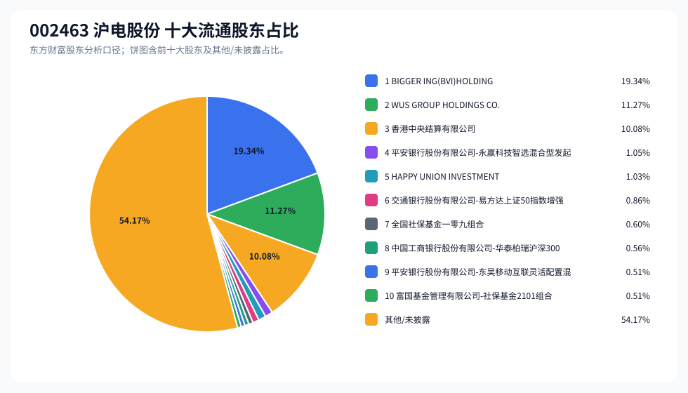
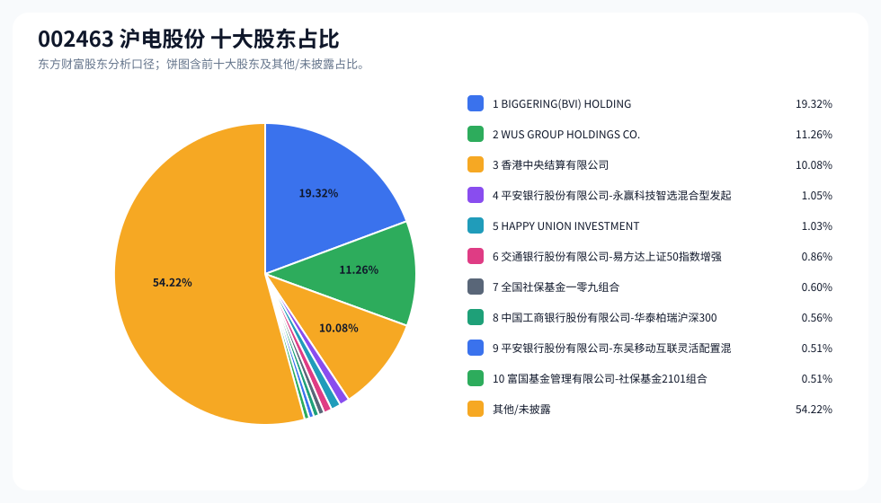
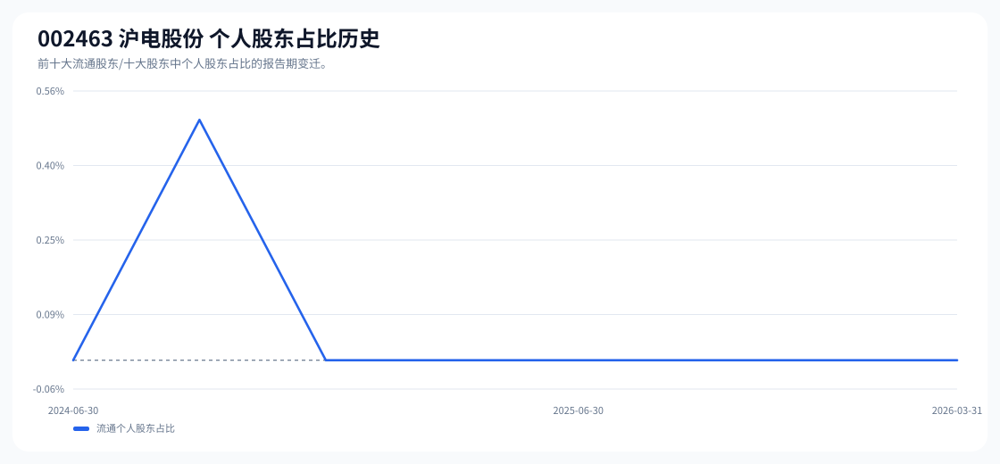

# 002463 沪电股份 股东成分报告

- 生成时间：2026-06-07T16:40:07
- 看涨排名：21；综合评分：21.462。
- ETF/指数线索：CSI_A50 / 159601 中证 A50ETF 华夏。
- 增长/交易机制标签：ETF 信号牵引;价格动量;流通股东集中;机构股东参与。
- 说明：本报告是股东结构研究工件，不构成投资建议。

## 1. 公司交易与 ETF 线索

|项目 | 数值|
|---|---:|
|行业/地区 | 元件 / 苏州市|
|最新价|133.22|
|成交额|130.32 亿|
|换手率|4.97%|
|5 日收益|0.89%|
|20 日收益|22.55%|
|20 日成交额放大倍数|1.26|
|主力净流入 | ()|

## 2. 股东结构快照

|项目 | 数值|
|---|---:|
|流通股东报告期|2026-03-31|
|前十大流通股东合计占流通股本|45.83%|
|其中机构类流通股东占比|45.83%|
|其中基金/社保/QFII 类占比|4.11%|
|前十大流通股东占比变化合计|2.06%|
|第一大流通股东|BIGGER ING(BVI)HOLDINGS CO.,LTD. / 其他 / 19.34%|
|十大股东报告期|2026-03-31|
|前十大股东合计占总股本|45.78%|
|其中机构类十大股东占比|45.78%|
|前十大股东占比变化合计|2.06%|
|第一大股东|BIGGERING(BVI) HOLDINGS CO., LTD. / 其他 / 19.32%|

## 3. 股东占比饼图

## 4. 历史股东变迁（个人股东重点）

|报告期 | 口径 | 前十大占比 | 个人股东数 | 个人股东占比 | 个人股东 | 机构占比 | 基金/社保/QFII 占比|
|---|---|---:|---:|---:|---|---:|---:|
|2026-03-31|流通股东|45.83%|0|0.00%||45.83%|4.11%|
|2025-12-31|流通股东|44.20%|0|0.00%||44.20%|5.11%|
|2025-09-30|流通股东|43.84%|0|0.00%||43.84%|4.89%|
|2025-06-30|流通股东|43.09%|0|0.00%||43.09%|4.79%|
|2025-03-31|流通股东|40.60%|0|0.00%||40.60%|3.83%|
|2024-12-31|流通股东|41.35%|0|0.00%||41.35%|4.35%|
|2024-09-30|流通股东|39.32%|1|0.50%|张琳|38.82%|1.95%|
|2024-06-30|流通股东|39.85%|0|0.00%||39.85%|2.91%|

### 个人股东逐期变化

|从 | 到|口径 | 个人股东 | 状态 | 上一期占比 | 本期占比 | 占比变化 | 上一期排名 | 本期排名|
|---|---|---|---|---|---:|---:|---:|---:|---:|
|2024-09-30|2024-12-31|流通 | 张琳 | 退出|0.50%||-0.50%|7||
|2024-06-30|2024-09-30|流通 | 张琳 | 新进||0.50%|0.50%||7|

## 5. 股东明细

### 十大流通股东

|排名 | 股东名称 | 类型 | 股份类型 | 持股数 | 占总股本 | 占流通股本 | 占比变化 | 方向 | 参考市值|
|---:|---|---|---|---:|---:|---:|---:|---|---:|
|1|BIGGER ING(BVI)HOLDINGS CO.,LTD.|其他|A 股|371799937|19.32%|19.34%|0.00%|不变|282.46 亿|
|2|WUS GROUP HOLDINGS CO.,LTD.|其他|A 股|216711023|11.26%|11.27%|0.00%|不变|164.64 亿|
|3|香港中央结算有限公司 | 其他|A 股|193881300|10.08%|10.08%|2.63%|增加|147.29 亿|
|4|平安银行股份有限公司 - 永赢科技智选混合型发起式证券投资基金 | 基金|A 股|20262438|1.05%|1.05%|0.08%|增加|15.39 亿|
|5|HAPPY UNION INVESTMENT LIMITED|其他|A 股|19811263|1.03%|1.03%|0.00%|不变|15.05 亿|
|6|交通银行股份有限公司 - 易方达上证 50 指数增强型证券投资基金 | 基金|A 股|16620895|0.86%|0.86%|-0.06%|减少|12.63 亿|
|7|全国社保基金一零九组合 | 社保|A 股|11580547|0.60%|0.60%|0.00%|不变|8.80 亿|
|8|中国工商银行股份有限公司 - 华泰柏瑞沪深 300 交易型开放式指数证券投资基金 | 基金|A 股|10831151|0.56%|0.56%|-0.59%|减少|8.23 亿|
|9|平安银行股份有限公司 - 东吴移动互联灵活配置混合型证券投资基金 | 基金|A 股|9900000|0.51%|0.51%||新进|7.52 亿|
|10|富国基金管理有限公司 - 社保基金 2101 组合 | 社保|A 股|9855294|0.51%|0.51%||新进|7.49 亿|

### 十大股东

|排名 | 股东名称 | 类型 | 股份类型 | 持股数 | 占总股本 | 占流通股本 | 占比变化 | 方向 | 参考市值|
|---:|---|---|---|---:|---:|---:|---:|---|---:|
|1|BIGGERING(BVI) HOLDINGS CO., LTD.|其他 | 流通 A 股|371799937|19.32%||0.00%|不变|282.46 亿|
|2|WUS GROUP HOLDINGS CO.,LTD.|其他 | 流通 A 股|216711023|11.26%||0.00%|不变|164.64 亿|
|3|香港中央结算有限公司 | 其他 | 流通 A 股|193881300|10.08%||2.64%|增持|147.29 亿|
|4|平安银行股份有限公司 - 永赢科技智选混合型发起式证券投资基金 | 基金 | 流通 A 股|20262438|1.05%||0.08%|增持|15.39 亿|
|5|HAPPY UNION INVESTMENT LIMITED|其他 | 流通 A 股|19811263|1.03%||0.00%|不变|15.05 亿|
|6|交通银行股份有限公司 - 易方达上证 50 指数增强型证券投资基金 | 基金 | 流通 A 股|16620895|0.86%||-0.06%|减持|12.63 亿|
|7|全国社保基金一零九组合 | 社保 | 流通 A 股|11580547|0.60%||0.00%|不变|8.80 亿|
|8|中国工商银行股份有限公司 - 华泰柏瑞沪深 300 交易型开放式指数证券投资基金 | 基金 | 流通 A 股|10831151|0.56%||-0.60%|减持|8.23 亿|
|9|平安银行股份有限公司 - 东吴移动互联灵活配置混合型证券投资基金 | 基金 | 流通 A 股|9900000|0.51%|||新进|7.52 亿|
|10|富国基金管理有限公司 - 社保基金 2101 组合 | 社保 | 流通 A 股|9855294|0.51%|||新进|7.49 亿|

## 6. 解读要点

- 若“成交额放大 + 高换手交易”同时出现，说明上涨背后有真实交易活跃度，但也可能伴随波动放大。
- 前十大流通股东占比越高，筹码越集中；机构/基金占比越高，越需要继续核对定期报告、基金持仓和是否存在被动指数持仓。
- 个人股东历史变迁重点看三类信号：连续增持、新进进入前十大、以及从前十大退出；个人股东占比变化越大，越需要核对公告和实际控制人/高管身份。
- 股东占比变化为增持/减持线索，需结合公告日、股价位置和成交额验证，不应单独作为买卖依据。

## 数据源

- 股东数据：https://datacenter-web.eastmoney.com/api/data/v1/get (RPT_F10_EH_FREEHOLDERS / RPT_DMSK_HOLDERS)
- 行情与 K 线：https://push2.eastmoney.com/api/qt/clist/get / https://push2his.eastmoney.com/api/qt/stock/kline/get
