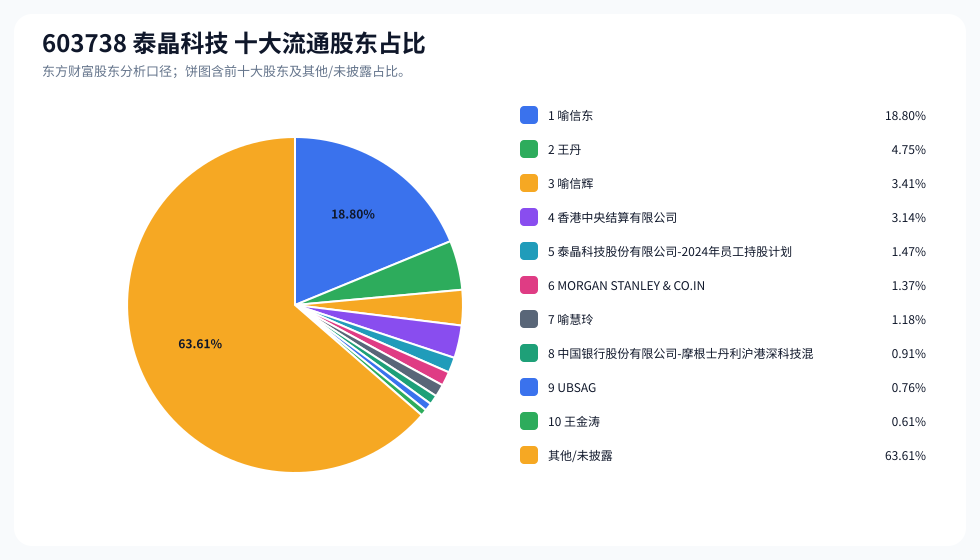
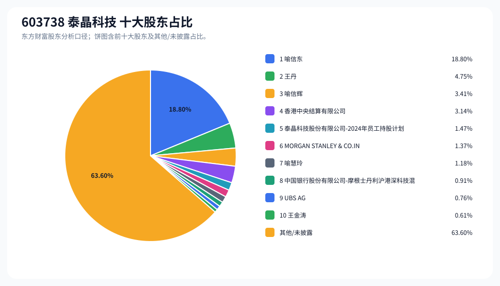
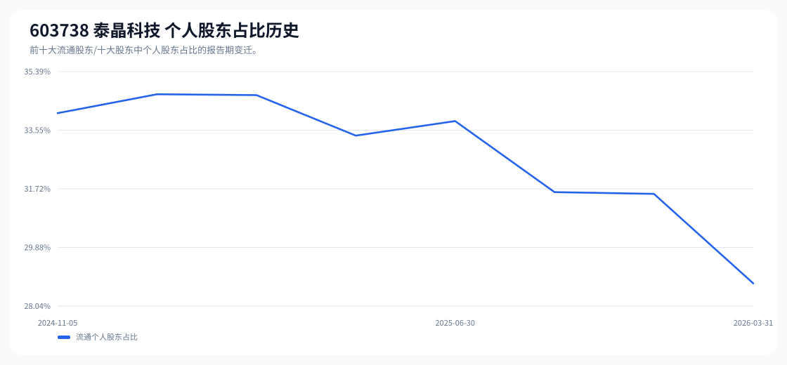

# 603738 泰晶科技 股东成分报告

- 生成时间：2026-06-07T16:32:44
- 看涨排名：22；综合评分：17.901。
- ETF/指数线索：CSI_2000 / 159531 中证2000ETF南方。
- 增长/交易机制标签：ETF信号牵引;高换手交易;流通股东集中。
- 说明：本报告是股东结构研究工件，不构成投资建议。

## 1. 公司交易与 ETF 线索

|项目|数值|
|---|---:|
|行业/地区|元件 / 随州市|
|最新价|44.49|
|成交额|15.81亿|
|换手率|9.11%|
|5日收益|2.46%|
|20日收益|-5.36%|
|20日成交额放大倍数|0.62|
|主力净流入| ()|

## 2. 股东结构快照

|项目|数值|
|---|---:|
|流通股东报告期|2026-03-31|
|前十大流通股东合计占流通股本|36.39%|
|其中机构类流通股东占比|7.64%|
|其中基金/社保/QFII 类占比|3.04%|
|前十大流通股东占比变化合计|2.02%|
|第一大流通股东|喻信东 / 个人 / 18.80%|
|十大股东报告期|2026-03-31|
|前十大股东合计占总股本|36.40%|
|其中机构类十大股东占比|7.65%|
|前十大股东占比变化合计|2.03%|
|第一大股东|喻信东 / 个人 / 18.80%|

## 3. 股东占比饼图

## 4. 历史股东变迁（个人股东重点）

|报告期|口径|前十大占比|个人股东数|个人股东占比|个人股东|机构占比|基金/社保/QFII占比|
|---|---|---:|---:|---:|---|---:|---:|
|2026-03-31|流通股东|36.39%|5|28.75%|喻信东、王丹、喻信辉、喻慧玲、王金涛|7.64%|3.04%|
|2025-12-31|流通股东|34.14%|8|31.56%|喻信东、王丹、喻信辉、徐进、喻慧玲、刘浩、王金涛、龚雯英|2.59%|0.00%|
|2025-09-30|流通股东|34.63%|8|31.61%|喻信东、王丹、喻信辉、徐进、喻慧玲、刘浩、王金涛、龚雯英|3.01%|0.00%|
|2025-06-30|流通股东|35.80%|9|33.84%|喻信东、王丹、喻信辉、徐进、王振海、喻慧玲、杜运志、王金涛、龚雯英|1.96%|0.00%|
|2025-03-31|流通股东|36.10%|8|33.38%|喻信东、王丹、喻信辉、徐进、王振海、喻慧玲、杜运志、王金涛|2.71%|0.00%|
|2024-12-31|流通股东|36.62%|9|34.65%|喻信东、王丹、喻信辉、徐进、王振海、喻慧玲、杜运志、勒伍超、勒孚仕|1.96%|0.00%|
|2024-11-15|流通股东|36.64%|9|34.68%|喻信东、王丹、喻信辉、徐进、王振海、喻慧玲、杜运志、勒孚仕、勒伍超|1.96%|0.00%|
|2024-11-05|流通股东|37.58%|8|34.09%|喻信东、王丹、喻信辉、徐进、王振海、喻慧玲、勒孚仕、勒伍超|3.50%|0.00%|

### 个人股东逐期变化

|从|到|口径|个人股东|状态|上一期占比|本期占比|占比变化|上一期排名|本期排名|
|---|---|---|---|---|---:|---:|---:|---:|---:|
|2025-12-31|2026-03-31|流通|徐进|退出|1.58%||-1.58%|5||
|2025-12-31|2026-03-31|流通|刘浩|退出|0.64%||-0.64%|7||
|2025-12-31|2026-03-31|流通|龚雯英|退出|0.59%||-0.59%|10||
|2025-12-31|2026-03-31|流通|喻信东|不变|18.80%|18.80%|0.00%|1|1|
|2025-12-31|2026-03-31|流通|喻信辉|不变|3.41%|3.41%|0.00%|3|3|
|2025-12-31|2026-03-31|流通|喻慧玲|不变|1.18%|1.18%|0.00%|6|7|
|2025-12-31|2026-03-31|流通|王丹|不变|4.75%|4.75%|0.00%|2|2|
|2025-12-31|2026-03-31|流通|王金涛|不变|0.61%|0.61%|0.00%|8|10|
|2025-09-30|2025-12-31|流通|徐进|减持|1.90%|1.58%|-0.32%|5|5|
|2025-09-30|2025-12-31|流通|喻信东|增持|18.64%|18.80%|0.17%|1|1|
|2025-09-30|2025-12-31|流通|王丹|增持|4.71%|4.75%|0.04%|2|2|
|2025-09-30|2025-12-31|流通|喻信辉|增持|3.38%|3.41%|0.03%|3|3|
|2025-09-30|2025-12-31|流通|喻慧玲|增持|1.17%|1.18%|0.01%|6|6|
|2025-09-30|2025-12-31|流通|刘浩|增持|0.63%|0.64%|0.01%|8|7|
|2025-09-30|2025-12-31|流通|王金涛|增持|0.60%|0.61%|0.01%|9|8|
|2025-09-30|2025-12-31|流通|龚雯英|增持|0.58%|0.59%|0.00%|10|10|
|2025-06-30|2025-09-30|流通|王振海|退出|1.27%||-1.27%|6||
|2025-06-30|2025-09-30|流通|杜运志|退出|0.87%||-0.87%|8||
|2025-06-30|2025-09-30|流通|徐进|减持|2.62%|1.90%|-0.72%|4|5|
|2025-06-30|2025-09-30|流通|刘浩|新进||0.63%|0.63%||8|
|2025-06-30|2025-09-30|流通|喻信东|不变|18.64%|18.64%|0.00%|1|1|
|2025-06-30|2025-09-30|流通|喻信辉|不变|3.38%|3.38%|0.00%|3|3|
|2025-06-30|2025-09-30|流通|喻慧玲|不变|1.17%|1.17%|0.00%|7|6|
|2025-06-30|2025-09-30|流通|王丹|不变|4.71%|4.71%|0.00%|2|2|

## 5. 股东明细

### 十大流通股东

|排名|股东名称|类型|股份类型|持股数|占总股本|占流通股本|占比变化|方向|参考市值|
|---:|---|---|---|---:|---:|---:|---:|---|---:|
|1|喻信东|个人|A股|72565200|18.80%|18.80%|0.00%|不变|18.81亿|
|2|王丹|个人|A股|18318646|4.75%|4.75%|0.00%|不变|4.75亿|
|3|喻信辉|个人|A股|13155940|3.41%|3.41%|0.00%|不变|3.41亿|
|4|香港中央结算有限公司|其他|A股|12099843|3.14%|3.14%|2.53%|增加|3.14亿|
|5|泰晶科技股份有限公司-2024年员工持股计划|其他|A股|5666240|1.47%|1.47%|-0.51%|减少|1.47亿|
|6|MORGAN STANLEY & CO.INTERNATIONAL PLC.|QFII|A股|5282438|1.37%|1.37%||新进|1.37亿|
|7|喻慧玲|个人|A股|4566800|1.18%|1.18%|0.00%|不变|1.18亿|
|8|中国银行股份有限公司-摩根士丹利沪港深科技混合型证券投资基金|基金|A股|3498920|0.91%|0.91%||新进|9069.20万|
|9|UBSAG|QFII|A股|2934295|0.76%|0.76%||新进|7605.69万|
|10|王金涛|个人|A股|2353365|0.61%|0.61%|0.00%|不变|6099.92万|

### 十大股东

|排名|股东名称|类型|股份类型|持股数|占总股本|占流通股本|占比变化|方向|参考市值|
|---:|---|---|---|---:|---:|---:|---:|---|---:|
|1|喻信东|个人|流通A股|72565200|18.80%||0.00%|不变|18.81亿|
|2|王丹|个人|流通A股|18318646|4.75%||0.00%|不变|4.75亿|
|3|喻信辉|个人|流通A股|13155940|3.41%||0.00%|不变|3.41亿|
|4|香港中央结算有限公司|其他|流通A股|12099843|3.14%||2.54%|增持|3.14亿|
|5|泰晶科技股份有限公司-2024年员工持股计划|其他|流通A股|5666240|1.47%||-0.51%|减持|1.47亿|
|6|MORGAN STANLEY & CO.INTERNATIONAL PLC.|QFII|流通A股|5282438|1.37%|||新进|1.37亿|
|7|喻慧玲|个人|流通A股|4566800|1.18%||0.00%|不变|1.18亿|
|8|中国银行股份有限公司-摩根士丹利沪港深科技混合型证券投资基金|基金|流通A股|3498920|0.91%|||新进|9069.20万|
|9|UBS AG|QFII|流通A股|2934295|0.76%|||新进|7605.69万|
|10|王金涛|个人|流通A股|2353365|0.61%||0.00%|不变|6099.92万|

## 6. 解读要点

- 若“成交额放大 + 高换手交易”同时出现，说明上涨背后有真实交易活跃度，但也可能伴随波动放大。
- 前十大流通股东占比越高，筹码越集中；机构/基金占比越高，越需要继续核对定期报告、基金持仓和是否存在被动指数持仓。
- 个人股东历史变迁重点看三类信号：连续增持、新进进入前十大、以及从前十大退出；个人股东占比变化越大，越需要核对公告和实际控制人/高管身份。
- 股东占比变化为增持/减持线索，需结合公告日、股价位置和成交额验证，不应单独作为买卖依据。

## 数据源

- 股东数据：https://datacenter-web.eastmoney.com/api/data/v1/get (RPT_F10_EH_FREEHOLDERS / RPT_DMSK_HOLDERS)
- 行情与 K 线：https://push2.eastmoney.com/api/qt/clist/get / https://push2his.eastmoney.com/api/qt/stock/kline/get
