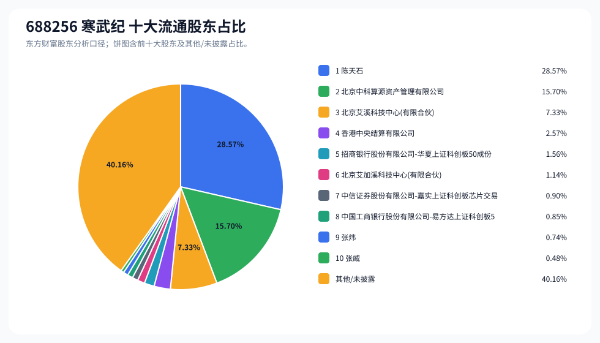
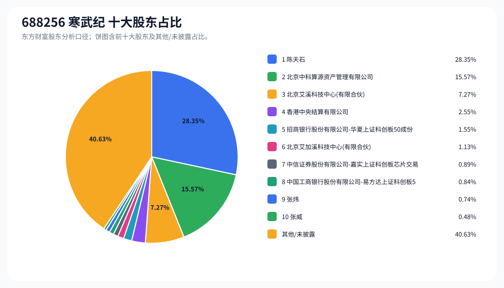
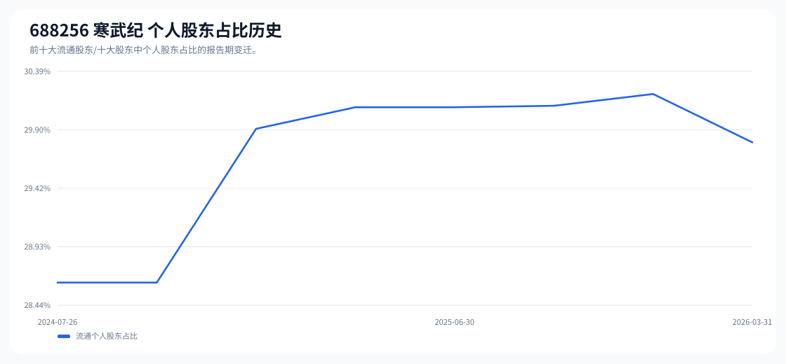

# 688256 寒武纪 股东成分报告

- 生成时间：2026-06-07T16:32:44
- 看涨排名：23；综合评分：17.069。
- ETF/指数线索：CSI_300;CSI_800;CSI_A100;CSI_A500 / 510310;159800;159627;159352 沪深300ETF易方达;中证800ETF鹏华;中证A100ETF华夏;中证A500ETF。
- 增长/交易机制标签：ETF信号牵引;流通股东集中;机构股东参与。
- 说明：本报告是股东结构研究工件，不构成投资建议。

## 1. 公司交易与 ETF 线索

|项目|数值|
|---|---:|
|行业/地区|半导体 / 北京市|
|最新价|1299.20|
|成交额|156.21亿|
|换手率|1.85%|
|5日收益|-0.82%|
|20日收益|9.87%|
|20日成交额放大倍数|0.75|
|主力净流入| ()|

## 2. 股东结构快照

|项目|数值|
|---|---:|
|流通股东报告期|2026-03-31|
|前十大流通股东合计占流通股本|59.84%|
|其中机构类流通股东占比|30.04%|
|其中基金/社保/QFII 类占比|3.30%|
|前十大流通股东占比变化合计|-0.65%|
|第一大流通股东|陈天石 / 个人 / 28.57%|
|十大股东报告期|2026-03-31|
|前十大股东合计占总股本|59.37%|
|其中机构类十大股东占比|29.80%|
|前十大股东占比变化合计|-0.65%|
|第一大股东|陈天石 / 个人 / 28.35%|

## 3. 股东占比饼图

## 4. 历史股东变迁（个人股东重点）

|报告期|口径|前十大占比|个人股东数|个人股东占比|个人股东|机构占比|基金/社保/QFII占比|
|---|---|---:|---:|---:|---|---:|---:|
|2026-03-31|流通股东|59.84%|3|29.80%|陈天石、张炜、张威|30.04%|3.30%|
|2025-12-31|流通股东|61.76%|2|30.20%|陈天石、章建平|31.56%|4.23%|
|2025-09-30|流通股东|61.62%|2|30.10%|陈天石、章建平|31.52%|4.41%|
|2025-06-30|流通股东|65.04%|2|30.09%|陈天石、章建平|34.95%|6.83%|
|2025-03-31|流通股东|64.50%|2|30.09%|陈天石、章建平|34.41%|6.35%|
|2024-12-31|流通股东|64.07%|2|29.91%|陈天石、章建平|34.16%|7.31%|
|2024-09-30|流通股东|64.82%|1|28.63%|陈天石|36.19%|9.28%|
|2024-07-26|流通股东|64.38%|1|28.63%|陈天石|35.75%|8.47%|

### 个人股东逐期变化

|从|到|口径|个人股东|状态|上一期占比|本期占比|占比变化|上一期排名|本期排名|
|---|---|---|---|---|---:|---:|---:|---:|---:|
|2025-12-31|2026-03-31|流通|章建平|退出|1.63%||-1.63%|5||
|2025-12-31|2026-03-31|流通|张炜|新进||0.74%|0.74%||9|
|2025-12-31|2026-03-31|流通|张威|新进||0.48%|0.48%||10|
|2025-12-31|2026-03-31|流通|陈天石|不变|28.57%|28.57%|0.00%|1|1|
|2025-09-30|2025-12-31|流通|章建平|增持|1.53%|1.63%|0.10%|5|5|
|2025-09-30|2025-12-31|流通|陈天石|不变|28.57%|28.57%|0.00%|1|1|
|2025-06-30|2025-09-30|流通|章建平|增持|1.46%|1.53%|0.07%|7|5|
|2025-06-30|2025-09-30|流通|陈天石|减持|28.63%|28.57%|-0.06%|1|1|
|2025-03-31|2025-06-30|流通|章建平|不变|1.46%|1.46%|0.00%|7|7|
|2025-03-31|2025-06-30|流通|陈天石|不变|28.63%|28.63%|0.00%|1|1|
|2024-12-31|2025-03-31|流通|章建平|增持|1.28%|1.46%|0.18%|8|7|
|2024-12-31|2025-03-31|流通|陈天石|不变|28.63%|28.63%|0.00%|1|1|
|2024-09-30|2024-12-31|流通|章建平|新进||1.28%|1.28%||8|
|2024-09-30|2024-12-31|流通|陈天石|不变|28.63%|28.63%|0.00%|1|1|
|2024-07-26|2024-09-30|流通|陈天石|不变|28.63%|28.63%|0.00%|1|1|

## 5. 股东明细

### 十大流通股东

|排名|股东名称|类型|股份类型|持股数|占总股本|占流通股本|占比变化|方向|参考市值|
|---:|---|---|---|---:|---:|---:|---:|---|---:|
|1|陈天石|个人|A股|119530650|28.35%|28.57%|0.00%|不变|1174.99亿|
|2|北京中科算源资产管理有限公司|其他|A股|65669721|15.57%|15.70%|0.00%|不变|645.53亿|
|3|北京艾溪科技中心(有限合伙)|其他|A股|30645870|7.27%|7.33%|0.00%|不变|301.25亿|
|4|香港中央结算有限公司|其他|A股|10737708|2.55%|2.57%|-0.58%|减少|105.55亿|
|5|招商银行股份有限公司-华夏上证科创板50成份交易型开放式指数证券投资基金|基金|A股|6527594|1.55%|1.56%|0.28%|增加|64.17亿|
|6|北京艾加溪科技中心(有限合伙)|其他|A股|4784098|1.13%|1.14%|-0.01%|减少|47.03亿|
|7|中信证券股份有限公司-嘉实上证科创板芯片交易型开放式指数证券投资基金|基金|A股|3755189|0.89%|0.90%||新进|36.91亿|
|8|中国工商银行股份有限公司-易方达上证科创板50成份交易型开放式指数证券投资基金|基金|A股|3539280|0.84%|0.85%|-0.34%|减少|34.79亿|
|9|张炜|个人|A股|3106340|0.74%|0.74%||新进|30.54亿|
|10|张威|个人|A股|2025598|0.48%|0.48%||新进|19.91亿|

### 十大股东

|排名|股东名称|类型|股份类型|持股数|占总股本|占流通股本|占比变化|方向|参考市值|
|---:|---|---|---|---:|---:|---:|---:|---|---:|
|1|陈天石|个人|流通A股|119530650|28.35%||0.00%|不变|1174.99亿|
|2|北京中科算源资产管理有限公司|其他|流通A股|65669721|15.57%||0.00%|不变|645.53亿|
|3|北京艾溪科技中心(有限合伙)|其他|流通A股|30645870|7.27%||0.00%|不变|301.25亿|
|4|香港中央结算有限公司|其他|流通A股|10737708|2.55%||-0.57%|减持|105.55亿|
|5|招商银行股份有限公司-华夏上证科创板50成份交易型开放式指数证券投资基金|基金|流通A股|6527594|1.55%||0.28%|增持|64.17亿|
|6|北京艾加溪科技中心(有限合伙)|其他|流通A股|4784098|1.13%||-0.02%|减持|47.03亿|
|7|中信证券股份有限公司-嘉实上证科创板芯片交易型开放式指数证券投资基金|基金|流通A股|3755189|0.89%|||新进|36.91亿|
|8|中国工商银行股份有限公司-易方达上证科创板50成份交易型开放式指数证券投资基金|基金|流通A股,限售流通A股|3556906|0.84%||-0.34%|减持|34.96亿|
|9|张炜|个人|流通A股|3106340|0.74%|||新进|30.54亿|
|10|张威|个人|流通A股|2025598|0.48%|||新进|19.91亿|

## 6. 解读要点

- 若“成交额放大 + 高换手交易”同时出现，说明上涨背后有真实交易活跃度，但也可能伴随波动放大。
- 前十大流通股东占比越高，筹码越集中；机构/基金占比越高，越需要继续核对定期报告、基金持仓和是否存在被动指数持仓。
- 个人股东历史变迁重点看三类信号：连续增持、新进进入前十大、以及从前十大退出；个人股东占比变化越大，越需要核对公告和实际控制人/高管身份。
- 股东占比变化为增持/减持线索，需结合公告日、股价位置和成交额验证，不应单独作为买卖依据。

## 数据源

- 股东数据：https://datacenter-web.eastmoney.com/api/data/v1/get (RPT_F10_EH_FREEHOLDERS / RPT_DMSK_HOLDERS)
- 行情与 K 线：https://push2.eastmoney.com/api/qt/clist/get / https://push2his.eastmoney.com/api/qt/stock/kline/get
