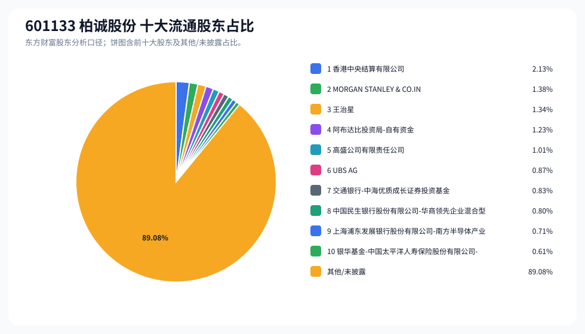
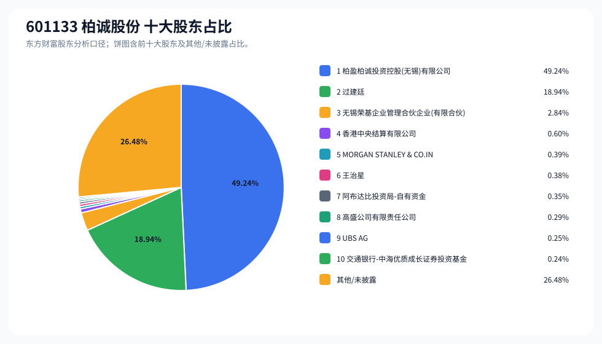
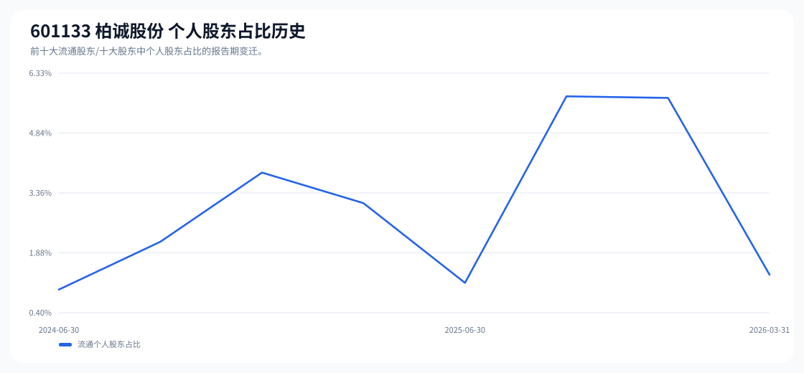

# 601133 柏诚股份 股东成分报告

- 生成时间：2026-06-07T16:40:07
- 看涨排名：24；综合评分：16.581。
- ETF/指数线索：CSI_2000 / 159531 中证2000ETF南方。
- 增长/交易机制标签：ETF信号牵引;价格动量。
- 说明：本报告是股东结构研究工件，不构成投资建议。

## 1. 公司交易与 ETF 线索

|项目|数值|
|---|---:|
|行业/地区|专业工程 / 无锡市|
|最新价|27.60|
|成交额|5.81亿|
|换手率|3.97%|
|5日收益|3.88%|
|20日收益|7.48%|
|20日成交额放大倍数|0.68|
|主力净流入| ()|

## 2. 股东结构快照

|项目|数值|
|---|---:|
|流通股东报告期|2026-03-31|
|前十大流通股东合计占流通股本|10.92%|
|其中机构类流通股东占比|9.58%|
|其中基金/社保/QFII 类占比|7.45%|
|前十大流通股东占比变化合计|0.44%|
|第一大流通股东|香港中央结算有限公司 / 其他 / 2.13%|
|十大股东报告期|2026-03-31|
|前十大股东合计占总股本|73.52%|
|其中机构类十大股东占比|54.20%|
|前十大股东占比变化合计|0.44%|
|第一大股东|柏盈柏诚投资控股(无锡)有限公司 / 其他 / 49.24%|

## 3. 股东占比饼图

## 4. 历史股东变迁（个人股东重点）

|报告期|口径|前十大占比|个人股东数|个人股东占比|个人股东|机构占比|基金/社保/QFII占比|
|---|---|---:|---:|---:|---|---:|---:|
|2026-03-31|流通股东|10.92%|1|1.34%|王治星|9.58%|7.45%|
|2025-12-31|流通股东|8.93%|8|5.71%|王治星、徐刚、王强、沈亚芬、许琨、洪跃彬、陈建伟、肖飞燕|3.22%|0.00%|
|2025-09-30|流通股东|10.01%|7|5.75%|王治星、刘宏伟、王强、陈建伟、许琨、卢建明、沈亚芬|4.26%|0.44%|
|2025-06-30|流通股东|7.88%|2|1.14%|黄杰、黄建春|6.74%|2.09%|
|2025-03-31|流通股东|7.53%|6|3.11%|王治星、洪跃彬、陈卫星、吴丽莉、徐军、陈建伟|4.42%|0.84%|
|2024-12-31|流通股东|9.16%|6|3.87%|刘浩、王治星、符永涛、孙瑜、徐军、吴丽莉|5.29%|0.54%|
|2024-09-30|流通股东|11.79%|5|2.16%|王治星、刘浩、李之毅、胡伟、吴丽莉|9.63%|1.48%|
|2024-06-30|流通股东|13.17%|2|0.97%|王治星、管爱民|12.20%|2.28%|

### 个人股东逐期变化

|从|到|口径|个人股东|状态|上一期占比|本期占比|占比变化|上一期排名|本期排名|
|---|---|---|---|---|---:|---:|---:|---:|---:|
|2025-12-31|2026-03-31|流通|徐刚|退出|1.04%||-1.04%|3||
|2025-12-31|2026-03-31|流通|王强|退出|0.95%||-0.95%|4||
|2025-12-31|2026-03-31|流通|沈亚芬|退出|0.71%||-0.71%|6||
|2025-12-31|2026-03-31|流通|许琨|退出|0.62%||-0.62%|7||
|2025-12-31|2026-03-31|流通|洪跃彬|退出|0.51%||-0.51%|8||
|2025-12-31|2026-03-31|流通|陈建伟|退出|0.37%||-0.37%|9||
|2025-12-31|2026-03-31|流通|肖飞燕|退出|0.34%||-0.34%|10||
|2025-12-31|2026-03-31|流通|王治星|增持|1.17%|1.34%|0.17%|2|3|
|2025-09-30|2025-12-31|流通|刘宏伟|退出|1.06%||-1.06%|3||
|2025-09-30|2025-12-31|流通|徐刚|新进||1.04%|1.04%||3|
|2025-09-30|2025-12-31|流通|卢建明|退出|0.68%||-0.68%|8||
|2025-09-30|2025-12-31|流通|洪跃彬|新进||0.51%|0.51%||8|
|2025-09-30|2025-12-31|流通|肖飞燕|新进||0.34%|0.34%||10|
|2025-09-30|2025-12-31|流通|陈建伟|减持|0.69%|0.37%|-0.32%|6|9|
|2025-09-30|2025-12-31|流通|沈亚芬|增持|0.52%|0.71%|0.19%|9|6|
|2025-09-30|2025-12-31|流通|王治星|减持|1.33%|1.17%|-0.16%|2|2|
|2025-09-30|2025-12-31|流通|王强|增持|0.78%|0.95%|0.16%|5|4|
|2025-09-30|2025-12-31|流通|许琨|减持|0.68%|0.62%|-0.06%|7|7|
|2025-06-30|2025-09-30|流通|王治星|新进||1.33%|1.33%||2|
|2025-06-30|2025-09-30|流通|刘宏伟|新进||1.06%|1.06%||3|
|2025-06-30|2025-09-30|流通|黄杰|退出|0.79%||-0.79%|3||
|2025-06-30|2025-09-30|流通|王强|新进||0.78%|0.78%||5|
|2025-06-30|2025-09-30|流通|陈建伟|新进||0.69%|0.69%||6|
|2025-06-30|2025-09-30|流通|许琨|新进||0.68%|0.68%||7|

## 5. 股东明细

### 十大流通股东

|排名|股东名称|类型|股份类型|持股数|占总股本|占流通股本|占比变化|方向|参考市值|
|---:|---|---|---|---:|---:|---:|---:|---|---:|
|1|香港中央结算有限公司|其他|A股|3175527|0.60%|2.13%|0.39%|增加|5442.85万|
|2|MORGAN STANLEY & CO.INTERNATIONAL PLC.|QFII|A股|2064881|0.39%|1.38%||新进|3539.21万|
|3|王治星|个人|A股|1999034|0.38%|1.34%|0.05%|增加|3426.34万|
|4|阿布达比投资局-自有资金|QFII|A股|1843000|0.35%|1.23%||新进|3158.90万|
|5|高盛公司有限责任公司|QFII|A股|1507129|0.29%|1.01%||新进|2583.22万|
|6|UBS AG|QFII|A股|1301147|0.25%|0.87%||新进|2230.17万|
|7|交通银行-中海优质成长证券投资基金|基金|A股|1246900|0.24%|0.83%||新进|2137.19万|
|8|中国民生银行股份有限公司-华商领先企业混合型证券投资基金|基金|A股|1195600|0.23%|0.80%||新进|2049.26万|
|9|上海浦东发展银行股份有限公司-南方半导体产业股票型发起式证券投资基金|基金|A股|1058600|0.20%|0.71%||新进|1814.44万|
|10|银华基金-中国太平洋人寿保险股份有限公司-分红险-银华基金中国太平洋人寿股票相对(保额分红)单一资产管理计划|其他|A股|917600|0.17%|0.61%||新进|1572.77万|

### 十大股东

|排名|股东名称|类型|股份类型|持股数|占总股本|占流通股本|占比变化|方向|参考市值|
|---:|---|---|---|---:|---:|---:|---:|---|---:|
|1|柏盈柏诚投资控股(无锡)有限公司|其他|限售流通A股|260000000|49.24%||0.00%|不变|44.56亿|
|2|过建廷|个人|限售流通A股|100000000|18.94%||0.00%|不变|17.14亿|
|3|无锡荣基企业管理合伙企业(有限合伙)|其他|限售流通A股|15000000|2.84%||0.00%|不变|2.57亿|
|4|香港中央结算有限公司|其他|流通A股|3175527|0.60%||0.39%|增持|5442.85万|
|5|MORGAN STANLEY & CO.INTERNATIONAL PLC.|QFII|流通A股|2064881|0.39%|||新进|3539.21万|
|6|王治星|个人|流通A股|1999034|0.38%||0.05%|增持|3426.34万|
|7|阿布达比投资局-自有资金|QFII|流通A股|1843000|0.35%|||新进|3158.90万|
|8|高盛公司有限责任公司|QFII|流通A股|1507129|0.29%|||新进|2583.22万|
|9|UBS AG|QFII|流通A股|1301147|0.25%|||新进|2230.17万|
|10|交通银行-中海优质成长证券投资基金|基金|流通A股|1246900|0.24%|||新进|2137.19万|

## 6. 解读要点

- 若“成交额放大 + 高换手交易”同时出现，说明上涨背后有真实交易活跃度，但也可能伴随波动放大。
- 前十大流通股东占比越高，筹码越集中；机构/基金占比越高，越需要继续核对定期报告、基金持仓和是否存在被动指数持仓。
- 个人股东历史变迁重点看三类信号：连续增持、新进进入前十大、以及从前十大退出；个人股东占比变化越大，越需要核对公告和实际控制人/高管身份。
- 股东占比变化为增持/减持线索，需结合公告日、股价位置和成交额验证，不应单独作为买卖依据。

## 数据源

- 股东数据：https://datacenter-web.eastmoney.com/api/data/v1/get (RPT_F10_EH_FREEHOLDERS / RPT_DMSK_HOLDERS)
- 行情与 K 线：https://push2.eastmoney.com/api/qt/clist/get / https://push2his.eastmoney.com/api/qt/stock/kline/get
