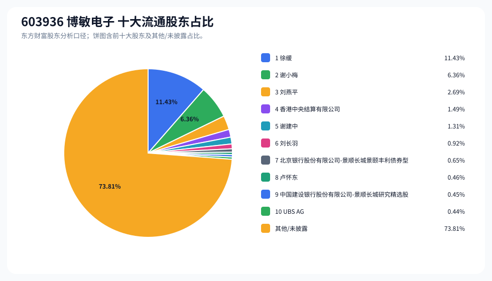
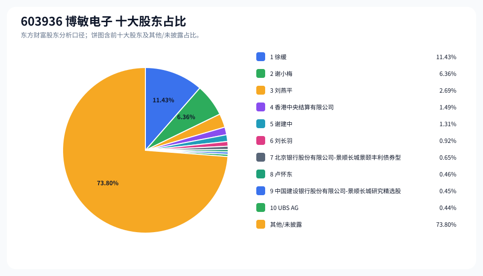
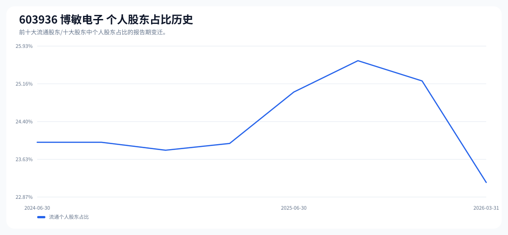

# 603936 博敏电子 股东成分报告

- 生成时间：2026-06-07T16:34:50
- 看涨排名：25；综合评分：15.677。
- ETF/指数线索：CSI_2000 / 159531 中证2000ETF南方。
- 增长/交易机制标签：ETF信号牵引;高换手交易。
- 说明：本报告是股东结构研究工件，不构成投资建议。

## 1. 公司交易与 ETF 线索

|项目|数值|
|---|---:|
|行业/地区|元件 / 梅州市|
|最新价|21.44|
|成交额|11.59亿|
|换手率|8.49%|
|5日收益|-10.59%|
|20日收益|16.65%|
|20日成交额放大倍数|0.69|
|主力净流入| ()|

## 2. 股东结构快照

|项目|数值|
|---|---:|
|流通股东报告期|2026-03-31|
|前十大流通股东合计占流通股本|26.19%|
|其中机构类流通股东占比|3.02%|
|其中基金/社保/QFII 类占比|1.54%|
|前十大流通股东占比变化合计|-0.44%|
|第一大流通股东|徐缓 / 个人 / 11.43%|
|十大股东报告期|2026-03-31|
|前十大股东合计占总股本|26.20%|
|其中机构类十大股东占比|3.03%|
|前十大股东占比变化合计|-0.43%|
|第一大股东|徐缓 / 个人 / 11.43%|

## 3. 股东占比饼图

## 4. 历史股东变迁（个人股东重点）

|报告期|口径|前十大占比|个人股东数|个人股东占比|个人股东|机构占比|基金/社保/QFII占比|
|---|---|---:|---:|---:|---|---:|---:|
|2026-03-31|流通股东|26.19%|6|23.16%|徐缓、谢小梅、刘燕平、谢建中、刘长羽、卢怀东|3.02%|1.54%|
|2025-12-31|流通股东|26.03%|9|25.22%|徐缓、谢小梅、刘燕平、刘长羽、谢建中、卢怀东、陶玉华、高焰、唐建玲|0.81%|0.00%|
|2025-09-30|流通股东|27.30%|9|25.63%|徐缓、谢小梅、刘燕平、谢建中、刘长羽、李志辉、卢怀东、陶玉华、黄开君|1.67%|0.00%|
|2025-06-30|流通股东|26.69%|7|24.99%|徐缓、谢小梅、谢建中、刘燕平、季严海、朱荃华、严丽丽|1.69%|0.40%|
|2025-03-31|流通股东|27.56%|6|23.95%|徐缓、谢小梅、谢建中、刘燕平、严丽丽、陶玉华|3.61%|0.40%|
|2024-12-31|流通股东|27.94%|6|23.82%|徐缓、谢小梅、谢建中、刘燕平、唐宪峰、陶玉华|4.13%|0.40%|
|2024-09-30|流通股东|29.28%|6|23.98%|徐缓、谢小梅、谢建中、刘燕平、唐宪峰、沈欣欣|5.31%|0.93%|
|2024-06-30|流通股东|28.88%|6|23.98%|徐缓、谢小梅、谢建中、刘燕平、唐宪峰、沈欣欣|4.91%|0.57%|

### 个人股东逐期变化

|从|到|口径|个人股东|状态|上一期占比|本期占比|占比变化|上一期排名|本期排名|
|---|---|---|---|---|---:|---:|---:|---:|---:|
|2025-12-31|2026-03-31|流通|刘长羽|减持|1.81%|0.92%|-0.89%|4|6|
|2025-12-31|2026-03-31|流通|陶玉华|退出|0.39%||-0.39%|8||
|2025-12-31|2026-03-31|流通|高焰|退出|0.28%||-0.28%|9||
|2025-12-31|2026-03-31|流通|谢建中|减持|1.58%|1.31%|-0.27%|5|5|
|2025-12-31|2026-03-31|流通|唐建玲|退出|0.27%||-0.27%|10||
|2025-12-31|2026-03-31|流通|卢怀东|增持|0.41%|0.46%|0.04%|7|8|
|2025-12-31|2026-03-31|流通|刘燕平|不变|2.69%|2.69%|0.00%|3|3|
|2025-12-31|2026-03-31|流通|徐缓|不变|11.43%|11.43%|0.00%|1|1|
|2025-12-31|2026-03-31|流通|谢小梅|不变|6.36%|6.36%|0.00%|2|2|
|2025-09-30|2025-12-31|流通|谢建中|减持|2.31%|1.58%|-0.73%|4|5|
|2025-09-30|2025-12-31|流通|刘长羽|增持|1.18%|1.81%|0.63%|6|4|
|2025-09-30|2025-12-31|流通|李志辉|退出|0.48%||-0.48%|7||
|2025-09-30|2025-12-31|流通|黄开君|退出|0.39%||-0.39%|10||
|2025-09-30|2025-12-31|流通|高焰|新进||0.28%|0.28%||9|
|2025-09-30|2025-12-31|流通|唐建玲|新进||0.27%|0.27%||10|
|2025-09-30|2025-12-31|流通|卢怀东|增持|0.40%|0.41%|0.01%|8|7|
|2025-09-30|2025-12-31|流通|陶玉华|减持|0.40%|0.39%|-0.00%|9|8|
|2025-09-30|2025-12-31|流通|刘燕平|不变|2.69%|2.69%|0.00%|3|3|
|2025-09-30|2025-12-31|流通|徐缓|不变|11.43%|11.43%|0.00%|1|1|
|2025-09-30|2025-12-31|流通|谢小梅|不变|6.36%|6.36%|0.00%|2|2|
|2025-06-30|2025-09-30|流通|刘长羽|新进||1.18%|1.18%||6|
|2025-06-30|2025-09-30|流通|季严海|退出|0.79%||-0.79%|5||
|2025-06-30|2025-09-30|流通|朱荃华|退出|0.60%||-0.60%|8||
|2025-06-30|2025-09-30|流通|李志辉|新进||0.48%|0.48%||7|

## 5. 股东明细

### 十大流通股东

|排名|股东名称|类型|股份类型|持股数|占总股本|占流通股本|占比变化|方向|参考市值|
|---:|---|---|---|---:|---:|---:|---:|---|---:|
|1|徐缓|个人|A股|72041919|11.43%|11.43%|0.00%|不变|9.13亿|
|2|谢小梅|个人|A股|40064480|6.36%|6.36%|0.00%|不变|5.08亿|
|3|刘燕平|个人|A股|16960252|2.69%|2.69%|0.00%|不变|2.15亿|
|4|香港中央结算有限公司|其他|A股|9384607|1.49%|1.49%|0.68%|增加|1.19亿|
|5|谢建中|个人|A股|8259660|1.31%|1.31%|-0.27%|减少|1.05亿|
|6|刘长羽|个人|A股|5808200|0.92%|0.92%|-0.89%|减少|7358.99万|
|7|北京银行股份有限公司-景顺长城景颐丰利债券型证券投资基金|基金|A股|4074384|0.65%|0.65%||新进|5162.24万|
|8|卢怀东|个人|A股|2877636|0.46%|0.46%|0.04%|增加|3645.96万|
|9|中国建设银行股份有限公司-景顺长城研究精选股票型证券投资基金|基金|A股|2830300|0.45%|0.45%||新进|3585.99万|
|10|UBS AG|QFII|A股|2775987|0.44%|0.44%||新进|3517.18万|

### 十大股东

|排名|股东名称|类型|股份类型|持股数|占总股本|占流通股本|占比变化|方向|参考市值|
|---:|---|---|---|---:|---:|---:|---:|---|---:|
|1|徐缓|个人|流通A股|72041919|11.43%||0.00%|不变|9.13亿|
|2|谢小梅|个人|流通A股|40064480|6.36%||0.00%|不变|5.08亿|
|3|刘燕平|个人|流通A股|16960252|2.69%||0.00%|不变|2.15亿|
|4|香港中央结算有限公司|其他|流通A股|9384607|1.49%||0.68%|增持|1.19亿|
|5|谢建中|个人|流通A股|8259660|1.31%||-0.27%|减持|1.05亿|
|6|刘长羽|个人|流通A股|5808200|0.92%||-0.89%|减持|7358.99万|
|7|北京银行股份有限公司-景顺长城景颐丰利债券型证券投资基金|基金|流通A股|4074384|0.65%|||新进|5162.24万|
|8|卢怀东|个人|流通A股|2877636|0.46%||0.05%|增持|3645.96万|
|9|中国建设银行股份有限公司-景顺长城研究精选股票型证券投资基金|基金|流通A股|2830300|0.45%|||新进|3585.99万|
|10|UBS AG|QFII|流通A股|2775987|0.44%|||新进|3517.18万|

## 6. 解读要点

- 若“成交额放大 + 高换手交易”同时出现，说明上涨背后有真实交易活跃度，但也可能伴随波动放大。
- 前十大流通股东占比越高，筹码越集中；机构/基金占比越高，越需要继续核对定期报告、基金持仓和是否存在被动指数持仓。
- 个人股东历史变迁重点看三类信号：连续增持、新进进入前十大、以及从前十大退出；个人股东占比变化越大，越需要核对公告和实际控制人/高管身份。
- 股东占比变化为增持/减持线索，需结合公告日、股价位置和成交额验证，不应单独作为买卖依据。

## 数据源

- 股东数据：https://datacenter-web.eastmoney.com/api/data/v1/get (RPT_F10_EH_FREEHOLDERS / RPT_DMSK_HOLDERS)
- 行情与 K 线：https://push2.eastmoney.com/api/qt/clist/get / https://push2his.eastmoney.com/api/qt/stock/kline/get
