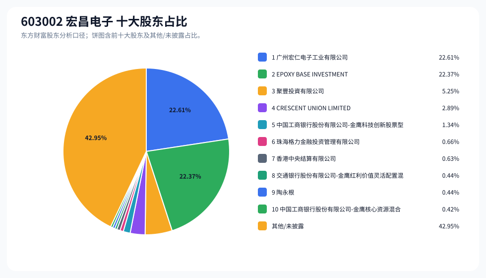
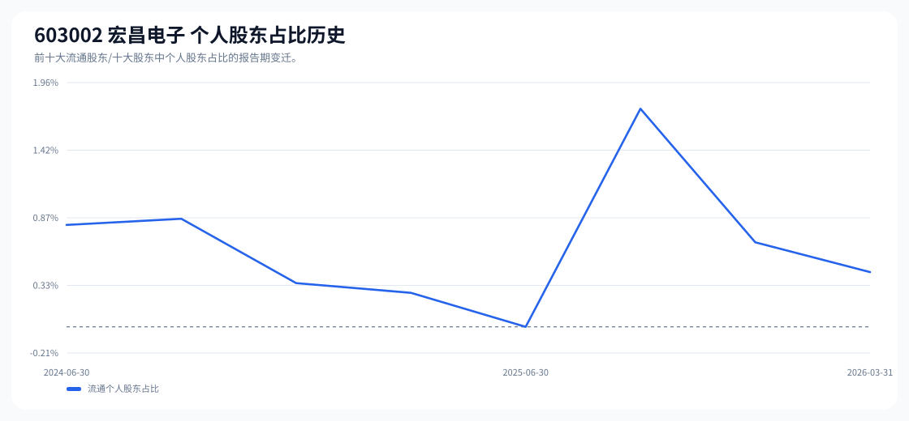

# 603002 宏昌电子 股东成分报告

- 生成时间：2026-06-07T16:34:50
- 看涨排名：26；综合评分：15.487。
- ETF/指数线索：CSI_2000 / 159531 中证2000ETF南方。
- 增长/交易机制标签：ETF信号牵引;价格动量;高换手交易;流通股东集中;机构股东参与。
- 说明：本报告是股东结构研究工件，不构成投资建议。

## 1. 公司交易与 ETF 线索

|项目|数值|
|---|---:|
|行业/地区|电子化学品Ⅱ / 广州市|
|最新价|16.75|
|成交额|10.30亿|
|换手率|5.30%|
|5日收益|1.03%|
|20日收益|9.33%|
|20日成交额放大倍数|0.69|
|主力净流入| ()|

## 2. 股东结构快照

|项目|数值|
|---|---:|
|流通股东报告期|2026-03-31|
|前十大流通股东合计占流通股本|57.05%|
|其中机构类流通股东占比|56.61%|
|其中基金/社保/QFII 类占比|2.20%|
|前十大流通股东占比变化合计|0.35%|
|第一大流通股东|广州宏仁电子工业有限公司 / 其他 / 22.61%|
|十大股东报告期|2026-03-31|
|前十大股东合计占总股本|57.05%|
|其中机构类十大股东占比|56.61%|
|前十大股东占比变化合计|0.36%|
|第一大股东|广州宏仁电子工业有限公司 / 其他 / 22.61%|

## 3. 股东占比饼图

## 4. 历史股东变迁（个人股东重点）

|报告期|口径|前十大占比|个人股东数|个人股东占比|个人股东|机构占比|基金/社保/QFII占比|
|---|---|---:|---:|---:|---|---:|---:|
|2026-03-31|流通股东|57.05%|1|0.44%|陶永根|56.61%|2.20%|
|2025-12-31|流通股东|56.86%|1|0.68%|朱永伟|56.19%|1.65%|
|2025-09-30|流通股东|57.19%|3|1.75%|朱永伟、陶永根、陆永强|55.44%|1.66%|
|2025-06-30|流通股东|56.08%|0|0.00%||56.08%|2.30%|
|2025-03-31|流通股东|54.68%|1|0.27%|陈良|54.41%|1.97%|
|2024-12-31|流通股东|54.69%|1|0.35%|周汝俊|54.34%|1.89%|
|2024-09-30|流通股东|60.13%|1|0.87%|王平|59.26%|1.52%|
|2024-06-30|流通股东|60.34%|1|0.82%|王平|59.53%|0.87%|

### 个人股东逐期变化

|从|到|口径|个人股东|状态|上一期占比|本期占比|占比变化|上一期排名|本期排名|
|---|---|---|---|---|---:|---:|---:|---:|---:|
|2025-12-31|2026-03-31|流通|朱永伟|退出|0.68%||-0.68%|7||
|2025-12-31|2026-03-31|流通|陶永根|新进||0.44%|0.44%||9|
|2025-09-30|2025-12-31|流通|陶永根|退出|0.55%||-0.55%|8||
|2025-09-30|2025-12-31|流通|陆永强|退出|0.45%||-0.45%|10||
|2025-09-30|2025-12-31|流通|朱永伟|减持|0.75%|0.68%|-0.07%|6|7|
|2025-06-30|2025-09-30|流通|朱永伟|新进||0.75%|0.75%||6|
|2025-06-30|2025-09-30|流通|陶永根|新进||0.55%|0.55%||8|
|2025-06-30|2025-09-30|流通|陆永强|新进||0.45%|0.45%||10|
|2025-03-31|2025-06-30|流通|陈良|退出|0.27%||-0.27%|10||
|2024-12-31|2025-03-31|流通|周汝俊|退出|0.35%||-0.35%|8||
|2024-12-31|2025-03-31|流通|陈良|新进||0.27%|0.27%||10|
|2024-09-30|2024-12-31|流通|王平|退出|0.87%||-0.87%|8||
|2024-09-30|2024-12-31|流通|周汝俊|新进||0.35%|0.35%||8|
|2024-06-30|2024-09-30|流通|王平|增持|0.82%|0.87%|0.05%|8|8|

## 5. 股东明细

### 十大流通股东

|排名|股东名称|类型|股份类型|持股数|占总股本|占流通股本|占比变化|方向|参考市值|
|---:|---|---|---|---:|---:|---:|---:|---|---:|
|1|广州宏仁电子工业有限公司|其他|A股|256367485|22.61%|22.61%|0.00%|不变|25.23亿|
|2|EPOXY BASE INVESTMENT HOLDING LTD.|其他|A股|253702000|22.37%|22.37%|0.00%|不变|24.96亿|
|3|聚豐投資有限公司|其他|A股|59576365|5.25%|5.25%|0.00%|不变|5.86亿|
|4|CRESCENT UNION LIMITED|其他|A股|32786885|2.89%|2.89%|0.00%|不变|3.23亿|
|5|中国工商银行股份有限公司-金鹰科技创新股票型证券投资基金|基金|A股|15177650|1.34%|1.34%|0.46%|增加|1.49亿|
|6|珠海格力金融投资管理有限公司|其他|A股|7510246|0.66%|0.66%|0.00%|不变|7390.08万|
|7|香港中央结算有限公司|其他|A股|7105749|0.63%|0.63%|-0.13%|减少|6992.06万|
|8|交通银行股份有限公司-金鹰红利价值灵活配置混合型证券投资基金|基金|A股|4976200|0.44%|0.44%||新进|4896.58万|
|9|陶永根|个人|A股|4970000|0.44%|0.44%||新进|4890.48万|
|10|中国工商银行股份有限公司-金鹰核心资源混合型证券投资基金|基金|A股|4770000|0.42%|0.42%|0.02%|增加|4693.68万|

### 十大股东

|排名|股东名称|类型|股份类型|持股数|占总股本|占流通股本|占比变化|方向|参考市值|
|---:|---|---|---|---:|---:|---:|---:|---|---:|
|1|广州宏仁电子工业有限公司|其他|流通A股|256367485|22.61%||0.00%|不变|25.23亿|
|2|EPOXY BASE INVESTMENT HOLDING LTD.|其他|流通A股|253702000|22.37%||0.00%|不变|24.96亿|
|3|聚豐投資有限公司|其他|流通A股|59576365|5.25%||0.00%|不变|5.86亿|
|4|CRESCENT UNION LIMITED|其他|流通A股|32786885|2.89%||0.00%|不变|3.23亿|
|5|中国工商银行股份有限公司-金鹰科技创新股票型证券投资基金|基金|流通A股|15177650|1.34%||0.46%|增持|1.49亿|
|6|珠海格力金融投资管理有限公司|其他|流通A股|7510246|0.66%||0.00%|不变|7390.08万|
|7|香港中央结算有限公司|其他|流通A股|7105749|0.63%||-0.12%|减持|6992.06万|
|8|交通银行股份有限公司-金鹰红利价值灵活配置混合型证券投资基金|基金|流通A股|4976200|0.44%|||新进|4896.58万|
|9|陶永根|个人|流通A股|4970000|0.44%|||新进|4890.48万|
|10|中国工商银行股份有限公司-金鹰核心资源混合型证券投资基金|基金|流通A股|4770000|0.42%||0.02%|增持|4693.68万|

## 6. 解读要点

- 若“成交额放大 + 高换手交易”同时出现，说明上涨背后有真实交易活跃度，但也可能伴随波动放大。
- 前十大流通股东占比越高，筹码越集中；机构/基金占比越高，越需要继续核对定期报告、基金持仓和是否存在被动指数持仓。
- 个人股东历史变迁重点看三类信号：连续增持、新进进入前十大、以及从前十大退出；个人股东占比变化越大，越需要核对公告和实际控制人/高管身份。
- 股东占比变化为增持/减持线索，需结合公告日、股价位置和成交额验证，不应单独作为买卖依据。

## 数据源

- 股东数据：https://datacenter-web.eastmoney.com/api/data/v1/get (RPT_F10_EH_FREEHOLDERS / RPT_DMSK_HOLDERS)
- 行情与 K 线：https://push2.eastmoney.com/api/qt/clist/get / https://push2his.eastmoney.com/api/qt/stock/kline/get
