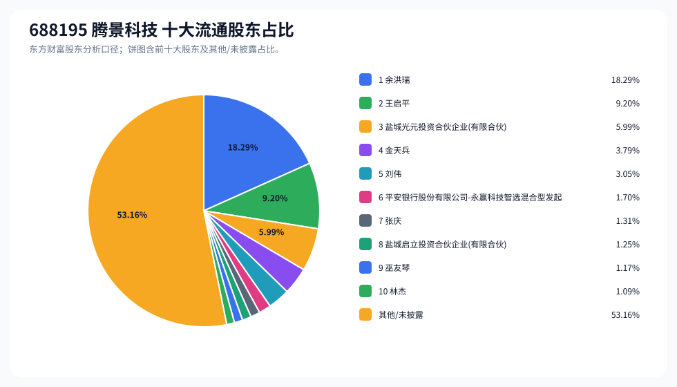
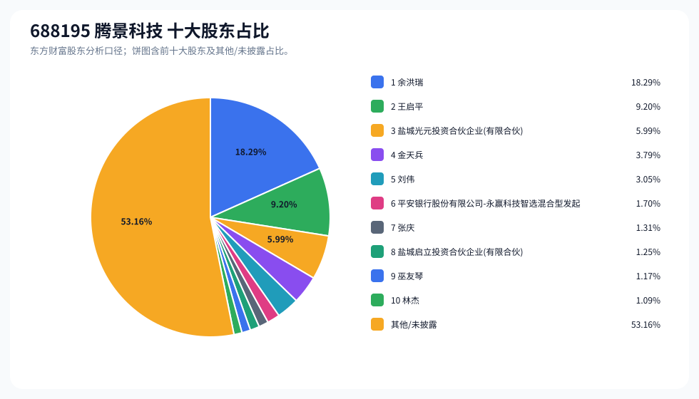
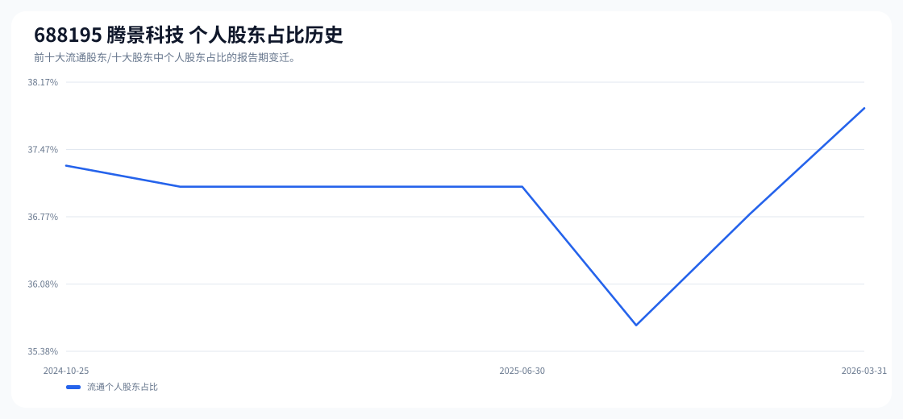

# 688195 腾景科技 股东成分报告

- 生成时间：2026-06-07T16:40:07
- 看涨排名：27；综合评分：15.355。
- ETF/指数线索：CSI_2000 / 159531 中证2000ETF南方。
- 增长/交易机制标签：ETF信号牵引;成交额放大;高换手交易;流通股东集中。
- 说明：本报告是股东结构研究工件，不构成投资建议。

## 1. 公司交易与 ETF 线索

|项目|数值|
|---|---:|
|行业/地区|光学光电子 / 福州市|
|最新价|241.80|
|成交额|29.26亿|
|换手率|6.67%|
|5日收益|3.38%|
|20日收益|-9.08%|
|20日成交额放大倍数|1.58|
|主力净流入| ()|

## 2. 股东结构快照

|项目|数值|
|---|---:|
|流通股东报告期|2026-03-31|
|前十大流通股东合计占流通股本|46.84%|
|其中机构类流通股东占比|8.94%|
|其中基金/社保/QFII 类占比|1.70%|
|前十大流通股东占比变化合计|0.00%|
|第一大流通股东|余洪瑞 / 个人 / 18.29%|
|十大股东报告期|2026-03-31|
|前十大股东合计占总股本|46.84%|
|其中机构类十大股东占比|8.94%|
|前十大股东占比变化合计|0.00%|
|第一大股东|余洪瑞 / 个人 / 18.29%|

## 3. 股东占比饼图

## 4. 历史股东变迁（个人股东重点）

|报告期|口径|前十大占比|个人股东数|个人股东占比|个人股东|机构占比|基金/社保/QFII占比|
|---|---|---:|---:|---:|---|---:|---:|
|2026-03-31|流通股东|46.84%|7|37.90%|余洪瑞、王启平、金天兵、刘伟、张庆、巫友琴、林杰|8.94%|1.70%|
|2025-12-31|流通股东|47.32%|6|36.81%|余洪瑞、王启平、金天兵、刘伟、张庆、巫友琴|10.51%|1.37%|
|2025-09-30|流通股东|48.42%|5|35.65%|余洪瑞、王启平、金天兵、刘伟、张庆|12.78%|0.00%|
|2025-06-30|流通股东|48.19%|6|37.09%|余洪瑞、王启平、金天兵、刘伟、林杰、张庆|11.10%|0.00%|
|2025-03-31|流通股东|50.19%|6|37.09%|余洪瑞、王启平、金天兵、刘伟、林杰、张庆|13.10%|0.00%|
|2025-02-26|流通股东|50.19%|6|37.09%|余洪瑞、王启平、金天兵、刘伟、林杰、张庆|13.10%|0.00%|
|2024-12-31|流通股东|50.19%|6|37.09%|余洪瑞、王启平、金天兵、刘伟、林杰、张庆|13.10%|0.00%|
|2024-10-25|流通股东|50.41%|6|37.30%|余洪瑞、王启平、金天兵、刘伟、林杰、张庆|13.10%|0.00%|

### 个人股东逐期变化

|从|到|口径|个人股东|状态|上一期占比|本期占比|占比变化|上一期排名|本期排名|
|---|---|---|---|---|---:|---:|---:|---:|---:|
|2025-12-31|2026-03-31|流通|林杰|新进||1.09%|1.09%||10|
|2025-12-31|2026-03-31|流通|余洪瑞|不变|18.29%|18.29%|0.00%|1|1|
|2025-12-31|2026-03-31|流通|刘伟|不变|3.05%|3.05%|0.00%|5|5|
|2025-12-31|2026-03-31|流通|巫友琴|不变|1.17%|1.17%|0.00%|10|9|
|2025-12-31|2026-03-31|流通|张庆|不变|1.31%|1.31%|0.00%|8|7|
|2025-12-31|2026-03-31|流通|王启平|不变|9.20%|9.20%|0.00%|2|2|
|2025-12-31|2026-03-31|流通|金天兵|不变|3.79%|3.79%|0.00%|4|4|
|2025-09-30|2025-12-31|流通|巫友琴|新进||1.17%|1.17%||10|
|2025-09-30|2025-12-31|流通|张庆|减持|1.31%|1.31%|-0.01%|9|8|
|2025-09-30|2025-12-31|流通|余洪瑞|不变|18.29%|18.29%|0.00%|1|1|
|2025-09-30|2025-12-31|流通|刘伟|不变|3.05%|3.05%|0.00%|5|5|
|2025-09-30|2025-12-31|流通|王启平|不变|9.20%|9.20%|0.00%|2|2|
|2025-09-30|2025-12-31|流通|金天兵|不变|3.79%|3.79%|0.00%|4|4|
|2025-06-30|2025-09-30|流通|林杰|退出|1.39%||-1.39%|8||
|2025-06-30|2025-09-30|流通|张庆|减持|1.36%|1.31%|-0.05%|9|9|
|2025-06-30|2025-09-30|流通|余洪瑞|不变|18.29%|18.29%|0.00%|1|1|
|2025-06-30|2025-09-30|流通|刘伟|不变|3.05%|3.05%|0.00%|5|5|
|2025-06-30|2025-09-30|流通|王启平|不变|9.20%|9.20%|0.00%|2|2|
|2025-06-30|2025-09-30|流通|金天兵|不变|3.79%|3.79%|0.00%|4|4|
|2025-03-31|2025-06-30|流通|余洪瑞|不变|18.29%|18.29%|0.00%|1|1|
|2025-03-31|2025-06-30|流通|刘伟|不变|3.05%|3.05%|0.00%|5|5|
|2025-03-31|2025-06-30|流通|张庆|不变|1.36%|1.36%|0.00%|10|9|
|2025-03-31|2025-06-30|流通|林杰|不变|1.39%|1.39%|0.00%|9|8|
|2025-03-31|2025-06-30|流通|王启平|不变|9.20%|9.20%|0.00%|2|2|

## 5. 股东明细

### 十大流通股东

|排名|股东名称|类型|股份类型|持股数|占总股本|占流通股本|占比变化|方向|参考市值|
|---:|---|---|---|---:|---:|---:|---:|---|---:|
|1|余洪瑞|个人|A股|23660000|18.29%|18.29%|0.00%|不变|64.01亿|
|2|王启平|个人|A股|11900000|9.20%|9.20%|0.00%|不变|32.19亿|
|3|盐城光元投资合伙企业(有限合伙)|其他|A股|7742635|5.99%|5.99%|0.00%|不变|20.95亿|
|4|金天兵|个人|A股|4900000|3.79%|3.79%|0.00%|不变|13.26亿|
|5|刘伟|个人|A股|3950000|3.05%|3.05%|0.00%|不变|10.69亿|
|6|平安银行股份有限公司-永赢科技智选混合型发起式证券投资基金|基金|A股|2198898|1.70%|1.70%||新进|5.95亿|
|7|张庆|个人|A股|1689856|1.31%|1.31%|0.00%|不变|4.57亿|
|8|盐城启立投资合伙企业(有限合伙)|其他|A股|1620365|1.25%|1.25%|0.00%|不变|4.38亿|
|9|巫友琴|个人|A股|1509200|1.17%|1.17%|0.00%|不变|4.08亿|
|10|林杰|个人|A股|1414696|1.09%|1.09%||新进|3.83亿|

### 十大股东

|排名|股东名称|类型|股份类型|持股数|占总股本|占流通股本|占比变化|方向|参考市值|
|---:|---|---|---|---:|---:|---:|---:|---|---:|
|1|余洪瑞|个人|流通A股|23660000|18.29%||0.00%|不变|64.01亿|
|2|王启平|个人|流通A股|11900000|9.20%||0.00%|不变|32.19亿|
|3|盐城光元投资合伙企业(有限合伙)|其他|流通A股|7742635|5.99%||0.00%|不变|20.95亿|
|4|金天兵|个人|流通A股|4900000|3.79%||0.00%|不变|13.26亿|
|5|刘伟|个人|流通A股|3950000|3.05%||0.00%|不变|10.69亿|
|6|平安银行股份有限公司-永赢科技智选混合型发起式证券投资基金|基金|流通A股|2198898|1.70%|||新进|5.95亿|
|7|张庆|个人|流通A股|1689856|1.31%||0.00%|不变|4.57亿|
|8|盐城启立投资合伙企业(有限合伙)|其他|流通A股|1620365|1.25%||0.00%|不变|4.38亿|
|9|巫友琴|个人|流通A股|1509200|1.17%||0.00%|不变|4.08亿|
|10|林杰|个人|流通A股|1414696|1.09%|||新进|3.83亿|

## 6. 解读要点

- 若“成交额放大 + 高换手交易”同时出现，说明上涨背后有真实交易活跃度，但也可能伴随波动放大。
- 前十大流通股东占比越高，筹码越集中；机构/基金占比越高，越需要继续核对定期报告、基金持仓和是否存在被动指数持仓。
- 个人股东历史变迁重点看三类信号：连续增持、新进进入前十大、以及从前十大退出；个人股东占比变化越大，越需要核对公告和实际控制人/高管身份。
- 股东占比变化为增持/减持线索，需结合公告日、股价位置和成交额验证，不应单独作为买卖依据。

## 数据源

- 股东数据：https://datacenter-web.eastmoney.com/api/data/v1/get (RPT_F10_EH_FREEHOLDERS / RPT_DMSK_HOLDERS)
- 行情与 K 线：https://push2.eastmoney.com/api/qt/clist/get / https://push2his.eastmoney.com/api/qt/stock/kline/get
