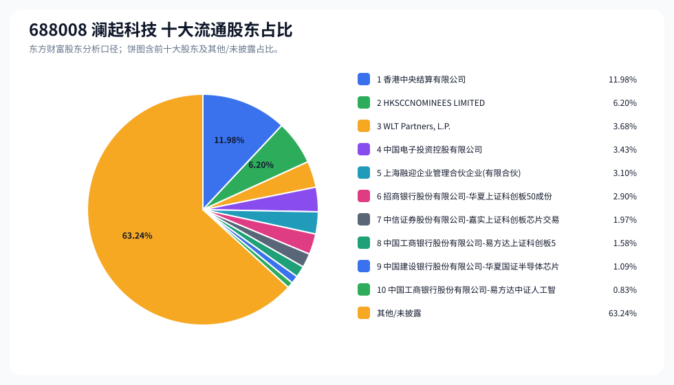
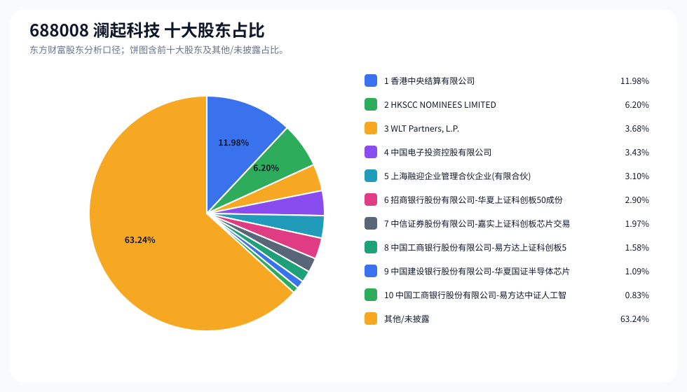
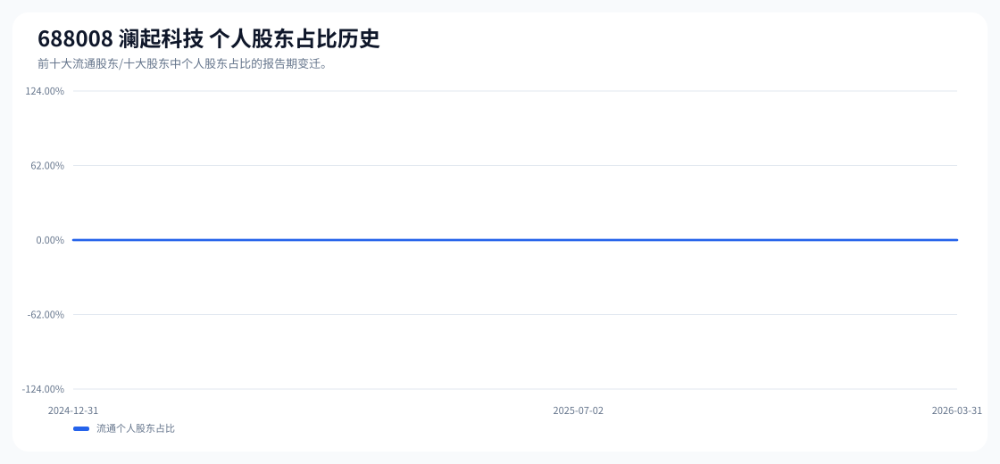

# 688008 澜起科技 股东成分报告

- 生成时间：2026-06-07T16:40:07
- 看涨排名：28；综合评分：15.271。
- ETF/指数线索：CSI_300;CSI_800;CSI_A100 / 510310;159800;159627 沪深 300ETF 易方达;中证 800ETF 鹏华;中证 A100ETF 华夏。
- 增长/交易机制标签：ETF 信号牵引;高换手交易;流通股东集中;机构股东参与。
- 说明：本报告是股东结构研究工件，不构成投资建议。

## 1. 公司交易与 ETF 线索

|项目 | 数值|
|---|---:|
|行业/地区 | 半导体 / 上海市|
|最新价|239.39|
|成交额|170.72 亿|
|换手率|6.04%|
|5 日收益|-5.38%|
|20 日收益|13.85%|
|20 日成交额放大倍数|0.78|
|主力净流入 | ()|

## 2. 股东结构快照

|项目 | 数值|
|---|---:|
|流通股东报告期|2026-03-31|
|前十大流通股东合计占流通股本|36.76%|
|其中机构类流通股东占比|36.76%|
|其中基金/社保/QFII 类占比|8.37%|
|前十大流通股东占比变化合计|-4.64%|
|第一大流通股东 | 香港中央结算有限公司 / 其他 / 11.98%|
|十大股东报告期|2026-03-31|
|前十大股东合计占总股本|36.76%|
|其中机构类十大股东占比|36.76%|
|前十大股东占比变化合计|-4.65%|
|第一大股东 | 香港中央结算有限公司 / 其他 / 11.98%|

## 3. 股东占比饼图

## 4. 历史股东变迁（个人股东重点）

|报告期 | 口径 | 前十大占比 | 个人股东数 | 个人股东占比 | 个人股东 | 机构占比 | 基金/社保/QFII 占比|
|---|---|---:|---:|---:|---|---:|---:|
|2026-03-31|流通股东|36.76%|0|0.00%||36.76%|8.37%|
|2025-12-31|流通股东|37.87%|0|0.00%||37.87%|13.24%|
|2025-09-30|流通股东|39.82%|0|0.00%||39.82%|13.87%|
|2025-07-02|流通股东|39.86%|0|0.00%||39.86%|16.57%|
|2025-06-30|流通股东|39.78%|0|0.00%||39.78%|16.41%|
|2025-06-20|流通股东|40.02%|0|0.00%||40.02%|16.50%|
|2025-03-31|流通股东|37.12%|0|0.00%||37.12%|13.75%|
|2024-12-31|流通股东|38.84%|0|0.00%||38.84%|14.32%|

### 个人股东逐期变化

- 最近报告期内前十大名单未出现个人股东，或个人股东无可计算变化。

## 5. 股东明细

### 十大流通股东

|排名 | 股东名称 | 类型 | 股份类型 | 持股数 | 占总股本 | 占流通股本 | 占比变化 | 方向 | 参考市值|
|---:|---|---|---|---:|---:|---:|---:|---|---:|
|1|香港中央结算有限公司 | 其他|A 股|146393531|11.98%|11.98%|-1.23%|减少|183.40 亿|
|2|HKSCCNOMINEES LIMITED|其他|H 股|75772700|6.20%|6.20%||新进|94.93 亿|
|3|WLT Partners, L.P.|其他|A 股|45012524|3.68%|3.68%|-0.24%|不变|56.39 亿|
|4|中国电子投资控股有限公司 | 其他|A 股|41971105|3.43%|3.43%|-0.76%|减少|52.58 亿|
|5|上海融迎企业管理合伙企业 (有限合伙)|其他|A 股|37905987|3.10%|3.10%|-0.20%|不变|47.49 亿|
|6|招商银行股份有限公司 - 华夏上证科创板 50 成份交易型开放式指数证券投资基金 | 基金|A 股|35443554|2.90%|2.90%|-0.35%|减少|44.40 亿|
|7|中信证券股份有限公司 - 嘉实上证科创板芯片交易型开放式指数证券投资基金 | 基金|A 股|24028972|1.97%|1.97%|-0.30%|减少|30.10 亿|
|8|中国工商银行股份有限公司 - 易方达上证科创板 50 成份交易型开放式指数证券投资基金 | 基金|A 股|19316984|1.58%|1.58%|-1.44%|减少|24.20 亿|
|9|中国建设银行股份有限公司 - 华夏国证半导体芯片交易型开放式指数证券投资基金 | 基金|A 股|13327187|1.09%|1.09%|-0.11%|减少|16.70 亿|
|10|中国工商银行股份有限公司 - 易方达中证人工智能主题交易型开放式指数证券投资基金 | 基金|A 股|10149482|0.83%|0.83%||新进|12.72 亿|

### 十大股东

|排名 | 股东名称 | 类型 | 股份类型 | 持股数 | 占总股本 | 占流通股本 | 占比变化 | 方向 | 参考市值|
|---:|---|---|---|---:|---:|---:|---:|---|---:|
|1|香港中央结算有限公司 | 其他 | 流通 A 股|146393531|11.98%||-1.23%|减持|183.40 亿|
|2|HKSCC NOMINEES LIMITED|其他 | 流通 H 股|75772700|6.20%|||新进|94.93 亿|
|3|WLT Partners, L.P.|其他 | 流通 A 股|45012524|3.68%||-0.25%|不变|56.39 亿|
|4|中国电子投资控股有限公司 | 其他 | 流通 A 股|41971105|3.43%||-0.76%|减持|52.58 亿|
|5|上海融迎企业管理合伙企业 (有限合伙)|其他 | 流通 A 股|37905987|3.10%||-0.21%|不变|47.49 亿|
|6|招商银行股份有限公司 - 华夏上证科创板 50 成份交易型开放式指数证券投资基金 | 基金 | 流通 A 股|35443554|2.90%||-0.35%|减持|44.40 亿|
|7|中信证券股份有限公司 - 嘉实上证科创板芯片交易型开放式指数证券投资基金 | 基金 | 流通 A 股|24028972|1.97%||-0.30%|减持|30.10 亿|
|8|中国工商银行股份有限公司 - 易方达上证科创板 50 成份交易型开放式指数证券投资基金 | 基金 | 流通 A 股|19316984|1.58%||-1.44%|减持|24.20 亿|
|9|中国建设银行股份有限公司 - 华夏国证半导体芯片交易型开放式指数证券投资基金 | 基金 | 流通 A 股|13327187|1.09%||-0.11%|减持|16.70 亿|
|10|中国工商银行股份有限公司 - 易方达中证人工智能主题交易型开放式指数证券投资基金 | 基金 | 流通 A 股|10149482|0.83%|||新进|12.72 亿|

## 6. 解读要点

- 若“成交额放大 + 高换手交易”同时出现，说明上涨背后有真实交易活跃度，但也可能伴随波动放大。
- 前十大流通股东占比越高，筹码越集中；机构/基金占比越高，越需要继续核对定期报告、基金持仓和是否存在被动指数持仓。
- 个人股东历史变迁重点看三类信号：连续增持、新进进入前十大、以及从前十大退出；个人股东占比变化越大，越需要核对公告和实际控制人/高管身份。
- 股东占比变化为增持/减持线索，需结合公告日、股价位置和成交额验证，不应单独作为买卖依据。

## 数据源

- 股东数据：https://datacenter-web.eastmoney.com/api/data/v1/get (RPT_F10_EH_FREEHOLDERS / RPT_DMSK_HOLDERS)
- 行情与 K 线：https://push2.eastmoney.com/api/qt/clist/get / https://push2his.eastmoney.com/api/qt/stock/kline/get
