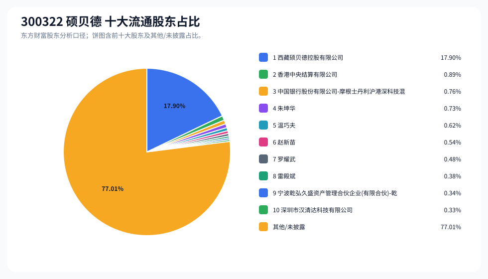
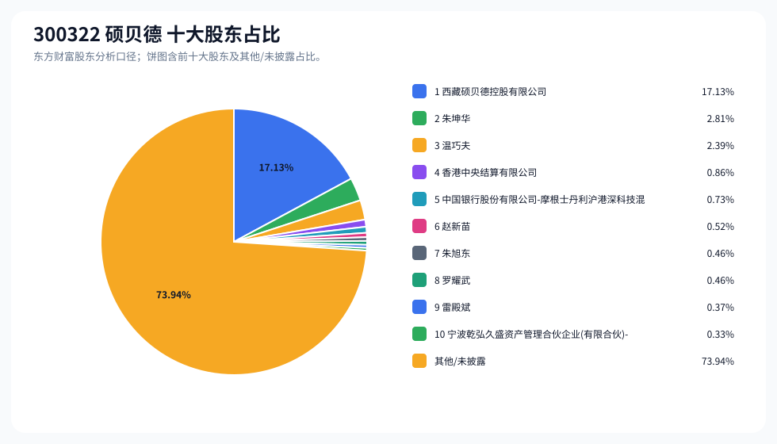
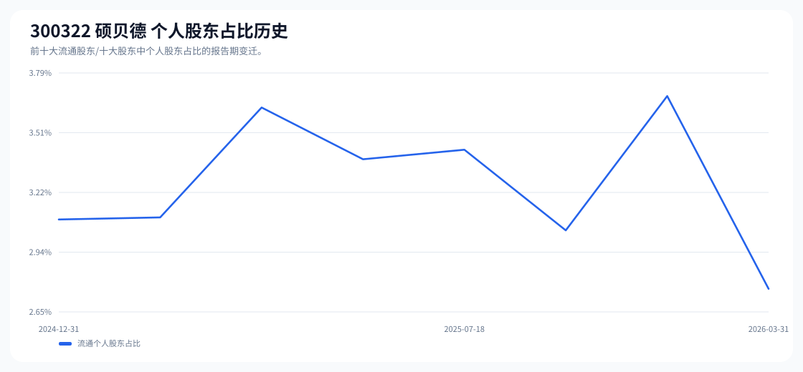

# 300322 硕贝德 股东成分报告

- 生成时间：2026-06-07T16:32:44
- 看涨排名：29；综合评分：15.175。
- ETF/指数线索：CSI_2000 / 159531 中证2000ETF南方。
- 增长/交易机制标签：ETF信号牵引;价格动量;成交额放大;高换手交易;机构股东参与。
- 说明：本报告是股东结构研究工件，不构成投资建议。

## 1. 公司交易与 ETF 线索

|项目|数值|
|---|---:|
|行业/地区|消费电子 / 惠州市|
|最新价|33.75|
|成交额|32.46亿|
|换手率|21.72%|
|5日收益|4.81%|
|20日收益|5.47%|
|20日成交额放大倍数|1.96|
|主力净流入| ()|

## 2. 股东结构快照

|项目|数值|
|---|---:|
|流通股东报告期|2026-03-31|
|前十大流通股东合计占流通股本|22.99%|
|其中机构类流通股东占比|20.22%|
|其中基金/社保/QFII 类占比|1.10%|
|前十大流通股东占比变化合计|-0.06%|
|第一大流通股东|西藏硕贝德控股有限公司 / 其他 / 17.90%|
|十大股东报告期|2026-03-31|
|前十大股东合计占总股本|26.06%|
|其中机构类十大股东占比|19.05%|
|前十大股东占比变化合计|-0.06%|
|第一大股东|西藏硕贝德控股有限公司 / 其他 / 17.13%|

## 3. 股东占比饼图

## 4. 历史股东变迁（个人股东重点）

|报告期|口径|前十大占比|个人股东数|个人股东占比|个人股东|机构占比|基金/社保/QFII占比|
|---|---|---:|---:|---:|---|---:|---:|
|2026-03-31|流通股东|22.99%|5|2.76%|朱坤华、温巧夫、赵新苗、罗耀武、雷殿斌|20.22%|1.10%|
|2025-12-31|流通股东|22.85%|7|3.68%|朱坤华、温巧夫、张新、罗耀武、赵新苗、雷殿斌、沈海娟|19.17%|0.29%|
|2025-09-30|流通股东|21.85%|7|3.04%|朱坤华、温巧夫、赵新苗、雷殿斌、高雄敬、沈海娟、朱旭华|18.81%|0.23%|
|2025-07-18|流通股东|22.41%|6|3.43%|罗耀武、朱坤华、温巧夫、赵新苗、金长江、雷殿斌|18.98%|0.68%|
|2025-07-08|流通股东|23.46%|6|3.38%|罗耀武、朱坤华、温巧夫、赵新苗、金长江、雷殿斌|20.08%|0.87%|
|2025-06-30|流通股东|24.33%|7|3.63%|罗耀武、朱坤华、温巧夫、赵新苗、金长江、雷殿斌、姚显强|20.71%|0.25%|
|2025-03-31|流通股东|22.07%|6|3.10%|朱坤华、罗耀武、温巧夫、赵新苗、雷殿斌、姚显强|18.97%|0.78%|
|2024-12-31|流通股东|21.10%|8|3.09%|朱坤华、罗耀武、赵新苗、温巧夫、雷殿斌、姚显强、张建勇、朱旭华|18.01%|0.00%|

### 个人股东逐期变化

|从|到|口径|个人股东|状态|上一期占比|本期占比|占比变化|上一期排名|本期排名|
|---|---|---|---|---|---:|---:|---:|---:|---:|
|2025-12-31|2026-03-31|流通|张新|退出|0.62%||-0.62%|5||
|2025-12-31|2026-03-31|流通|沈海娟|退出|0.32%||-0.32%|9||
|2025-12-31|2026-03-31|流通|赵新苗|增持|0.50%|0.54%|0.05%|7|6|
|2025-12-31|2026-03-31|流通|罗耀武|减持|0.50%|0.48%|-0.02%|6|7|
|2025-12-31|2026-03-31|流通|朱坤华|不变|0.73%|0.73%|0.00%|3|4|
|2025-12-31|2026-03-31|流通|温巧夫|不变|0.62%|0.62%|0.00%|4|5|
|2025-12-31|2026-03-31|流通|雷殿斌|不变|0.38%|0.38%|0.00%|8|8|
|2025-09-30|2025-12-31|流通|张新|新进||0.62%|0.62%||5|
|2025-09-30|2025-12-31|流通|罗耀武|新进||0.50%|0.50%||6|
|2025-09-30|2025-12-31|流通|高雄敬|退出|0.34%||-0.34%|7||
|2025-09-30|2025-12-31|流通|朱旭华|退出|0.22%||-0.22%|10||
|2025-09-30|2025-12-31|流通|赵新苗|增持|0.42%|0.50%|0.08%|5|7|
|2025-09-30|2025-12-31|流通|朱坤华|不变|0.73%|0.73%|0.00%|2|3|
|2025-09-30|2025-12-31|流通|沈海娟|不变|0.32%|0.32%|0.00%|8|9|
|2025-09-30|2025-12-31|流通|温巧夫|不变|0.62%|0.62%|0.00%|4|4|
|2025-09-30|2025-12-31|流通|雷殿斌|不变|0.38%|0.38%|0.00%|6|8|
|2025-07-18|2025-09-30|流通|罗耀武|退出|0.89%||-0.89%|2||
|2025-07-18|2025-09-30|流通|金长江|退出|0.38%||-0.38%|7||
|2025-07-18|2025-09-30|流通|高雄敬|新进||0.34%|0.34%||7|
|2025-07-18|2025-09-30|流通|沈海娟|新进||0.32%|0.32%||8|
|2025-07-18|2025-09-30|流通|朱旭华|新进||0.22%|0.22%||10|
|2025-07-18|2025-09-30|流通|朱坤华|增持|0.73%|0.73%|0.00%|3|2|
|2025-07-18|2025-09-30|流通|温巧夫|增持|0.62%|0.62%|0.00%|4|4|
|2025-07-18|2025-09-30|流通|赵新苗|增持|0.42%|0.42%|0.00%|6|5|

## 5. 股东明细

### 十大流通股东

|排名|股东名称|类型|股份类型|持股数|占总股本|占流通股本|占比变化|方向|参考市值|
|---:|---|---|---|---:|---:|---:|---:|---|---:|
|1|西藏硕贝德控股有限公司|其他|A股|78825104|17.13%|17.90%|0.00%|不变|18.73亿|
|2|香港中央结算有限公司|其他|A股|3936430|0.86%|0.89%|-0.08%|减少|9352.96万|
|3|中国银行股份有限公司-摩根士丹利沪港深科技混合型证券投资基金|基金|A股|3343900|0.73%|0.76%||新进|7945.11万|
|4|朱坤华|个人|A股|3234169|0.70%|0.73%|0.00%|不变|7684.39万|
|5|温巧夫|个人|A股|2746578|0.60%|0.62%|0.00%|不变|6525.87万|
|6|赵新苗|个人|A股|2386400|0.52%|0.54%|0.04%|增加|5670.09万|
|7|罗耀武|个人|A股|2122914|0.46%|0.48%|-0.02%|减少|5044.04万|
|8|雷殿斌|个人|A股|1686800|0.37%|0.38%|0.00%|不变|4007.84万|
|9|宁波乾弘久盛资产管理合伙企业(有限合伙)-乾弘悦享多策略二期私募证券投资基金|其他|A股|1500000|0.33%|0.34%||新进|3564.00万|
|10|深圳市汉清达科技有限公司|其他|A股|1459700|0.32%|0.33%||新进|3468.25万|

### 十大股东

|排名|股东名称|类型|股份类型|持股数|占总股本|占流通股本|占比变化|方向|参考市值|
|---:|---|---|---|---:|---:|---:|---:|---|---:|
|1|西藏硕贝德控股有限公司|其他|流通A股|78825104|17.13%||0.00%|不变|18.73亿|
|2|朱坤华|个人|流通A股,限售流通A股|12936677|2.81%||0.00%|不变|3.07亿|
|3|温巧夫|个人|流通A股,限售流通A股|10986313|2.39%||0.00%|不变|2.61亿|
|4|香港中央结算有限公司|其他|流通A股|3936430|0.86%||-0.08%|减持|9352.96万|
|5|中国银行股份有限公司-摩根士丹利沪港深科技混合型证券投资基金|基金|流通A股|3343900|0.73%|||新进|7945.11万|
|6|赵新苗|个人|流通A股|2386400|0.52%||0.04%|增持|5670.09万|
|7|朱旭东|个人|流通A股,限售流通A股|2125096|0.46%||0.00%|不变|5049.23万|
|8|罗耀武|个人|流通A股|2122914|0.46%||-0.02%|减持|5044.04万|
|9|雷殿斌|个人|流通A股|1686800|0.37%||0.00%|不变|4007.84万|
|10|宁波乾弘久盛资产管理合伙企业(有限合伙)-乾弘悦享多策略二期私募证券投资基金|其他|流通A股|1500000|0.33%|||新进|3564.00万|

## 6. 解读要点

- 若“成交额放大 + 高换手交易”同时出现，说明上涨背后有真实交易活跃度，但也可能伴随波动放大。
- 前十大流通股东占比越高，筹码越集中；机构/基金占比越高，越需要继续核对定期报告、基金持仓和是否存在被动指数持仓。
- 个人股东历史变迁重点看三类信号：连续增持、新进进入前十大、以及从前十大退出；个人股东占比变化越大，越需要核对公告和实际控制人/高管身份。
- 股东占比变化为增持/减持线索，需结合公告日、股价位置和成交额验证，不应单独作为买卖依据。

## 数据源

- 股东数据：https://datacenter-web.eastmoney.com/api/data/v1/get (RPT_F10_EH_FREEHOLDERS / RPT_DMSK_HOLDERS)
- 行情与 K 线：https://push2.eastmoney.com/api/qt/clist/get / https://push2his.eastmoney.com/api/qt/stock/kline/get
