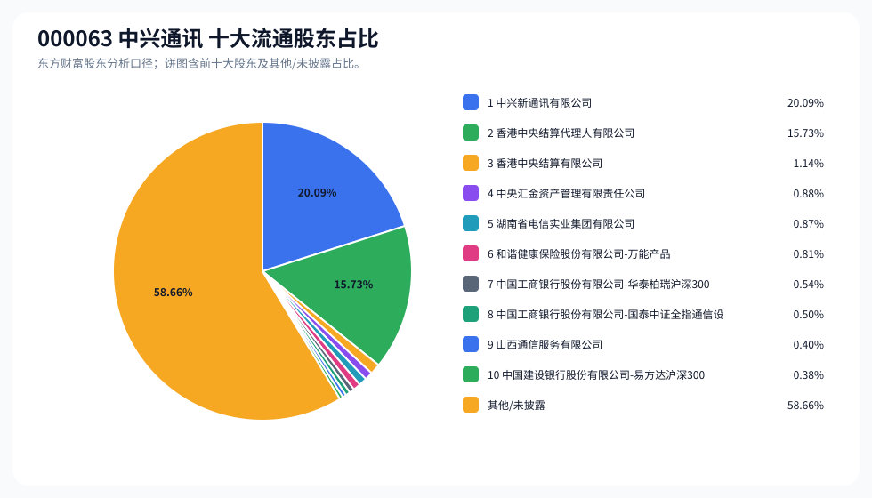
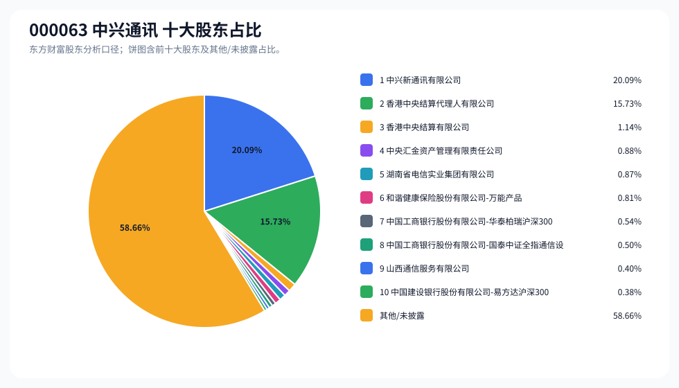
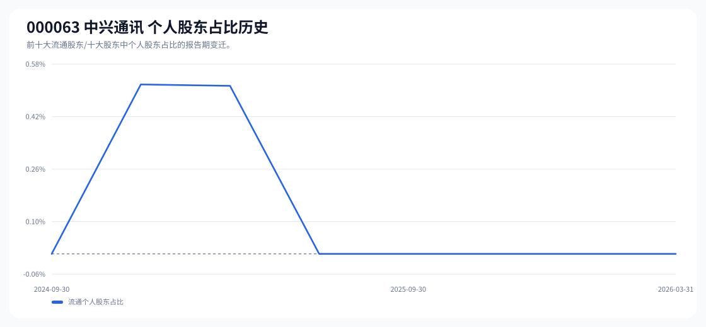

# 000063 中兴通讯 股东成分报告

- 生成时间：2026-06-07T16:40:07
- 看涨排名：30；综合评分：13.950。
- ETF/指数线索：CSI_A50 / 159601 中证 A50ETF 华夏。
- 增长/交易机制标签：ETF 信号牵引;价格动量;成交额放大;高换手交易;流通股东集中;机构股东参与。
- 说明：本报告是股东结构研究工件，不构成投资建议。

## 1. 公司交易与 ETF 线索

|项目 | 数值|
|---|---:|
|行业/地区 | 通信设备 / 深圳市|
|最新价|39.13|
|成交额|183.26 亿|
|换手率|11.51%|
|5 日收益|6.56%|
|20 日收益|1.16%|
|20 日成交额放大倍数|2.80|
|主力净流入 | ()|

## 2. 股东结构快照

|项目 | 数值|
|---|---:|
|流通股东报告期|2026-03-31|
|前十大流通股东合计占流通股本|41.34%|
|其中机构类流通股东占比|41.34%|
|其中基金/社保/QFII 类占比|1.42%|
|前十大流通股东占比变化合计|-1.17%|
|第一大流通股东 | 中兴新通讯有限公司 / 其他 / 20.09%|
|十大股东报告期|2026-03-31|
|前十大股东合计占总股本|41.34%|
|其中机构类十大股东占比|41.34%|
|前十大股东占比变化合计|-1.17%|
|第一大股东 | 中兴新通讯有限公司 / 其他 / 20.09%|

## 3. 股东占比饼图

## 4. 历史股东变迁（个人股东重点）

|报告期 | 口径 | 前十大占比 | 个人股东数 | 个人股东占比 | 个人股东 | 机构占比 | 基金/社保/QFII 占比|
|---|---|---:|---:|---:|---|---:|---:|
|2026-03-31|流通股东|41.34%|0|0.00%||41.34%|1.42%|
|2025-12-31|流通股东|42.74%|0|0.00%||42.74%|3.03%|
|2025-12-11|流通股东|42.93%|0|0.00%||42.93%|3.11%|
|2025-09-30|流通股东|43.12%|0|0.00%||43.12%|3.13%|
|2025-06-30|流通股东|43.45%|0|0.00%||43.45%|3.22%|
|2025-03-31|流通股东|42.56%|1|0.52%|王世忱|42.04%|2.88%|
|2024-12-31|流通股东|43.59%|1|0.52%|王世忱|43.07%|3.00%|
|2024-09-30|流通股东|43.13%|0|0.00%||43.13%|3.74%|

### 个人股东逐期变化

|从 | 到|口径 | 个人股东 | 状态 | 上一期占比 | 本期占比 | 占比变化 | 上一期排名 | 本期排名|
|---|---|---|---|---|---:|---:|---:|---:|---:|
|2025-03-31|2025-06-30|流通 | 王世忱 | 退出|0.52%||-0.52%|9||
|2024-12-31|2025-03-31|流通 | 王世忱 | 减持|0.52%|0.52%|-0.00%|9|9|
|2024-09-30|2024-12-31|流通 | 王世忱 | 新进||0.52%|0.52%||9|

## 5. 股东明细

### 十大流通股东

|排名 | 股东名称 | 类型 | 股份类型 | 持股数 | 占总股本 | 占流通股本 | 占比变化 | 方向 | 参考市值|
|---:|---|---|---|---:|---:|---:|---:|---|---:|
|1|中兴新通讯有限公司 | 其他|A 股，H 股|960978400|20.09%|20.09%|0.00%|不变|311.74 亿|
|2|香港中央结算代理人有限公司 | 其他|H 股|752419722|15.73%|15.73%|0.00%|增加|244.08 亿|
|3|香港中央结算有限公司 | 其他|A 股|54577719|1.14%|1.14%|-0.19%|减少|17.71 亿|
|4|中央汇金资产管理有限责任公司 | 国家队|A 股|42171534|0.88%|0.88%|0.00%|不变|13.68 亿|
|5|湖南省电信实业集团有限公司 | 其他|A 股|41516065|0.87%|0.87%|0.00%|不变|13.47 亿|
|6|和谐健康保险股份有限公司 - 万能产品 | 保险|A 股|38796600|0.81%|0.81%|0.00%|不变|12.59 亿|
|7|中国工商银行股份有限公司 - 华泰柏瑞沪深 300 交易型开放式指数证券投资基金 | 基金|A 股|25925685|0.54%|0.54%|-0.57%|减少|8.41 亿|
|8|中国工商银行股份有限公司 - 国泰中证全指通信设备交易型开放式指数证券投资基金 | 基金|A 股|23853373|0.50%|0.50%||新进|7.74 亿|
|9|山西通信服务有限公司 | 其他|A 股|19073940|0.40%|0.40%||新进|6.19 亿|
|10|中国建设银行股份有限公司 - 易方达沪深 300 交易型开放式指数发起式证券投资基金 | 基金|A 股|18024285|0.38%|0.38%|-0.42%|减少|5.85 亿|

### 十大股东

|排名 | 股东名称 | 类型 | 股份类型 | 持股数 | 占总股本 | 占流通股本 | 占比变化 | 方向 | 参考市值|
|---:|---|---|---|---:|---:|---:|---:|---|---:|
|1|中兴新通讯有限公司 | 其他 | 流通 A 股，流通 H 股|960978400|20.09%||0.00%|不变|311.74 亿|
|2|香港中央结算代理人有限公司 | 其他 | 流通 H 股|752419722|15.73%||0.00%|增持|244.08 亿|
|3|香港中央结算有限公司 | 其他 | 流通 A 股|54577719|1.14%||-0.19%|减持|17.71 亿|
|4|中央汇金资产管理有限责任公司 | 国家队 | 流通 A 股|42171534|0.88%||0.00%|不变|13.68 亿|
|5|湖南省电信实业集团有限公司 | 其他 | 流通 A 股|41516065|0.87%||0.00%|不变|13.47 亿|
|6|和谐健康保险股份有限公司 - 万能产品 | 保险 | 流通 A 股|38796600|0.81%||0.00%|不变|12.59 亿|
|7|中国工商银行股份有限公司 - 华泰柏瑞沪深 300 交易型开放式指数证券投资基金 | 基金 | 流通 A 股|25925685|0.54%||-0.57%|减持|8.41 亿|
|8|中国工商银行股份有限公司 - 国泰中证全指通信设备交易型开放式指数证券投资基金 | 基金 | 流通 A 股|23853373|0.50%|||新进|7.74 亿|
|9|山西通信服务有限公司 | 其他 | 流通 A 股|19073940|0.40%|||新进|6.19 亿|
|10|中国建设银行股份有限公司 - 易方达沪深 300 交易型开放式指数发起式证券投资基金 | 基金 | 流通 A 股|18024285|0.38%||-0.41%|减持|5.85 亿|

## 6. 解读要点

- 若“成交额放大 + 高换手交易”同时出现，说明上涨背后有真实交易活跃度，但也可能伴随波动放大。
- 前十大流通股东占比越高，筹码越集中；机构/基金占比越高，越需要继续核对定期报告、基金持仓和是否存在被动指数持仓。
- 个人股东历史变迁重点看三类信号：连续增持、新进进入前十大、以及从前十大退出；个人股东占比变化越大，越需要核对公告和实际控制人/高管身份。
- 股东占比变化为增持/减持线索，需结合公告日、股价位置和成交额验证，不应单独作为买卖依据。

## 数据源

- 股东数据：https://datacenter-web.eastmoney.com/api/data/v1/get (RPT_F10_EH_FREEHOLDERS / RPT_DMSK_HOLDERS)
- 行情与 K 线：https://push2.eastmoney.com/api/qt/clist/get / https://push2his.eastmoney.com/api/qt/stock/kline/get
