# 中证宽基 ETF 自动挖掘与轻量模型训练报告

本报告由零第三方依赖的 `python -m hp_ml.lite_train` 自动生成；输出用于量化研究，不构成投资建议。

## 1. 候选 ETF 池

- 候选 ETF 数量：13
- 覆盖指数族：CSI_1000(2), CSI_2000(1), CSI_300(2), CSI_500(2), CSI_800(1), CSI_A100(1), CSI_A50(2), CSI_A500(2)
- 发现方式：扫描东方财富 ETF 行情/基金代码列表，并用中证/沪深宽基名称模式聚焦纯宽基产品。

|代码 | 名称 | 指数族 | 最新价 | 成交额 | 族内排名|
|---|---|---|---:|---:|---:|
|512100|中证1000ETF南方|CSI_1000|||1|
|159845|中证1000ETF华夏|CSI_1000|||2|
|159531|中证2000ETF南方|CSI_2000|||1|
|510300|沪深300ETF华泰柏瑞|CSI_300|||1|
|510310|沪深300ETF易方达|CSI_300|||2|
|510500|中证500ETF南方|CSI_500|||1|
|512500|中证500ETF华夏|CSI_500|||2|
|159800|中证800ETF鹏华|CSI_800|||1|
|159627|中证A100ETF华夏|CSI_A100|||1|
|159136|中证A50ETF广发|CSI_A50|||1|
|159601|中证A50ETF华夏|CSI_A50|||2|
|563360|中证A500ETF华泰柏瑞|CSI_A500|||1|

## 2. 训练设置与验证

- 预测目标：未来 5 个交易日收益。
- 模型：标准化特征 + 岭回归（纯 Python 线性方程求解）。
- 特征数量：31

|指标 | 值|
|---|---:|
|train_rows|10954|
|test_rows|780|
|train_start|2019-05-21|
|train_end|2026-03-02|
|test_start|2026-03-03|
|test_end|2026-05-29|
|mae|0.021694|
|rmse|0.027652|
|r2|0.060281|
|directional_accuracy|0.612821|
|spearman_ic_by_date|-0.012420|
|top1_mean_fwd_ret|0.003362|
|top_vs_all|-0.000663|
|top_bottom_spread|-0.002321|

## 3. 长历史与跨时间尺度分析

- 本次长历史请求区间：20180101 至 20260607；实际最早 ETF 日线：2019-05-21，最新：2026-06-05。
- 可用历史覆盖：最长 7.04 年；跨周期 horizon：5, 20, 60, 120, 250 个交易日。
- 统计口径：对每个 ETF 的所有重叠前瞻收益做描述统计；用于观察不同持有周期的历史胜率、波动和阶段变化。

|持有周期|ETF 数 | 样本数 | 平均前瞻收益 | 中位数 | 胜率 | 波动 | 类 Sharpe|最佳 | 最差|
|---:|---:|---:|---:|---:|---:|---:|---:|---:|---:|
|5日|13|11734|0.28%|0.29%|54.24%|3.35%|0.5952|36.30%|-21.89%|
|20日|13|11539|1.15%|0.77%|55.16%|6.47%|0.6299|37.91%|-29.56%|
|60日|13|11019|3.16%|1.52%|58.22%|10.81%|0.5996|54.25%|-34.90%|
|120日|12|10254|6.35%|7.01%|63.26%|14.70%|0.6256|60.11%|-33.77%|
|250日|12|8694|12.86%|16.31%|70.53%|23.72%|0.5444|85.56%|-46.40%|

### 历史覆盖最长的 ETF

|代码 | 名称 | 指数族 | 起始 | 截止 | 日线数 | 年限 | 全期收益 | 最大回撤|
|---|---|---|---|---|---:|---:|---:|---:|
|510300|沪深300ETF华泰柏瑞|CSI_300|2019-05-21|2026-06-05|1380|7.04|56.33%|-44.75%|
|510310|沪深300ETF易方达|CSI_300|2019-05-21|2026-06-05|1380|7.04|60.73%|-43.18%|
|510500|中证500ETF南方|CSI_500|2019-05-21|2026-06-05|1380|7.04|88.28%|-40.79%|
|512100|中证1000ETF南方|CSI_1000|2019-05-21|2026-06-05|1380|7.04|97.18%|-46.96%|
|512500|中证500ETF华夏|CSI_500|2019-05-21|2026-06-05|1380|7.04|85.87%|-39.87%|
|159845|中证1000ETF华夏|CSI_1000|2021-03-31|2026-06-05|926|5.18|43.70%|-45.79%|
|159601|中证A50ETF华夏|CSI_A50|2021-11-08|2026-06-05|1109|4.57|14.70%|-38.22%|
|159627|中证A100ETF华夏|CSI_A100|2022-11-30|2026-06-05|848|3.51|34.62%|-24.53%|
|159531|中证2000ETF南方|CSI_2000|2023-09-18|2026-06-05|654|2.71|54.87%|-36.54%|
|159800|中证800ETF鹏华|CSI_800|2024-07-12|2026-06-05|459|1.90|46.73%|-16.02%|
|159352|中证A500ETF|CSI_A500|2024-10-15|2026-06-05|399|1.64|37.45%|-16.07%|
|563360|中证A500ETF华泰柏瑞|CSI_A500|2024-10-15|2026-06-05|399|1.64|36.30%|-15.81%|

### 多尺度输出文件

|文件 | 说明|
|---|---|
|`/home/steve/文档/vibe coding/hp-ml/reports/long_history_coverage_lite.csv`|每只 ETF 的历史覆盖、全期收益和价格最大回撤|
|`/home/steve/文档/vibe coding/hp-ml/reports/multi_scale_etf_metrics_lite.csv`|ETF × horizon 的收益/胜率/波动/回撤统计|
|`/home/steve/文档/vibe coding/hp-ml/reports/multi_scale_family_metrics_lite.csv`|指数族/全池 × horizon 聚合统计|
|`/home/steve/文档/vibe coding/hp-ml/reports/multi_scale_period_metrics_lite.csv`|年份 × 指数族 × horizon 的阶段统计|

## 4. 自动参数调优

- 调优方式：在训练集内部再切出靠后的验证期，先调 Ridge L2，再调购买策略 TopK / 最低预测收益阈值。
- 模型目标：directional_accuracy + 0.8*IC + 4*top_vs_all - 0.5*RMSE
- 策略目标：cum_return + 0.25*win_rate + 0.25*outperform + 0.05*sharpe + 0.25*max_drawdown
- 最佳 L2：30.0；最佳策略：Top5，最低预测收益 0.50%。

### L2 调优结果

|L2|验证分数 | 方向准确率|IC|Top1-全池|RMSE|
|---:|---:|---:|---:|---:|---:|
|0.3|0.475508|47.54%|0.0178|-0.05%|0.024318|
|1.0|0.477854|47.54%|0.0208|-0.05%|0.024318|
|3.0|0.478854|47.54%|0.0218|-0.05%|0.024319|
|10.0|0.477321|47.90%|0.0164|-0.07%|0.024318|
|30.0|0.480955|47.81%|0.0236|-0.10%|0.024304|

### 策略参数 Top 结果

|TopK|最低预测 | 调优分数 | 交易胜率 | 跑赢基准率 | 累计收益 | 最大回撤|
|---:|---:|---:|---:|---:|---:|---:|
|5|0.50%|0.616955|78.67%|37.78%|21.93%|-6.28%|
|4|0.50%|0.613986|78.79%|38.89%|21.70%|-6.72%|
|2|0.50%|0.611013|76.19%|40.00%|21.58%|-6.74%|
|3|0.50%|0.603604|78.57%|37.78%|21.16%|-6.74%|
|2|1.00%|0.584914|81.82%|40.00%|10.11%|-3.23%|
|3|1.00%|0.584914|81.82%|40.00%|10.11%|-3.23%|
|4|1.00%|0.584914|81.82%|40.00%|10.11%|-3.23%|
|5|1.00%|0.584914|81.82%|40.00%|10.11%|-3.23%|
|1|0.50%|0.567679|70.37%|40.00%|19.47%|-6.73%|
|1|1.00%|0.532890|77.78%|38.89%|8.53%|-3.23%|
|4|-0.50%|0.517005|59.47%|35.56%|28.19%|-22.54%|
|3|-0.50%|0.516193|59.30%|33.33%|28.73%|-22.60%|

## 5. 相关股票/成分股扩展

- 已拉取相关股票/指数成分股：240 条。
- 覆盖：CSI_1000(30), CSI_2000(30), CSI_300(30), CSI_500(30), CSI_800(30), CSI_A100(30), CSI_A50(30), CSI_A500(30)
- 数据源：东方财富指数成分股数据；有权重字段时按权重排序，否则按自由流通市值排序。

|指数族 | 排名 | 股票代码 | 股票名称 | 行业 | 权重 | 自由流通市值 | 涨跌幅|PE|
|---|---:|---|---|---|---:|---:|---:|---:|
|CSI_1000|1|601869|长飞光纤|通信设备||1794.67|-3.12%|184.63|
|CSI_1000|2|603256|宏和科技|玻璃玻纤||1724.79|0.54%|316.18|
|CSI_1000|3|300620|光库科技|通信设备||791.47|0.33%|446.02|
|CSI_1000|4|300475|香农芯创|其他电子Ⅱ||773.61|-7.06%|15.20|
|CSI_1000|5|688313|仕佳光子|通信设备||708.67|-5.23%|152.50|
|CSI_1000|6|601126|四方股份|电网设备||594.47|-3.39%|55.44|
|CSI_1000|7|601208|东材科技|塑料||573.38|-4.77%|76.72|
|CSI_1000|8|002428|云南锗业|小金属||558.35|-3.51%|1532.92|
|CSI_1000|9|603083|剑桥科技|通信设备||529.18|-5.95%|149.40|
|CSI_1000|10|601777|千里科技|摩托车及其他||454.37|-4.10%|234.84|
|CSI_1000|11|301511|德福科技|电池||447.68|-2.30%|127.90|
|CSI_1000|12|688409|富创精密|半导体||444.92|-1.15%|191.96|
|CSI_1000|13|002222|福晶科技|光学光电子||441.94|-2.88%|170.11|
|CSI_1000|14|603308|应流股份|通用设备||436.90|-3.39%|90.90|
|CSI_1000|15|300870|欧陆通|其他电源设备Ⅱ||408.15|-2.76%|-813.71|
|CSI_1000|16|688433|华曙高科|通用设备||403.11|-0.59%|-2765.92|
|CSI_1000|17|002487|大金重工|风电设备||401.71|-5.79%|27.02|
|CSI_1000|18|002015|协鑫能科|电力||362.33|-7.46%|31.47|
|CSI_1000|19|688205|德科立|通信设备||360.99|-3.10%|459.53|
|CSI_1000|20|002378|章源钨业|小金属||354.83|-4.32%|23.39|
|CSI_1000|21|688127|蓝特光学|光学光电子||339.98|-2.09%|65.61|
|CSI_1000|22|600667|太极实业|工程咨询服务Ⅱ||337.78|-1.28%|65.40|
|CSI_1000|23|002245|蔚蓝锂芯|电池||330.32|-1.39%|44.83|
|CSI_1000|24|002456|欧菲光|光学光电子||327.12|-1.89%|-33.45|
|CSI_1000|25|603306|华懋科技|汽车零部件||326.04|-4.52%|696.88|
|CSI_1000|26|002149|西部材料|小金属||317.29|3.98%|862.63|
|CSI_1000|27|600259|中稀有色|小金属||315.98|0.15%|46.22|
|CSI_1000|28|300438|鹏辉能源|电池||305.75|-2.05%|29.43|
|CSI_1000|29|301526|国际复材|玻璃玻纤||305.46|-4.14%|75.89|
|CSI_1000|30|300776|帝尔激光|光伏设备||304.55|3.57%|74.05|

## 6. 历史/未来数据集拆分

- 历史有标签数据：11734 行，可用于训练、验证和回测。
- 训练集：10954 行；测试/回测集：780 行。
- 未来未标注数据：65 行，目标收益尚未发生，只用于推理和生成买入信号。

|数据集 | 用途 | 文件|
|---|---|---|
|历史有标签全集|训练/验证/回测的监督学习样本|`/home/steve/文档/vibe coding/hp-ml/data/processed/historical_dataset_lite.csv`|
|历史训练集|拟合模型|`/home/steve/文档/vibe coding/hp-ml/data/processed/train_dataset_lite.csv`|
|历史测试/回测集|时间切分验证与策略回测|`/home/steve/文档/vibe coding/hp-ml/data/processed/test_dataset_lite.csv`|
|未来未标注集|未来收益未知，仅做推理|`/home/steve/文档/vibe coding/hp-ml/data/processed/future_dataset_lite.csv`|

## 7. 购买策略与回测

- 策略规则：每个决策日按预测收益排序，买入预测值 >= 0.50% 的前 5 只 ETF，等权持有 5 个交易日。
- 成本假设：单次完整买卖往返成本 10.0 bps。
- 说明：回测使用测试期的前瞻收益标签；由于每日滚动 horizon 收益存在重叠，结果用于研究排序信号。

### 当前买入信号

|动作 | 日期 | 代码 | 名称 | 指数族 | 仓位 | 预测未来收益 | 理由|
|---|---|---|---|---|---:|---:|---|
|BUY|2026-06-05|159352|中证A500ETF|CSI_A500|20.0%|1.19%|预测排序 Top5 且预测收益 >= 0.50%|
|BUY|2026-06-05|563360|中证A500ETF华泰柏瑞|CSI_A500|20.0%|1.15%|预测排序 Top5 且预测收益 >= 0.50%|
|BUY|2026-06-05|159601|中证A50ETF华夏|CSI_A50|20.0%|1.11%|预测排序 Top5 且预测收益 >= 0.50%|
|BUY|2026-06-05|159531|中证2000ETF南方|CSI_2000|20.0%|1.06%|预测排序 Top5 且预测收益 >= 0.50%|
|BUY|2026-06-05|510310|沪深300ETF易方达|CSI_300|20.0%|1.04%|预测排序 Top5 且预测收益 >= 0.50%|

### 回测指标

|指标 | 值|
|---|---:|
|decision_count|60|
|active_decision_count|45|
|trade_count|170|
|trade_win_rate|65.29%|
|decision_win_rate|62.22%|
|benchmark_outperform_rate|51.67%|
|avg_trade_return|0.88%|
|median_trade_return|0.61%|
|strategy_cumulative_return|36.07%|
|benchmark_cumulative_return|24.59%|
|excess_cumulative_return|11.48%|
|strategy_max_drawdown|-12.77%|
|sharpe_like|1.935260|

## 8. 图表结果

### 最新预测排序图

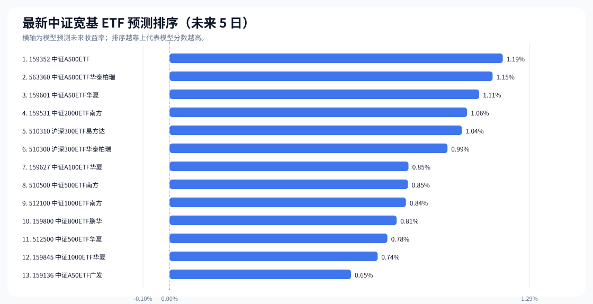

### 候选指数族覆盖图

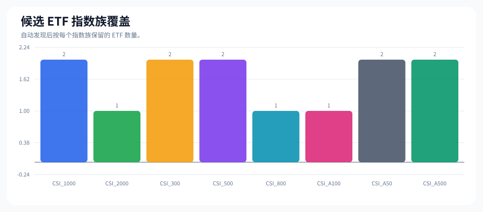

### 验证指标快照图

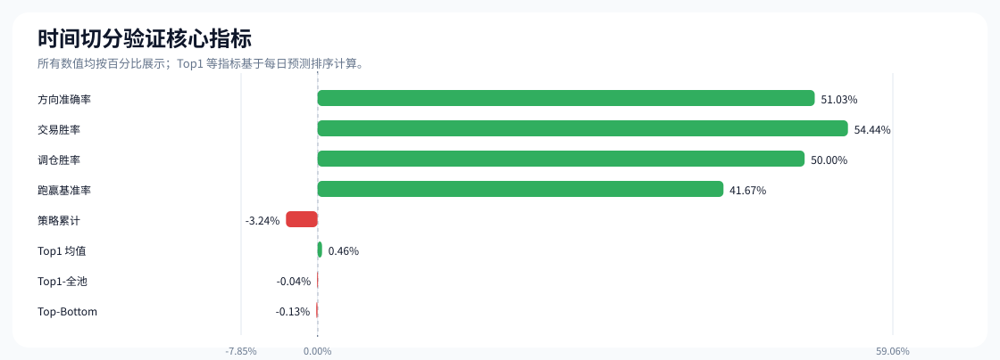

### Holdout 累计曲线

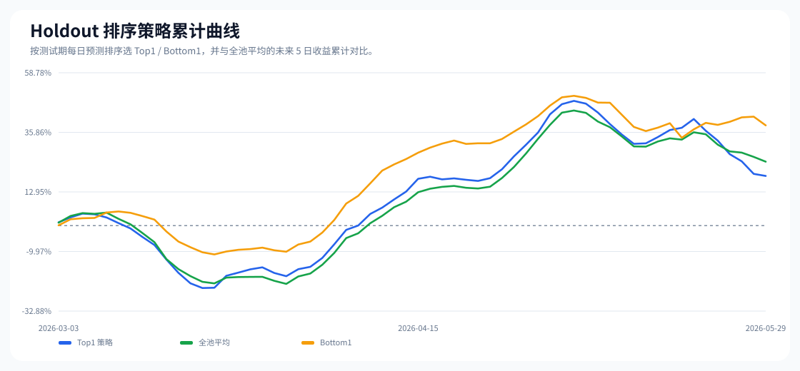

### 购买策略回测累计曲线

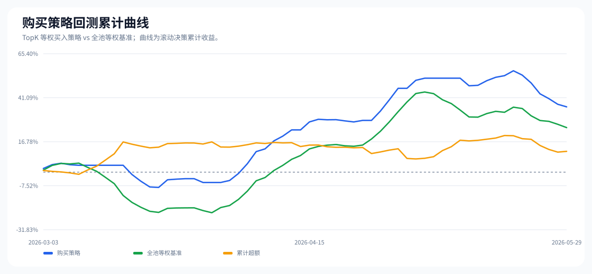

### 模型参数调优图

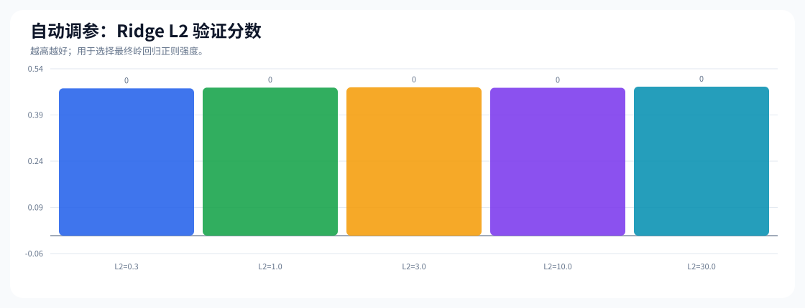

### 策略参数调优图

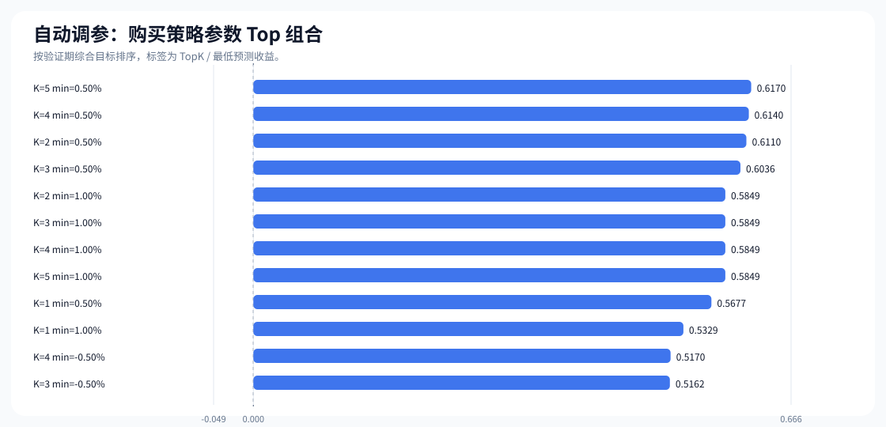

### 相关股票暴露图

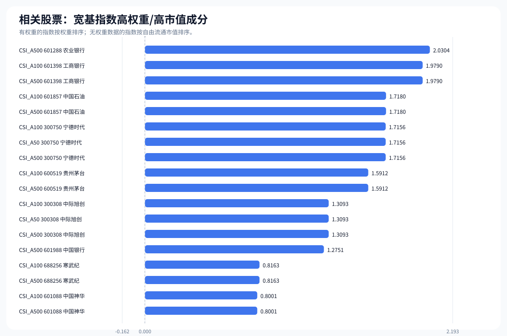

### 跨周期平均收益图

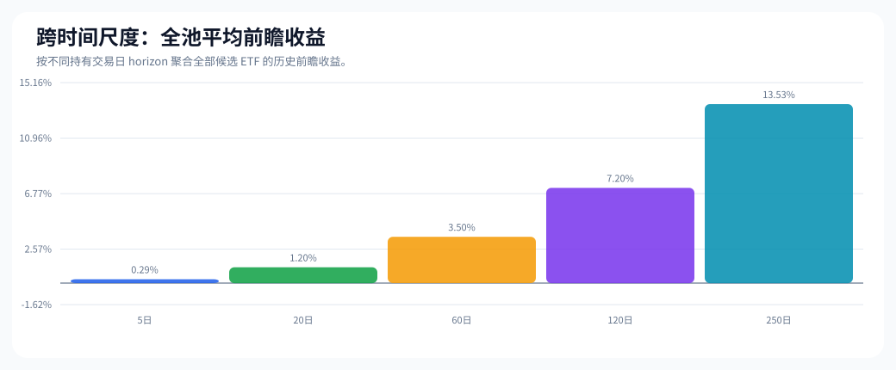

### 跨周期胜率图

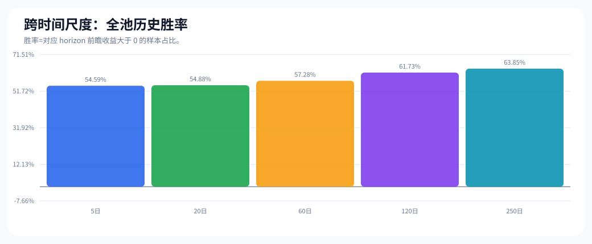

### 长期历史覆盖图

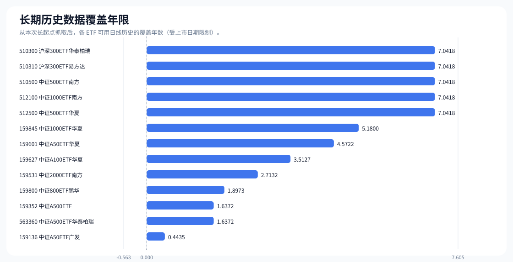

### 跨年份周期收益图

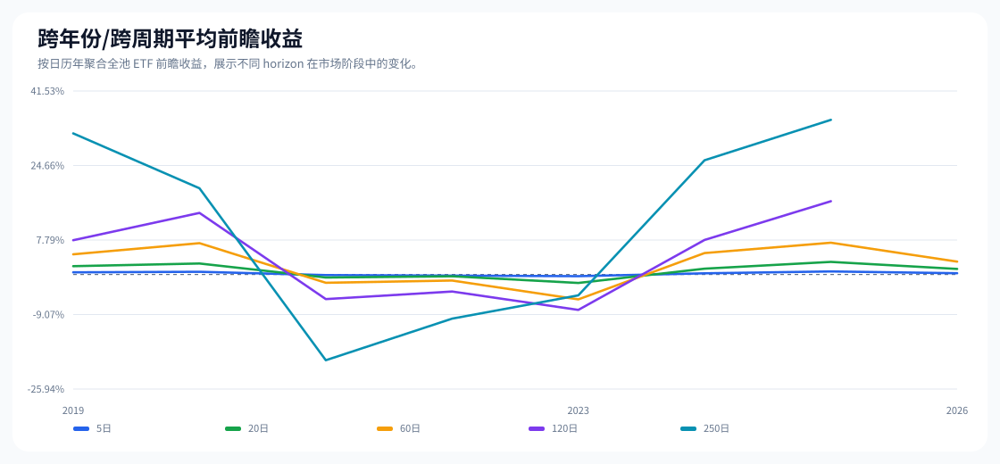

## 9. 最新预测排序

|排名 | 日期 | 代码 | 名称 | 指数族 | 收盘价 | 预测未来收益 | 近 5 日 | 近 20 日|20 日波动|20 日回撤|
|---:|---|---|---|---|---:|---:|---:|---:|---:|---:|
|1|2026-06-05|159352|中证A500ETF|CSI_A500|1.325|1.19%|-1.56%|-2.14%|1.23%|-4.74%|
|2|2026-06-05|563360|中证A500ETF华泰柏瑞|CSI_A500|1.348|1.15%|-1.46%|-1.96%|1.18%|-4.60%|
|3|2026-06-05|159601|中证A50ETF华夏|CSI_A50|1.139|1.11%|-2.23%|-0.18%|1.47%|-3.80%|
|4|2026-06-05|159531|中证2000ETF南方|CSI_2000|1.541|1.06%|-0.64%|-5.11%|1.50%|-6.49%|
|5|2026-06-05|510310|沪深300ETF易方达|CSI_300|4.687|1.04%|-1.88%|-0.89%|1.10%|-3.50%|
|6|2026-06-05|510300|沪深300ETF华泰柏瑞|CSI_300|4.843|0.99%|-1.63%|-0.88%|1.07%|-3.47%|
|7|2026-06-05|159627|中证A100ETF华夏|CSI_A100|1.361|0.85%|-1.87%|-1.87%|1.13%|-4.56%|
|8|2026-06-05|510500|中证500ETF南方|CSI_500|8.339|0.85%|-1.23%|-4.90%|1.46%|-7.44%|
|9|2026-06-05|512100|中证1000ETF南方|CSI_1000|3.358|0.84%|-0.74%|-4.22%|1.44%|-6.67%|
|10|2026-06-05|159800|中证800ETF鹏华|CSI_800|1.479|0.81%|-1.33%|-1.86%|1.04%|-4.21%|
|11|2026-06-05|512500|中证500ETF华夏|CSI_500|4.617|0.78%|-1.30%|-4.86%|1.39%|-7.46%|
|12|2026-06-05|159845|中证1000ETF华夏|CSI_1000|3.453|0.74%|-0.69%|-4.27%|1.45%|-6.57%|
